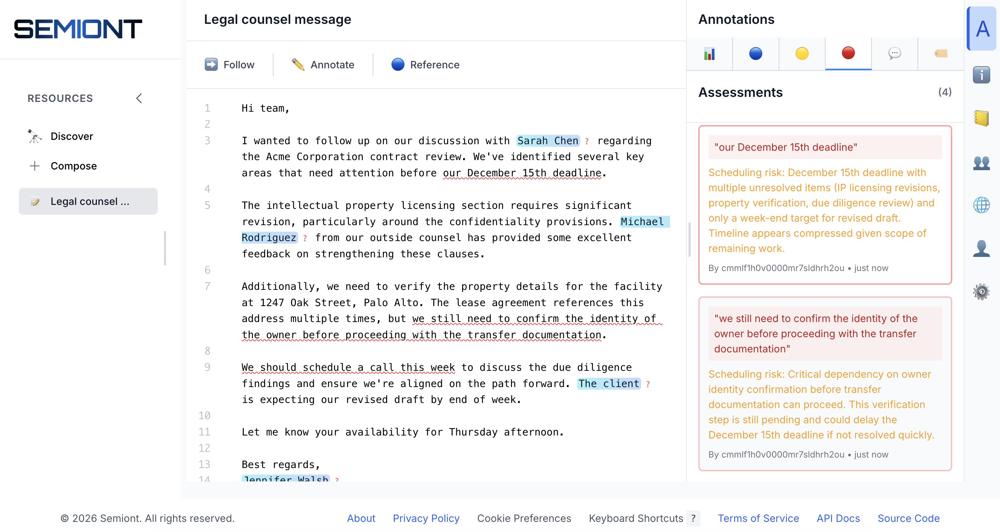

# Semiont - Semantic Knowledge Kernel

[](https://github.com/The-AI-Alliance/semiont)
[](https://github.com/The-AI-Alliance/semiont)
[](https://github.com/The-AI-Alliance/semiont/actions/workflows/ci.yml?query=branch%3Amain)
[](https://github.com/The-AI-Alliance/semiont/actions/workflows/security-tests.yml?query=branch%3Amain)
[](https://github.com/The-AI-Alliance/semiont/actions/workflows/accessibility-tests.yml?query=branch%3Amain)
[](apps/frontend/docs/ACCESSIBILITY.md)
[](https://github.com/The-AI-Alliance/semiont/tree/main?tab=Apache-2.0-1-ov-file#readme)
[](https://github.com/The-AI-Alliance/semiont/issues)
[](CONTRIBUTING.md)
[](CODE_OF_CONDUCT.md)

> ⚠️ **Early Development**: Semiont is in active alpha development. The API is not yet stable and breaking changes are expected. See [CONTRIBUTING.md](CONTRIBUTING.md) for how to participate.

**Semiont is an open-source knowledge kernel where humans and AI agents collaboratively annotate, link, and extend a shared corpus of documents.**

Built on the W3C Web Annotation standard, Semiont transforms unstructured content into interconnected semantic networks — all stored as portable, interoperable annotations. Self-hosted, so your data stays on your infrastructure. Inference runs on **Anthropic** (cloud) or **Ollama** (local) — mix providers per worker to balance cost, capability, and privacy.



## Get Started

**[Run Semiont locally](docs/LOCAL-SEMIONT.md)** using published npm packages — no need to clone this repository. Install the CLI, initialize a project, provision services, and start annotating.

## Semiont Knowledge Bases

Ready-to-run knowledge base repositories you can load directly into Semiont:

- **[gutenberg-kb](https://github.com/The-AI-Alliance/gutenberg-kb)** — Public domain literature from Project Gutenberg
- **[synthetic_family](https://github.com/pingel-org/synthetic_family)** — A synthetic family dataset for testing and exploration

More coming soon.

## Why Semiont

**Eliminate Cold Starts** — Import a set of documents and the seven flows immediately begin producing value: AI agents detect entity mentions, propose annotations, and generate linked resources while humans review, correct, and extend the results. The knowledge graph grows as a byproduct of annotation — no upfront schema design, manual data entry, or batch ETL pipeline required.

**Calibrate the Human–AI Mix** — Because humans and AI agents share identical interfaces, organizations can dial the mix to fit their constraints. A domain with abundant expert availability and a high accuracy bar can run human-primary workflows with AI suggestions; a domain rich in GPU capacity but short on specialists can run agent-primary pipelines with human spot-checks. Supervision depth, automation ratio, and quality gates are deployment decisions — not architectural rewrites.

## Core Tenets

**Peer Collaboration** — Humans and AI agents are architectural equals. Every operation flows through the same API, event bus, and event-sourced storage regardless of who initiates it. Any workflow can be performed manually, automated by an agent, or done collaboratively.

**Document-Grounded Knowledge** — Knowledge is always anchored to source documents. Annotations point into specific passages; references link documents to each other. The knowledge graph is a projection of these grounded relationships, not a replacement for the original material.

**Seven Collaborative Flows** — humans and AI agents work as peers through seven composable workflows:

- **[Yield](docs/flows/YIELD.md)** — Introduce new resources into the system — upload documents, load pages, or generate new content from annotated references
- **[Mark](docs/flows/MARK.md)** — Add structured metadata to resources — highlights, assessments, comments, tags, and entity references — manually or via AI-assisted detection
- **[Match](docs/flows/MATCHER.md)** — Search the knowledge base for candidate resources using multi-source retrieval and composite scoring — structural signals plus optional LLM re-ranking
- **[Bind](docs/flows/BIND.md)** — Resolve ambiguous references to specific resources, linking entity mentions to their correct targets in the knowledge base
- **[Gather](docs/flows/GATHER.md)** — Assemble related context around a focal annotation for downstream generation or analysis
- **[Browse](docs/flows/BROWSE.md)** — Navigate through resources, panels, and views — structured paths for reviewing and examining content
- **[Beckon](docs/flows/BECKON.md)** — Direct user focus to specific annotations or regions of interest through visual cues and coordination signals

## 📦 Published Artifacts

Semiont publishes npm packages and container images for easy integration and deployment.

- **NPM Packages** - See [packages/README.md](packages/README.md) for available packages and documentation
- **Container Images** - See [docs/administration/IMAGES.md](docs/administration/IMAGES.md) for Docker images and deployment examples

## 📖 Documentation

| Document | Description |
| --- | --- |
| **[Architecture](docs/ARCHITECTURE.md)** | System design, event sourcing, and layered package structure |
| **[W3C Web Annotation](specs/docs/W3C-WEB-ANNOTATION.md)** | How Semiont implements the W3C standard across all layers |
| **[Local Development](docs/development/LOCAL-DEVELOPMENT.md)** | Get running locally — prerequisites, configuration, first launch |
| **[API Reference](specs/docs/API.md)** | HTTP endpoints ([OpenAPI spec](specs/README.md)) |
| **[Packages](packages/README.md)** | All published npm packages with dependency graph |
| **[Deployment](docs/administration/DEPLOYMENT.md)** | Production deployment, platforms, scaling, and maintenance |
| **[Security](docs/administration/SECURITY.md)** | Authentication, RBAC, and security controls |
| **[Contributing](CONTRIBUTING.md)** | How to participate, testing guide, and development standards |

### Applications

| Application | Description |
| --- | --- |
| **[Backend](apps/backend/README.md)** | Hono API server — routes, event bridging, real-time SSE, logging |
| **[Frontend](apps/frontend/README.md)** | Next.js app — annotations, accessibility, i18n, performance |
| **[CLI](apps/cli/README.md)** | Environment management, service orchestration, deployment commands |

## Core Development & Contributing

**GitHub Codespaces** (Recommended for quick setup):

[](https://github.com/codespaces/new/The-AI-Alliance/semiont)

See [.devcontainer/README.md](.devcontainer/README.md) for setup details.

**Local Development**:

Semiont uses a [CLI](apps/cli/README.md) (`semiont`) to initialize projects, provision services, and manage environments. See [LOCAL-DEVELOPMENT.md](docs/development/LOCAL-DEVELOPMENT.md) for installation, configuration, and running locally.

See [CONTRIBUTING.md](CONTRIBUTING.md) for how to participate, testing guide, and development standards.

## 📁 File Layout

```text
semiont/
├── specs/                      # API specifications (spec-first architecture)
│   ├── src/                    # OpenAPI source files (tracked in git)
│   │   ├── openapi.json        # Root spec with $ref to all paths/schemas
│   │   ├── paths/              # Individual endpoint definitions
│   │   └── components/
│   │       └── schemas/        # Schema definitions
│   ├── openapi.json            # Generated bundle (gitignored, built by Redocly)
│   └── docs/                   # API and W3C annotation documentation
├── apps/                       # Application packages
│   ├── frontend/               # Next.js 15 frontend application
│   ├── backend/                # Hono backend API server
│   └── cli/                    # Semiont management CLI
├── packages/                   # Shared workspace packages (see packages/README.md)
│   ├── api-client/             # OpenAPI-generated TypeScript SDK
│   ├── core/                   # Core types and utilities
│   ├── event-sourcing/         # Event store and view storage
│   ├── content/                # Content-addressed storage
│   ├── graph/                  # Graph database abstraction
│   ├── ontology/               # Entity types and tag schemas
│   ├── inference/              # AI prompts, parsers, and text generation
│   ├── make-meaning/           # Context assembly, detection, reasoning
│   ├── jobs/                   # Job queue and worker infrastructure
│   ├── react-ui/               # React components and hooks
│   ├── mcp-server/             # Model Context Protocol server
│   └── test-utils/             # Testing utilities and mock factories
├── docs/                       # System documentation
└── scripts/                    # Build and utility scripts
```

**See [packages/README.md](packages/README.md) for detailed package documentation, architecture overview, and dependency graph.**

## 📜 License

Apache 2.0 - See [LICENSE](LICENSE) for details.
