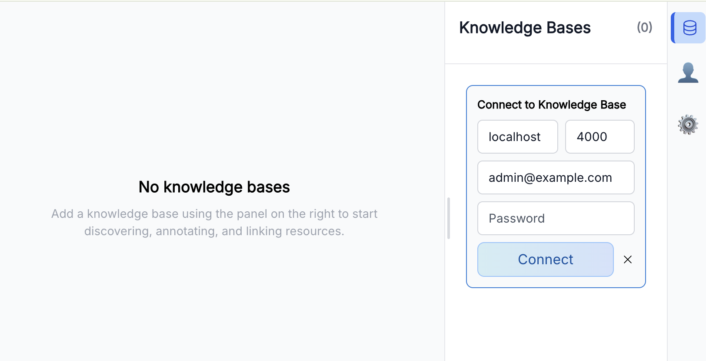

# Semiont

**Semiont is an open source Human+AI knowledge platform. Use it as: a Wiki, Knowledge Base, Semantic Layer, Context Graph, or Agentic Memory.**


## Quick Start

### Start the browser

Install one of [Apple Container](https://github.com/apple/container), [Docker](https://www.docker.com/), or [Podman](https://podman.io/) if you don't already have one.

Run the published browser container image (substitute `docker` or `podman` for `container` as needed):

```bash
container run --publish 3000:3000 -it ghcr.io/the-ai-alliance/semiont-frontend:latest
```

The browser needs to reach a knowledge base backend running on your machine, so the container runtime must have local network permission. See [Local network access](docs/system/LOCAL-SEMIONT.md#local-network-access) for per-platform notes.

The image is signed with build provenance + SBOM attestations. To verify before running, see [Supply-chain verification](docs/system/administration/IMAGES.md#supply-chain-verification).

Also available as a **[desktop app](https://github.com/The-AI-Alliance/semiont/releases)** (macOS, Linux). See **[Browser setup](apps/frontend/docs/LOCAL.md)** for details.

Point your web browser to the Semiont browser running at **http://localhost:3000**.

### Start a knowledge base

Clone a knowledge base and follow its README. Each KB repo contains configuration, container definitions, and startup scripts under `.semiont/`.

| Knowledge Base | Description |
|---|---|
| **[semiont-template-kb](https://github.com/The-AI-Alliance/semiont-template-kb)** | Empty template — start here for a new project |
| **[gutenberg-kb](https://github.com/The-AI-Alliance/gutenberg-kb)** | Public domain literature from Project Gutenberg |
| **[synthetic-family](https://github.com/pingel-org/synthetic-family)** | Synthetic family dataset for testing and exploration |

### Connect browser to knowledge base

In the Semiont browser's Knowledge Bases panel, enter host `localhost`, port `4000`, and the email and password you provided when starting the backend.



## Automate

Every operation in the GUI is available programmatically. The same seven flows — yield, mark, match, bind, gather, browse, beckon — work identically whether driven by a human, a script, or an AI agent.

**[Semiont CLI](apps/cli/README.md)** — pipe the full annotation pipeline from the terminal:

```bash
semiont mark doc-123 --delegate --motivation linking --entity-type Person --entity-type Organization
semiont gather annotation doc-123 ann-456
semiont match doc-123 ann-456
semiont bind doc-123 ann-456 target-789
```

**[Semiont SDK](packages/sdk/README.md)** — type-safe TypeScript SDK organized by the seven verbs. `SemiontClient.signIn(...)` is the credentials-first one-line construction for scripts. Long-running scripts that span token expiry use `SemiontSession.signIn(...)` instead — same shape, plus refresh and persistence (see the [SDK README](packages/sdk/README.md)).

```typescript
import { SemiontClient } from '@semiont/sdk';

const semiont = await SemiontClient.signIn({ baseUrl: 'http://localhost:4000', email, password });

await semiont.mark.assist(resourceId, 'linking', { entityTypes: ['Person'] });
const context = await semiont.gather.annotation(annId, resourceId);
const results = await semiont.match.search(resourceId, refId, context);
await semiont.bind.body(resourceId, annId, [{ op: 'add', item: { type: 'SpecificResource', source: targetId } }]);
```

**[Agent Skills](docs/protocol/skills/)** — ready-made skill definitions that agentic coding assistants like Claude Code can use to drive the full pipeline without writing integration code.

See the **[Local Semiont Overview](docs/system/LOCAL-SEMIONT.md)** for alternative setup paths.


## Why Semiont

Semiont transforms unstructured content into interconnected semantic networks, stored as portable, structured annotations anchored to source passages. Self-hosted, so your data stays on your infrastructure. Inference runs on **Anthropic** (cloud) or **Ollama** (local) — mix providers per worker to balance cost, capability, and privacy.

**Eliminate Cold Starts** — Import a set of documents and the seven flows immediately begin producing value: AI agents detect entity mentions, propose annotations, and generate linked resources while humans review, correct, and extend the results. The knowledge graph grows as a byproduct of annotation — no upfront schema design, manual data entry, or batch ETL pipeline required.

**Calibrate the Human–AI Mix** — Because humans and AI agents share identical interfaces, organizations can dial the mix to fit their constraints. A domain with abundant expert availability and a high accuracy bar can run human-primary workflows with AI suggestions; a domain rich in GPU capacity but short on specialists can run agent-primary pipelines with human spot-checks. Supervision depth, automation ratio, and quality gates are deployment decisions — not architectural rewrites.

## Core Tenets

**Peer Collaboration** — Humans and AI agents are architectural equals. Every operation flows through the same API, event bus, and event-sourced storage regardless of who initiates it. Any workflow can be performed manually, automated by an agent, or done collaboratively.

**Document-Grounded Knowledge** — Knowledge is always anchored to source documents. Annotations point into specific passages; references link documents to each other. The knowledge graph is a projection of these grounded relationships, not a replacement for the original material.

**[Seven Collaborative Flows](docs/protocol/flows/README.md)** — humans and AI agents work as peers through seven composable workflows:

- **[Yield](docs/protocol/flows/YIELD.md)** — Introduce new resources into the system — upload documents, load pages, or generate new content from annotated references
- **[Mark](docs/protocol/flows/MARK.md)** — Add structured metadata to resources — highlights, assessments, comments, tags, and entity references — manually or via AI-assisted detection
- **[Match](docs/protocol/flows/MATCHER.md)** — Search the knowledge base for candidate resources using multi-source retrieval and composite scoring — structural signals plus optional LLM re-ranking
- **[Bind](docs/protocol/flows/BIND.md)** — Resolve ambiguous references to specific resources, linking entity mentions to their correct targets in the knowledge base
- **[Gather](docs/protocol/flows/GATHER.md)** — Assemble related context around a focal annotation for downstream generation or analysis
- **[Browse](docs/protocol/flows/BROWSE.md)** — Navigate through resources, panels, and views — structured paths for reviewing and examining content
- **[Beckon](docs/protocol/flows/BECKON.md)** — Direct user focus to specific annotations or regions of interest through visual cues and coordination signals

## 📦 Published Artifacts

| Artifact | Use it for |
| --- | --- |
| **`@semiont/sdk`** ([npm](https://www.npmjs.com/package/@semiont/sdk)) | TypeScript SDK — `SemiontClient`, namespaces, session, view-models. Pair with the HTTP transport for scripts and apps. |
| **`@semiont/api-client`** ([npm](https://www.npmjs.com/package/@semiont/api-client)) | `HttpTransport` + `HttpContentTransport` — the wire adapter the SDK consumes. |
| **`@semiont/core`** ([npm](https://www.npmjs.com/package/@semiont/core)) | OpenAPI-generated types, branded IDs, and the event protocol. |
| **`@semiont/observability`** ([npm](https://www.npmjs.com/package/@semiont/observability)) | OpenTelemetry helpers — `withSpan`, traceparent inject/extract, Node + Web init. |
| **`ghcr.io/the-ai-alliance/semiont-frontend`** | Browser image — signed with build provenance + SBOM. Pull, run, point at any KB backend. |

See **[packages/README.md](packages/README.md)** for the full layered package list, dependency graph, and the rest of the workspace packages.

## 📖 Documentation

| Document | Description |
| --- | --- |
| **[Architecture](docs/system/ARCHITECTURE.md)** | System design, event sourcing, and layered package structure |
| **[W3C Web Annotation](specs/docs/W3C-WEB-ANNOTATION.md)** | How Semiont implements the W3C standard across all layers |
| **[Local Development](docs/development/LOCAL-DEVELOPMENT.md)** | Get running locally — prerequisites, configuration, first launch |
| **[API Reference](specs/docs/API.md)** | HTTP endpoints ([OpenAPI spec](specs/README.md)) |
| **[SDK](packages/sdk/README.md)** ([Usage](packages/sdk/docs/Usage.md)) | TypeScript SDK guide — namespaces, session, view-models, awaitable observables |
| **[Packages](packages/README.md)** | All published npm packages with dependency graph |
| **[Deployment](docs/system/administration/DEPLOYMENT.md)** | Production deployment, platforms, scaling, and maintenance |
| **[Observability](docs/system/administration/OBSERVABILITY.md)** | Tracing, metrics, log correlation, and the `busLog` grep timeline |
| **[Security](docs/system/administration/SECURITY.md)** | Authentication, RBAC, and security controls |
| **[Contributing](CONTRIBUTING.md)** | How to participate, testing guide, and development standards |

### Applications

| Application | Description |
| --- | --- |
| **[Backend](apps/backend/README.md)** | Hono API server — routes, event bridging, real-time SSE, logging |
| **[Frontend](apps/frontend/README.md)** | Vite + React SPA — annotations, accessibility, i18n, performance |
| **[CLI](apps/cli/README.md)** | Environment management, service orchestration, deployment commands |

## Contributing

> ⚠️ **Alpha.** API and package surface are not yet stable; breaking changes between 0.x releases are expected.

[](https://github.com/The-AI-Alliance/semiont/actions/workflows/ci.yml?query=branch%3Amain)
[](https://github.com/The-AI-Alliance/semiont/tree/main?tab=Apache-2.0-1-ov-file#readme)
[](https://github.com/The-AI-Alliance/semiont/issues)

- **[Monorepo orientation](docs/development/MONOREPO.md)** — codebase layout, build status badges, Codespaces shortcut, where to read next.
- **[CONTRIBUTING.md](CONTRIBUTING.md)** — branch/PR workflow, commit conventions, platform-contribution playbook.

## 📜 License

Apache 2.0 - See [LICENSE](LICENSE) for details.
