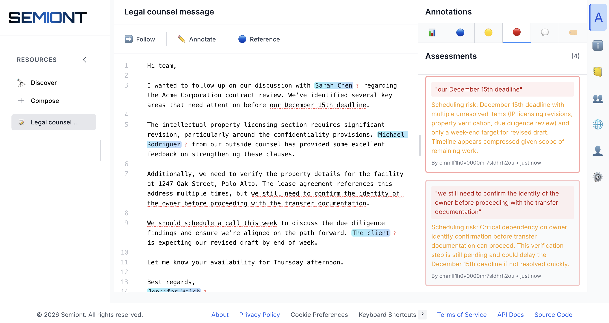
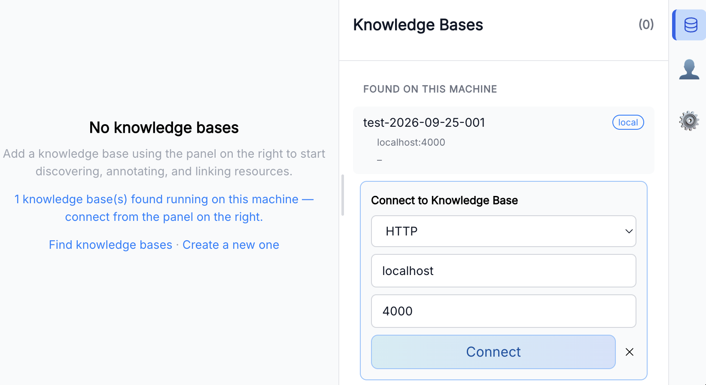

# Semiont

**Semiont is an open, source-grounded semantic knowledge platform for building and maintaining trusted AI knowledge bases and context layers. It gives humans and AI agents a shared workspace and architecture to annotate, connect, enrich, and govern domain knowledge for accurate applications, agents, and workflows.**



## Quick Start

Four steps: install → get a knowledge base → start it → connect.

### 1. Install

The `semiont` launcher is a single static binary — no npm, no Node.js:

```bash
brew install the-ai-alliance/semiont/semiont
```

### 2. Get a knowledge base

Not this repo — every command below runs from a KB.

**Try a demo** — [semiont-gutenberg-kb](https://github.com/The-AI-Alliance/semiont-gutenberg-kb), public-domain literature from Project Gutenberg:

```bash
git clone https://github.com/The-AI-Alliance/semiont-gutenberg-kb.git
cd semiont-gutenberg-kb
```

**Or start a new project** — `semiont init` births one in place, stamping its identity from your git origin and synthesizing a config it validates before writing:

```bash
semiont init --yes --inference anthropic --embedding ollama:nomic-embed-text
```

The full catalog — seven demo KBs across different domains, plus community
knowledge bases and the empty [template](https://github.com/The-AI-Alliance/semiont-template-kb) — is in **[docs/KNOWLEDGE-BASES.md](docs/KNOWLEDGE-BASES.md)**.

### 3. Start it

You'll need a container runtime — [Apple Container](https://github.com/apple/container), [Docker](https://www.docker.com/), or [Podman](https://podman.io/), auto-detected — and an inference provider: [Ollama](https://ollama.com/) for fully local inference (it downloads several GB of models on first run), or an [Anthropic](https://www.anthropic.com/) API key for cloud. Then, from inside the KB — **not this repo**:

```bash
semiont start
```

One command starts the whole stack: the launcher pulls the published Semiont images and the infrastructure containers, bind-mounts the KB's config, and brings everything up — **and ensures the Semiont browser is running at http://localhost:3000**. `semiont logs` follows the stack and `semiont stop` tears it down — the browser stays up (it's the machine-level viewer of every KB, not a stack member; `semiont stop --service frontend` closes it). `semiont start --help` lists the options (inference configs via `--config`, `--list-configs`, …).

### 4. Connect

Create your admin user:

```bash
semiont useradd --email admin@example.com --admin   # prompts for the password
```

Then open **http://localhost:3000**. The Semiont browser's Knowledge Bases panel discovers launcher-managed stacks automatically — pick yours and sign in with the email and password you just created. (Connecting to a KB the launcher doesn't know about? Enter its host and port by hand, e.g. `localhost` / `4000`.)



**Just the browser?** To point a Semiont browser at an already-running or remote knowledge base, run the frontend on its own — no clone needed, from any directory (the launcher auto-detects your container runtime and pulls the published image):

```bash
semiont start --service frontend            # http://localhost:3000
semiont start --service frontend --port 3001   # 3000 busy? move the browser
```

For local-network access notes, supply-chain verification, and the native [desktop app](https://github.com/The-AI-Alliance/semiont/releases) alternative, see **[docs/browser/](docs/browser/README.md)**.

## Automate

Everything the browser does travels over one event bus, and the **[Semiont SDK](packages/sdk/README.md)** (`@semiont/sdk`) is how you speak it — a type-safe TypeScript client whose namespaces are the **[eight verbs](docs/protocol/flows/README.md)**: browse, bind, yield, mark, frame, gather, match, beckon. Your app never calls the backend's HTTP API directly; the SDK is the boundary.

Here is a grounded answer — gather context by traversing the graph, then generate from it, with each claim cited back to its source:

```typescript
import { SemiontSession } from '@semiont/sdk';

const { client } = await SemiontSession.signInHttp({ kb, storage, baseUrl, email, password });

const context = await client.gather.resource(questionId, { excludeEntityTypes: ['Question'] });

const answer = await client.yield.fromResource(questionId, {
  title: question, storageUri: 'file://generated/answer.md', context,
  task: 'answer', structure: 'prose', cite: true,   // cite → linking annotations from claim to source
}).run((e) => { if (e.kind === 'progress') showProgress(e.data); });
```

New here? **[INTRODUCTION](packages/sdk/docs/INTRODUCTION.md)** is the orientation chapter — read it first, then the **[Developer Guide](packages/sdk/docs/DEVELOPER-GUIDE.md)** to build, with **[Usage](packages/sdk/docs/Usage.md)** open as the reference.

Built on the SDK: **[@semiont/react-ui](packages/react-ui/README.md)** embeds the resource viewer and annotation UI in your own app, and **[Agent Skills](docs/protocol/skills/)** are ready-made definitions for agentic coding assistants. A **[Go SDK](packages/sdk-go/README.md)** exists; more languages are planned — the contract is specified independently of any of them in **[docs/protocol/](docs/protocol/README.md)**.

## Contributing

> ⚠️ **Alpha.** API and package surface are not yet stable; breaking changes between 0.x releases are expected.

[](https://github.com/The-AI-Alliance/semiont/actions/workflows/ci.yml?query=branch%3Amain)
[](https://github.com/The-AI-Alliance/semiont/tree/main?tab=Apache-2.0-1-ov-file#readme)
[](https://github.com/The-AI-Alliance/semiont/issues)

- **[Development docs](docs/development/README.md)** — codebase layout, build status badges, Codespaces shortcut, where to read next.
- **[System architecture](docs/system/README.md)** — actor model, knowledge system, container topology, package architecture.
- **[Frontend development](apps/browser/docs/DEVELOPMENT.md)** — running the Browser from source against a stack.
- **[CONTRIBUTING.md](CONTRIBUTING.md)** — branch/PR workflow, commit conventions, platform-contribution playbook.

## 📜 License

Apache 2.0 - See [LICENSE](LICENSE) for details.
