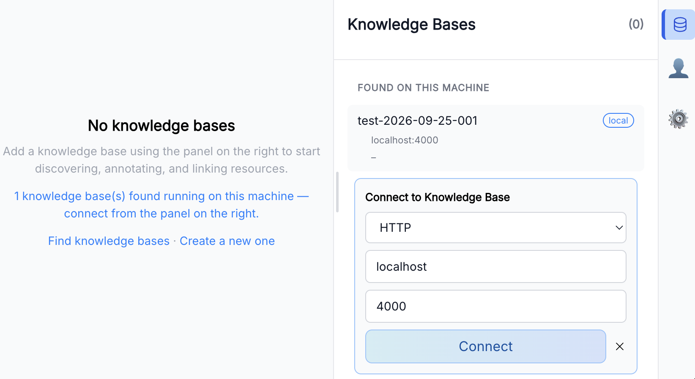
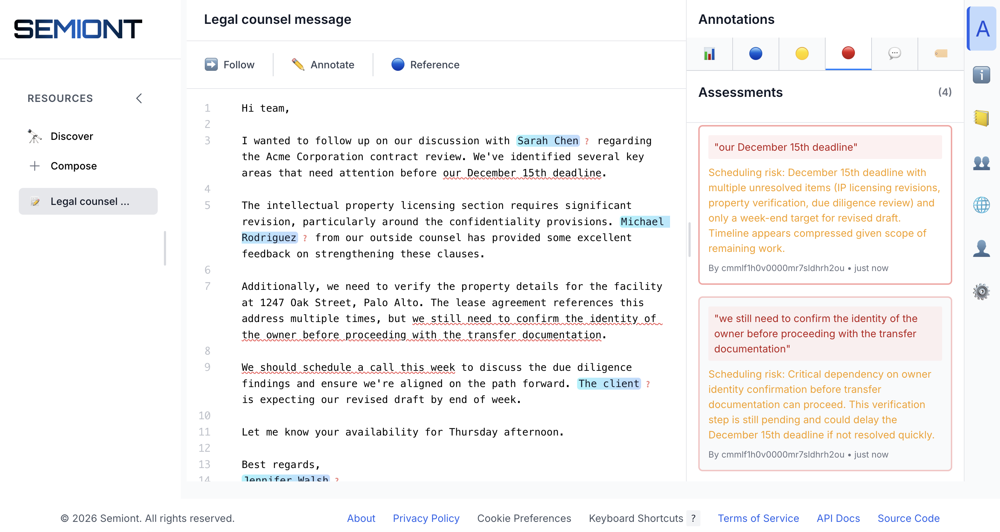

# Semiont

**Semiont is an open, source-grounded semantic knowledge platform for building and maintaining trusted AI knowledge bases and context layers. It gives humans and AI agents a shared workspace and architecture to annotate, connect, enrich, and govern domain knowledge for accurate applications, agents, and workflows.**

## Quick Start

### 0. Prerequisites

You'll need a container runtime — [Apple Container](https://github.com/apple/container), [Docker](https://www.docker.com/), or [Podman](https://podman.io/), auto-detected.

### 1. Install

The `semiont` launcher is a single static binary — no npm, no Node.js:

```bash
brew install the-ai-alliance/semiont/semiont
```

`semiont settings` lists everything the launcher keeps: the container runtime, where your secrets come from, and where each knowledge base's generated secrets are kept. By default they are plain files, which are not secure and are for development only. To keep every new knowledge base's secrets in 1Password, set that before creating one:

```bash
semiont settings secret-store --default op://YourVaultName
```

### 2. Configure inference

A knowledge base needs a model to reason with. Either a hosted one or a local one — pick now, because the next step records the choice.

**Hosted** — register your [Anthropic](https://www.anthropic.com/) key once. Only the pointer is stored, read fresh on every start and passed to the containers, written nowhere:

```bash
semiont settings secret set ANTHROPIC_API_KEY op://YourVaultName/Anthropic/credential
```

**Local** — [Ollama](https://ollama.com/) runs a small model on your own machine instead. There is no key to register and nothing to configure here; you select it in the next step, and no content leaves your machine.

### 3. Create a knowledge base

`semiont init` births a KB in place, synthesizing a config it validates before writing:

```bash
mkdir my-kb && cd my-kb
semiont init --yes --domain example.com:my-kb --inference anthropic
```

**Change `--domain`** — it is the KB's permanent identity, stamped into the committed event log, and has no default. Use `--inference ollama` instead if you chose the local model above.

Every step below runs from inside the knowledge base — not from this repo.

### 4. Start it

One command starts the whole stack and ensures the Semiont browser is running at **http://localhost:3000**:

```bash
semiont start
```

`semiont logs` follows it, `semiont stop` tears it down, and `semiont start --help` lists the options.

### 5. Connect

Create your first user. A fresh stack has none — the account is created at the knowledge base's identity provider, which is what Semiont trusts to authenticate people:

```bash
semiont useradd --email admin@example.com   # prompts for the password
```

Then open **http://localhost:3000**. The Semiont browser's Knowledge Bases panel discovers launcher-managed stacks automatically — pick yours and sign in with the email and password you just created. Sign-in happens at the identity provider, not at Semiont, so you'll be handed to its page and back, and it asks for your name on first use.



Sign the launcher in as well — it holds a session of its own, which the next step needs:

```bash
semiont login          # approve in a browser; only tokens come back
```

No password reaches the launcher, and the session renews itself; `semiont logout` ends it. It is the CLI's own session — an SDK app signs in separately.

For local-network access notes, supply-chain verification, and the native [desktop app](https://github.com/The-AI-Alliance/semiont/releases) alternative, see **[docs/browser/](docs/browser/README.md)**.

### 6. Ingest content

Pull down a well-known paper and upload it with the session from step 5. The storage URI is repo-relative, so the file has to land under the KB root first:

```bash
mkdir -p papers
curl -L -o papers/attention-is-all-you-need.pdf https://arxiv.org/pdf/1706.03762
semiont yield --upload papers/attention-is-all-you-need.pdf
```

### 7. Annotate



Open the document you just ingested and start marking it up — highlight a passage, tag an entity, link a claim to the source that supports it. You are not doing it alone: AI agents reach the same document over the same bus, proposing references and entity types for you to accept, refine, or throw out. Every annotation records who made it, human or agent, and the two are the same kind of participant here.

## Automate

Everything the Semiont browser does travels over one event bus, spoken as
**[eight verbs](docs/protocol/flows/README.md)**: browse, bind, yield, mark,
frame, gather, match, beckon. You have been speaking them already — `semiont yield`
was one. The launcher speaks all eight (`semiont browse --help`, and so on), and so does
your code.

The **[Semiont SDK](packages/sdk/README.md)** (`@semiont/sdk`) is how your code speaks the same bus — a type-safe TypeScript client whose namespaces are those eight verbs. Your app never calls the gateway's HTTP API directly; the SDK is the boundary.

```bash
npm install @semiont/sdk
```

Here is a grounded answer — gather context by traversing the graph, then generate from it, with each claim cited back to its source:

```typescript
import { SemiontSession } from '@semiont/sdk';

const { client } = await SemiontSession.signInDevice({ kb, storage, onCode });

const context = await client.gather.resource(questionId, { excludeEntityTypes: ['Question'] });

const answer = await client.yield.fromContext(context, {
  title: question, storageUri: 'file://generated/answer.md',
  task: 'answer', structure: 'prose', cite: true,   // cite → linking annotations from claim to source
}).run((e) => { if (e.kind === 'progress') showProgress(e.data); });
```

New here? **[INTRODUCTION](packages/sdk/docs/INTRODUCTION.md)** is the orientation chapter — read it first, then the **[Developer Guide](packages/sdk/docs/DEVELOPER-GUIDE.md)** to build, with **[Usage](packages/sdk/docs/Usage.md)** open as the reference.

Built on the SDK: **[@semiont/react-ui](packages/react-ui/README.md)** embeds the resource viewer and annotation UI in your own app, and **[Agent Skills](docs/protocol/skills/)** are ready-made definitions for agentic coding assistants. A **[Go SDK](packages/sdk-go/README.md)** exists; more languages are planned — the contract is specified independently of any of them in **[docs/protocol/](docs/protocol/README.md)**.

## Demo and Community KBs

Rather than starting empty, clone a knowledge base that already carries content. [semiont-gutenberg-kb](https://github.com/The-AI-Alliance/semiont-gutenberg-kb) holds public-domain literature from Project Gutenberg:

```bash
git clone https://github.com/The-AI-Alliance/semiont-gutenberg-kb.git
cd semiont-gutenberg-kb
```

It arrives with its identity and config already set, so skip step 3 — there is nothing to create. The rest of the Quick Start carries you the same way, and it ships with content, so step 6 is optional too.

The full catalog — seven demo KBs across different domains, plus community
knowledge bases and the empty [template](https://github.com/The-AI-Alliance/semiont-template-kb) — is in **[docs/KNOWLEDGE-BASES.md](docs/KNOWLEDGE-BASES.md)**.

## Contributing

> ⚠️ **Alpha.** API and package surface are not yet stable; breaking changes between 0.x releases are expected.

[](https://github.com/The-AI-Alliance/semiont/actions/workflows/ci.yml?query=branch%3Amain)
[](https://github.com/The-AI-Alliance/semiont/tree/main?tab=Apache-2.0-1-ov-file#readme)
[](https://github.com/The-AI-Alliance/semiont/issues)

- **[Development docs](docs/development/README.md)** — codebase layout, build status badges, Codespaces shortcut, where to read next.
- **[System architecture](docs/system/README.md)** — actor model, knowledge system, container topology, package architecture.
- **[Browser development](apps/browser/docs/DEVELOPMENT.md)** — running the Browser from source against a stack.
- **[CONTRIBUTING.md](CONTRIBUTING.md)** — branch/PR workflow, commit conventions, platform-contribution playbook.

## 📜 License

Apache 2.0 - See [LICENSE](LICENSE) for details.
