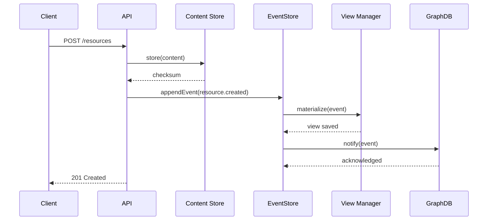
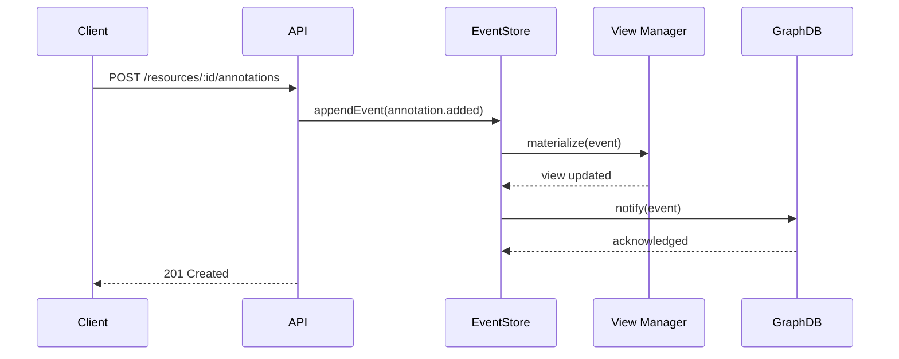
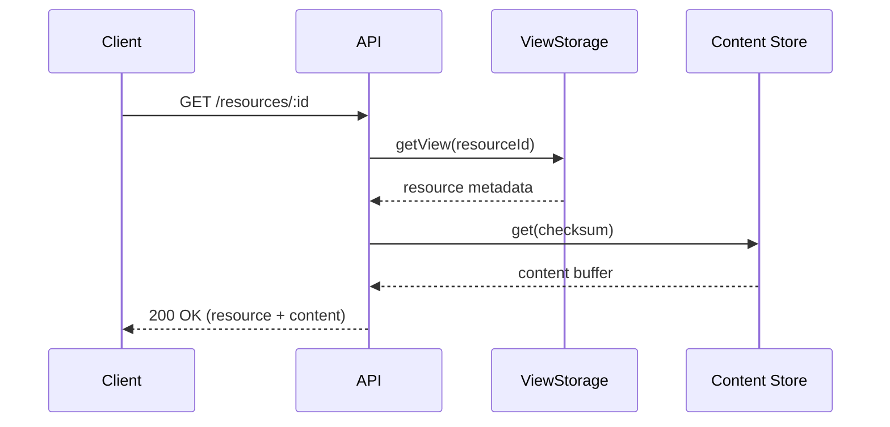
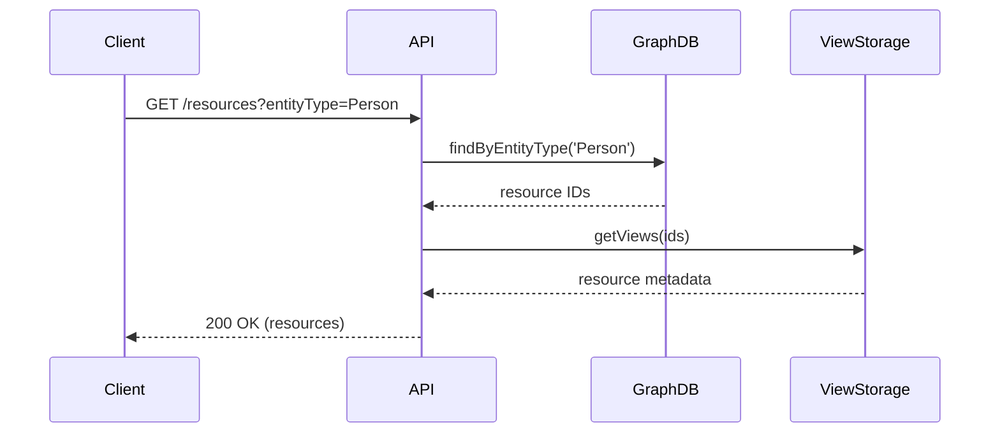
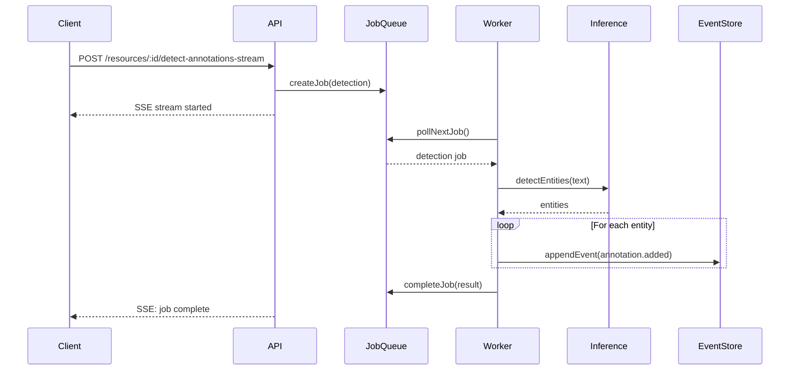
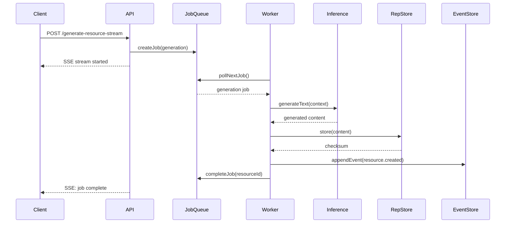
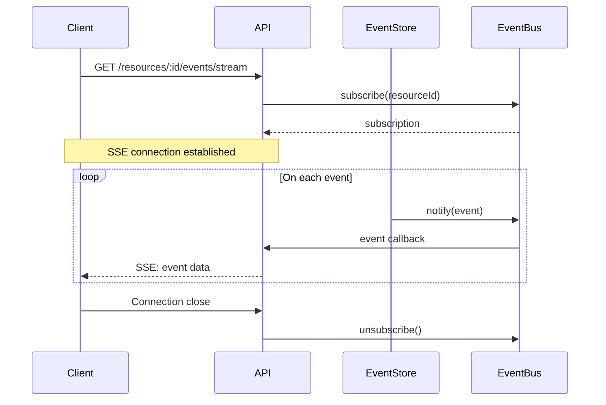

# Data Flow Architecture

## Overview

This document describes how data flows through the backend system, from API requests through event processing to storage and retrieval.

## Write Path

### Document Creation Flow



### Annotation Creation Flow



## Read Path

### Single Resource Query



### Cross-Resource Query (Graph)



## Event Processing

### Event Store Coordination

The EventStore enforces a strict write invariant:

```typescript
async appendEvent(event: ResourceEvent): Promise<StoredEvent> {
  // 1. Persist to immutable log
  const stored = await this.log.append(event);

  // 2. Update materialized view
  await this.views.materialize(resourceId, stored);

  // 3. Notify subscribers
  await this.bus.notify(resourceId, stored);

  return stored;
}
```

### Event Consumer Pattern

```typescript
class GraphDBConsumer {
  async handleEvent(event: StoredEvent) {
    switch (event.event.type) {
      case 'resource.created':
        await this.createDocument(event);
        break;
      case 'annotation.added':
        await this.createAnnotation(event);
        break;
      // ... other event types
    }
  }
}
```

## Job Processing Flow

### Entity Detection Job



### Document Generation Job



## Real-Time Updates (SSE)

### Event Streaming



## Storage Layers

### Layer Responsibilities

1. **RepresentationStore** (L1)
   - Binary/text content storage
   - Content-addressed by checksum
   - Automatic deduplication

2. **Event Store** (L2)
   - Immutable append-only log
   - Event sequencing and chaining
   - Pub/sub notifications

3. **View Storage** (L3)
   - Materialized current state
   - Optimized for queries
   - Rebuilt from events

4. **Graph Database** (L4)
   - Relationship traversal
   - Cross-resource queries
   - Optional projection

### Data Consistency

```typescript
// Event Store ensures consistency
class EventStore {
  async appendEvent(event) {
    const tx = await this.beginTransaction();
    try {
      // Atomic operations
      const stored = await tx.persist(event);
      await tx.updateView(stored);
      await tx.commit();

      // Non-critical notifications
      this.bus.notify(stored).catch(console.error);

      return stored;
    } catch (error) {
      await tx.rollback();
      throw error;
    }
  }
}
```

## Error Handling

### Graceful Degradation

```typescript
// Graph unavailable - fallback to views
async function queryResources(filter) {
  try {
    // Try graph first (faster for complex queries)
    return await graphDB.query(filter);
  } catch (error) {
    console.warn('Graph unavailable, using views', error);
    // Fallback to view storage
    return await viewStorage.query(filter);
  }
}
```

### Recovery Mechanisms

```typescript
// Rebuild from events
async function recover() {
  // 1. Rebuild views from events
  await eventStore.rebuildAllViews();

  // 2. Rebuild graph from events
  await graphConsumer.rebuildAll();

  // 3. Verify integrity
  await eventValidator.validateAll();
}
```

## Performance Optimizations

### Caching Strategy

- View cache: 5-minute TTL
- Content cache: Indefinite (immutable)
- Graph query cache: 1-minute TTL

### Batch Processing

```typescript
// Batch event processing
const events = await eventStore.getBatch(100);
await Promise.all(events.map(e => processor.handle(e)));
```

### Streaming

- SSE for real-time updates
- Stream large content directly
- Paginate list responses

## Monitoring Points

### Key Metrics

- Event append latency
- View materialization time
- Graph sync lag
- Job processing rate
- Cache hit ratio

### Health Checks

```typescript
app.get('/api/health', async (c) => {
  const health = {
    database: await checkDatabase(),
    eventStore: await checkEventStore(),
    graph: await checkGraph(),
    jobs: await checkJobQueue()
  };

  const status = Object.values(health).every(h => h.status === 'ok')
    ? 200 : 503;

  return c.json(health, status);
});
```

## Related Documentation

- [Event Store Architecture](../../../packages/event-sourcing/docs/ARCHITECTURE.md)
- [Graph Database Patterns](../../../packages/graph/docs/ARCHITECTURE.md)
- [Job Queue API](../../../packages/jobs/docs/API.md)
- [Content Storage](../../../packages/content/docs/API.md)