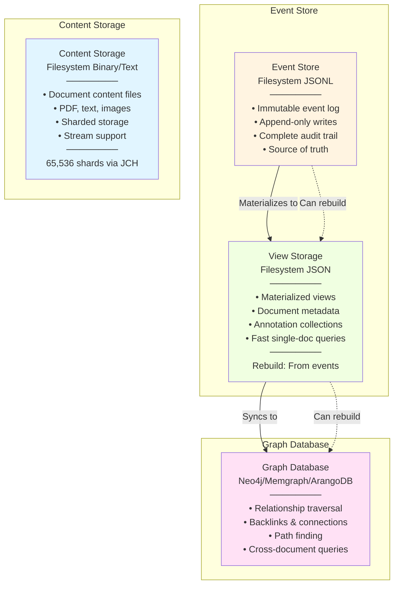

# W3C Web Annotation Backend Implementation

This document describes how W3C Web Annotations flow through Semiont's backend data architecture.

**Related Documentation:**

- [W3C Data Model](../../../specs/docs/W3C-WEB-ANNOTATION.md) - JSON-LD structure and W3C semantics
- [W3C Selectors](../../../specs/docs/W3C-SELECTORS.md) - Selector types and examples
- [Backend README](../README.md) - Backend overview and quick start
- [Development Guide](./DEVELOPMENT.md) - Local development setup

## Architecture Overview

Semiont's data architecture for W3C annotations:

```
┌─────────────────────────────────────────────────────┐
│ Graph Database (Neptune/In-Memory)                 │
│ - Relationships, backlinks, graph traversal        │
│ - Document → Annotation edges                      │
│ - Annotation → Document edges (links)              │
└─────────────────────────────────────────────────────┘
                      ↑
┌─────────────────────────────────────────────────────┐
│ Event Store (Filesystem - JSONL)                   │
│ - Immutable append-only event log                  │
│ - Materialized views of current state              │
│ - Fast document + annotations queries              │
│ - Event chain with prevEventHash integrity         │
│ Storage: data/events/ + data/views/                │
└─────────────────────────────────────────────────────┘
                      ↑
┌─────────────────────────────────────────────────────┐
│ Content Store (Filesystem - .dat files)            │
│ - Binary/text documents, content-addressed         │
│ - Sharded by document hash                         │
│ Storage: data/documents/shards/xx/yy/              │
└─────────────────────────────────────────────────────┘
```

**PostgreSQL** stores only:

- User accounts, profiles, API keys
- Job queue status
- System configuration

**NOT stored in Postgres:** Events, views, documents, annotations

## Data Storage Architecture



### Component Responsibilities

- **Content Storage**: Stores raw document content in binary/text format with 4-hex sharding (65,536 shards). Provides fast read/write by document ID.

- **Event Store**: Immutable append-only event log (JSONL files). Source of truth for all state changes. Supports event replay and view rebuilding.

- **View Storage**: Materialized views of document state built from events. Optimized for fast single-document queries. Can be rebuilt from events at any time.

- **Graph Database**: Relationship and connection data synced from views. Handles graph traversal, backlinks, path finding, and cross-document queries.

### Data Flow

1. **Write Path**: Content → Content Storage, Events → Event Store, Events → Views (materialization), Views → Graph (sync)
2. **Read Path**: Single-document queries → Views, Graph queries → Graph Database
3. **Rebuild Path**: Events can rebuild Views and Graph at any time

## Annotation Lifecycle

### 1. Create Annotation (API → Event Store)

**HTTP Request:**

```http
POST /api/annotations
Authorization: Bearer <jwt-token>
Content-Type: application/json

{
  "target": {
    "source": "doc-sha256:abc123",
    "selector": [
      { "type": "TextPositionSelector", "start": 100, "end": 115 },
      { "type": "TextQuoteSelector", "exact": "Albert Einstein" }
    ]
  },
  "body": [
    { "type": "TextualBody", "value": "Person", "purpose": "tagging" },
    { "type": "SpecificResource", "source": "doc-bio-123", "purpose": "linking" }
  ],
  "motivation": "linking"
}
```

**Backend Flow:**

```typescript
// 1. API Layer validates request
const validated = CreateAnnotationRequestSchema.parse(request);

// 2. Create W3C-compliant annotation
const annotation: Annotation = {
  '@context': 'http://www.w3.org/ns/anno.jsonld',
  type: 'Annotation',
  id: generateAnnotationId(),
  creator: userToAgent(currentUser),
  created: new Date().toISOString(),
  motivation: validated.motivation,
  target: validated.target,
  body: validated.body
};

// 3. Emit event to Event Store
await eventStore.emit({
  type: 'annotation.added',
  documentId: targetDocId,
  userId: currentUser.id,
  payload: { annotation }
});

// Event stored to filesystem:
// data/events/shards/ab/cd/documents/doc-sha256:abc123/events-000042-1234567890.jsonl
```

### 2. Event Store Persistence

**Event Structure:**

```json
{
  "id": "event-uuid-123",
  "type": "annotation.added",
  "documentId": "doc-sha256:abc123",
  "userId": "user-456",
  "timestamp": "2025-10-24T10:30:00Z",
  "payload": {
    "annotation": { "...full W3C annotation..." }
  },
  "metadata": {
    "sequenceNumber": 42,
    "streamPosition": 12345,
    "checksum": "sha256:...",
    "prevEventHash": "sha256:..."
  }
}
```

**Filesystem Storage:**

```
data/events/shards/
├── ab/
│   └── cd/
│       └── documents/
│           └── doc-sha256:abc123def456.../
│               ├── events-000000-1698765432.jsonl  (first 1000 events)
│               ├── events-001000-1698776543.jsonl  (next 1000 events)
│               └── events-002000-1698787654.jsonl
```

**Event Types:**

- `document.created`
- `document.archived` / `document.unarchived`
- `annotation.added`
- `annotation.removed`
- `annotation.body_updated`
- `entity_tag.added` / `entity_tag.removed`

### 3. View Materialization (Events → Views)

**Graph Consumer** listens to events and projects current state:

```typescript
// apps/backend/src/events/projections/graph-consumer.ts
class GraphConsumer {
  async processEvent(event: StoredEvent) {
    switch (event.event.type) {
      case 'annotation.added':
        await this.projector.applyAnnotationAdded(event);
        break;
      case 'annotation.removed':
        await this.projector.applyAnnotationRemoved(event);
        break;
      // ...
    }
  }
}
```

**Projection Store** writes materialized view:

```typescript
// Build current document state from events
const projection: DocumentAnnotations = {
  documentId: 'doc-sha256:abc123',
  annotations: [...all current annotations],
  metadata: {
    totalAnnotations: 5,
    lastEventSequence: 42,
    lastModified: '2025-10-24T10:30:00Z'
  }
};

// Write to filesystem
// data/projections/shards/ab/cd/doc-sha256:abc123.jsonl
await projectionStore.write(documentId, projection);
```

### 4. Graph Database Sync (Views → Graph)

**Event Projector** syncs to graph database:

```typescript
// apps/backend/src/events/projections/event-projector.ts
class EventProjector {
  async applyAnnotationAdded(event: StoredEvent) {
    const { annotation } = event.event.payload;

    // 1. Update view
    await this.updateProjection(documentId, annotation);

    // 2. Sync to graph database
    await this.graphDb.addAnnotation(annotation);

    // Creates graph edges:
    // - (Document)-[:HAS_ANNOTATION]->(Annotation)
    // - (Annotation)-[:LINKS_TO]->(TargetDocument)  [if body has link]
  }
}
```

**Graph Database Operations:**

```typescript
// Neptune/In-Memory graph operations
interface GraphOperations {
  // Add annotation node and edges
  addAnnotation(annotation: Annotation): Promise<void>;

  // Remove annotation and edges
  removeAnnotation(annotationId: string): Promise<void>;

  // Query relationships
  getBacklinks(documentId: string): Promise<Annotation[]>;
  getOutgoingLinks(documentId: string): Promise<Annotation[]>;

  // Graph traversal
  findRelatedDocuments(documentId: string, maxDepth: number): Promise<string[]>;
}
```

## Query Flow

### Get Document with Annotations

```
API Request
    ↓
Views: Read materialized view from filesystem
    ↓
data/projections/shards/ab/cd/doc-sha256:abc123.jsonl
    ↓
Return: {
  document: {...},
  annotations: [...full W3C annotations]
}
```

**Code:**

```typescript
// apps/backend/src/services/document-query-service.ts
class DocumentQueryService {
  async getDocument(id: string) {
    // Read from materialized view
    const projection = await projectionStore.read(id);

    return {
      document: projection.document,
      annotations: projection.annotations  // Full W3C format
    };
  }
}
```

### Get Backlinks (Graph Traversal)

```
API Request
    ↓
Graph Database: Query relationships
    ↓
Neptune/In-Memory: MATCH (d:Document {id: $id})<-[:LINKS_TO]-(a:Annotation)
    ↓
Return: Array<Annotation> with full W3C structure
```

**Code:**

```typescript
// apps/backend/src/routes/documents/routes/backlinks.ts
async function getBacklinks(documentId: string) {
  // Query graph database for relationships
  const backlinks = await graphDb.getBacklinks(documentId);

  return {
    documentId,
    backlinks: backlinks.map(annotation => ({
      id: annotation.id,
      source: annotation.target.source,  // Document that has the link
      text: getAnnotationExactText(annotation),
      entityTypes: getEntityTypes(annotation)
    }))
  };
}
```

## Event Sourcing Benefits

### 1. Immutable Audit Trail

Every change is recorded:

```bash
# View complete history
GET /api/documents/{id}/events

Response:
{
  "events": [
    { "sequenceNumber": 1, "type": "document.created", "timestamp": "..." },
    { "sequenceNumber": 2, "type": "annotation.added", "timestamp": "..." },
    { "sequenceNumber": 3, "type": "annotation.body_updated", "timestamp": "..." }
  ],
  "total": 3
}
```

### 2. Projection Rebuilding

Projections can be rebuilt from events:

```typescript
// Rebuild projection for a document
async function rebuildProjection(documentId: string) {
  // 1. Read all events from Event Store
  const events = await eventStore.getEvents(documentId);

  // 2. Replay events to rebuild state
  let state: DocumentAnnotations = { annotations: [] };

  for (const event of events) {
    state = applyEvent(state, event);
  }

  // 3. Write rebuilt view to ViewStorage
  await projectionStore.write(documentId, state);
}
```

### 3. Time Travel

Query historical state:

```typescript
// Get document state at specific point in time
async function getDocumentAtTime(docId: string, timestamp: Date) {
  const events = await eventStore.getEventsUntil(docId, timestamp);
  return replayEvents(events);
}
```

## W3C Compliance

### Annotation Creation

All annotations are W3C-compliant from creation:

```typescript
// apps/backend/src/routes/annotations/crud.ts
function createAnnotation(request: CreateAnnotationRequest, user: User) {
  const annotation: Annotation = {
    '@context': 'http://www.w3.org/ns/anno.jsonld',
    type: 'Annotation',
    id: generateAnnotationId(),  // e.g., http://localhost:4000/annotations/abc123
    creator: userToAgent(user),   // DID:WEB agent
    created: new Date().toISOString(),
    motivation: request.motivation,
    target: request.target,
    body: request.body
  };

  // Validate against W3C schema
  AnnotationSchema.parse(annotation);

  return annotation;
}
```

### JSON-LD Export

Export full W3C JSON-LD:

```typescript
GET /api/annotations/{id}/export

Response:
{
  "@context": "http://www.w3.org/ns/anno.jsonld",
  "type": "Annotation",
  "id": "https://semiont.app/annotations/abc123",
  "creator": {
    "id": "did:web:semiont.app:users:alice",
    "type": "Person",
    "name": "Alice"
  },
  "created": "2025-10-24T10:30:00Z",
  "motivation": "linking",
  "target": {...},
  "body": [...]
}
```

## Storage Directories

### Filesystem Layout

```
data/
├── documents/          # Content Store
│   └── shards/
│       ├── ab/
│       │   └── cd/
│       │       └── doc-sha256:abcd123.dat
│       └── ...
├── events/             # Event Store
│   └── shards/
│       ├── ab/
│       │   └── cd/
│       │       └── documents/
│       │           └── doc-sha256:abcd123/
│       │               ├── events-000000-{timestamp}.jsonl
│       │               └── events-001000-{timestamp}.jsonl
│       └── ...
└── views/              # View Storage
    └── shards/
        ├── ab/
        │   └── cd/
        │       └── doc-sha256:abcd123.jsonl
        └── ...
```

### Sharding Strategy

- **4-hex sharding**: 65,536 shards (00/00 through ff/ff)
- **Content-addressed**: SHA-256 hash determines shard
- **Example**: `doc-sha256:abcd123...` → `shards/ab/cd/`

## References

- [W3C Web Annotation Data Model](https://www.w3.org/TR/annotation-model/)
- [Event Sourcing Pattern](https://martinfowler.com/eaaDev/EventSourcing.html)
- [CQRS Pattern](https://martinfowler.com/bliki/CQRS.html)
- [Backend README](../README.md)
- [Development Guide](./DEVELOPMENT.md)
