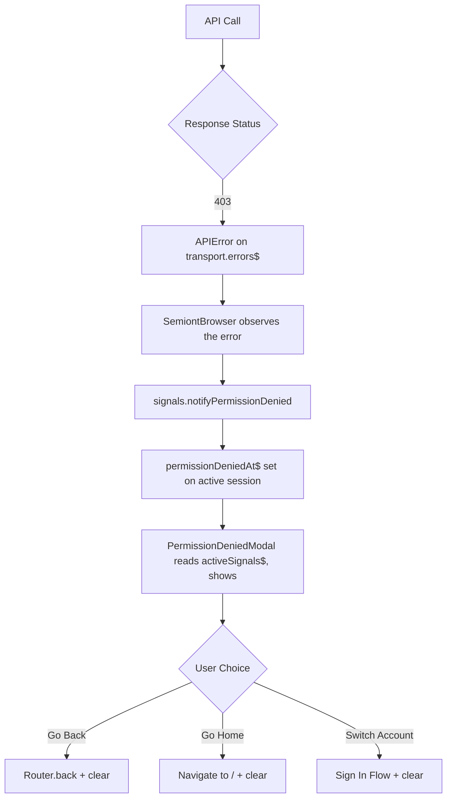

# Browser Authorization Architecture

## Overview

The Semiont Browser carries the machinery for fine-grained access control, but
nothing currently exercises it. The gateway has exactly one authorization gate —
authenticate, or 401 — and returns no 403 anywhere, so the permission-denied path
below is wired end to end and dormant. It is the place a future per-resource
permission model would arrive, not a description of a system running today.

## Current State

### What exists

- **A complete 403 path** — transport maps the status to a `forbidden` error,
  the session raises `notifyPermissionDenied`, the modal shows. Tested, and
  untriggered against this gateway.
- **PermissionDeniedModal** for user-friendly access denial messages
- **Type-safe error handling** with proper status codes

### What does NOT exist

**Role flags.** There is no `isAdmin` and no `isModerator`, on the session or
anywhere else. The active session's `user$` emits exactly what
`GET /api/users/me` returns:

```typescript
import { useSemiont, useObservable } from '@semiont/react-ui';

const session = useObservable(useSemiont().activeSession$);
const user = useObservable(session?.user$);
// { did, email, name, image, domain } — and nothing else
```

The `did` is the identity: it is what the bus stamps on every event and what a
client compares against to recognise its own work. The rest is for display.

Accounts and any roles they hold live at the knowledge base's identity provider.
The gateway reads none of them, so the browser has none to read either, and a
component that gates on a role flag is gating on `undefined`.

#### 2. PermissionDeniedModal (`@semiont/react-ui`)

A library modal that surfaces when users encounter 403 errors. It reads the active session's `SessionSignals` (specifically `permissionDeniedAt$` and `permissionDeniedMessage$`, exposed by the browser as `activeSignals$`), so it appears whenever that signal becomes non-null. Recovery options:

- **Go Back** - Return to previous page
- **Go to Home** - Navigate to home page
- **Switch Account** - Sign in with different credentials

The modal is mounted inside `AuthShell` alongside `SessionExpiredModal`.

#### 3. `signals.notifyPermissionDenied` (`@semiont/sdk`)

A 403 from the gateway surfaces on the transport's error stream; the `SemiontBrowser` observes it and raises the signal on the active session's `SessionSignals`:

```typescript
// inside SemiontBrowser, observing transport errors
if (error instanceof APIError && error.status === 403) {
  signals.notifyPermissionDenied(error.message);
}
```

When no session is active (e.g. on the landing page), `activeSignals$` is `null`, so nothing is raised. The signal is cleared (`clearPermissionDenied`) when the user dismisses the modal.

## 403 Error Handling Flow



### Error Detection Layers

1. **Transport Level** (`@semiont/http-transport`)
   - Throws `APIError` with status: 403 and surfaces it on `transport.errors$`
   - Preserves error context from the gateway

2. **Session Level** (`@semiont/sdk` — `SemiontBrowser`)
   ```typescript
   if (error instanceof APIError && error.status === 403) {
     signals.notifyPermissionDenied('Permission denied');
   }
   ```

3. **Component Level**
   - Nothing to check proactively. With no role flags and no 403s, a component
     cannot know in advance that an action will be refused — it attempts the
     action and handles the error.

## Security Considerations

### Current Implementation

- **404 for unauthorized routes** - Routes return 404 instead of 403 to hide existence
- **No permission details in errors** - Generic messages prevent information leakage
- **Client-side permission checks** - Basic checks, not authoritative

### Best Practices

1. **Never trust client-side permissions** - Always validate on gateway
2. **Fail closed** - Default to denying access
3. **Obscure sensitive routes** - Use 404s for privileged paths
4. **Minimal error information** - Don't reveal system internals

## Future Roadmap

### Near-term Enhancements

#### 1. Enhanced Error Responses

```typescript
interface PermissionError {
  status: 403;
  code: 'PERMISSION_DENIED';
  details: {
    resource: 'document:123';
    action: 'edit';
    required: ['doc.edit', 'team.member'];
    userHas: ['doc.view'];
    suggestion: 'Request edit access from owner';
  }
}
```

#### 2. Permission-Aware Components

```typescript
function DocumentEditor({ document }) {
  const permissions = useDocumentPermissions(document.id);

  if (!permissions.canEdit) {
    return <ReadOnlyView document={document} />;
  }

  return <FullEditor document={document} />;
}
```

#### 3. Optimistic Permission Checking

```typescript
// Check before making API call
const { canDelete } = useResourcePermissions(resourceId);
if (!canDelete) {
  showPermissionModal({
    action: 'delete',
    resource: 'document'
  });
  return;
}
```

### Long-term Vision

#### Fine-Grained RBAC

- **Resource-level permissions** - Per-document, per-collection access
- **Team-based access** - Organizational hierarchy support
- **Temporal permissions** - Time-limited access grants
- **Delegated permissions** - Acting on behalf of others

#### Access Request Workflow

```typescript
interface AccessRequest {
  resource: string;
  permissions: string[];
  justification: string;
  duration?: number;
  approver?: string;
}
```

#### Permission Caching Strategy

```typescript
const permissionCache = new Map({
  'document:123': ['read', 'comment'],
  'collection:abc': ['read', 'write'],
  'global': ['create_document']
});
```

## Integration with Authentication

Authorization works in tandem with authentication:

- **Authentication** (401) - "Who are you?" - See [AUTHENTICATION.md](./AUTHENTICATION.md)
- **Authorization** (403) - "What can you do?"

Both systems use the same event-driven architecture for consistent error handling and user experience.

## Usage Examples

### Identifying the signed-in person

There is no permission to check before acting. What the session can tell you is
who the caller is — which is what attribution and "is this mine?" need:

```typescript
function MyComponent() {
  const session = useObservable(useSemiont().activeSession$);
  const me = useObservable(session?.user$);

  // Recognise this viewer's own work in the data.
  const mine = annotations.filter((a) => a.creator === me?.did);

  return <AnnotationList items={mine} />;
}
```

### Handling Permission Errors

```typescript
// A verb call rejects on failure; a 403 also surfaces the modal automatically
try {
  await semiont.mark.delete(resourceId, annotationId);
} catch (error) {
  if (error instanceof APIError && error.status === 403) {
    // The transport stamped this as `forbidden` and already routed it to
    // SessionSignals → PermissionDeniedModal appears
  }
}
```

### Protected UI Elements

```typescript
function ActionButtons({ document }) {
  const { canEdit, canDelete } = useDocumentPermissions(document);

  return (
    <>
      <Button
        disabled={!canEdit}
        title={!canEdit ? 'You need edit permission' : ''}
      >
        Edit
      </Button>
      <Button
        disabled={!canDelete}
        title={!canDelete ? 'You need delete permission' : ''}
      >
        Delete
      </Button>
    </>
  );
}
```

## Testing

### Manual Testing

1. **Trigger 403 error** - Access restricted resource
2. **Verify modal appears** - PermissionDeniedModal should show
3. **Test recovery options** - Each button should work correctly
4. **Check toast notifications** - Brief error message should appear

### Automated Testing

```typescript
describe('Authorization', () => {
  it('shows PermissionDeniedModal on 403', async () => {
    // Mock API to return 403
    server.use(
      http.get('/api/resources/*', () => {
        return new Response('Forbidden', { status: 403 });
      })
    );

    // Trigger API call
    await userEvent.click(screen.getByText('Admin Action'));

    // Verify modal appears
    expect(screen.getByText('Access Denied')).toBeInTheDocument();
  });
});
```

## Configuration

### Environment Variables

There are currently no authorization-specific environment variables.

### Permission Definitions

Future permission configuration structure:

```typescript
const permissions = {
  document: ['create', 'read', 'update', 'delete', 'share'],
  collection: ['create', 'read', 'update', 'delete', 'manage'],
};
```

## Troubleshooting

### Common Issues

1. **Modal not appearing on 403**
   - First: confirm a 403 actually occurred. This gateway returns none — every
     refusal is a 401 — so against it the modal is expected never to show.
   - Check that the transport surfaced a `forbidden` error on `session.errors$` (it drives `notifyPermissionDenied`)
   - Verify `PermissionDeniedModal` is mounted inside `AuthShell`
   - Confirm the page is inside the protected layout boundary — outside it, no provider is mounted and the notify call is a no-op
   - Check browser console for errors

2. **Looking for role flags**
   - There are none. `user$` carries `did`, `email`, `name`, `image`, `domain`.
   - Roles live at the identity provider; the gateway reads none of them, so a
     per-resource permission model has to arrive there first.

3. **403 errors not caught**
   - Ensure using `APIError` class from http-transport
   - Check error instanceof APIError

## Related Documentation

- [Authentication Architecture](./AUTHENTICATION.md) - 401 handling and session management
- [@semiont/http-transport Reference](../../../packages/http-transport/docs/API-Reference.md#apierror) - `APIError` shape and HTTP error handling
- [Gateway RBAC](../../../docs/system/administration/SECURITY.md) - Server-side permission system

## Contributing

When adding new permission-related features:

1. **Use existing patterns** - Event system, modals, hooks
2. **Type everything** - Full TypeScript coverage required
3. **Consider future RBAC** - Design for expansion
4. **Document permissions** - Clear comments on what each permission allows
5. **Test error paths** - Ensure graceful degradation