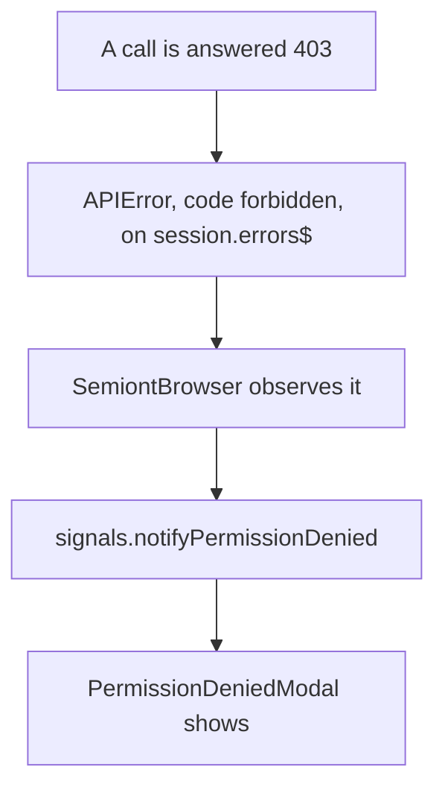

# Browser Authorization

What the Browser knows about what a person may do, which is very little, and the one
permission path it carries.

## What a knowledge base decides

A gateway makes one decision about a request: its token is good, or the answer is 401. It reads
no role to decide access and answers no 403 ([RBAC](../../../docs/protocol/RBAC.md)). Accounts,
and any roles they hold, live at the knowledge base's identity provider.

So the Browser has nothing to check before it acts. A component attempts the action and handles
the error.

## What the session knows: who, not what

The active session's `user$` emits exactly what `GET /api/users/me` returns:

```typescript
import { useSemiont, useObservable } from '@semiont/react-ui';

const session = useObservable(useSemiont().activeSession$);
const user = useObservable(session?.user$);
// { did, email, name, image, domain } — and nothing else
```

The `did` is the identity: it is what the bus stamps on every event and what a client compares
against to recognise its own work. The rest is for display.

There is no `isAdmin` and no `isModerator`, on the session or anywhere else. A component that
gates on a role flag is gating on `undefined`.

```tsx
function MyComponent() {
  const session = useObservable(useSemiont().activeSession$);
  const me = useObservable(session?.user$);

  // Recognise this viewer's own work in the data.
  const mine = annotations.filter((a) => a.creator?.['@id'] === me?.did);

  return <p>{mine.length} of these annotations are yours</p>;
}
```

## The permission-denied path

The Browser handles a 403 from end to end, and no gateway sends one. The path is tested and
dormant: it is where a refusal would arrive if a knowledge base ever made one.


```mermaid
flowchart TD
    A[A call is answered 403] --> C[APIError, code forbidden, on session.errors$]
    C --> D[SemiontBrowser observes it]
    D --> E[signals.notifyPermissionDenied]
    E --> G[PermissionDeniedModal shows]
```

1. **The transport** (`@semiont/http-transport`) throws an `APIError` with status 403 and code
   `forbidden`, and republishes it on the session's `errors$`.
2. **`SemiontBrowser`** (`@semiont/sdk`) observes the active session's errors and raises the
   signal:

   ```typescript
   // inside SemiontBrowser, observing the session's transport errors
   declare const signals: SessionSignals; // the session's signals

   session.errors$.subscribe((err) => {
     if (err.code === 'unauthorized') {
       void session.refresh();
     } else if (err.code === 'forbidden') {
       signals.notifyPermissionDenied(err.message);
     }
   });
   ```

3. **`PermissionDeniedModal`** (`@semiont/react-ui`), mounted in `AuthShell` beside
   `SessionEndedModal`, reads `permissionDenied$` from `activeSignals$` and shows. Its own copy
   is in the person's language; beneath it is the refusal's message, unaltered and marked as the
   knowledge base's. It offers going back, going home, and signing in as someone else, and
   dismissing it clears the signal (`acknowledgePermissionDenied`).

A 401 does not take this path. `session.refresh()` renews the token in silence, or the session
ends and `SessionEndedModal` says why ([Authentication](./AUTHENTICATION.md)).

A call that is refused still rejects where it was made:

```typescript
try {
  await semiont.mark.delete(resourceId, annotationId);
} catch (error) {
  if (error instanceof APIError && error.status === 403) {
    // Already routed to SessionSignals: the modal is showing.
  }
}
```

When no session is active, as on the landing page, `activeSignals$` is `null` and nothing is
raised.

## Testing it

Raise the signal on a test browser and render the modal against it. This is the pattern of
`packages/react-ui/src/components/modals/__tests__/PermissionDeniedModal.test.tsx`, which also
replaces `@headlessui/react`'s `Dialog` and `Transition` with plain elements:

```tsx
import { renderWithProviders, createTestBrowserWithSignals, screen } from '@semiont/react-ui/test-utils';

const SAID = 'Archiving needs the curator role.';

describe('Authorization', () => {
  it("shows the knowledge base's refusal beneath the modal's own copy", () => {
    renderWithProviders(<PermissionDeniedModal />, {
      browser: createTestBrowserWithSignals({ permissionDenied: { detail: SAID } }),
    });

    expect(screen.getByText(SAID).tagName).toBe('BLOCKQUOTE');
  });
});
```

## When the modal does not appear

- **Was there a 403?** Against a Semiont gateway there is not: every refusal is a 401, and the
  modal is expected never to show.
- **Is the page inside the protected layout?** `AuthShell` mounts only around `know/` and
  `moderate/`. Outside it the modal is not mounted.
- **Did the error reach `session.errors$`?** That stream is what drives the signal.

## Related

- [Authentication](./AUTHENTICATION.md): sessions, 401s and the session-ended path
- [RBAC](../../../docs/protocol/RBAC.md): the one decision a gateway makes, and the two service roles
- [`APIError`](../../../packages/http-transport/docs/API-Reference.md#apierror): the transport's error
