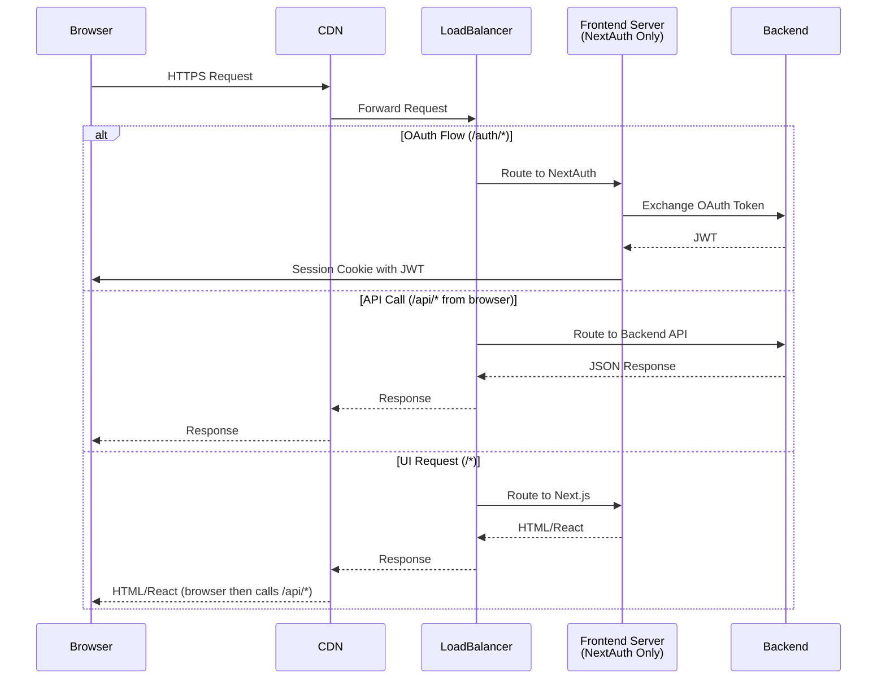

# Frontend Architecture

This document describes the high-level architecture of the Semiont frontend application.

## Table of Contents

- [Overview](#overview)
- [Technology Stack](#technology-stack)
- [Authentication Architecture](#authentication-architecture)
- [State Management](#state-management)
- [API Integration](#api-integration)
- [Data Flow](#data-flow)
- [Provider Hierarchy](#provider-hierarchy)
- [Directory Structure](#directory-structure)
- [Key Design Patterns](#key-design-patterns)
- [Related Documentation](#related-documentation)

## Overview

The Semiont frontend is a Next.js 14 application using the App Router with React Server Components and Client Components. The architecture emphasizes:

- **Type Safety**: TypeScript throughout with strict mode enabled
- **Server State Management**: React Query for all API interactions
- **Authentication**: NextAuth.js for session management with custom JWT backend
- **No Global Mutable State**: All state is managed through React hooks and contexts
- **Fail-Fast Philosophy**: No default values - explicit configuration required

## Technology Stack

### Core Framework
- **Next.js 14** (App Router) - React framework with server/client components
- **React 18** - UI library with concurrent features
- **TypeScript 5** - Type safety and developer experience

### State Management
- **React Query (TanStack Query)** - Server state, caching, and data synchronization
- **React Context** - UI state and cross-cutting concerns (keyboard shortcuts, toast notifications)
- **NextAuth.js** - Authentication session management

### UI & Styling

#### Hybrid CSS Architecture
The frontend uses a hybrid CSS approach that combines:
- **@semiont/react-ui** - Semantic CSS with BEM methodology for all UI components, organized into:
  - `core/` - Fundamental UI elements (buttons, toggles, sliders, badges, tags, indicators)
  - `components/` - Complex composed components (forms, modals, cards)
  - `panels/` - Panel layouts and containers (12 different panel styles)
  - `motivations/` - W3C Web Annotation standard styles (5 motivation types)
  - `features/` - Feature-specific styling
- **Tailwind CSS** - Utility-first CSS for app-specific layouts and custom components

This architecture ensures:
- Framework-agnostic component library (@semiont/react-ui uses semantic CSS)
- Modular organization with clear separation (core elements vs. components vs. panels)
- Centralized design tokens for consistency (panel tokens, color palettes)
- W3C Web Annotation compliance with dedicated motivation styles
- Flexibility for app-specific styling (frontend uses Tailwind)
- Clear separation of concerns (component styles vs. layout utilities)

#### UI Libraries
- **CodeMirror 6** - Code editor for document content
- **Headless UI** - Accessible UI components with Tailwind integration
- **Radix UI** - Low-level UI primitives

### Component Library Architecture

The frontend leverages **@semiont/react-ui**, a comprehensive framework-agnostic component library that provides:

#### Core Components
- **UI Components**: Button, Card, Toolbar, Toast, StatusDisplay
- **Resource Components**: ResourceViewer, AnnotateView, BrowseView
- **Annotation Components**: Complete annotation system with popups and overlays
- **Panel Components**: Comments, References, Tags, Statistics, JSON-LD panels
- **Navigation**: Footer, NavigationMenu, SkipLinks
- **Layout**: UnifiedHeader, LeftSidebar, PageLayout
- **Session**: SessionTimer, SessionExpiryBanner

#### Hooks & Utilities
- **API Hooks**: React Query wrappers for all Semiont API operations
- **UI Hooks**: useTheme, useKeyboardShortcuts, useToast, useDebounce
- **Resource Hooks**: useResourceEvents, useDetectionProgress, useGenerationProgress
- **Form Hooks**: useFormValidation with built-in validation rules

#### Provider Pattern
@semiont/react-ui uses a provider pattern for framework independence:

```typescript
// Frontend provides Next.js-specific implementations
<SessionProvider sessionManager={nextAuthSessionManager}>
  <TranslationProvider translationManager={nextIntlManager}>
    <ApiClientProvider apiClientManager={apiClientManager}>
      {/* App components can now use react-ui hooks */}
    </ApiClientProvider>
  </TranslationProvider>
</SessionProvider>
```

This architecture enables:
- **Framework Independence**: Components work with any React framework
- **Consistent Design**: Shared components across all Semiont applications
- **Type Safety**: Shared TypeScript types and interfaces
- **Comprehensive Testing**: 1250+ tests in the component library
- **Clear Boundaries**: Separation between framework code and UI components

See [Component Library Integration Guide](./COMPONENT-LIBRARY.md) for detailed usage.

### API Communication
- **Fetch API** - HTTP client (wrapped with authentication)
- **Server-Sent Events (SSE)** - Real-time updates for long-running operations
- **WebSockets** - (Future) Real-time collaboration

### Request Routing

The application handles three types of requests with path-based routing:



**Path-Based Routing:**

- **`/auth/*`** → Frontend Server (NextAuth.js OAuth flows, server-side only)
  - OAuth login/callback handling
  - Token exchange with backend
  - Session cookie management

- **`/api/*`** → Backend API (called directly from browser)
  - All REST API endpoints
  - WebSocket connections
  - SSE streams
  - Browser includes JWT from session cookie

- **`/*`** → Frontend Server (Next.js SSR/SSG)
  - Server-side rendering
  - Static pages
  - Delivers React app to browser
  - Browser then makes `/api/*` calls directly to backend

**Key Architecture Points:**
- Frontend server handles OAuth callback ONLY
- Browser calls backend API directly (not proxied by frontend)
- JWT stored in session cookie, included in browser API requests

## Authentication Architecture

See [AUTHENTICATION.md](./AUTHENTICATION.md) for detailed authentication flow.

### Key Components

**Session Management:**
```
NextAuth SessionProvider
    └── Custom SessionContext (isFullyAuthenticated helper)
        └── Application Components
```

**Authentication Flow:**
1. User authenticates via NextAuth (local or OAuth)
2. Backend returns JWT token stored in NextAuth session
3. `useSession()` hook provides token to components
4. `useAuthenticatedAPI()` hook wraps fetch with Bearer token
5. All API calls automatically include authentication

**Token Management:**
- Token stored in NextAuth session (`session.backendToken`)
- Read synchronously via `useSession()` hook (no async/await needed)
- Automatically included in all API requests via `useAuthenticatedAPI`
- No global mutable state - each request reads fresh token from session

### Authentication Hooks

```typescript
// Get session and authentication status
const { data: session, status } = useSession();
const isAuthenticated = status === 'authenticated' && !!session?.backendToken;

// Make authenticated API requests
const { fetchAPI, isAuthenticated } = useAuthenticatedAPI();
const data = await fetchAPI('/api/endpoint');

// Check full authentication (session + backend token)
const { isFullyAuthenticated } = useCustomSession();
```

## State Management

### Server State (React Query)

All server data is managed through React Query hooks generated from the API client.

**Queries (Read Operations):**
```typescript
// Fetch data with automatic caching and refetching
const { data, isLoading, error } = api.documents.get.useQuery(documentId);
```

**Mutations (Write Operations):**
```typescript
// Create/update/delete with automatic cache invalidation
const updateMutation = api.documents.update.useMutation();
await updateMutation.mutateAsync({ id, title, content });
```

**Benefits:**
- Automatic caching (5 minute stale time)
- Background refetching
- Request deduplication
- Optimistic updates
- Error handling with retry logic
- No manual state management needed

### UI State (React Context)

UI-only state and framework-agnostic providers:

**Framework-Agnostic Providers** (from `@semiont/react-ui`):
- `AnnotationProvider` - Injects `AnnotationManager` for annotation mutations
- `CacheProvider` - Injects `CacheManager` for cache invalidation
- `AnnotationUIProvider` - UI-only state for sparkle animations (`newAnnotationIds`)
- `TranslationProvider` - Injects `TranslationManager` for i18n
- `ApiClientProvider` - Injects `ApiClientManager` for API access
- `SessionProvider` - Injects `SessionManager` for session state
- `OpenResourcesProvider` - Injects `OpenResourcesManager` for routing

These providers are framework-independent and can work with Next.js, Vite, or any React framework. The app provides framework-specific manager implementations.

**Next.js-Specific Contexts:**
- `KeyboardShortcutsProvider` - Keyboard shortcut registration and handling
- `ToastProvider` - Toast notification queue
- `LiveRegionProvider` - ARIA live region for screen reader announcements

See [`@semiont/react-ui/docs/PROVIDERS.md`](../../../packages/react-ui/docs/PROVIDERS.md) for complete Provider Pattern documentation.

## API Integration

### API Client Structure

```typescript
// Type-safe API client with React Query hooks
export const api = {
  documents: {
    get: {
      useQuery: (id: string) => useAuthenticatedQuery(['/api/documents', id], ...)
    },
    list: {
      useQuery: () => useAuthenticatedQuery(['/api/documents'], ...)
    },
    create: {
      useMutation: () => useAuthenticatedMutation(...)
    },
    update: {
      useMutation: () => useAuthenticatedMutation(...)
    },
    delete: {
      useMutation: () => useAuthenticatedMutation(...)
    }
  },
  annotations: { ... },  // Note: API still uses 'selections' endpoint, to be renamed later
  entityTypes: { ... },
  // ... other resources
};
```

### Query Keys

React Query uses query keys to identify and cache queries. We follow **TanStack Query best practices** by centralizing query keys in a single source of truth.

**Location:** `/src/lib/api-client.ts`

**Structure:**
```typescript
export const QUERY_KEYS = {
  auth: {
    me: () => ['/api/auth/me'],
  },
  documents: {
    all: (limit?: number, archived?: boolean) => ['/api/documents', limit, archived],
    detail: (id: string) => ['/api/documents', id],
    search: (query: string, limit: number) => ['/api/documents/search', query, limit],
    events: (id: string) => ['/api/documents', id, 'events'],
    highlights: (documentId: string) => ['/api/documents/:id/highlights', documentId],
    references: (documentId: string) => ['/api/documents/:id/references', documentId],
  },
  entityTypes: {
    all: () => ['/api/entity-types'],
  },
  // ... other resources
};
```

**Usage in Hooks:**
```typescript
// Query hook uses QUERY_KEYS
getReferences: {
  useQuery: (documentId: string) => {
    return useAuthenticatedQuery(
      QUERY_KEYS.documents.references(documentId),  // Single source of truth
      `/api/documents/${documentId}/references`
    );
  }
}
```

**Usage in Invalidation:**
```typescript
// Invalidation uses same key - guaranteed to match
queryClient.invalidateQueries({
  queryKey: QUERY_KEYS.documents.references(documentId)
});
```

**Benefits:**
- ✅ **Type-safe**: TypeScript autocomplete for all query keys
- ✅ **Single source of truth**: Change key structure in one place
- ✅ **No mismatches**: Impossible for hook and invalidation to use different keys
- ✅ **Refactoring safety**: Rename/restructure without breaking cache invalidation
- ✅ **Hierarchical invalidation**: Can invalidate all document queries or specific subsets

**Anti-Pattern (Before):**
```typescript
// ❌ WRONG - Keys hardcoded in multiple places
useAuthenticatedQuery(['/api/documents/:id/references', documentId], ...);
queryClient.invalidateQueries({ queryKey: ['/api/selections', documentId, 'references'] });
// These don't match! Cache invalidation silently fails.
```

**Best Practice (After):**
```typescript
// ✅ RIGHT - Keys from QUERY_KEYS constant
useAuthenticatedQuery(QUERY_KEYS.documents.references(documentId), ...);
queryClient.invalidateQueries({ queryKey: QUERY_KEYS.documents.references(documentId) });
// Guaranteed to match!
```

**Why No `as const`:**
```typescript
// We don't use 'as const' because it creates readonly tuple types
// which can cause React Query type mismatches
() => ['/api/documents', id] as const  // ❌ Readonly tuple - avoid
() => ['/api/documents', id]           // ✅ Mutable array - use this
```

### Error Handling

**Global Error Handlers:**
```typescript
// In QueryClient configuration
queryCache: new QueryCache({
  onError: (error) => {
    if (error instanceof APIError) {
      if (error.status === 401) {
        dispatch401Error('Session expired');
      } else if (error.status === 403) {
        dispatch403Error('Permission denied');
      }
    }
  }
})
```

**Component-Level:**
```typescript
const { data, error } = api.documents.get.useQuery(id);

if (error) {
  return <ErrorDisplay error={error} />;
}
```

## Data Flow

### Read Flow (Queries)

```
Component renders
    └── useQuery hook checks cache
        ├── Cache HIT → Return cached data + background refetch
        └── Cache MISS → Fetch from API
            └── useAuthenticatedAPI adds Bearer token
                └── Fetch from backend
                    └── Cache result + return data
```

### Write Flow (Mutations)

```
User action (e.g., click save)
    └── Component calls mutation.mutateAsync()
        └── useAuthenticatedAPI adds Bearer token
            └── POST/PATCH/DELETE to backend
                └── On success:
                    ├── Invalidate related queries
                    ├── Trigger automatic refetch
                    └── UI updates with fresh data
```

### Real-Time Updates (SSE)

```
Component mounts
    └── useResourceEvents hook connects to SSE
        └── EventSource with Bearer token auth
            └── Backend sends events
                └── Event handler refetches queries
                    └── UI updates automatically
```

## Provider Hierarchy

The app is wrapped in multiple providers in this order (outer to inner):

```tsx
<NextAuthSessionProvider>              // NextAuth.js session
  <AuthErrorBoundary>                 // Catch auth errors
    <QueryClientProvider>             // React Query state
      <SessionProvider>               // @semiont/react-ui - Session management
        <ApiClientProvider>           // @semiont/react-ui - API client injection
          <TranslationProvider>       // @semiont/react-ui - i18n
            <CacheProvider>           // @semiont/react-ui - Cache invalidation
              <AnnotationProvider>    // @semiont/react-ui - Annotation mutations
                <AnnotationUIProvider>  // @semiont/react-ui - UI state (sparkles)
                  <OpenResourcesProvider>  // @semiont/react-ui - Routing
                    <ToastProvider>   // App-specific - Toast notifications
                      <LiveRegionProvider>  // App-specific - Screen reader
                        <KeyboardShortcutsProvider>  // App-specific - Keyboard
                          {children}  // App content
```

**Why This Order:**
1. NextAuthSessionProvider must be outermost (provides auth to all)
2. AuthErrorBoundary catches auth failures
3. QueryClientProvider needed for all data fetching
4. Provider Pattern providers (Session, ApiClient, Translation, Cache, Annotation, etc.) from `@semiont/react-ui`
5. App-specific utilities (Toast, LiveRegion, KeyboardShortcuts)

See [`@semiont/react-ui/docs/PROVIDERS.md`](../../../packages/react-ui/docs/PROVIDERS.md) for details on the Provider Pattern architecture.

## Directory Structure

```
apps/frontend/src/
├── app/                    # Next.js App Router pages
│   ├── (auth)/            # Auth-related pages (login, signup)
│   ├── know/              # Main knowledge management UI
│   │   ├── discover/      # Document discovery
│   │   ├── document/[id]/ # Document viewer/editor with Toolbar
│   │   └── compose/       # Document composition
│   ├── api/               # API route handlers (NextAuth, etc.)
│   ├── layout.tsx         # Root layout
│   └── providers.tsx      # Provider setup (wraps @semiont/react-ui providers)
├── components/            # App-specific UI components
│   ├── modals/            # Modal dialogs
│   └── ...                # Other app-specific components
├── contexts/              # App-specific React Context providers
│   ├── KeyboardShortcutsContext.tsx
│   └── ...
├── hooks/                 # App-specific custom hooks
│   ├── useAuthenticatedAPI.ts
│   ├── useResourceEvents.ts
│   └── ...
├── lib/                   # App-specific utility libraries
│   ├── api-client.ts      # API client setup with React Query
│   ├── query-helpers.ts   # React Query utilities
│   ├── auth-events.ts     # Auth error event bus
│   └── cacheManager.ts    # CacheManager implementation for @semiont/react-ui
└── types/                 # TypeScript type definitions

packages/react-ui/src/      # Reusable React components library
├── features/              # Feature-based components
│   ├── auth/              # Authentication components
│   │   ├── components/
│   │   │   ├── SignInForm.tsx         # Framework-agnostic sign-in
│   │   │   ├── SignUpForm.tsx         # Framework-agnostic sign-up
│   │   │   ├── AuthErrorDisplay.tsx   # Error display
│   │   │   └── WelcomePage.tsx        # Welcome page
│   │   └── __tests__/     # Component tests
│   ├── resource-viewer/   # Resource viewing components
│   ├── resource-discovery/ # Discovery components
│   └── ...                # Other feature modules
├── components/            # Shared UI components
│   ├── resource/          # Resource viewer components
│   │   ├── AnnotateView.tsx      # Curation mode
│   │   ├── BrowseView.tsx        # Browse mode
│   │   └── ResourceViewer.tsx    # Main resource component
│   ├── CodeMirrorRenderer.tsx    # Editor-based renderer
│   ├── annotation-popups/ # Annotation interaction UI
│   └── ...                # Other reusable components
├── contexts/              # Provider Pattern contexts
│   ├── AnnotationContext.tsx
│   ├── CacheContext.tsx
│   ├── ApiClientContext.tsx
│   ├── TranslationContext.tsx
│   └── SessionContext.tsx
├── hooks/                 # Reusable React hooks
│   ├── useResourceAnnotations.ts
│   └── ...
├── lib/                   # Reusable utilities
│   ├── annotation-registry.ts  # Annotation type metadata
│   ├── api-hooks.ts       # API client utilities
│   └── ...
└── types/                 # Shared TypeScript interfaces
    ├── AnnotationManager.ts
    ├── CacheManager.ts
    └── ...
```

**Key Separation:**
- `apps/frontend/src` - Next.js-specific pages and implementations
- `packages/react-ui/src` - Framework-agnostic components and interfaces

**Note**: Authentication components (SignInForm, SignUpForm, AuthErrorDisplay, WelcomePage) are framework-agnostic and live in `packages/react-ui/src/features/auth/`. The frontend provides Next.js-specific wrappers that handle routing, translations, and authentication callbacks.

See [`@semiont/react-ui/docs/`](../../../packages/react-ui/docs/) for documentation on the reusable component library.

## Key Design Patterns

### 1. Provider Pattern (Framework Independence)

**Philosophy:** Avoid framework lock-in by inverting dependencies.

The `@semiont/react-ui` library uses the **Provider Pattern** to remain framework-agnostic:

```typescript
// @semiont/react-ui defines INTERFACES
interface AnnotationManager {
  createAnnotation: (params: CreateAnnotationParams) => Promise<Annotation | undefined>;
  deleteAnnotation: (params: DeleteAnnotationParams) => Promise<void>;
}

interface CacheManager {
  invalidateAnnotations: (rUri: ResourceUri) => void | Promise<void>;
  invalidateEvents: (rUri: ResourceUri) => void | Promise<void>;
}

// Apps provide IMPLEMENTATIONS
const annotationManager: AnnotationManager = {
  createAnnotation: async (params) => {
    const annotation = await client.createAnnotation(params);
    queryClient.invalidateQueries(['annotations', params.rUri]);
    return annotation;
  },
  deleteAnnotation: async (params) => {
    await client.deleteAnnotation(params);
    queryClient.invalidateQueries(['annotations', params.rUri]);
  }
};

const cacheManager: CacheManager = {
  invalidateAnnotations: (rUri) => {
    queryClient.invalidateQueries({ queryKey: ['annotations', rUri] });
  },
  invalidateEvents: (rUri) => {
    queryClient.invalidateQueries({ queryKey: ['documents', 'events', rUri] });
  }
};

// Inject implementations via providers
<AnnotationProvider annotationManager={annotationManager}>
  <CacheProvider cacheManager={cacheManager}>
    <App />
  </CacheProvider>
</AnnotationProvider>
```

**Benefits:**
- ✅ React UI library has **zero React Query dependency**
- ✅ Apps can use React Query, SWR, Apollo, or any data fetching library
- ✅ Easy to test with mock implementations
- ✅ Clear separation of concerns

See [`@semiont/react-ui/docs/PROVIDERS.md`](../../../packages/react-ui/docs/PROVIDERS.md) for complete documentation.

### 2. No Default Values

**Philosophy:** Defaults hide configuration errors and create silent failures.

**Example:**
```typescript
// ❌ WRONG - hides missing configuration
const apiUrl = config?.apiUrl || 'http://localhost:4000';

// ✅ RIGHT - fails loudly
if (!config?.apiUrl) {
  throw new Error('API URL not configured!');
}
```

### 2. Fail-Fast Authentication

**Philosophy:** Better to fail immediately than work with wrong/missing auth.

```typescript
// All API calls require authentication - no fallback
if (!session?.backendToken) {
  throw new Error('Authentication required');
}
```

### 3. Data Fetching in Components

**Philosophy:** Components fetch their own data, not through props drilling.

```typescript
// Each component fetches what it needs
function DocumentView({ documentId }: { documentId: string }) {
  const { data: doc } = api.documents.get.useQuery(documentId);
  const { data: highlights } = api.annotations.getHighlights.useQuery(documentId);
  // Note: API client uses 'annotations', but backend endpoint is still '/api/selections'
  // ...
}
```

### 4. Query Invalidation Over Manual Refetch

**Philosophy:** Let React Query handle refetching automatically.

```typescript
// After mutation, invalidate queries
const updateMutation = api.documents.update.useMutation({
  onSuccess: () => {
    queryClient.invalidateQueries(['/api/documents']);
  }
});
```

### 5. Separation of Concerns

**Contexts handle UI state only:**
- Keyboard shortcuts
- Toast notifications
- Animation state (sparkles)

**React Query handles server state:**
- Documents
- Annotations
- Entity types

## UI Components and Terminology

### Document Page Layout

The document page (`/know/document/[id]/page.tsx`) consists of:

**Main Content Area**:
- **AnnotateView**: Curation mode with text selection and annotation creation
- **BrowseView**: Read-only mode for document viewing

**Right Panel** (conditionally visible based on activeToolbarPanel state):
- **History Panel**: Append-only event log showing document changes (📒 icon)
- **Stats Panel**: Document metadata and "Referenced By" section (ℹ️ icon)
- **Detect Panel**: Reference detection UI (🔵 icon, only in curation mode)

**Toolbar** (far right, vertical icon strip):
- Vertically aligned buttons for toggling right panel content
- Visual feedback: left border accent + background color when active
- Icons: 🔵 Detect References, 📒 History, ℹ️ Statistics

### Bi-directional Document ↔ History Focusing

The document and history panels synchronize via hover interactions:

**History → Document**:
- Hovering over an event in History scrolls to the related annotation in the document
- Annotation pulses to draw attention

**Document → History**:
- Hovering over an annotation in the document scrolls to its creation event in History
- Event background pulses to indicate the match

**Implementation**:
- Uses `hoveredAnnotationId` state managed by document page
- CodeMirrorRenderer handles mousemove events and scroll/pulse animations
- AnnotationHistory tracks event refs and scrolls on hover changes

## Related Documentation

### React UI Library
- [`@semiont/react-ui/docs/PROVIDERS.md`](../../../packages/react-ui/docs/PROVIDERS.md) - Provider Pattern architecture
- [`@semiont/react-ui/docs/ANNOTATIONS.md`](../../../packages/react-ui/docs/ANNOTATIONS.md) - Annotation system documentation
- [`@semiont/react-ui/docs/`](../../../packages/react-ui/docs/) - Complete library documentation

### Frontend Documentation
- [AUTHENTICATION.md](./AUTHENTICATION.md) - Authentication and authorization
- [AUTHORIZATION.md](./AUTHORIZATION.md) - Permission model
- [RENDERING-ARCHITECTURE.md](./RENDERING-ARCHITECTURE.md) - Rendering pipeline and component hierarchy
- [REACT-MARKDOWN.md](./REACT-MARKDOWN.md) - BrowseView rendering with ReactMarkdown
- [CODEMIRROR-INTEGRATION.md](./CODEMIRROR-INTEGRATION.md) - AnnotateView rendering with CodeMirror
- [ANNOTATIONS.md](./ANNOTATIONS.md) - Annotation UI/UX and workflows
- [ANNOTATION-RENDERING-PRINCIPLES.md](../../../packages/react-ui/docs/ANNOTATION-RENDERING-PRINCIPLES.md) - Rendering axioms and correctness properties
- [KEYBOARD-NAV.md](./KEYBOARD-NAV.md) - Keyboard shortcuts
- [PERFORMANCE.md](./PERFORMANCE.md) - Performance optimization

## Migration Notes

This architecture represents a major refactoring completed in phases 0-8 (see `/CLEAN-FRONTEND.md` in project root):

**Before:** Global mutable state, race conditions, `apiClient.setAuthToken()`
**After:** React Query, no global state, `useAuthenticatedAPI` hook

**Key Changes:**
- Removed all `apiClient.setAuthToken()` / `clearAuthToken()` / `getAuthToken()` methods
- All API calls now use React Query hooks
- Authentication handled per-request via `useAuthenticatedAPI`
- No more `apiService.*` direct calls in components
- SSE hooks use `useSession()` for auth instead of `getAuthToken()`

All 802 tests passing with 100% coverage of authentication code.
