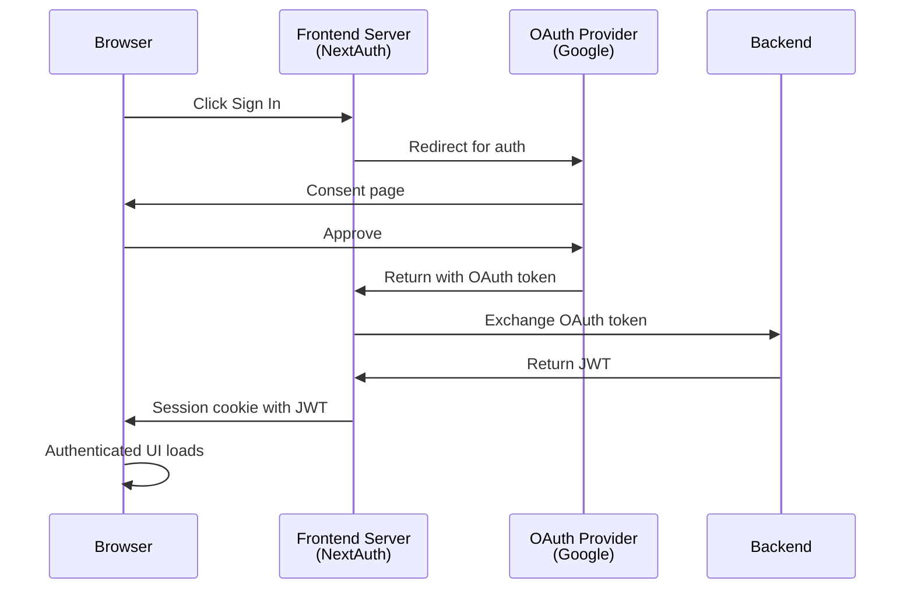
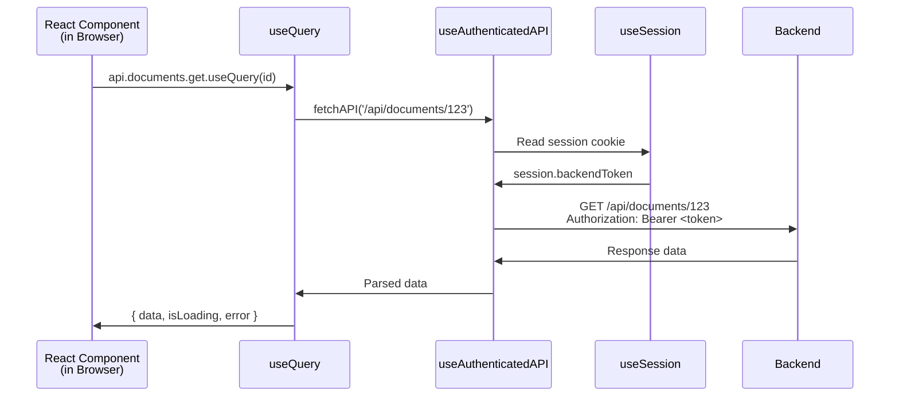

# Frontend Authentication Architecture

## Overview

The Semiont frontend implements a comprehensive authentication system built on NextAuth.js with JWT tokens from a custom backend. The architecture emphasizes:

- **No global mutable state** - All authentication state managed through React hooks
- **Per-request authentication** - Each API call reads fresh token from session
- **Fail-fast philosophy** - Missing authentication throws errors immediately
- **React Query integration** - All API calls use authenticated React Query hooks

## Core Components

### 1. NextAuth.js Configuration (`src/app/api/auth/[...nextauth]/route.ts`)

- OAuth providers: Google, GitHub, GitLab
- JWT strategy for stateless authentication
- Custom session callbacks to include backend JWT token
- Secure token generation and validation

**Session Structure:**
```typescript
session: {
  user: { email, name, image },
  backendToken: string,  // JWT from backend
  expires: string
}
```

### 2. Session Management

#### SessionProvider (NextAuth)
- Top-level provider wrapping entire app
- Manages NextAuth session state
- Provides `useSession()` hook throughout app

#### Custom SessionContext (`src/contexts/SessionContext.tsx`)
- Lightweight wrapper around NextAuth
- Provides `isFullyAuthenticated` helper
- Checks both NextAuth session AND backend token presence

```typescript
const { isFullyAuthenticated } = useCustomSession();
// true only if: status === 'authenticated' AND backendToken exists
```

### 3. Authentication Hooks

#### useSession() (NextAuth)
**Primary authentication hook** - Use this everywhere!

```typescript
const { data: session, status } = useSession();

// status: 'loading' | 'authenticated' | 'unauthenticated'
// session.backendToken: JWT for backend API calls
```

#### useAuthenticatedAPI() (`src/hooks/useAuthenticatedAPI.ts`)
**Wraps fetch with automatic Bearer token authentication**

```typescript
const { fetchAPI, isAuthenticated } = useAuthenticatedAPI();

// Automatically includes Authorization: Bearer <token>
const data = await fetchAPI('/api/endpoint');

// Throws error if no token available (fail-fast)
```

**Features:**
- Reads token synchronously from `useSession()` (no async/await)
- Adds `Authorization: Bearer <token>` header automatically
- Throws `APIError` with status code on failures
- Used internally by all React Query hooks

### 4. React Query Integration

All API calls use React Query hooks that internally use `useAuthenticatedAPI`:

```typescript
// Query (read)
const { data, isLoading, error } = api.documents.get.useQuery(documentId);

// Mutation (write)
const updateMutation = api.documents.update.useMutation();
await updateMutation.mutateAsync({ id, title, content });
```

**Query Hooks Automatically:**
- Include Bearer token via `useAuthenticatedAPI`
- Wait for authentication before running (via `enabled` flag)
- Handle 401/403 errors through global error handlers
- Retry non-auth errors (but not 401/403)

### 5. Error Handling

#### Global Error Handlers (`src/app/providers.tsx`)

React Query caches have global error handlers:

```typescript
queryCache: new QueryCache({
  onError: (error) => {
    if (error instanceof APIError) {
      if (error.status === 401) {
        dispatch401Error('Session expired');
      } else if (error.status === 403) {
        dispatch403Error('Permission denied');
      }
    }
  }
})
```

#### Auth Events (`src/lib/auth-events.ts`)

Custom event system for auth errors:
- `dispatch401Error()` - Triggers session expired modal
- `dispatch403Error()` - Triggers permission denied notification
- Type-safe event handling with cleanup

#### AuthErrorBoundary (`src/components/AuthErrorBoundary.tsx`)

Error boundary that catches auth-related errors:
- Provides recovery UI with sign-in option
- Development mode error details
- Graceful fallback for auth failures

### 6. SSE Authentication

Server-Sent Events hooks use `useSession()` directly:

```typescript
const { data: session } = useSession();

useEffect(() => {
  if (!session?.backendToken) return;

  const eventSource = new EventSource(url, {
    headers: {
      'Authorization': `Bearer ${session.backendToken}`
    }
  });
  // ...
}, [session?.backendToken]);
```

**Hooks:**
- `useDocumentEvents` - Real-time document change notifications
- `useGenerationProgress` - AI generation progress
- `useDetectionProgress` - Entity detection progress

## Authentication Flow



**Note**: Frontend server only involved in OAuth callback. All subsequent API calls go directly from browser to backend.

## API Request Flow (Client-Side in Browser)



**Note**: This entire flow happens in the browser, not on the frontend server. The browser reads the JWT from the session cookie and calls the backend API directly.

## Security Features

### Token Management
- JWT tokens stored in secure HTTP-only cookies (via NextAuth)
- Never exposed to client JavaScript directly
- Automatic token reading via `useSession()`
- No global mutable state
- CSRF protection via NextAuth

### API Security
- All API requests include Bearer token automatically
- 401/403 errors trigger global handlers
- Request validation and rate limiting
- Secure headers on all requests

### Per-Request Authentication
**No global token storage!** Each request reads fresh token:

```typescript
// ❌ OLD WAY (removed)
apiClient.setAuthToken(token);  // Global mutable state
const data = await apiClient.get('/api/endpoint');

// ✅ NEW WAY
const { fetchAPI } = useAuthenticatedAPI();  // Per-request
const data = await fetchAPI('/api/endpoint');
```

## 401 Error Handling

### Multi-Layer Detection

401 errors are caught at multiple levels:

1. **API Client Level** (`src/lib/api-client.ts`)
   - Throws typed `APIError` with status code
   - Enables precise error handling

2. **React Query Level** (`src/app/providers.tsx`)
   - Global `QueryCache` and `MutationCache` error handlers
   - Catches 401s from ALL queries and mutations
   - Dispatches `auth-401` events

3. **Component Level**
   - Individual queries can handle 401s specifically
   - Shows appropriate UI feedback

### User Experience

When a 401 error occurs:
1. React Query cache is cleared (fresh start)
2. `auth-401` event triggers SessionExpiredModal
3. Modal provides recovery options:
   - **Sign In Again** - Re-authenticate and return to current page
   - **Go to Home** - Navigate to home page

## Best Practices

### 1. Always Use useSession()

```typescript
// ✅ Good - use NextAuth hook
const { data: session, status } = useSession();
if (status === 'authenticated' && session?.backendToken) {
  // User is fully authenticated
}

// ❌ Bad - don't store token in component state
const [token, setToken] = useState();
```

### 2. Use React Query Hooks for API Calls

```typescript
// ✅ Good - React Query handles auth automatically
const { data } = api.documents.get.useQuery(id);

// ❌ Bad - manual fetch (not authenticated)
const data = await fetch('/api/documents/123').then(r => r.json());
```

### 3. Handle Loading States

```typescript
const { status } = useSession();

if (status === 'loading') {
  return <LoadingSkeleton />;
}

if (status === 'unauthenticated') {
  return <SignInPrompt />;
}

// Render authenticated content
```

### 4. Don't Set Default Values

```typescript
// ❌ Bad - hides missing auth
const token = session?.backendToken || 'default-token';

// ✅ Good - fails loudly
if (!session?.backendToken) {
  throw new Error('Authentication required');
}
```

### 5. Use Enabled Flag for Conditional Queries

```typescript
// Wait for authentication before running query
const { data } = api.documents.get.useQuery(id, {
  enabled: isFullyAuthenticated && !!id
});
```

## Configuration

### Environment Variables

```env
# NextAuth
NEXTAUTH_URL=http://localhost:3000
NEXTAUTH_SECRET=your-secret-here

# OAuth Providers
GOOGLE_CLIENT_ID=your-google-client-id
GOOGLE_CLIENT_SECRET=your-google-client-secret
GITHUB_CLIENT_ID=your-github-client-id
GITHUB_CLIENT_SECRET=your-github-client-secret
GITLAB_CLIENT_ID=your-gitlab-client-id
GITLAB_CLIENT_SECRET=your-gitlab-client-secret

# Backend API
NEXT_PUBLIC_API_URL=http://localhost:4000
```

### Session Configuration

```typescript
session: {
  strategy: 'jwt',
  maxAge: 24 * 60 * 60, // 24 hours
}
```

## Troubleshooting

### Session Not Persisting
- Check `NEXTAUTH_SECRET` is set
- Verify cookie settings in browser
- Check `NEXTAUTH_URL` matches deployment URL

### 401 Errors
- Token may be expired (check backend logs)
- Verify backend token validation
- Check if session exists: `console.log(session?.backendToken)`

### OAuth Redirect Issues
- Verify `NEXTAUTH_URL` matches deployment
- Check OAuth app callback URLs match
- Ensure HTTPS in production

### Queries Not Running
- Check `isFullyAuthenticated` is true
- Verify `enabled` flag on query
- Check session status: `console.log(status)`

## Migration Notes

**Major refactoring completed (Phases 0-8):**

### Removed (Old Architecture)
- ❌ `apiClient.setAuthToken()` - Global mutable state
- ❌ `apiClient.clearAuthToken()` - Global mutable state
- ❌ `apiClient.getAuthToken()` - Global mutable state
- ❌ `useApiWithAuth` - Replaced by React Query hooks
- ❌ `useSecureAPI` - Replaced by `useAuthenticatedAPI`
- ❌ Direct `apiService.*` calls - Replaced by `api.*` hooks

### Added (New Architecture)
- ✅ `useAuthenticatedAPI()` - Per-request auth hook
- ✅ `api.*` React Query hooks - Type-safe API client
- ✅ Global error handlers in QueryClient
- ✅ `useCustomSession()` - isFullyAuthenticated helper
- ✅ SSE hooks use `useSession()` directly

### Benefits
- ✅ No global mutable state
- ✅ No race conditions on page load
- ✅ All requests authenticated per-request
- ✅ 100% test coverage (802/802 tests passing)
- ✅ Type-safe API client
- ✅ Automatic caching and refetching

## Related Documentation

- [ARCHITECTURE.md](./ARCHITECTURE.md) - Overall frontend architecture
- [AUTHORIZATION.md](./AUTHORIZATION.md) - Permissions and 403 handling
- [NextAuth.js Documentation](https://next-auth.js.org/)
- [React Query Documentation](https://tanstack.com/query)
