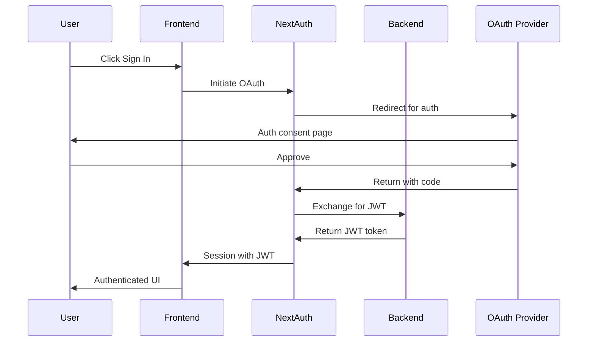

# Frontend Authentication Architecture

## Overview

The Semiont frontend implements a comprehensive authentication system built on NextAuth.js with JWT tokens, providing secure OAuth-based authentication with multiple providers and graceful session management.

## Core Components

### 1. NextAuth.js Configuration (`src/lib/auth.ts`)
- OAuth providers: Google, GitHub, GitLab
- JWT strategy for stateless authentication
- Custom session callbacks to include backend JWT token
- Secure token generation and validation

### 2. Session Management

#### SessionContext (`src/contexts/SessionContext.tsx`)
- Centralized session state management
- JWT expiration tracking
- Real-time session status updates
- Provides `isAuthenticated`, `expiresAt`, and `isExpiringSoon` states

#### Session Monitoring Hooks
- **useSessionExpiry**: Tracks time remaining and expiration warnings
- **useFormattedTime**: Formats remaining time for display
- **useSecureAPI**: Manages API authentication headers

### 3. Visual Feedback Components

#### SessionTimer (`src/components/SessionTimer.tsx`)
- Real-time countdown display in user menu
- Shows time remaining in session
- Updates every second with proper cleanup

#### SessionExpiryBanner (`src/components/SessionExpiryBanner.tsx`)
- Warning banner shown when < 5 minutes remaining
- Dismissible yellow warning with clear CTA
- Prompts users to extend their session

#### SessionExpiredModal (`src/components/SessionExpiredModal.tsx`)
- Modal overlay when session expires
- Options to sign in again or navigate home
- Prevents accidental data loss

### 4. API Integration

#### useApiWithAuth Hook (`src/hooks/useApiWithAuth.ts`)
- Wraps API calls with automatic authentication
- Handles 401/403 errors gracefully
- Shows appropriate error toasts
- Clears React Query cache on auth errors

#### API Client Security
- Automatic Bearer token injection
- Token refresh handling (planned)
- Request/response interceptors for auth

### 5. Error Handling

#### AuthErrorBoundary (`src/components/AuthErrorBoundary.tsx`)
- Catches authentication-related errors
- Provides recovery UI with sign-in option
- Development mode error details
- Graceful fallback for auth failures

## Authentication Flow



## Security Features

### Token Management
- JWT tokens stored in secure HTTP-only cookies
- Automatic token expiration tracking
- No sensitive data in localStorage
- CSRF protection via NextAuth

### API Security
- All API requests include Bearer token
- Automatic 401 handling and session clearing
- Rate limiting and request validation
- Secure headers on all requests

### Session Security
- 24-hour session expiration
- Visual warnings before expiry
- Automatic cleanup on logout
- Clear session state on auth errors

## User Experience Features

### Proactive Warnings
- 5-minute warning before session expiry
- Visual countdown in user menu
- Dismissible banner for flexibility
- Modal when session expires

### Seamless Recovery
- One-click re-authentication
- Return to previous location after sign-in
- Preserved application state where possible
- Clear error messages and recovery options

### Loading States
- Authentication loading indicators
- Skeleton components during auth checks
- Prevents flash of unauthenticated content
- Smooth transitions between states

## Development Tools

### SessionDebugger (`src/components/SessionDebugger.tsx`)
- Development-only debug panel
- Shows real-time session state
- Displays token expiration
- Helps test edge cases

### Testing Utilities
- Mock session providers
- Auth state simulation
- Token expiration testing
- Error scenario testing

## Best Practices

### 1. Always Use Auth Hooks
```typescript
// Good - uses auth hook
const { data, error } = useApiWithAuth();

// Bad - manual token handling
const token = getToken();
fetch('/api/data', { headers: { Authorization: `Bearer ${token}` }});
```

### 2. Handle Loading States
```typescript
const { status } = useSession();

if (status === 'loading') {
  return <LoadingSkeleton />;
}

if (status === 'unauthenticated') {
  return <SignInPrompt />;
}
```

### 3. Wrap Protected Routes
```typescript
<ModerationAuthWrapper>
  {/* Protected content */}
</ModerationAuthWrapper>
```

### 4. Clear Error Handling
```typescript
onError: (error) => {
  if (error.status === 401) {
    // Session expired - handled globally
  } else if (error.status === 403) {
    showError('Insufficient permissions');
  }
}
```

## Configuration

### Environment Variables
```env
NEXTAUTH_URL=http://localhost:3000
NEXTAUTH_SECRET=your-secret-here
GOOGLE_CLIENT_ID=your-google-client-id
GOOGLE_CLIENT_SECRET=your-google-client-secret
GITHUB_CLIENT_ID=your-github-client-id
GITHUB_CLIENT_SECRET=your-github-client-secret
GITLAB_CLIENT_ID=your-gitlab-client-id
GITLAB_CLIENT_SECRET=your-gitlab-client-secret
```

### Session Configuration
```typescript
session: {
  strategy: 'jwt',
  maxAge: 24 * 60 * 60, // 24 hours
}
```

## Troubleshooting

### Common Issues

1. **Session Not Persisting**
   - Check NEXTAUTH_SECRET is set
   - Verify cookie settings
   - Check browser cookie permissions

2. **401 Errors**
   - Token may be expired
   - Check backend token validation
   - Verify API endpoint authentication

3. **OAuth Redirect Issues**
   - Verify NEXTAUTH_URL matches deployment
   - Check OAuth app callback URLs
   - Ensure proper HTTPS in production

4. **Session Timer Not Updating**
   - Check SessionProvider wrapping
   - Verify JWT has exp claim
   - Check browser console for errors

## Future Enhancements

### Planned Features
- Token refresh mechanism
- Remember me functionality
- Biometric authentication support
- Session activity tracking
- Multi-device session management

### Security Improvements
- Enhanced CSRF protection
- Request signing
- Rate limiting per user
- Anomaly detection
- Security event logging

## Related Documentation
- [NextAuth.js Documentation](https://next-auth.js.org/)
- [Backend Security](/docs/SECURITY.md)
- [API Documentation](/docs/API.md)
- [React Query Integration](https://tanstack.com/query)