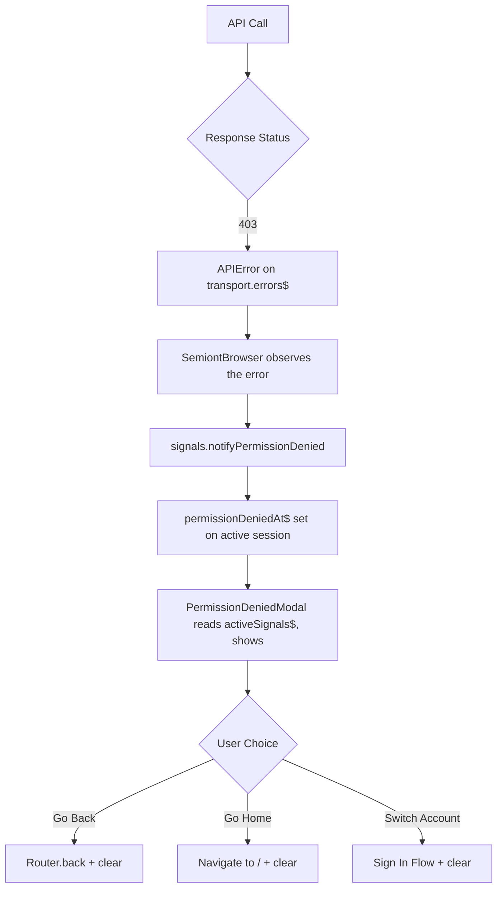

# Frontend Authorization Architecture

## Overview

The Semiont frontend implements a foundation for fine-grained access control with graceful 403 error handling and permission-aware UI components. While the current implementation is minimal, the architecture is designed to scale with future RBAC (Role-Based Access Control) requirements.

## Current State

### Basic Permission System

The current authorization system provides:

- **Global 403 error handling** via event-driven architecture
- **PermissionDeniedModal** for user-friendly access denial messages
- **Permission hooks** ready for expansion
- **Type-safe error handling** with proper status codes

### Core Components

#### 1. Role flags from the active session's `user$`

Role flags live on the authenticated user, exposed by the active `SemiontSession` as `user$`:

```typescript
import { useSemiont, useObservable } from '@semiont/react-ui';

const session = useObservable(useSemiont().activeSession$);
const user = useObservable(session?.user$);
const isAdmin = user?.isAdmin ?? false;
const isModerator = user?.isModerator ?? false;
```

These come straight from the authenticated user record and are coarse — fine-grained permission scopes are still backend-only and a future enhancement.

#### 2. PermissionDeniedModal (`@semiont/react-ui`)

A library modal that surfaces when users encounter 403 errors. It reads the active session's `SessionSignals` (specifically `permissionDeniedAt$` and `permissionDeniedMessage$`, exposed by the browser as `activeSignals$`), so it appears whenever that signal becomes non-null. Recovery options:

- **Go Back** - Return to previous page
- **Go to Home** - Navigate to home page
- **Switch Account** - Sign in with different credentials

The modal is mounted inside `AuthShell` alongside `SessionExpiredModal`.

#### 3. `signals.notifyPermissionDenied` (`@semiont/sdk`)

A 403 from the backend surfaces on the transport's error stream; the `SemiontBrowser` observes it and raises the signal on the active session's `SessionSignals`:

```typescript
// inside SemiontBrowser, observing transport errors
if (error instanceof APIError && error.status === 403) {
  signals.notifyPermissionDenied(error.message);
}
```

When no session is active (e.g. on the landing page), `activeSignals$` is `null`, so nothing is raised. The signal is cleared (`clearPermissionDenied`) when the user dismisses the modal.

## 403 Error Handling Flow



### Error Detection Layers

1. **Transport Level** (`@semiont/http-transport`)
   - Throws `APIError` with status: 403 and surfaces it on `transport.errors$`
   - Preserves error context from the backend

2. **Session Level** (`@semiont/sdk` — `SemiontBrowser`)
   ```typescript
   if (error instanceof APIError && error.status === 403) {
     signals.notifyPermissionDenied('Permission denied');
   }
   ```

3. **Component Level**
   - Components can read `isAdmin` / `isModerator` from the active session's `user$` (`useObservable(session?.user$)`) to disable or hide UI affordances proactively

## Security Considerations

### Current Implementation

- **404 for unauthorized admin routes** - Routes return 404 instead of 403 to hide existence
- **No permission details in errors** - Generic messages prevent information leakage
- **Client-side permission checks** - Basic checks, not authoritative

### Best Practices

1. **Never trust client-side permissions** - Always validate on backend
2. **Fail closed** - Default to denying access
3. **Obscure sensitive routes** - Use 404s for admin/moderate paths
4. **Minimal error information** - Don't reveal system internals

## Future Roadmap

### Near-term Enhancements

#### 1. Enhanced Error Responses

```typescript
interface PermissionError {
  status: 403;
  code: 'PERMISSION_DENIED';
  details: {
    resource: 'document:123';
    action: 'edit';
    required: ['doc.edit', 'team.member'];
    userHas: ['doc.view'];
    suggestion: 'Request edit access from owner';
  }
}
```

#### 2. Permission-Aware Components

```typescript
function DocumentEditor({ document }) {
  const permissions = useDocumentPermissions(document.id);

  if (!permissions.canEdit) {
    return <ReadOnlyView document={document} />;
  }

  return <FullEditor document={document} />;
}
```

#### 3. Optimistic Permission Checking

```typescript
// Check before making API call
const { canDelete } = useResourcePermissions(resourceId);
if (!canDelete) {
  showPermissionModal({
    action: 'delete',
    resource: 'document'
  });
  return;
}
```

### Long-term Vision

#### Fine-Grained RBAC

- **Resource-level permissions** - Per-document, per-collection access
- **Team-based access** - Organizational hierarchy support
- **Temporal permissions** - Time-limited access grants
- **Delegated permissions** - Acting on behalf of others

#### Access Request Workflow

```typescript
interface AccessRequest {
  resource: string;
  permissions: string[];
  justification: string;
  duration?: number;
  approver?: string;
}
```

#### Permission Caching Strategy

```typescript
const permissionCache = new Map({
  'document:123': ['read', 'comment'],
  'collection:abc': ['read', 'write'],
  'global': ['create_document']
});
```

## Integration with Authentication

Authorization works in tandem with authentication:

- **Authentication** (401) - "Who are you?" - See [AUTHENTICATION.md](./AUTHENTICATION.md)
- **Authorization** (403) - "What can you do?"

Both systems use the same event-driven architecture for consistent error handling and user experience.

## Usage Examples

### Checking Permissions

```typescript
function MyComponent() {
  const session = useObservable(useSemiont().activeSession$);
  const isAdmin = useObservable(session?.user$)?.isAdmin ?? false;

  if (!isAdmin) {
    return <ReadOnlyMessage />;
  }

  return <EditableContent />;
}
```

### Handling Permission Errors

```typescript
// A verb call rejects on failure; a 403 also surfaces the modal automatically
try {
  await semiont.mark.delete(resourceId, annotationId);
} catch (error) {
  if (error instanceof APIError && error.status === 403) {
    // The transport stamped this as `forbidden` and already routed it to
    // SessionSignals → PermissionDeniedModal appears
  }
}
```

### Protected UI Elements

```typescript
function ActionButtons({ document }) {
  const { canEdit, canDelete } = useDocumentPermissions(document);

  return (
    <>
      <Button
        disabled={!canEdit}
        title={!canEdit ? 'You need edit permission' : ''}
      >
        Edit
      </Button>
      <Button
        disabled={!canDelete}
        title={!canDelete ? 'You need delete permission' : ''}
      >
        Delete
      </Button>
    </>
  );
}
```

## Testing

### Manual Testing

1. **Trigger 403 error** - Access restricted resource
2. **Verify modal appears** - PermissionDeniedModal should show
3. **Test recovery options** - Each button should work correctly
4. **Check toast notifications** - Brief error message should appear

### Automated Testing

```typescript
describe('Authorization', () => {
  it('shows PermissionDeniedModal on 403', async () => {
    // Mock API to return 403
    server.use(
      http.get('/api/admin/*', () => {
        return new Response('Forbidden', { status: 403 });
      })
    );

    // Trigger API call
    await userEvent.click(screen.getByText('Admin Action'));

    // Verify modal appears
    expect(screen.getByText('Access Denied')).toBeInTheDocument();
  });
});
```

## Configuration

### Environment Variables

There are currently no authorization-specific environment variables.

### Permission Definitions

Future permission configuration structure:

```typescript
const permissions = {
  document: ['create', 'read', 'update', 'delete', 'share'],
  collection: ['create', 'read', 'update', 'delete', 'manage'],
  admin: ['users', 'security', 'devops', 'audit']
};
```

## Troubleshooting

### Common Issues

1. **Modal not appearing on 403**
   - Check that the transport surfaced a `forbidden` error on `session.errors$` (it drives `notifyPermissionDenied`)
   - Verify `PermissionDeniedModal` is mounted inside `AuthShell`
   - Confirm the page is inside the protected layout boundary — outside it, no provider is mounted and the notify call is a no-op
   - Check browser console for errors

2. **Coarse role flags only**
   - `isAdmin` / `isModerator` come straight from `getMe`
   - Fine-grained per-resource permissions are pending backend support

3. **403 errors not caught**
   - Ensure using `APIError` class from http-transport
   - Check error instanceof APIError

## Related Documentation

- [Authentication Architecture](./AUTHENTICATION.md) - 401 handling and session management
- [API Documentation](../../../docs/protocol/API.md) - API error handling details
- [Backend RBAC](../../../docs/system/administration/SECURITY.md) - Server-side permission system

## Contributing

When adding new permission-related features:

1. **Use existing patterns** - Event system, modals, hooks
2. **Type everything** - Full TypeScript coverage required
3. **Consider future RBAC** - Design for expansion
4. **Document permissions** - Clear comments on what each permission allows
5. **Test error paths** - Ensure graceful degradation