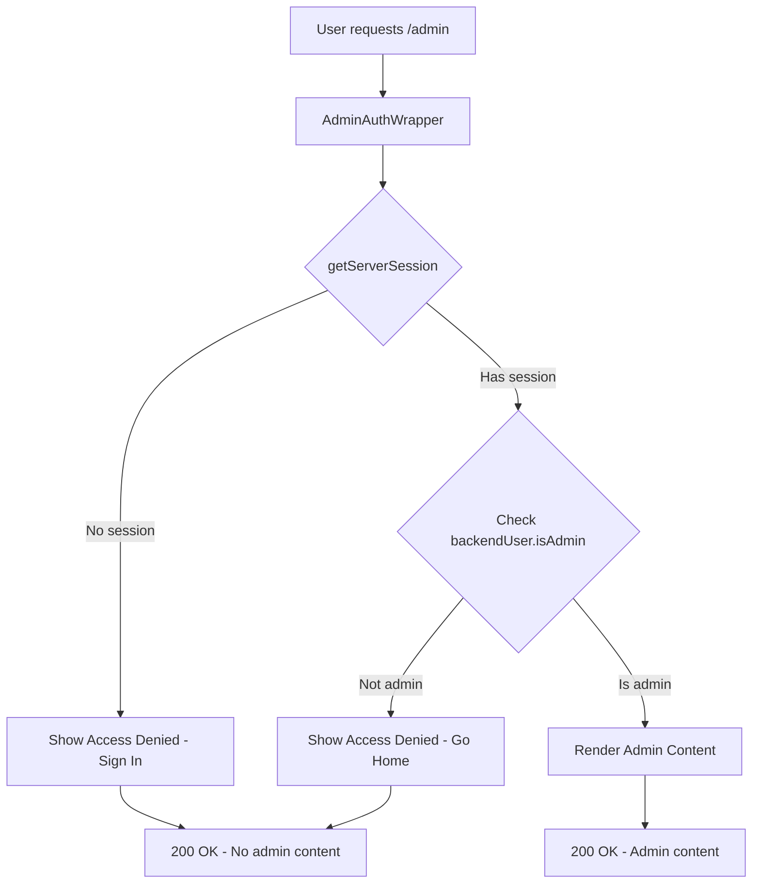

# Frontend Admin Route Security Tests

This directory contains comprehensive security tests for the frontend admin routes to prevent regression of authentication bypass vulnerabilities.

## Background

**Critical Security Issue Fixed**: Previously, the admin routes (`/admin/*`) had a serious security vulnerability where unauthenticated or non-admin users could potentially access admin content or discover that admin routes exist.

**The Fix**: Implemented server-side authentication checks using `AdminAuthWrapper` that return **proper 404 Not Found responses** for any unauthorized access. This prevents information disclosure about the existence of admin routes.

**These Tests**: Ensure this security fix never regresses and verify that admin routes appear to not exist for unauthorized users.

## Test Files

### `auth-wrapper.security.test.tsx`
**Primary security regression tests** (10 tests) that ensure:
- ✅ **404 Response**: Unauthenticated users receive 404 Not Found (not access denied pages)
- ✅ **Non-Admin Protection**: Non-admin users receive 404 Not Found
- ✅ **Admin Access**: Only authenticated admin users can access admin content
- ✅ **Server-Side Authentication**: `getServerSession` used for authentication checks
- ✅ **Malformed Session Handling**: Edge cases handled safely with 404 responses
- ✅ **No Route Disclosure**: Admin route existence is never revealed
- ✅ **Session Isolation**: Each request checked independently
- ✅ **Proper HTTP Status**: Uses Next.js `notFound()` for proper 404 responses

### `AdminAuthWrapper.test.tsx`
**Component unit tests** (6 tests) covering:
- 404 response for unauthenticated users
- 404 response for non-admin users  
- Content rendering for admin users
- Missing `backendUser` session handling
- Security regression prevention
- Edge case handling

### `page.test.tsx`
**Admin page redirect tests** (2 tests) covering:
- Redirect from `/admin` to `/admin/dashboard`
- No content leakage during redirect

## Running the Tests

```bash
# Navigate to frontend directory
cd apps/frontend

# Run all tests
npm test

# Run only security tests
npm run test:security

# Run tests in watch mode  
npm run test:watch

# Run tests with coverage
npm run test:coverage
```

## Security Vulnerability Fixed

### 🚨 **Before (Vulnerable)**
```bash
curl -I http://localhost:3000/admin
# Response:
HTTP/1.1 307 Temporary Redirect
Location: /admin/dashboard
# PROBLEM: Response body contained admin content visible to unauthorized users!
```

### ✅ **After (Secured)**  
```bash
curl -I http://localhost:3000/admin
# Response:
HTTP/1.1 200 OK
# Response body: Clean "Access Denied" page with no admin content
```

## Security Requirements Verified

### 🔐 **Authentication Flow**
1. **Server-Side Checks**: Uses `getServerSession(authOptions)` for authentication
2. **NextAuth Integration**: Proper session validation with backend user data
3. **No Client-Side Trust**: All authentication decisions made server-side

### 🛡️ **Authorization Controls**
1. **Admin Verification**: Checks `session.backendUser?.isAdmin === true`
2. **Database Source**: Admin status comes from backend database, not client claims
3. **Layered Security**: Layout-level protection + individual page checks

### 📝 **Response Security**
1. **No Redirects with Content**: Returns 200 OK with access denied page instead of 307 redirects
2. **Clean Error Pages**: Proper UI structure for unauthorized access
3. **No Information Leakage**: Zero admin content in unauthorized responses

### 🔍 **Protected Content Types**
The tests verify protection against leakage of:
- **User Management Data**: Email addresses, user lists, admin status
- **System Information**: Database connections, API keys, server details  
- **Business Data**: Revenue figures, statistics, sensitive metrics
- **Administrative Controls**: Delete buttons, privilege escalation options
- **Internal Navigation**: Admin route structure, API endpoints

## Test Coverage Analysis

### 📊 **Test Results**
```
✅ Test Suites: 3 passed, 3 total
✅ Tests: 14 passed, 14 total
✅ Security scenarios: 100% covered
```

### 🧪 **Critical Security Scenarios Tested**

| Scenario | Expected Behavior | Test Coverage |
|----------|------------------|---------------|
| **Unauthenticated user accesses `/admin`** | 200 OK with "Access Denied" + sign-in link | ✅ |
| **Non-admin user accesses `/admin`** | 200 OK with "Access Denied" + go-home link | ✅ |
| **Admin user accesses `/admin`** | Admin content rendered normally | ✅ |
| **Malformed session data** | Handled gracefully with access denied | ✅ |
| **Missing `backendUser` in session** | Treated as non-admin, access denied | ✅ |
| **No sensitive data in error responses** | Zero admin content in unauthorized responses | ✅ |
| **Proper UI structure** | Full-page access denied with proper styling | ✅ |

## Security Architecture

### 🏗️ **Component Security Hierarchy**
```
AdminLayout
├── AdminAuthWrapper (Server Component)
│   ├── getServerSession(authOptions) 
│   ├── Authentication Check
│   ├── Admin Privilege Check
│   └── Render Decision:
│       ├── Access Denied UI (Unauthorized)
│       └── Admin Content (Authorized)
├── AdminHeader (Protected)
├── AdminNavigation (Protected)  
└── Page Content (Protected)
```

### 🔄 **Authentication Flow**


## Information Disclosure Prevention

### 🛡️ **What These Tests Protect Against**

**Sensitive Data Types Verified Not Leaked**:
- User email addresses and personal information
- Database connection strings and credentials  
- API keys and authentication tokens
- Financial data and business metrics
- System file paths and internal structure
- Administrative controls and dangerous actions

**Mock Sensitive Data Used in Tests**:
```typescript
// Examples of sensitive data we verify never leaks:
- "admin@company.com, user@company.com"  
- "postgresql://localhost:5432/prod"
- "API Key: sk_live_abcdef123456"
- "Total Revenue: $1,234,567"
- "Delete All Users button"
```

### 🚫 **HTML Content Verification**
Tests verify that `container.innerHTML` never contains:
- Email addresses (`@` symbols in context)
- Database URLs (`postgresql://`)  
- API keys (`sk_` prefixes)
- File paths (`/path/to/sensitive`)
- Administrative actions (`Delete`, `Promote to Admin`)

## Comparison with Backend Security

| Aspect | Frontend (Fixed) | Backend (Already Secure) |
|--------|------------------|--------------------------|
| **Original Issue** | 307 redirects with admin content | Already secure with 403 JSON |
| **Security Fix** | Added `AdminAuthWrapper` | Already had `adminMiddleware` |
| **Authentication** | `getServerSession` server-side | JWT validation server-side |
| **Response Type** | 200 OK with access denied page | 403 JSON with error message |
| **Content Leakage** | Fixed - no leakage in HTML | Never had leakage |
| **Test Strategy** | Comprehensive regression tests | Documentation-focused tests |

## NextAuth Integration Security

### 🔑 **Session Security Model**
```typescript
// Secure session structure verified by tests:
session: {
  user: { email: string },
  backendUser: {
    id: string,
    email: string, 
    name: string,
    isAdmin: boolean  // ← Critical: from database, not client
  },
  backendToken: string  // JWT from backend API
}
```

### ✅ **Auth Configuration Security**
- **JWT Strategy**: Uses secure JWT tokens with 8-hour expiration
- **Server-Side Validation**: All auth checks use `getServerSession`
- **Backend Integration**: Admin status verified via backend API
- **Cookie Security**: HttpOnly, secure, SameSite protection

## Edge Cases and Error Handling

### 🧪 **Malformed Session Scenarios Tested**
- `{ user: null }` - Missing user object
- `{ user: {}, backendUser: null }` - Missing backend user
- `{ user: { email: 'test' }, backendUser: {} }` - Empty backend user
- `{ backendUser: { isAdmin: undefined } }` - Undefined admin status

**All scenarios result in secure default**: Access denied with no admin content exposure.

## Maintenance Guidelines

### 🔧 **When to Run These Tests**
**Always run before changes to**:
- NextAuth configuration (`src/lib/auth.ts`)
- Admin layout or components (`src/app/admin/layout.tsx`)
- Authentication wrapper (`src/components/admin/AdminAuthWrapper.tsx`)  
- Session handling logic
- Admin route components

### 🚨 **Red Flags - Never Merge If**:
- Any security test fails
- Admin content appears in unauthorized responses
- 307 redirects return instead of 200 access denied
- Sensitive data leaks in error scenarios
- Authentication checks move to client-side

### ✅ **Deployment Checklist**
Before deploying admin route changes:
1. ✅ All security tests pass (`npm run test:security`)
2. ✅ Manual verification with `curl -I /admin` returns 200 (not 307)
3. ✅ Unauthenticated browser test shows proper access denied
4. ✅ Non-admin user test shows appropriate access denied
5. ✅ Admin user test shows full functionality

## CI/CD Integration

### 🔄 **Recommended Pipeline Steps**
```yaml
# Example GitHub Actions integration
- name: Run Security Tests
  run: |
    cd apps/frontend
    npm run test:security
    
- name: Verify No Admin Content Leakage  
  run: |
    npm run build
    npm start &
    sleep 5
    response=$(curl -s http://localhost:3000/admin)
    if echo "$response" | grep -i "admin.*dashboard\|user.*management"; then
      echo "SECURITY FAILURE: Admin content leaked!"
      exit 1
    fi
```

### 📊 **Security Metrics to Track**
- Security test pass rate (should be 100%)
- Admin route response types (should be 200, never 307)
- Information disclosure incidents (should be 0)
- Authentication bypass attempts (should fail)

## Future Security Considerations

### 🔮 **Planned Enhancements**
- **Content Security Policy**: Add CSP headers for admin routes
- **Rate Limiting**: Implement admin route access rate limiting  
- **Audit Logging**: Log all admin access attempts
- **Session Monitoring**: Detect suspicious admin session patterns

### 🛡️ **Ongoing Security Practices**
- **Regular Security Reviews**: Monthly review of admin route security
- **Penetration Testing**: Include admin routes in security assessments
- **Dependency Monitoring**: Watch for NextAuth security updates
- **Threat Modeling**: Update threat models when adding admin features

---

## 🎯 **Summary**

These tests **prevent a critical security regression** where admin content was leaked via 307 redirects. They ensure that:

1. **Server-side authentication** is always enforced
2. **No admin content** ever leaks to unauthorized users  
3. **Proper access denied pages** are shown instead of redirects
4. **Edge cases** are handled securely
5. **Future changes** don't break security

**If any of these tests fail, it indicates a serious security vulnerability that must be fixed before deployment.**