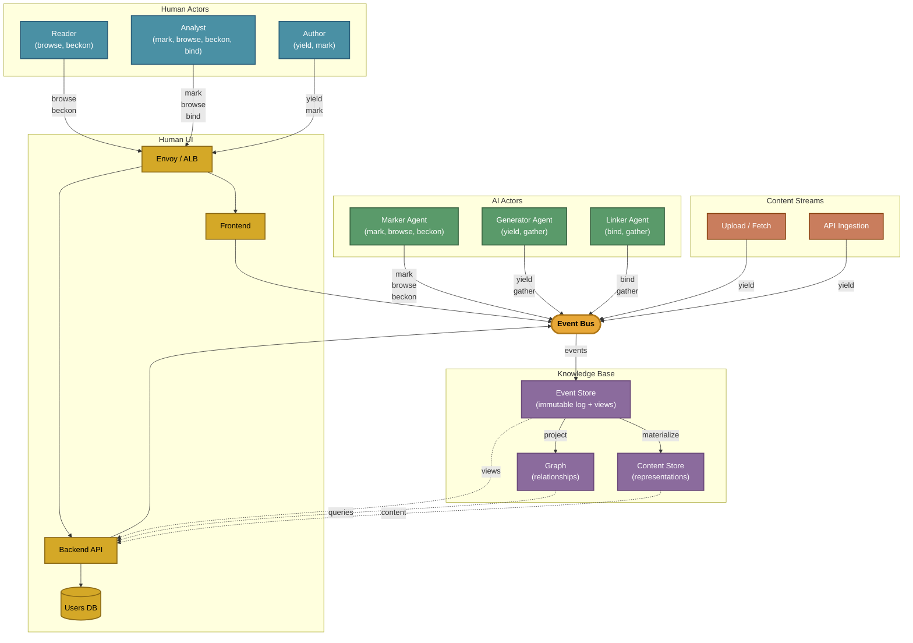

# Architecture: Actor Model

The current architecture ([ARCHITECTURE.md](ARCHITECTURE.md)) describes Semiont as a layered system — client, application, data, compute. This document reframes the same system as a set of **actors** communicating through a central **event bus**. The shift in perspective clarifies what each participant *does* and *knows*, and makes it easier to reason about adding new actors (human or AI) without touching the plumbing.

## Core Insight

Every meaningful action in Semiont is an event on the bus. The actors fall into three categories:

1. **Intelligent actors** — humans or AI agents that read, interpret, and annotate content. They produce events that carry semantic intent (mark, browse, yield, bind, gather, beckon).
2. **The knowledge base** — a passive actor that listens to events and materializes durable state. It has no intelligence; it simply records what the intelligent actors decide.
3. **Content streams** — external sources that yield new resources into the system (uploads, web fetches, API ingestion).

The event bus is the only coupling between actors. An actor does not know who else is listening.

## Actor Topology

## Actors

### Human Actors

| Actor | Flows | What they do |
|-------|-------|-------------|
| **Reader** | browse, beckon | Navigates resources and annotations. Clicks, hovers, scrolls. Consumes the knowledge base without modifying it. |
| **Analyst** | mark, browse, beckon, bind | Reads content, creates annotations (highlights, comments, assessments, tags), and resolves references to existing resources. The primary human intelligence in the system. |
| **Author** | yield, mark | Composes new resources manually (via the compose page) and annotates them. Produces content that the knowledge base records. |

All human actors interact through the **Human UI** — the browser, Envoy proxy, Next.js frontend, and Hono backend. The UI translates DOM interactions (clicks, selections, form submissions) into events on the bus.

### AI Actors

| Actor | Flows | What they do |
|-------|-------|-------------|
| **Marker Agent** | mark, browse, beckon | Scans documents and proposes annotations — highlights, assessments, comments, tags, and entity references. Produces the same W3C annotations that human analysts do. |
| **Generator Agent** | yield, gather | Assembles context around a reference annotation (gather), then synthesizes a new resource from it (yield). Creates content that the knowledge base records. |
| **Linker Agent** | bind, gather | Resolves unresolved references by searching for matching resources and linking them. Performs entity resolution and coreference — the binding of a mention to its referent. |

AI actors connect via the backend API (REST + JWT) or MCP protocol. They emit the same events as human actors. The knowledge base cannot distinguish a human-created annotation from an AI-created one — both are W3C annotations with a `creator` field that identifies the agent.

### Knowledge Base (Passive)

The knowledge base is not an intelligent actor. It has no goals, preferences, or decisions. It listens to events on the bus and materializes three projections:

| Store | Purpose | Access Pattern |
|-------|---------|---------------|
| **Content Store** | Content-addressed binary storage (documents, images, PDFs) | Write-once, read by checksum |
| **Event Store** | Immutable append-only log of all domain events, plus materialized views | Append events, query views |
| **Graph** | Relationship projection for traversal queries (backlinks, entity networks) | Read-only projection from events |

The knowledge base never initiates an event. Events flow *into* it. Reads flow *out of* it (via the backend API). This asymmetry is deliberate — it means the knowledge base can be rebuilt from the event log at any time.

### Content Streams

Content streams are sources of new resources entering the system. They participate only in the **yield** flow:

- **Upload** — a human drags a file into the browser
- **API Ingestion** — an external system pushes content via REST
- **Web Fetch** — the system retrieves content from a URL

Each produces a `resource.created` event. After that, the resource is available for all other actors to annotate, browse, link, and generate from.

## Flows as Verbs

The six flows are verbs that actors perform. Each flow is a conversation between one or more intelligent actors and the knowledge base, mediated by the event bus:

| Flow | Verb | Who does it | What happens |
|------|------|-------------|-------------|
| **[Mark](flows/MARK.md)** | Annotate | Analyst, Author, Marker Agent | Create W3C annotations on resources |
| **[Browse](flows/BROWSE.md)** | Navigate | Reader, Analyst, Marker Agent | Route attention to panels, annotations, resources |
| **[Beckon](flows/BECKON.md)** | Focus | Reader, Analyst, Marker Agent | Coordinate which annotation has visual attention |
| **[Bind](flows/BIND.md)** | Link | Analyst, Linker Agent | Resolve references to concrete resources |
| **[Gather](flows/GATHER.md)** | Contextualize | Generator Agent, Linker Agent | Assemble surrounding context for downstream use |
| **[Yield](flows/YIELD.md)** | Create | Author, Generator Agent, Content Streams | Produce new resources in the knowledge base |

## Why This Matters

The actor model makes three things visible that the layered architecture obscures:

1. **Human and AI are peers.** They perform the same flows, produce the same events, and create the same W3C annotations. The system does not privilege one over the other. A future actor — a different AI model, a rule engine, a crowdsourcing pipeline — slots in by subscribing to and emitting events.

2. **The knowledge base is inert.** It records; it does not decide. All intelligence lives in the actors. This means the knowledge base can be simple, append-only, and rebuildable — properties that are hard to maintain when "smart" behavior leaks into the data layer.

3. **Flows are composable.** A Marker Agent does mark + browse + beckon. A Generator Agent does yield + gather. New actor types can mix flows freely. The bus doesn't care who emits an event or who consumes it — only that the event conforms to the [event map](../packages/core/src/event-map.ts).
