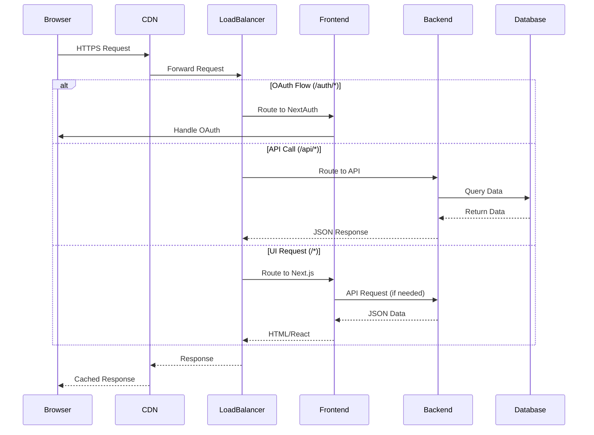
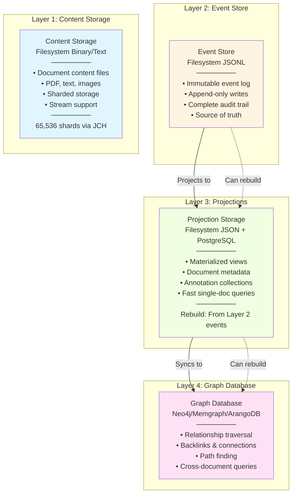

# Semiont Architecture

This document describes the platform-agnostic architecture of the Semiont semantic knowledge platform.

For platform-specific deployment details, see:
- [AWS Deployment](./platforms/AWS.md) - ECS Fargate, RDS, EFS deployment

## Overview

Semiont is a semantic knowledge platform with a modern architecture focused on:

- **Event Sourcing**: Immutable event log as source of truth
- **4-Layer Data Model**: Separation of content, events, projections, and relationships
- **Type Safety**: TypeScript throughout with schema validation
- **W3C Standards**: Full Web Annotation Data Model compliance
- **Modularity**: Clear separation of concerns with focused modules

**Quick Navigation:**
- [Application Architecture](#application-architecture) - Frontend/Backend services
- [Data Layer Architecture](#data-layer-architecture) - 4-layer storage model
- [Authentication](#authentication) - OAuth and JWT (see [AUTHENTICATION.md](./AUTHENTICATION.md) for details)
- [Development Workflow](#development-workflow) - Local development guide

**Layer-Specific Documentation:**
- [Content Storage (Layer 1)](./CONTENT-STORE.md) - Raw document storage
- [Event Store (Layer 2)](./EVENT-STORE.md) - Event sourcing
- [Projection Storage (Layer 3)](./PROJECTION.md) - Materialized views
- [Graph Database (Layer 4)](./GRAPH.md) - Relationship traversal
- [W3C Web Annotation](../specs/docs/W3C-WEB-ANNOTATION.md) - Complete annotation flow

## Application Architecture

### Dual-Service Model

The application consists of two separate services:

#### Frontend Service

**Next.js 14** application with TypeScript, Tailwind CSS, and NextAuth.js for OAuth authentication.

**Key Features**:
- Server-side rendering (SSR) and static generation (SSG)
- OAuth authentication with domain restrictions
- Responsive design with dark mode support
- Type-safe API client for backend communication
- W3C Web Annotation UI components with JSON-LD export

**For complete frontend details**, including framework choices, development setup, and feature documentation, see [Frontend README](../apps/frontend/README.md).

#### Backend Service (BFF)

**Backend for Frontend** API built with Hono, featuring automatic OpenAPI documentation and type-safe validation.

**Key Features**:
- High-performance HTTP server with automatic OpenAPI docs
- Event sourcing with 4-layer data architecture
- JWT-based authentication middleware
- Automatic database migrations
- Type-safe queries with Prisma
- W3C Web Annotation Data Model support

**For complete backend details**, including API documentation, framework choices, and development setup, see [Backend README](../apps/backend/README.md).

### Service Communication



**Routing Pattern**:
1. **Browser to Frontend**: Direct HTTPS connection via CDN/Load Balancer
2. **Frontend to Backend**: Path-based routing with clear separation:
   - `/auth/*` → Frontend (NextAuth.js OAuth flows)
   - `/api/*` → Backend (All API endpoints)
   - `/*` → Frontend (Default - UI and static assets)
3. **Backend to Database**: Direct connection via private networking

## Authentication

Semiont implements a **secure-by-default** authentication model using OAuth 2.0 and JWT tokens.

**Quick Summary**:
- **OAuth 2.0**: Google OAuth with domain restrictions
- **JWT Tokens**: Stateless authentication for API requests
- **MCP Support**: Special flow for Model Context Protocol clients
- **Default Protected**: All API routes require authentication unless explicitly public

**Public Endpoints**:
- `GET /api/health` - Health check
- `GET /api` - API documentation
- `POST /api/auth/google` - OAuth login

**Key Features**:
- Automatic JWT validation middleware
- 7-day access tokens, 30-day refresh tokens (MCP only)
- Email domain restrictions
- Admin role support

For complete details on authentication flows, token management, security best practices, and implementation examples, see [AUTHENTICATION.md](./AUTHENTICATION.md).

For MCP client implementation, see [MCP Server](../packages/mcp-server/README.md).

## Data Layer Architecture

The backend implements a 4-layer data architecture, each layer serving a specific purpose:



### Layer Responsibilities

- **Layer 1 (Content Storage)**: Stores raw document content in binary/text format with 4-hex sharding (65,536 shards). Provides O(1) read/write by document ID. See [CONTENT-STORE.md](./CONTENT-STORE.md).

- **Layer 2 (Event Store)**: Immutable append-only event log (JSONL files). Source of truth for all state changes. Supports event replay and projection rebuilding. See [EVENT-STORE.md](./EVENT-STORE.md).

- **Layer 3 (Projections)**: Materialized views of document state built from Layer 2 events. Optimized for fast single-document queries. Can be rebuilt from events at any time. See [PROJECTION.md](./PROJECTION.md).

- **Layer 4 (Graph Database)**: Relationship and connection data synced from Layer 3. Handles graph traversal, backlinks, path finding, and cross-document queries. See [GRAPH.md](./GRAPH.md).

### Data Flow

1. **Write Path**: Content → Layer 1, Events → Layer 2, Events → Layer 3 (projection), Projection → Layer 4 (sync)
2. **Read Path**: Single-document queries → Layer 3, Graph queries → Layer 4
3. **Rebuild Path**: Layer 2 events can rebuild Layer 3 projections and Layer 4 graph at any time

## Development Workflow

### Local Development

For detailed local development instructions, see [LOCAL-DEVELOPMENT.md](./LOCAL-DEVELOPMENT.md).

```bash
# Frontend development
cd apps/frontend && npm run dev

# Backend development
cd apps/backend && npm run dev

# Database migrations
cd apps/backend && npm run prisma:migrate
```

For testing strategies, see [TESTING.md](./TESTING.md).

### Configuration

For configuration management, see [CONFIGURATION.md](./CONFIGURATION.md).

## Deployment

For platform-specific deployment:
- [AWS Deployment](./platforms/AWS.md) - ECS Fargate, RDS, CloudFormation

For general deployment procedures, see [DEPLOYMENT.md](./DEPLOYMENT.md).

## Related Documentation

### Platform Documentation
- [AWS Deployment](./platforms/AWS.md) - AWS-specific infrastructure and deployment

### Architecture Documentation
- [Authentication](./AUTHENTICATION.md) - OAuth 2.0, JWT tokens, and MCP client support
- [Content Storage (Layer 1)](./CONTENT-STORE.md) - Raw document storage and filesystem sharding
- [Event Store (Layer 2)](./EVENT-STORE.md) - Event sourcing and immutable event log
- [Projection Storage (Layer 3)](./PROJECTION.md) - Materialized views and query optimization
- [Graph Database (Layer 4)](./GRAPH.md) - Graph database patterns and implementations
- [W3C Web Annotation](../specs/docs/W3C-WEB-ANNOTATION.md) - Complete annotation implementation across all layers
- [Database Management](./DATABASE.md) - PostgreSQL schema migrations and backup procedures

### Operations Documentation
- [Deployment Guide](./DEPLOYMENT.md) - Step-by-step deployment instructions
- [Configuration Guide](./CONFIGURATION.md) - Environment and secret management
- [Local Development](./LOCAL-DEVELOPMENT.md) - Local development setup
- [Testing Guide](./TESTING.md) - Testing strategies and patterns
- [Troubleshooting](./TROUBLESHOOTING.md) - Common issues and solutions

---

**Document Version**: 2.0
**Last Updated**: 2025-10-23
**Architecture**: Platform-agnostic application architecture
