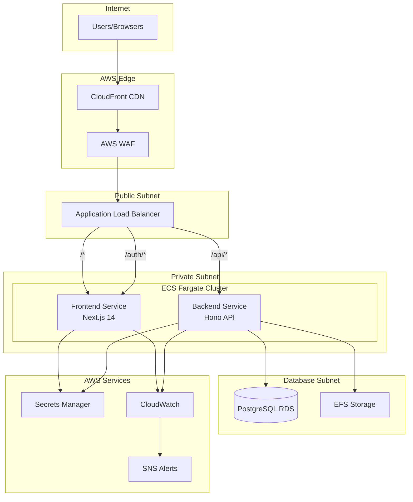
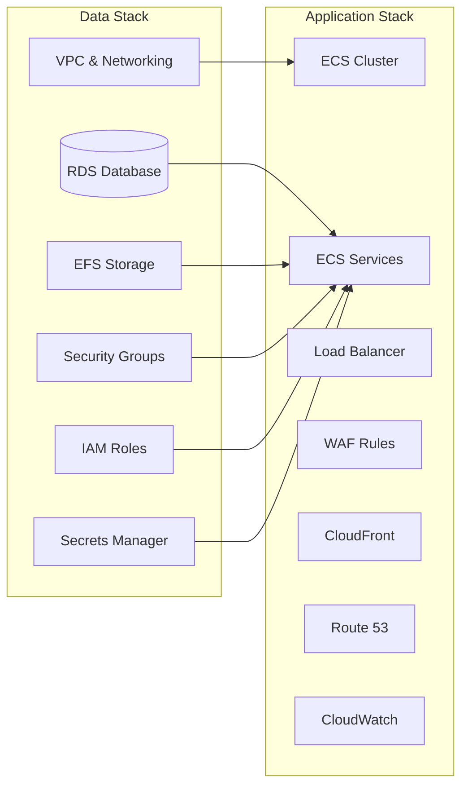
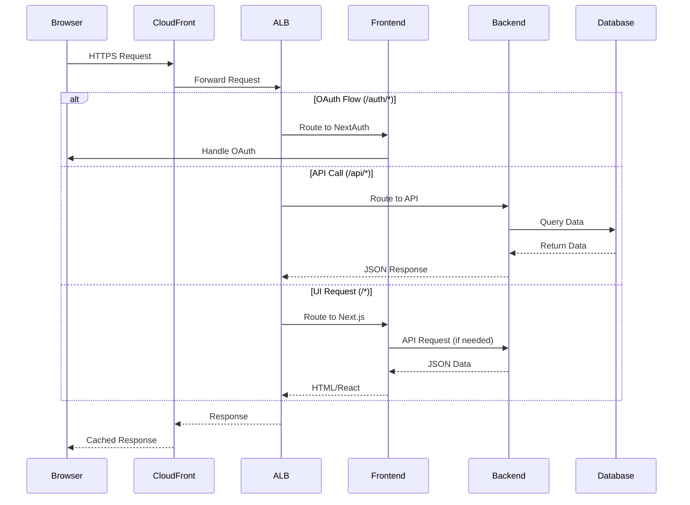
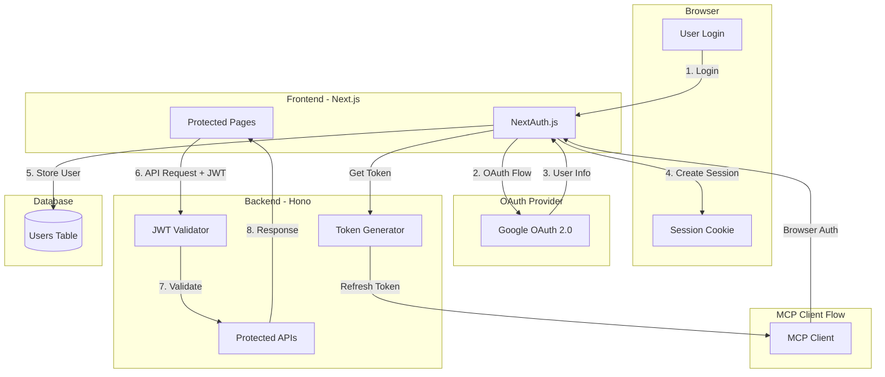
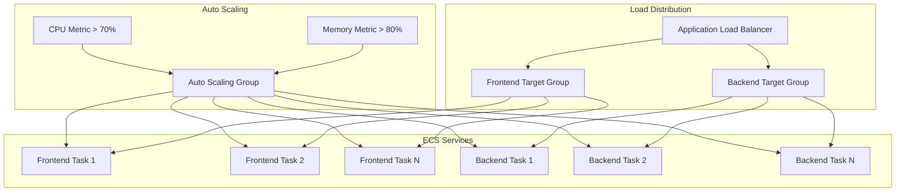

# Semiont Architecture

This document describes the overall architecture of the Semiont platform, focusing on AWS technologies and major frameworks in use.

## Overview

Semiont is a cloud-native semantic knowledge platform built on AWS using Infrastructure as Code (CDK) with a modern microservices architecture. The platform is designed for scalability, security, and maintainability with a clean separation between data infrastructure provisioning and application deployment.

**Quick Navigation:**
- [Data Infrastructure Components](#data-infrastructure-components) - VPC, RDS, EFS setup
- [Application Architecture](#application-architecture) - Frontend/Backend services
- [Authentication](#authentication-architecture) - OAuth and JWT implementation
- [Security](#security-architecture) - Network and application security
- [Event Store Architecture](./EVENT-STORE.md) - Event sourcing and Layer 2 implementation
- [Database Management](./DATABASE.md) - PostgreSQL and migrations
- [Graph Implementation](./GRAPH.md) - Graph database storage patterns
- [W3C Web Annotation](./W3C-WEB-ANNOTATION.md) - Complete annotation implementation across all layers

## High-Level Architecture



## Data Infrastructure Components

### Two-Stack Architecture

The Semiont platform uses a **two-stack deployment model** that separates long-lived data infrastructure from frequently updated application code:



#### 1. Data Stack (`SemiontDataStack`)
**Purpose**: Provisions foundational AWS data resources that rarely change

**Components**:
- **VPC with 3-tier networking**:
  - Public subnets (ALB, NAT gateways)
  - Private subnets (ECS tasks) 
  - Database subnets (RDS, isolated)
- **PostgreSQL RDS Database**:
  - PostgreSQL 15 on t3.micro instance
  - Encrypted storage with 7-day backup retention
  - Multi-AZ disabled for cost optimization
  - Isolated in database subnets
- **EFS File System**: Encrypted persistent storage for uploads
- **AWS Secrets Manager**: All credentials and secrets
- **Security Groups**: Network access control
- **IAM Roles**: Service permissions

#### 2. Application Stack (`SemiontAppStack`)  
**Purpose**: Deploys containerized applications and associated resources

**Components**:
- **ECS Fargate Cluster**: Container orchestration
- **Dual ECS Services**: Frontend and backend containers
- **Application Load Balancer**: Traffic routing and SSL termination
- **WAF**: Web application firewall with rate limiting
- **CloudFront**: CDN for static assets
- **Route 53**: DNS management
- **CloudWatch**: Logging and monitoring
- **SNS/Budgets**: Alerting and cost management

### Benefits of Two-Stack Model

1. **Faster Deployments**: App stack deploys in ~5 minutes vs full data infrastructure
2. **Lower Risk**: Database and core data infrastructure remain stable
3. **Cost Control**: Avoid accidental deletion of expensive resources
4. **Easier Rollbacks**: Application rollbacks don't affect data infrastructure
5. **Environment Isolation**: Different app stacks can share data infrastructure

## Application Architecture

### Dual-Service Model

The application layer consists of two separate ECS services running on Fargate:

#### Frontend Service
- **Framework**: Next.js 14 with App Router
- **Language**: TypeScript
- **UI Framework**: Tailwind CSS
- **Authentication**: NextAuth.js with Google OAuth
- **State Management**: React Query (@tanstack/react-query)
- **Build**: Static generation with dynamic routes
- **Container**: Alpine Linux with Node.js 18

**Key Features**:
- Server-side rendering (SSR) and static generation (SSG)
- OAuth authentication with domain restrictions
- Responsive design with dark mode support
- Type-safe API client for backend communication
- W3C Web Annotation UI components with JSON-LD export

#### Backend Service (BFF)
- **Architecture Pattern**: Backend for Frontend (BFF) - optimized API layer for the Next.js frontend
- **Framework**: OpenAPIHono (Hono with OpenAPI integration)
- **Language**: TypeScript
- **Event Store**: Append-only event log with projections (see [EVENT-STORE.md](./EVENT-STORE.md) for details)
- **Database ORM**: Prisma with PostgreSQL (see [DATABASE.md](./DATABASE.md) for details)
- **Graph Database**: Multiple implementations for annotation relationship traversal (see [GRAPH.md](./GRAPH.md) for details)
- **Authentication**: JWT tokens for API access (see [Authentication Architecture](#authentication-architecture))
- **API**: RESTful endpoints with automatic OpenAPI documentation (accessible at `/api`)
- **Validation**: Zod schemas for request/response validation
- **Annotation Model**: W3C Web Annotation Data Model (see [W3C-WEB-ANNOTATION.md](./W3C-WEB-ANNOTATION.md) for details)
- **Container**: Alpine Linux with Node.js 18

**Key Features**:
- High-performance HTTP server (@hono/node-server)
- Automatic database migrations on startup
- JWT-based authentication middleware
- Type-safe database queries with Prisma
- Health check endpoints for monitoring
- Automatic OpenAPI documentation generation
- Request/response validation with Zod schemas

**Modular Route Architecture**:
The backend uses a modular router pattern where each domain has its own router file:

```
apps/backend/src/
├── index.ts              # Main app, mounts all routers
├── routes/
│   ├── health.ts        # Health check endpoints (public)
│   ├── auth.ts          # Authentication & token endpoints
│   ├── hello.ts         # Example endpoints (protected)
│   ├── status.ts        # Status endpoint (protected)
│   └── admin.ts         # Admin endpoints (protected + admin check)
├── middleware/
│   └── auth.ts          # JWT authentication middleware
├── auth/
│   ├── jwt.ts           # JWT token generation/verification
│   └── oauth.ts         # OAuth user management
└── openapi.ts           # OpenAPI schemas and configuration
```

Each router:
- Defines its own OpenAPI route specifications with Zod schemas
- Applies authentication middleware as needed (no central auth list)
- Provides type-safe request/response handling
- Automatically contributes to the OpenAPI documentation

### Service Communication



1. **Browser to Frontend**: Direct HTTPS connection via CloudFront/ALB
2. **Frontend to Backend**: Simplified ALB routing with clear separation:
   - `/auth/*` → Frontend (NextAuth.js OAuth flows)
   - `/api/*` → Backend (All API endpoints)
   - `/*` → Frontend (Default - UI and static assets)
3. **Backend to Database**: Direct connection via VPC private networking

## AWS Services Used

### Compute & Containers
- **ECS Fargate**: Serverless container platform
- **ECR**: Container image registry (implicit via CDK)
- **ECS Exec**: Container debugging and management

### Networking
- **VPC**: Virtual private cloud with multi-AZ design
- **ALB**: Application Load Balancer with SSL termination  
- **Route 53**: DNS hosting and domain management
- **CloudFront**: Global CDN for static assets
- **Certificate Manager**: SSL/TLS certificates

### Data & Storage
- **RDS PostgreSQL**: Managed relational database
- **Graph Database**: Multiple implementations (Neo4j, Neptune, JanusGraph, Memory) - see [Graph Implementation Guide](GRAPH.md)
- **EFS**: Elastic File System for persistent storage
- **Secrets Manager**: Encrypted credential storage

### Security
- **WAF**: Web Application Firewall
- **Security Groups**: Network-level firewall rules
- **IAM**: Identity and access management
- **VPC Flow Logs**: Network traffic monitoring (implicit)

### Monitoring & Management
- **CloudWatch**: Centralized logging and metrics
- **CloudWatch Alarms**: Automated alerting
- **SNS**: Notification service
- **AWS Budgets**: Cost monitoring and alerts

## Key Design Decisions

### 1. **Simplified ALB Routing Architecture**
We use a clean 3-rule routing pattern that eliminates path conflicts:

```typescript
// Priority 10: OAuth flows handled by frontend
ListenerCondition.pathPatterns(['/auth/*'])

// Priority 20: All API calls go to backend
ListenerCondition.pathPatterns(['/api', '/api/*'])

// Default: Everything else to frontend
```

**Benefits**:
- **No path conflicts**: NextAuth at `/auth/*` doesn't intercept backend `/api/auth/*` routes
- **Clear separation**: Frontend handles OAuth, backend handles all API logic
- **Simple mental model**: Easy to understand routing rules
- **Independent scaling**: Frontend and backend scale separately

### 2. **OpenAPIHono Over Express**
We use OpenAPIHono (Hono + OpenAPI integration) over traditional Express.js:

**Advantages**:
- **Performance**: ~3x faster than Express
- **Type Safety**: Built-in TypeScript support with Zod validation
- **Small Bundle**: Minimal dependencies
- **Modern APIs**: Web Standards compliant
- **Automatic OpenAPI**: Route definitions generate documentation
- **Request/Response Validation**: Automatic validation against schemas
- **Modular Architecture**: Each domain owns its routes and auth logic

### 3. **Prisma ORM with PostgreSQL**
Database layer uses Prisma with PostgreSQL:

**Benefits**:
- **Type Safety**: Generated TypeScript types
- **Auto Migrations**: Schema evolution management
- **Query Builder**: SQL-like syntax with type checking
- **PostgreSQL Features**: JSON columns, full-text search, arrays

### 4. **NextAuth.js for Authentication**
OAuth authentication handled by NextAuth.js:

**Features**:
- **Multiple Providers**: Google OAuth (extensible)
- **Domain Restrictions**: Email domain-based access control
- **Secure Sessions**: Encrypted JWT tokens
- **Database Sessions**: User persistence in PostgreSQL

### 5. **Infrastructure as Code (CDK)**
All infrastructure defined in TypeScript using AWS CDK:

**Advantages**:
- **Type Safety**: Compile-time validation
- **Reusability**: Shared constructs and patterns
- **Version Control**: All changes tracked in Git
- **Automated Rollbacks**: CloudFormation change sets

## Authentication Architecture



### Authentication Model

The platform implements a **secure-by-default** authentication model for API access:

#### Core Principles
- **Default Protection**: All API routes require authentication automatically
- **Explicit Exceptions**: Public endpoints must be explicitly listed
- **JWT Bearer Tokens**: Stateless authentication for API requests
- **OAuth Integration**: Google OAuth 2.0 for user authentication

#### Authentication Flow

```
1. User Login (Frontend)
   ↓
2. Google OAuth 2.0
   ↓
3. Backend validates OAuth token
   ↓
4. Backend issues JWT token
   ↓
5. Frontend includes JWT in API requests
   ↓
6. Backend validates JWT on each request
```

#### MCP Authentication Architecture

The platform provides special authentication support for Model Context Protocol (MCP) clients:

**Frontend MCP Bridge** (`/auth/mcp-setup`):
- Handles browser-based OAuth flow for MCP clients
- Uses NextAuth session cookies for authentication
- Calls backend to generate long-lived refresh tokens
- Redirects to MCP client callback with token

**Backend Token Management**:
- `POST /api/tokens/mcp-generate`: Issues 30-day refresh tokens for MCP clients
- `POST /api/tokens/refresh`: Exchanges refresh tokens for 1-hour access tokens

**Token Lifecycle**:
1. MCP client opens browser to `/auth/mcp-setup?callback=<url>`
2. Frontend authenticates user via NextAuth (Google OAuth)
3. Frontend calls backend's `/api/tokens/mcp-generate` with session token
4. Backend generates 30-day refresh token
5. Frontend redirects to callback URL with refresh token
6. MCP client stores refresh token locally
7. MCP client exchanges refresh token for access tokens as needed

This architecture bridges the gap between browser-based authentication (cookies) and API-based authentication (JWT tokens), enabling secure MCP client integration.

#### Public Endpoints

Only these endpoints are accessible without authentication:
- `GET /api/health` - Health check for AWS ALB monitoring
- `GET /api` - API documentation
- `POST /api/auth/google` - OAuth login initiation

#### Protected Endpoints

All other API routes automatically require:
- Valid JWT token in Authorization header
- Token signature verification
- Token expiration validation
- User existence verification

#### Admin Endpoints

Admin endpoints require additional authorization:
- Valid JWT token (authentication)
- `isAdmin: true` user attribute (authorization)
- Returns 403 Forbidden for non-admin users

### JWT Security Implementation

#### Token Validation Layers
1. **Signature Verification**: Validates token hasn't been tampered with
2. **Payload Structure**: Runtime validation of token structure
3. **Expiration Checking**: Ensures token hasn't expired
4. **User Verification**: Confirms user exists and is active
5. **Domain Validation**: Checks email domain against allowed list

#### Security Features
- **Short-lived Tokens**: 7-day expiration by default
- **Secure Secret Management**: JWT secret stored in AWS Secrets Manager
- **Domain Restrictions**: Email domain-based access control
- **Automatic Middleware**: Global authentication applied to all API routes

## Security Architecture

### Network Security
- **3-Tier VPC**: Public, private, and database subnets
- **Security Groups**: Principle of least privilege
- **Private Database**: No internet access, ECS-only connections
- **WAF Protection**: Web Application Firewall with multiple security rules:
  - AWS Managed Core Rule Set (common vulnerabilities)
  - AWS Managed Known Bad Inputs protection
  - Rate limiting (100 requests per 5-minute window per IP)
  - Geo-blocking for high-risk countries
  - IP reputation filtering
  - Enhanced exclusions for file uploads to prevent false positives

### Application Security  
- **OAuth Authentication**: Google-based with domain restrictions
- **JWT Tokens**: Secure API authentication
- **Secure-by-Default API**: All API routes require authentication unless explicitly listed
- **HTTPS Everywhere**: SSL termination at ALB
- **Secret Management**: All credentials in AWS Secrets Manager

### Data Security
- **Encryption at Rest**: RDS and EFS encrypted
- **Encryption in Transit**: HTTPS/TLS for all connections
- **Database Isolation**: Private subnets with no internet access
- **Backup Encryption**: Automated encrypted backups

## Scalability Design



### Horizontal Scaling
- **ECS Auto Scaling**: CPU/memory-based task scaling
  - Backend: 1-10 tasks, scales at 70% CPU or 80% memory
  - Frontend: 1-10 tasks, scales at 70% CPU or 80% memory
- **ALB Distribution**: Traffic spread across healthy instances
- **Multi-AZ Database**: High availability (optional)
- **CDN Caching**: Reduced origin load

### Deployment Resilience
- **Circuit Breaker**: Both services configured with automatic rollback on failed deployments
- **Rolling Deployments**: 100% minimum healthy, 200% maximum during deployments
- **Health Check Grace Period**: 2-minute grace period for service startup
- **Execute Command**: Enabled for debugging and maintenance access

### Vertical Scaling
- **Fargate**: Easy CPU/memory adjustments without downtime
- **RDS Instance Types**: Seamless database instance upgrades
- **EFS Performance**: Automatic throughput scaling

### Performance Optimizations
- **Next.js SSG**: Pre-generated static pages
- **CloudFront CDN**: Global edge caching
- **Database Connection Pooling**: Efficient connection management
- **Hono Performance**: High-throughput HTTP server

## Monitoring & Observability

### Application Monitoring
- **Health Checks**: `/api/health` endpoints for service status
- **CloudWatch Logs**: Centralized log aggregation with 1-month retention
- **Container Logging**: Both frontend and backend services stream logs to dedicated CloudWatch log group
- **Structured Logging**: JSON-formatted log entries with service-specific prefixes
- **Error Tracking**: Application-level error monitoring

### System Monitoring
- **ECS Service Metrics**: CPU, memory, task count
- **ALB Metrics**: Request count, latency, error rates
- **RDS Metrics**: Database performance and connections
- **WAF Metrics**: Request filtering and security events
- **Custom Dashboards**: Operational visibility

### Logging Configuration
- **CloudWatch Log Group**: Single log group (`SemiontLogGroup`) with 1-month retention
- **Service-Specific Streams**: 
  - Frontend: `semiont-frontend` prefix
  - Backend: `semiont-backend` prefix
- **Log Drivers**: AWS Logs driver for automatic CloudWatch integration
- **ALB Access Logs**: Not currently configured (potential enhancement)

### Alerting
- **CloudWatch Alarms**: Automated threshold monitoring
- **SNS Notifications**: Email/SMS alerts
- **Cost Budgets**: Spending limit notifications
- **Health Check Failures**: Service availability alerts

## Development Workflow

### Local Development

For detailed local development instructions, see [LOCAL-DEVELOPMENT.md](./LOCAL-DEVELOPMENT.md).

```bash
# Frontend development
cd apps/frontend && npm run dev

# Backend development
cd apps/backend && npm run dev

# Database migrations
cd apps/backend && npm run prisma:migrate
```

For testing strategies, see [TESTING.md](./TESTING.md).

### Deployment Pipeline

For complete deployment procedures, see [DEPLOYMENT.md](./DEPLOYMENT.md).

```bash
# Set default environment
export SEMIONT_ENV=production

# Deploy infrastructure (rare)
semiont provision

# Deploy application (frequent)
semiont publish

# Service management
semiont restart  # All services
semiont restart --service frontend  # Specific service
semiont watch logs  # Monitor logs
```

For configuration management, see [CONFIGURATION.md](./CONFIGURATION.md).

### Management Scripts
TypeScript-based management scripts provide:
- **Dynamic Resource Discovery**: No hardcoded ARNs
- **Service-Specific Operations**: Frontend/backend command targeting
- **OAuth Management**: Interactive credential setup
- **Database Operations**: Backup and maintenance utilities

## Cost Optimization

### Resource Sizing
- **t3.micro RDS**: Minimal database instance for development
- **256 CPU / 512MB ECS**: Right-sized containers
- **Single AZ**: Reduced NAT gateway and data transfer costs
- **EFS Lifecycle**: Automatic transition to cheaper storage tiers

### Operational Efficiency  
- **Fargate Spot**: Cost savings for non-critical workloads (future)
- **CloudFront Caching**: Reduced ALB/ECS load
- **Reserved Capacity**: Long-term cost reduction (future)
- **Budget Alerts**: Proactive cost monitoring

## Future Architecture Considerations

### Scalability Enhancements
- **Multi-AZ RDS**: High availability for production
- **ECS Service Auto Scaling**: Dynamic capacity management
- **CloudFront Edge Functions**: Global compute distribution
- **ElastiCache**: Redis caching layer

### Security Enhancements
- **AWS Config**: Compliance and configuration drift detection
- **GuardDuty**: Threat detection and monitoring
- **Secrets Rotation**: Automatic credential rotation
- **VPC Flow Logs**: Network traffic analysis

### Operational Improvements
- **CI/CD Pipeline**: Automated testing and deployment
- **Blue/Green Deployments**: Zero-downtime updates
- **Canary Releases**: Gradual rollout strategies
- **Distributed Tracing**: End-to-end request tracking

## Related Documentation

- [Deployment Guide](DEPLOYMENT.md) - Step-by-step deployment instructions
- [Configuration Guide](CONFIGURATION.md) - Environment and secret management
- [Event Store Architecture](EVENT-STORE.md) - Event sourcing and immutable event log
- [Database Management](DATABASE.md) - Schema migrations and backup procedures
- [Graph Implementation Guide](GRAPH.md) - Graph database patterns and implementations
- [OAuth Setup](OAuth.md) - Authentication configuration guide
- [Troubleshooting](TROUBLESHOOTING.md) - Common issues and solutions