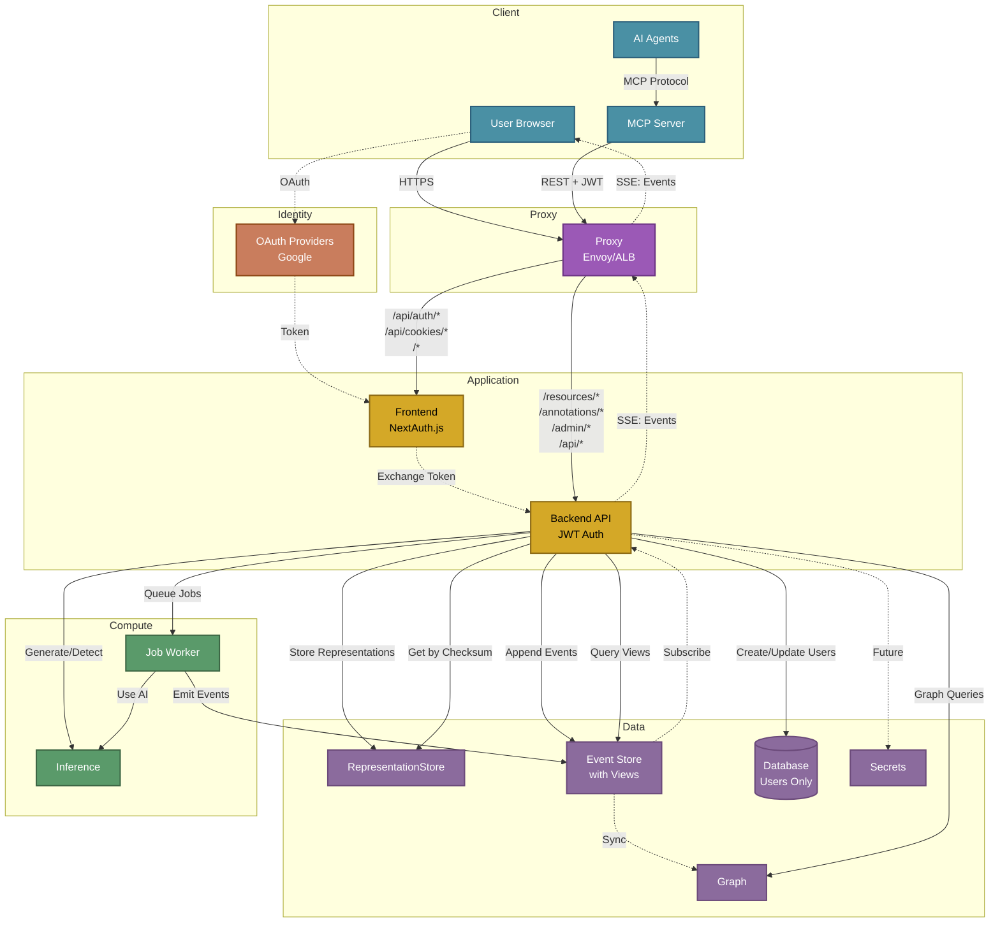

# Semiont Architecture

Platform-agnostic architecture for the Semiont semantic knowledge platform.

## Overview

Semiont transforms unstructured text into a queryable knowledge graph using W3C Web Annotations as the semantic layer. The architecture makes deliberate choices that prioritize longevity, interoperability, and operational simplicity.

**Core Principles:**

- **Event Sourcing**: Immutable event log as source of truth, enabling audit trails and temporal queries
- **Data Architecture**: Separation of content (representations), events (Event Store), and relationships (Graph Database)
- **W3C Standards**: Full Web Annotation Data Model compliance ensures data portability
- **Spec-First Development**: Types generated from OpenAPI specification, not the reverse
- **Platform Agnostic**: Services run on local processes, containers, or cloud infrastructure

This is a knowledge management system designed to outlive specific vendors or platforms. W3C compliance means your data exports as standard JSON-LD that any compatible system can consume.

## System Architecture



## Application Services

### Proxy
Routes HTTP traffic between frontend and backend services.
- **Documentation**: [docs/services/PROXY.md](./services/PROXY.md)
- **Local/Codespaces**: Envoy proxy
- **AWS Platform**: Application Load Balancer (ALB)

### Frontend
Next.js web application with React components for document management and annotation.
- **Documentation**: [apps/frontend/README.md](../apps/frontend/README.md)
- **Authentication**: NextAuth.js with OAuth providers

### Backend API
Hono REST API server with JWT authentication and WebSocket support.
- **Documentation**: [apps/backend/README.md](../apps/backend/README.md)
- **API Specification**: [OpenAPI Spec](../specs/README.md)

### MCP Server
Model Context Protocol server for AI agent integration.
- **Package**: [@semiont/mcp-server](../packages/mcp-server/)

## Data Architecture

The data layer uses specialized storage for different access patterns:

### Content Storage
Content-addressed storage with automatic deduplication.
- **Package**: [@semiont/content](../packages/content/)
- **API Documentation**: [packages/content/docs/API.md](../packages/content/docs/API.md)
- **Key Features**: SHA-256 checksums, 4-hex sharding, W3C representation model

### Event Store
Immutable append-only log with materialized views.
- **Package**: [@semiont/event-sourcing](../packages/event-sourcing/)
- **API Documentation**: [packages/event-sourcing/docs/API.md](../packages/event-sourcing/docs/API.md)
- **Architecture**: [packages/event-sourcing/docs/ARCHITECTURE.md](../packages/event-sourcing/docs/ARCHITECTURE.md)

### Graph Database
Optional projection for relationship traversal.
- **Package**: [@semiont/graph](../packages/graph/)
- **API Documentation**: [packages/graph/docs/API.md](../packages/graph/docs/API.md)
- **Providers**: Neo4j, AWS Neptune, JanusGraph, In-memory

### Database
PostgreSQL for user authentication only.
- **Documentation**: [apps/backend/docs/DATABASE.md](../apps/backend/docs/DATABASE.md)
- **Scope**: User accounts, OAuth tokens (NOT document metadata)

## Compute Services

### Inference
AI/ML service for text generation and entity detection.
- **Package**: [@semiont/inference](../packages/inference/)
- **API Documentation**: [packages/inference/docs/API.md](../packages/inference/docs/API.md)
- **Providers**: Anthropic Claude, OpenAI, Local models

### Job Worker
Background job processing for long-running operations.
- **Package**: [@semiont/jobs](../packages/jobs/)
- **API Documentation**: [packages/jobs/docs/API.md](../packages/jobs/docs/API.md)
- **Workers**: Entity detection, document generation

## Package Architecture

Semiont is built as a monorepo with modular packages:

```
Foundation Layer:
  @semiont/core         - Core types and utilities
  @semiont/api-client   - OpenAPI-generated types

Domain Layer:
  @semiont/ontology     - Entity types and vocabularies
  @semiont/content      - Content-addressed storage
  @semiont/event-sourcing - Event store implementation
  @semiont/graph        - Graph database abstraction

AI Layer:
  @semiont/inference    - LLM integration
  @semiont/jobs         - Job queue
  @semiont/make-meaning - Context assembly

UI Layer:
  @semiont/react-ui     - React components
```

See [packages/README.md](../packages/README.md) for the complete dependency graph.

## Platform Abstraction

Services can run on different platforms via environment configuration:

### Platform Types
- **POSIX**: Local processes (development)
- **Container**: Docker containers
- **AWS**: ECS tasks, RDS, S3, Neptune

### Service Management
All services are managed through the Semiont CLI:
```bash
semiont start --environment local
semiont check --service all
semiont stop --environment production
```

See [CLI Documentation](../apps/cli/README.md) for details.

## Authentication Flow

1. **OAuth Login**: User authenticates with Google OAuth
2. **Token Exchange**: Frontend exchanges OAuth token for JWT
3. **JWT Auth**: All API calls include JWT bearer token
4. **MCP Tokens**: Long-lived refresh tokens for AI agents

See [Authentication Documentation](./AUTHENTICATION.md) for complete flow.

## Deployment

### Local Development
- All services run as local processes
- In-memory graph database
- Filesystem storage

### Production (AWS)
- ECS Fargate for compute
- RDS PostgreSQL for users
- S3/EFS for storage
- Neptune for graph database

See [AWS Deployment Guide](./platforms/AWS.md) for production setup.

## Service Documentation

For detailed service documentation and implementation:
- **Service Overview**: [docs/services/OVERVIEW.md](./services/OVERVIEW.md)
- **Package APIs**: See individual package docs directories
- **Backend Implementation**: [apps/backend/docs/](../apps/backend/docs/)

## Related Documentation

- [Configuration Guide](./CONFIGURATION.md) - Environment configuration
- [API Documentation](../specs/docs/API.md) - REST API reference
- [W3C Web Annotation](../specs/docs/W3C-WEB-ANNOTATION.md) - Annotation model
- [Contributing](../CONTRIBUTING.md) - Development guidelines