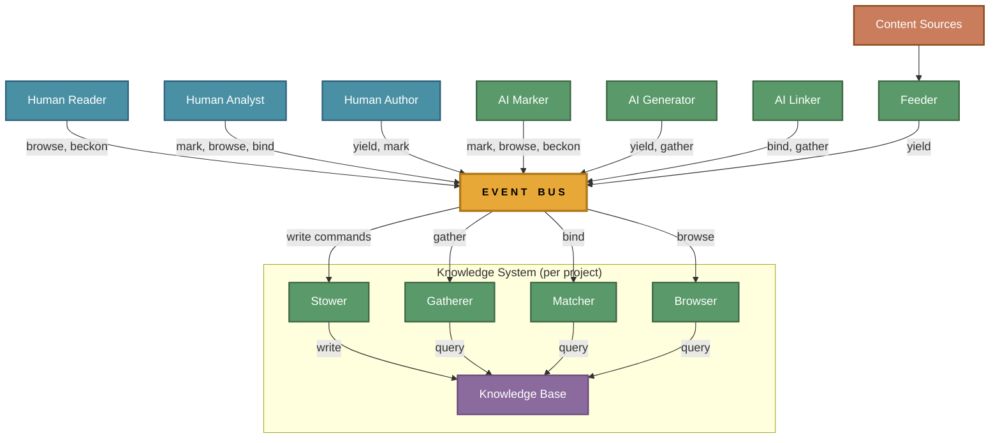
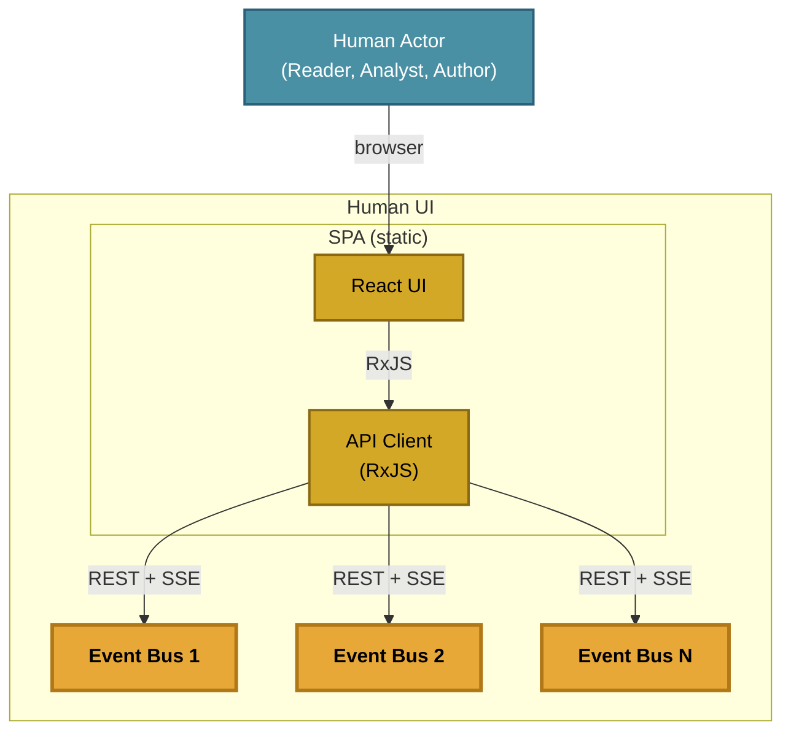
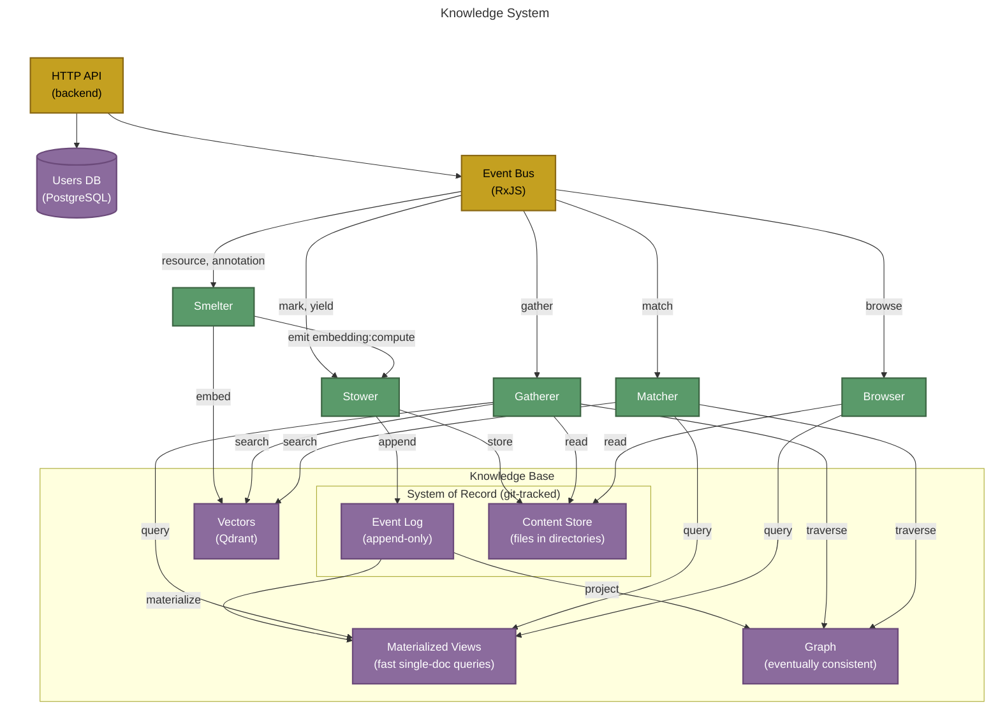
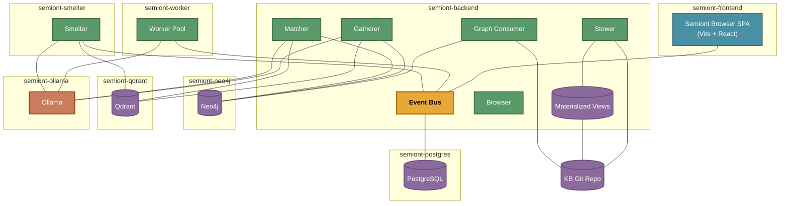

# Semiont Architecture

Semiont transforms unstructured text into a queryable knowledge graph using W3C Web Annotations as the semantic layer. The architecture is organized around **actors** communicating through a central **event bus**. This clarifies what each participant *does* and *knows*, and makes it easy to add new actors (human or AI) without touching the plumbing.

## Core Insight

Every meaningful action in Semiont is an event on the bus. The actors fall into three categories:

1. **Intelligent actors** — humans or AI agents that read, interpret, and annotate content. They produce events that carry semantic intent (mark, browse, yield, match, bind, gather, beckon).
2. **The knowledge base** — a passive actor that listens to events and materializes durable state. It has no intelligence; it simply records what the intelligent actors decide.
3. **Content streams** — external sources that yield new resources into the system (uploads, web fetches, API ingestion).

The event bus is the only coupling between actors. An actor does not know who else is listening.

## Actor Topology


```mermaid
graph TD
    READER["Human Reader"] -->|"browse, beckon"| BUS
    ANALYST["Human Analyst"] -->|"mark, browse, bind"| BUS
    AUTHOR["Human Author"] -->|"yield, mark"| BUS
    MARKER["AI Marker"] -->|"mark, browse, beckon"| BUS
    GENERATOR["AI Generator"] -->|"yield, gather"| BUS
    LINKER["AI Linker"] -->|"bind, gather"| BUS

    BUS["E V E N T &ensp; B U S"]

    subgraph ks ["Knowledge System (per project)"]
        STOWER["Stower"]
        GATHERER["Gatherer"]
        MATCHER["Matcher"]
        BROWSER["Browser"]
        KB["Knowledge Base"]
        STOWER -->|"write"| KB
        GATHERER -->|"query"| KB
        MATCHER -->|"query"| KB
        BROWSER -->|"query"| KB
    end

    BUS -->|"write commands"| STOWER
    BUS -->|"gather"| GATHERER
    BUS -->|"bind"| MATCHER
    BUS -->|"browse"| BROWSER

    SOURCES["Content Sources"] --> FEEDER["Feeder"]
    FEEDER -->|"yield"| BUS

    classDef bus fill:#e8a838,stroke:#b07818,stroke-width:3px,color:#000,font-weight:bold,font-size:14px
    classDef human fill:#4a90a4,stroke:#2c5f7a,stroke-width:2px,color:#fff
    classDef ai fill:#5a9a6a,stroke:#3d6644,stroke-width:2px,color:#fff
    classDef kb fill:#8b6b9d,stroke:#6b4a7a,stroke-width:2px,color:#fff
    classDef stream fill:#c97d5d,stroke:#8b4513,stroke-width:2px,color:#fff
    classDef worker fill:#5a9a6a,stroke:#3d6644,stroke-width:2px,color:#fff

    class READER,ANALYST,AUTHOR human
    class MARKER,GENERATOR,LINKER ai
    class BUS bus
    class KB kb
    class SOURCES stream
    class FEEDER,STOWER,GATHERER,MATCHER,BROWSER worker
```

## Actors

### Example

| | Actor | Flows | What they do |
|-|-------|-------|-------------|
| 🧠 | **Reader** | browse, beckon | Navigates resources and annotations. Clicks, hovers, scrolls. Consumes the knowledge base without modifying it. |
| 🧠 | **Analyst** | mark, browse, beckon, bind | Reads content, creates annotations (highlights, comments, assessments, tags), and resolves references to existing resources. The primary human intelligence in the system. |
| 🧠 | **Author** | yield, mark | Composes new resources manually (via the compose page) and annotates them. Produces content that the knowledge base records. |
| 🤖 | **Marker Agent** | mark, browse, beckon | Scans documents and proposes annotations — highlights, assessments, comments, tags, and entity references. Produces the same W3C annotations that human analysts do. |
| 🤖 | **Generator Agent** | yield, gather | Assembles context around a reference annotation (gather), then synthesizes a new resource from it (yield). Creates content that the knowledge base records. |
| 🤖 | **Linker Agent** | bind, gather | Resolves unresolved references by searching for matching resources and linking them. Performs entity resolution and coreference — the binding of a mention to its referent. |

Human actors interact through the **Semiont Browser** — the `apps/frontend` single-page app (Vite + React), packaged as the `ghcr.io/the-ai-alliance/semiont-frontend` container image. A user connects to one or more Knowledge Bases (each a separate backend); DOM interactions become bus commands through the same `/bus/emit` + `/bus/subscribe` endpoints every other Semiont actor uses. Because it's a static SPA, it can equivalently be served from any file server or CDN — the container is the deployment-ready packaging for the "download and run" path.

The SPA is internally a literal Model–View–ViewModel split:

- **Model** — `@semiont/api-client` namespaces (browse, mark, bind, gather, match, yield, beckon), typed RxJS Observables, per-key caches, and bus-driven invalidation.
- **ViewModel** — one factory per verb (`createBrowseVM`, `createMarkVM`, `createBindVM`, `createGatherVM`, `createMatchVM`, `createYieldVM`, `createBeckonVM`) plus page-level composite VMs; pure RxJS, framework-agnostic, unit-testable without a renderer.
- **View** — React components in `@semiont/react-ui` and `apps/frontend`, reduced to two adapters (`useViewModel`, `useObservable`) plus JSX. No component-owned fetching, caching, or subscription management.

Per-KB authentication and state live in `SemiontSession` (see [Unified Bus and SemiontSession](#unified-bus-and-semiontsession)) — the same abstraction workers and the smelter use.


```mermaid
graph TB
    HUMAN["Human Actor<br/>(Reader, Analyst, Author)"] -->|browser| FE

    subgraph ui ["Human UI"]
        subgraph spa ["SPA (static)"]
            FE["React UI"]
            API["API Client<br/>(RxJS)"]
            FE -->|RxJS| API
        end

        BUS1["Event Bus 1"]
        BUS2["Event Bus 2"]
        BUSN["Event Bus N"]

        API -->|"REST + SSE"| BUS1
        API -->|"REST + SSE"| BUS2
        API -->|"REST + SSE"| BUSN
    end

    classDef actor fill:#4a90a4,stroke:#2c5f7a,stroke-width:2px,color:#fff
    classDef ui fill:#d4a827,stroke:#8b6914,stroke-width:2px,color:#000
    classDef bus fill:#e8a838,stroke:#b07818,stroke-width:3px,color:#000,font-weight:bold
    classDef client fill:#d4a827,stroke:#8b6914,stroke-width:2px,color:#000

    class HUMAN actor
    class FE ui
    class API client
    class BUS1,BUS2,BUSN bus
```

AI actors connect to an event bus via REST + JWT or MCP protocol. They emit the same events as human actors. The knowledge base cannot distinguish a human-created annotation from an AI-created one — both are W3C annotations with a `creator` field that identifies the agent.

### Knowledge System

The **Knowledge System** binds the Knowledge Base to its five actors. Nothing outside the Knowledge System reads or writes the Knowledge Base directly.

The knowledge base itself is not an intelligent actor. It has no goals, preferences, or decisions. It never initiates an event. It is inert storage — the durable record of what intelligent actors decide. Five reactive actors mediate all access: **Stower** (write), **Gatherer** (read context), **Matcher** (read search), **Browser** (read directory), and **Smelter** (vector projection). All five subscribe to the EventBus via RxJS pipelines in `initialize()`, process events through private handlers, and communicate results back by emitting on the bus. They expose no public business methods — only `initialize()` and `stop()` for lifecycle management. Callers never call into an actor directly; they put a message on the bus and trust the actor is listening.


```mermaid
---
title: Knowledge System
---
graph TB
    subgraph top [" "]
        direction LR
        API["HTTP API<br/>(backend)"]
        DB[("Users DB<br/>(PostgreSQL)")]
    end
    BE["Event Bus<br/>(RxJS)"]

    API --> BE
    API --> DB

    BE -->|"mark, yield"| STOWER["Stower"]
    BE -->|"gather"| GATHERER["Gatherer"]
    BE -->|"match"| MATCHER["Matcher"]
    BE -->|"browse"| BROWSER["Browser"]
    BE -->|"resource, annotation"| SMELTER["Smelter"]

    STOWER -->|append| EVENTLOG
    STOWER -->|store| CONTENT

    SMELTER -->|embed| VECTORS
    SMELTER -->|"emit embedding:compute"| STOWER

    subgraph kb ["Knowledge Base"]
        subgraph sor ["System of Record (git-tracked)"]
            EVENTLOG["Event Log<br/>(append-only)"]
            CONTENT["Content Store<br/>(files in directories)"]
        end
        VIEWS["Materialized Views<br/>(fast single-doc queries)"]
        GRAPH["Graph<br/>(eventually consistent)"]
        VECTORS["Vectors<br/>(Qdrant)"]

        EVENTLOG -->|materialize| VIEWS
        EVENTLOG -->|project| GRAPH
    end

    GATHERER -->|query| VIEWS
    GATHERER -->|read| CONTENT
    GATHERER -->|traverse| GRAPH
    GATHERER -->|search| VECTORS

    MATCHER -->|query| VIEWS
    MATCHER -->|traverse| GRAPH
    MATCHER -->|search| VECTORS

    BROWSER -->|query| VIEWS
    BROWSER -->|read| CONTENT

    classDef backend fill:#c4a020,stroke:#8b6914,stroke-width:2px,color:#000
    classDef store fill:#8b6b9d,stroke:#6b4a7a,stroke-width:2px,color:#fff
    classDef worker fill:#5a9a6a,stroke:#3d6644,stroke-width:2px,color:#fff

    class API,BE backend
    class DB,EVENTLOG,VIEWS,CONTENT,GRAPH,VECTORS store
    class STOWER,GATHERER,MATCHER,BROWSER,SMELTER worker

    style top fill:none,stroke:none
```

| Store | Purpose | Access Pattern |
|-------|---------|---------------|
| **Event Log** | Immutable append-only log of all domain events; system of record, committed to version control | Stower appends; Gatherer/Matcher read |
| **Materialized Views** | Denormalized projections for fast reads | Gatherer/Matcher/Browser query by resource URI |
| **Content Store** | Content-addressed binary storage (documents, images, PDFs) | Stower writes; Gatherer reads by SHA-256 checksum |
| **Graph** | Eventually consistent relationship projection for traversal queries (backlinks, entity networks) | Gatherer/Matcher traverse and search |
| **Vectors** | Embedding vectors in Qdrant for semantic similarity search | Smelter projects; Gatherer/Matcher search |

### Stower

The Stower is the single write gateway to the knowledge base. It subscribes to command events on the bus (`mark:create`, `yield:create`, `mark:delete`, `mark:update-body`, `job:start`, `job:complete`, etc.) and translates them into domain events on the event log and content writes to the content store. After successful persistence, it emits result events back onto the bus (`mark:created`, `yield:created`, `mark:deleted`, etc.) so callers can confirm completion. No other code calls `eventStore.appendEvent()` or `contentStore.store()`.

### Gatherer

The Gatherer is the read actor for context assembly. When a Generator Agent or Linker Agent emits a **gather** event, the Gatherer receives it from the bus, queries the relevant KB stores (materialized views, content store, graph, vectors), and assembles the context needed for downstream work. It emits the assembled context back onto the bus.

### Matcher

The Matcher is the read actor for entity resolution. When an Analyst or Linker Agent emits a **bind** event, the Matcher receives it from the bus, searches the KB stores (materialized views, graph, vectors) for matching resources, and resolves references — linking a mention to its referent. The Matcher does not need the content store directly; it works with metadata, relationships, and embeddings to find the right target. It emits search results back onto the bus.

### Browser

The Browser is the read actor for navigation and content retrieval. It handles directory listings, resource reads, and annotation lookups — everything the UI and CLI need to present the knowledge base to a user. For directory requests, it performs a prefix scan of the materialized views for tracked resources under the requested path, reads their content from the content store, and merges the result with untracked entries. Each entry is either bare (`tracked: false`) or enriched with KB metadata (resource ID, entity types, annotation count, creator). It enforces a path confinement invariant: all resolved paths must remain within `project.root`.

### Smelter

The Smelter is the vector projection actor. It runs in its own container (`semiont-smelter`) — not in the backend process — and reaches the backend through the unified bus, the same way workers do. When a resource is created or an annotation is added, the Smelter receives the event, chunks the text into overlapping passages, computes embedding vectors via the configured embedding provider (Voyage AI or Ollama), and indexes them into the vector store (Qdrant). It emits `embedding:compute` commands on the bus so the Stower can persist them as `embedding:computed` domain events in `.semiont/events/` — making them part of the system of record. The Smelter follows the same RxJS burst-buffer pattern as the Graph Consumer for per-resource ordering and batch efficiency.

### Multi-Container Topology

A local deployment runs three containers of Semiont code, four if you include the frontend, or eight if you also count the infrastructure dependencies:


```mermaid
graph TB
    subgraph frontend_c ["semiont-frontend"]
        SPA["Semiont Browser SPA<br/>(Vite + React)"]
    end

    subgraph backend_c ["semiont-backend"]
        BUS["Event Bus"]
        STOWER["Stower"]
        BROWSER["Browser"]
        GATHERER["Gatherer"]
        MATCHER["Matcher"]
        GC["Graph Consumer"]
        VIEWS[("Materialized Views")]
    end

    GIT[("KB Git Repo")]

    subgraph worker_c ["semiont-worker"]
        WORKERS["Worker Pool"]
    end

    subgraph smelter_c ["semiont-smelter"]
        SMELTER["Smelter"]
    end

    subgraph pg_c ["semiont-postgres"]
        PG[("PostgreSQL")]
    end

    subgraph neo_c ["semiont-neo4j"]
        NEO[("Neo4j")]
    end

    subgraph qd_c ["semiont-qdrant"]
        QD[("Qdrant")]
    end

    subgraph ol_c ["semiont-ollama"]
        OL["Ollama"]
    end

    SPA --- BUS
    WORKERS --- BUS
    SMELTER --- BUS

    STOWER --- GIT
    STOWER --- VIEWS
    VIEWS --- GIT
    GC --- GIT
    GC --- NEO
    SMELTER --- QD
    BUS --- PG
    WORKERS --- OL
    SMELTER --- OL
    GATHERER --- NEO
    GATHERER --- QD
    GATHERER --- OL
    MATCHER --- NEO
    MATCHER --- QD
    MATCHER --- OL

    classDef bus fill:#e8a838,stroke:#b07818,stroke-width:3px,color:#000,font-weight:bold
    classDef actor fill:#5a9a6a,stroke:#3d6644,stroke-width:2px,color:#fff
    classDef store fill:#8b6b9d,stroke:#6b4a7a,stroke-width:2px,color:#fff
    classDef spa fill:#4a90a4,stroke:#2c5f7a,stroke-width:2px,color:#fff
    classDef service fill:#c97d5d,stroke:#8b4513,stroke-width:2px,color:#fff

    class BUS bus
    class STOWER,BROWSER,GATHERER,MATCHER,GC,WORKERS,SMELTER actor
    class GIT,VIEWS,PG,NEO,QD store
    class SPA spa
    class OL service
```

The three Semiont-code backend containers communicate exclusively through the unified bus exposed by `semiont-backend` (`/bus/emit`, `/bus/subscribe`). Workers and the smelter authenticate via `POST /api/tokens/worker`, which exchanges a shared secret (`SEMIONT_WORKER_SECRET`) for a JWT with `role: worker`; the existing auth middleware validates that JWT exactly as it would a user's. This split isolates long-running LLM and embedding work from the request-serving event loop — the backend stays responsive to human users while workers and the smelter run in separate V8 isolates.

### Unified Bus and SemiontSession

Every actor that runs Semiont code — the Semiont Browser SPA, CLI, MCP, worker pool, and smelter — is a bus participant using the same primitives in `@semiont/api-client`. The backend exposes exactly two runtime endpoints that carry domain traffic: `POST /bus/emit` and `GET /bus/subscribe` (an SSE stream with dynamic channel subscriptions and Last-Event-ID replay on reconnect). Every other HTTP route exists for auth, admin, exchange, binary content, or infrastructure — not for domain commands. Commands and domain events flow through the bus.

The common abstraction for "I am a Semiont actor" is `SemiontSession`, which lives in `@semiont/api-client` and carries per-KB authentication, token refresh, bus access, and cross-process state synchronization. A session is constructed against a storage adapter (`SessionStorage`): `WebBrowserStorage` in the browser, filesystem storage for CLI and MCP, in-memory storage in workers and tests. `SemiontApiClient` exposes `emit`, `on`, and `stream` methods over its private bus; the invariant "nothing outside client or session touches the bus" is type-enforced rather than convention.

A new kind of actor slots in the same way in every environment: construct a session with the right storage adapter, authenticate, subscribe to the channels it cares about, emit the commands it produces. The worker and smelter containers are the clearest demonstration — same session, same bus primitives, same authentication pattern as the frontend; just different storage and different channels.

### Feeder and Content Streams

Content streams are external sources of new resources: file uploads, API ingestion, web fetches. The **Feeder** actor sits between content streams and the event bus. It accepts raw content from a source, emits `yield:create` on the bus, and the Stower handles persistence. The Feeder normalizes the intake — regardless of how content arrives, it enters the system as a yield event.

Content sources:

- **Upload** — a human drags a file into the browser
- **API Ingestion** — an external system pushes content via REST
- **Web Fetch** — the system retrieves content from a URL

## Flows

Seven composable flows define how actors interact with the knowledge base: **Mark**, **Browse**, **Beckon**, **Match**, **Bind**, **Gather**, and **Yield**. See **[Flows](flows/README.md)** for the full table, relationships, and individual flow documentation.

## Why This Matters

The actor model makes three things visible that the layered architecture obscures:

1. **Human and AI are peers.** They perform the same flows, produce the same events, and create the same W3C annotations. The system does not privilege one over the other. A future actor — a different AI model, a rule engine, a crowdsourcing pipeline — slots in by subscribing to and emitting events.

2. **The knowledge base is inert.** It records; it does not decide. All intelligence lives in the actors. This means the knowledge base can be simple, append-only, and rebuildable — properties that are hard to maintain when "smart" behavior leaks into the data layer.

3. **Flows are composable.** A Marker Agent does mark + browse + beckon. A Generator Agent does yield + gather. New actor types can mix flows freely. The bus doesn't care who emits an event or who consumes it — only that the event conforms to the [event map](../packages/core/src/bus-protocol.ts).

## Package Architecture

Semiont is a monorepo with modular packages organized in four layers:

```
Foundation Layer:
  @semiont/core           - Core types, EventBus, event map, branded IDs
  @semiont/api-client     - OpenAPI-generated types; unified bus client; SemiontSession
                            and storage adapters; ViewModel factories (MVVM); ActorVM /
                            WorkerVM / SmelterActorVM primitives

Domain Layer:
  @semiont/ontology       - Entity types and vocabularies
  @semiont/content        - Content-addressed storage (SHA-256, deduplicated)
  @semiont/event-sourcing - Event store, materialized views, view materializer
  @semiont/graph          - Graph database abstraction (Neo4j, Neptune, in-memory)
  @semiont/vectors        - Vector storage, embedding, and semantic search (Qdrant, in-memory)

AI Layer:
  @semiont/inference      - LLM integration (Anthropic, OpenAI, local)
  @semiont/jobs           - Job queue, annotation workers, and the standalone container
                            entry points (worker-main, smelter-main) for semiont-worker
                            and semiont-smelter
  @semiont/make-meaning   - Stower, Gatherer, Matcher, Browser, Smelter — the KB actor implementations

UI Layer:
  @semiont/react-ui       - React components; useViewModel / useObservable adapters
```

See [packages/README.md](../packages/README.md) for the complete dependency graph.

## Platform and Deployment

Services run on different platforms, configured in `~/.semiontconfig` per environment.

### Platform Types
- **POSIX** — Local processes (development, Codespaces)
- **Container** — Docker containers
- **AWS** — ECS tasks, RDS, S3, Neptune

### Environments

| Environment | Compute | Storage | Graph | Users DB |
|-------------|---------|---------|-------|----------|
| **Local** | Local processes | Filesystem | In-memory | PostgreSQL |
| **Production (AWS)** | ECS Fargate | S3/EFS | Neptune | RDS PostgreSQL |

### Service Management

All services are managed through the Semiont CLI:
```bash
semiont start --environment local
semiont check --service all
semiont stop --environment production
```

See [CLI Documentation](../apps/cli/README.md) and [Configuration Guide](./administration/CONFIGURATION.md) for details.

## Related Documentation

- [Configuration Guide](./administration/CONFIGURATION.md) — Environment configuration
- [Authentication](./administration/AUTHENTICATION.md) — OAuth, JWT, MCP token flows
- [API Documentation](../specs/docs/API.md) — REST API reference
- [W3C Web Annotation](../specs/docs/W3C-WEB-ANNOTATION.md) — Annotation data model
- [Services Overview](./services/OVERVIEW.md) — Service index and data architecture
