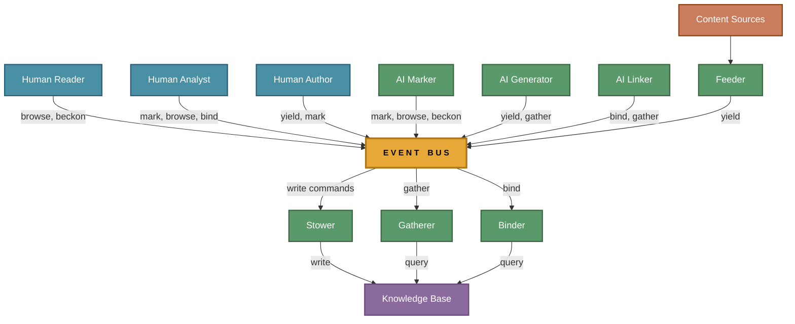
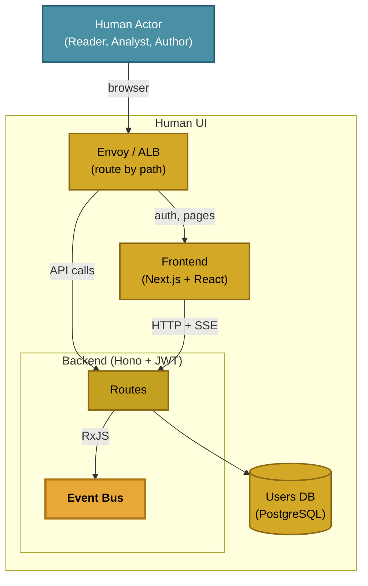
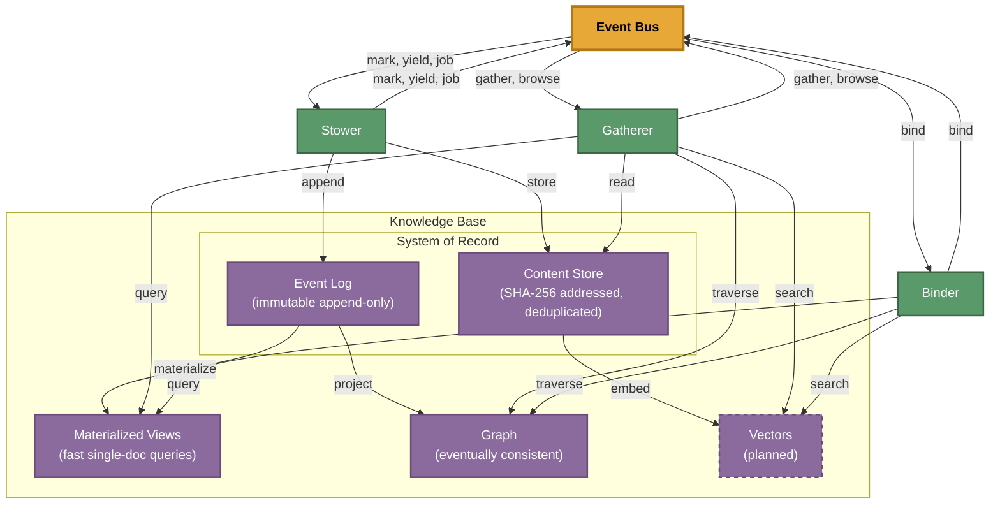

# Semiont Architecture

Semiont transforms unstructured text into a queryable knowledge graph using W3C Web Annotations as the semantic layer. The architecture is organized around **actors** communicating through a central **event bus**. This clarifies what each participant *does* and *knows*, and makes it easy to add new actors (human or AI) without touching the plumbing.

## Core Insight

Every meaningful action in Semiont is an event on the bus. The actors fall into three categories:

1. **Intelligent actors** — humans or AI agents that read, interpret, and annotate content. They produce events that carry semantic intent (mark, browse, yield, bind, gather, beckon).
2. **The knowledge base** — a passive actor that listens to events and materializes durable state. It has no intelligence; it simply records what the intelligent actors decide.
3. **Content streams** — external sources that yield new resources into the system (uploads, web fetches, API ingestion).

The event bus is the only coupling between actors. An actor does not know who else is listening.

## Actor Topology


```mermaid
graph TD
    READER["Human Reader"] -->|"browse, beckon"| BUS
    ANALYST["Human Analyst"] -->|"mark, browse, bind"| BUS
    AUTHOR["Human Author"] -->|"yield, mark"| BUS
    MARKER["AI Marker"] -->|"mark, browse, beckon"| BUS
    GENERATOR["AI Generator"] -->|"yield, gather"| BUS
    LINKER["AI Linker"] -->|"bind, gather"| BUS

    BUS["E V E N T &ensp; B U S"]

    BUS -->|"write commands"| STOWER["Stower"]
    BUS -->|"gather"| GATHERER["Gatherer"]
    BUS -->|"bind"| BINDER["Binder"]
    STOWER -->|"write"| KB["Knowledge Base"]
    GATHERER -->|"query"| KB
    BINDER -->|"query"| KB

    SOURCES["Content Sources"] --> FEEDER["Feeder"]
    FEEDER -->|"yield"| BUS

    classDef bus fill:#e8a838,stroke:#b07818,stroke-width:3px,color:#000,font-weight:bold,font-size:14px
    classDef human fill:#4a90a4,stroke:#2c5f7a,stroke-width:2px,color:#fff
    classDef ai fill:#5a9a6a,stroke:#3d6644,stroke-width:2px,color:#fff
    classDef kb fill:#8b6b9d,stroke:#6b4a7a,stroke-width:2px,color:#fff
    classDef stream fill:#c97d5d,stroke:#8b4513,stroke-width:2px,color:#fff
    classDef worker fill:#5a9a6a,stroke:#3d6644,stroke-width:2px,color:#fff

    class READER,ANALYST,AUTHOR human
    class MARKER,GENERATOR,LINKER ai
    class BUS bus
    class KB kb
    class SOURCES stream
    class FEEDER,STOWER,GATHERER,BINDER worker
```

## Actors

### Example

| | Actor | Flows | What they do |
|-|-------|-------|-------------|
| 🧠 | **Reader** | browse, beckon | Navigates resources and annotations. Clicks, hovers, scrolls. Consumes the knowledge base without modifying it. |
| 🧠 | **Analyst** | mark, browse, beckon, bind | Reads content, creates annotations (highlights, comments, assessments, tags), and resolves references to existing resources. The primary human intelligence in the system. |
| 🧠 | **Author** | yield, mark | Composes new resources manually (via the compose page) and annotates them. Produces content that the knowledge base records. |
| 🤖 | **Marker Agent** | mark, browse, beckon | Scans documents and proposes annotations — highlights, assessments, comments, tags, and entity references. Produces the same W3C annotations that human analysts do. |
| 🤖 | **Generator Agent** | yield, gather | Assembles context around a reference annotation (gather), then synthesizes a new resource from it (yield). Creates content that the knowledge base records. |
| 🤖 | **Linker Agent** | bind, gather | Resolves unresolved references by searching for matching resources and linking them. Performs entity resolution and coreference — the binding of a mention to its referent. |

Human actors interact through the **Human UI** — the browser, Envoy proxy, Next.js frontend, and Hono backend. The UI translates DOM interactions (clicks, selections, form submissions) into events on the bus.


```mermaid
graph TB
    HUMAN["Human Actor<br/>(Reader, Analyst, Author)"] -->|browser| PROXY

    subgraph ui ["Human UI"]
        PROXY["Envoy / ALB<br/>(route by path)"]
        FE["Frontend<br/>(Next.js + React)"]
        DB[("Users DB<br/>(PostgreSQL)")]

        subgraph backend ["Backend (Hono + JWT)"]
            BE["Routes"]
            BUS["Event Bus"]
            BE -->|RxJS| BUS
        end

        PROXY -->|"auth, pages"| FE
        PROXY -->|"API calls"| BE
        FE -->|"HTTP + SSE"| BE
        BE --> DB
    end

    classDef actor fill:#4a90a4,stroke:#2c5f7a,stroke-width:2px,color:#fff
    classDef ui fill:#d4a827,stroke:#8b6914,stroke-width:2px,color:#000
    classDef bus fill:#e8a838,stroke:#b07818,stroke-width:3px,color:#000,font-weight:bold
    classDef backend fill:#c4a020,stroke:#8b6914,stroke-width:2px,color:#000

    class HUMAN actor
    class PROXY,FE,DB ui
    class BE backend
    class BUS bus
```

AI actors connect via the backend API (REST + JWT) or MCP protocol. They emit the same events as human actors. The knowledge base cannot distinguish a human-created annotation from an AI-created one — both are W3C annotations with a `creator` field that identifies the agent.

### Knowledge Base

The knowledge base is not an intelligent actor. It has no goals, preferences, or decisions. It never initiates an event. It is inert storage — the durable record of what intelligent actors decide.

The knowledge base has exactly three actor interfaces. No other code touches KB stores directly:

- **Stower** (write) — subscribes to command events on the bus and persists them to the event log and content store
- **Gatherer** (read context) — subscribes to gather events on the bus and assembles context from KB stores
- **Binder** (read search) — subscribes to bind events on the bus and searches KB stores for matching resources

All three are reactive actors: they subscribe to the EventBus via RxJS pipelines in `initialize()`, process events through private handlers, and communicate results back by emitting on the bus. They expose no public business methods — only `initialize()` and `stop()` for lifecycle management. Callers never call into an actor directly; they put a message on the bus and trust the actor is listening.


```mermaid
graph TB
    BUS["Event Bus"]

    BUS -->|"mark, yield, job"| STOWER["Stower"]
    BUS -->|"gather, browse"| GATHERER["Gatherer"]
    BUS -->|"bind"| BINDER["Binder"]

    STOWER -->|append| EVENTLOG
    STOWER -->|store| CONTENT

    subgraph kb ["Knowledge Base"]
        subgraph sor ["System of Record"]
            EVENTLOG["Event Log<br/>(immutable append-only)"]
            CONTENT["Content Store<br/>(SHA-256 addressed, deduplicated)"]
        end
        VIEWS["Materialized Views<br/>(fast single-doc queries)"]
        GRAPH["Graph<br/>(eventually consistent)"]
        VECTORS["Vectors<br/>(planned)"]

        EVENTLOG -->|materialize| VIEWS
        EVENTLOG -->|project| GRAPH
        CONTENT -->|embed| VECTORS
    end

    GATHERER -->|query| VIEWS
    GATHERER -->|read| CONTENT
    GATHERER -->|traverse| GRAPH
    GATHERER -->|search| VECTORS

    BINDER -->|query| VIEWS
    BINDER -->|traverse| GRAPH
    BINDER -->|search| VECTORS

    STOWER -->|"mark, yield, job"| BUS
    GATHERER -->|"gather, browse"| BUS
    BINDER -->|"bind"| BUS

    classDef bus fill:#e8a838,stroke:#b07818,stroke-width:3px,color:#000,font-weight:bold
    classDef store fill:#8b6b9d,stroke:#6b4a7a,stroke-width:2px,color:#fff
    classDef planned fill:#8b6b9d,stroke:#6b4a7a,stroke-width:2px,color:#fff,stroke-dasharray: 5 5
    classDef worker fill:#5a9a6a,stroke:#3d6644,stroke-width:2px,color:#fff

    class BUS bus
    class EVENTLOG,VIEWS,CONTENT,GRAPH store
    class VECTORS planned
    class STOWER,GATHERER,BINDER worker
```

| Store | Purpose | Access Pattern |
|-------|---------|---------------|
| **Event Log** | Immutable append-only log of all domain events | Stower appends; Gatherer/Binder read |
| **Materialized Views** | Denormalized projections for fast reads | Gatherer/Binder query by resource URI |
| **Content Store** | Content-addressed binary storage (documents, images, PDFs) | Stower writes; Gatherer reads by SHA-256 checksum |
| **Graph** | Eventually consistent relationship projection for traversal queries (backlinks, entity networks) | Gatherer/Binder traverse and search |
| **Vectors** *(planned)* | Embedding vectors derived from content for semantic search | Gatherer/Binder search |

### Stower

The Stower is the single write gateway to the knowledge base. It subscribes to command events on the bus (`mark:create`, `yield:create`, `mark:delete`, `mark:update-body`, `job:start`, `job:complete`, etc.) and translates them into domain events on the event log and content writes to the content store. After successful persistence, it emits result events back onto the bus (`mark:created`, `yield:created`, `mark:deleted`, etc.) so callers can confirm completion. No other code calls `eventStore.appendEvent()` or `contentStore.store()`.

### Gatherer

The Gatherer is the read actor for context assembly. When a Generator Agent or Linker Agent emits a **gather** event, the Gatherer receives it from the bus, queries the relevant KB stores (materialized views, content store, graph, vectors), and assembles the context needed for downstream work. It emits the assembled context back onto the bus.

### Binder

The Binder is the read actor for entity resolution. When an Analyst or Linker Agent emits a **bind** event, the Binder receives it from the bus, searches the KB stores (materialized views, graph, vectors) for matching resources, and resolves references — linking a mention to its referent. The Binder does not need the content store directly; it works with metadata, relationships, and embeddings to find the right target. It emits search results back onto the bus.

### Feeder and Content Streams

Content streams are external sources of new resources: file uploads, API ingestion, web fetches. The **Feeder** actor sits between content streams and the event bus. It accepts raw content from a source, emits `yield:create` on the bus, and the Stower handles persistence. The Feeder normalizes the intake — regardless of how content arrives, it enters the system as a yield event.

Content sources:

- **Upload** — a human drags a file into the browser
- **API Ingestion** — an external system pushes content via REST
- **Web Fetch** — the system retrieves content from a URL

## Flows as Verbs

The six flows are verbs that actors perform. Each flow is a conversation between one or more intelligent actors and the knowledge base, mediated by the event bus:

| Flow | Verb | Who does it | What happens |
|------|------|-------------|-------------|
| **[Mark](flows/MARK.md)** | Annotate | Analyst, Author, Marker Agent | Create W3C annotations on resources |
| **[Browse](flows/BROWSE.md)** | Navigate | Reader, Analyst, Marker Agent | Route attention to panels, annotations, resources |
| **[Beckon](flows/BECKON.md)** | Focus | Reader, Analyst, Marker Agent | Coordinate which annotation has visual attention |
| **[Bind](flows/BIND.md)** | Link | Analyst, Linker Agent, Binder | Resolve references to concrete resources |
| **[Gather](flows/GATHER.md)** | Contextualize | Generator Agent, Linker Agent, Gatherer | Assemble surrounding context for downstream use |
| **[Yield](flows/YIELD.md)** | Create | Author, Generator Agent, Content Streams | Produce new resources in the knowledge base |

## Why This Matters

The actor model makes three things visible that the layered architecture obscures:

1. **Human and AI are peers.** They perform the same flows, produce the same events, and create the same W3C annotations. The system does not privilege one over the other. A future actor — a different AI model, a rule engine, a crowdsourcing pipeline — slots in by subscribing to and emitting events.

2. **The knowledge base is inert.** It records; it does not decide. All intelligence lives in the actors. This means the knowledge base can be simple, append-only, and rebuildable — properties that are hard to maintain when "smart" behavior leaks into the data layer.

3. **Flows are composable.** A Marker Agent does mark + browse + beckon. A Generator Agent does yield + gather. New actor types can mix flows freely. The bus doesn't care who emits an event or who consumes it — only that the event conforms to the [event map](../packages/core/src/event-map.ts).

## Package Architecture

Semiont is a monorepo with modular packages organized in four layers:

```
Foundation Layer:
  @semiont/core           - Core types, EventBus, event map, branded IDs
  @semiont/api-client     - OpenAPI-generated types + EventBus client

Domain Layer:
  @semiont/ontology       - Entity types and vocabularies
  @semiont/content        - Content-addressed storage (SHA-256, deduplicated)
  @semiont/event-sourcing - Event store, materialized views, view materializer
  @semiont/graph          - Graph database abstraction (Neo4j, Neptune, in-memory)

AI Layer:
  @semiont/inference      - LLM integration (Anthropic, OpenAI, local)
  @semiont/jobs           - Job queue and annotation workers
  @semiont/make-meaning   - Stower, Gatherer, Binder — the KB actor implementations

UI Layer:
  @semiont/react-ui       - React components, hooks, and context providers
```

See [packages/README.md](../packages/README.md) for the complete dependency graph.

## Platform and Deployment

Services run on different platforms via environment configuration. The platform is selected per-service in `semiont.json` + environment overlays.

### Platform Types
- **POSIX** — Local processes (development, Codespaces)
- **Container** — Docker containers
- **AWS** — ECS tasks, RDS, S3, Neptune

### Environments

| Environment | Compute | Storage | Graph | Users DB |
|-------------|---------|---------|-------|----------|
| **Local** | Local processes | Filesystem | In-memory | SQLite or PostgreSQL |
| **Production (AWS)** | ECS Fargate | S3/EFS | Neptune | RDS PostgreSQL |

### Service Management

All services are managed through the Semiont CLI:
```bash
semiont start --environment local
semiont check --service all
semiont stop --environment production
```

See [CLI Documentation](../apps/cli/README.md) for details.

## Related Documentation

- [Configuration Guide](./CONFIGURATION.md) — Environment configuration
- [Authentication](./AUTHENTICATION.md) — OAuth, JWT, MCP token flows
- [API Documentation](../specs/docs/API.md) — REST API reference
- [W3C Web Annotation](../specs/docs/W3C-WEB-ANNOTATION.md) — Annotation data model
- [Services Overview](./services/OVERVIEW.md) — Service index and data architecture
