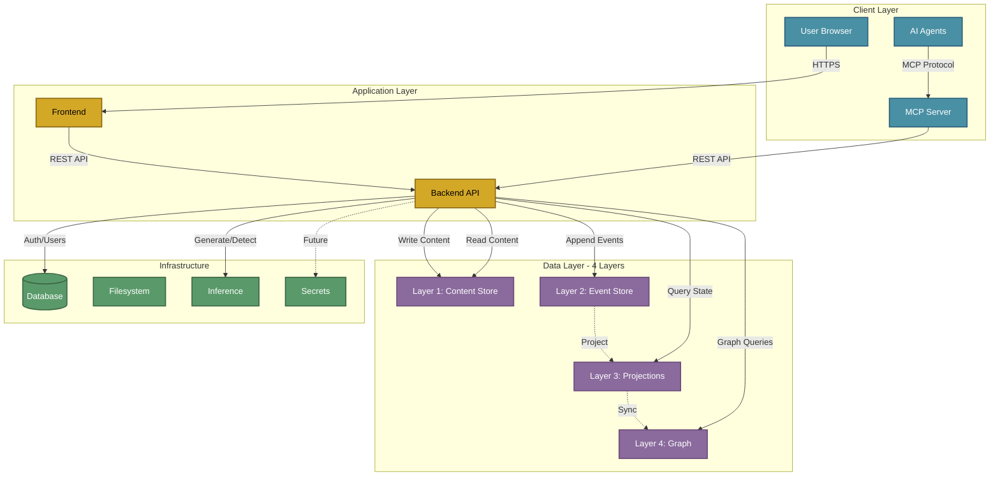

# Semiont Architecture

Platform-agnostic architecture for the Semiont semantic knowledge platform.

## Overview

Semiont transforms unstructured text into a queryable knowledge graph using W3C Web Annotations as the semantic layer. The architecture makes deliberate choices that prioritize longevity, interoperability, and operational simplicity.

**Core Principles:**

- **Event Sourcing**: Immutable event log as source of truth, enabling audit trails and temporal queries
- **4-Layer Data Model**: Clean separation of content, events, projections, and relationships
- **W3C Standards**: Full Web Annotation Data Model compliance ensures data portability
- **Spec-First Development**: Types generated from OpenAPI specification, not the reverse
- **Platform Agnostic**: Services run on local processes, containers, or cloud infrastructure

**For Executives**: This is a knowledge management system designed to outlive specific vendors or platforms. W3C compliance means your data exports as standard JSON-LD that any compatible system can consume.

**For Architects**: Event sourcing provides complete audit trails. The 4-layer model allows rebuilding any downstream state from the immutable event log. All services communicate via REST APIs with OpenAPI contracts.

## System Architecture



**Component Details**:

- **Frontend**: Next.js 14 web application with SSR/SSG
- **Backend API**: Hono server implementing W3C Web Annotation Data Model
- **MCP Server**: Model Context Protocol for AI agent integration
- **Layer 1 (Content Store)**: Binary/text files, 65K shards, O(1) access
- **Layer 2 (Event Store)**: Immutable JSONL event log, source of truth
- **Layer 3 (Projections)**: Materialized views in PostgreSQL + JSON files
- **Layer 4 (Graph)**: Neo4j/Neptune for relationship queries
- **Database**: PostgreSQL for users and authentication
- **Filesystem**: S3/EFS for uploads and assets
- **Inference**: LLM APIs (Anthropic Claude, OpenAI)
- **Secrets**: Planned credential management integration

**Key Flows**:

- **Write Path**: User → Frontend → Backend → Content Store (L1) + Event Store (L2) → Projections (L3) → Graph (L4)
- **Read Path**: User → Frontend → Backend → Projections (L3) or Graph (L4) → Response
- **Event Sourcing**: All writes create immutable events (L2), projections (L3) rebuilt from events
- **Graph Sync**: Graph database (L4) updated automatically via event subscriptions

## Application Services

Semiont consists of two primary application services plus supporting infrastructure.

### Frontend - Next.js Web Application

**Technology**: Next.js 14, TypeScript, Tailwind CSS, NextAuth.js

**Responsibilities**:

- Server-side rendering and static page generation
- OAuth 2.0 authentication with domain restrictions
- W3C annotation UI (highlight text, create entity tags, link documents)
- Real-time collaboration via Server-Sent Events
- Export annotations as JSON-LD

**Key Architectural Decisions**:

- SSR for initial page loads, CSR for dynamic interactions
- API client generated from OpenAPI spec ensures type safety
- Authentication handled by NextAuth.js with JWT session tokens

**Documentation**: [Frontend README](../apps/frontend/README.md)

### Backend - API Server (BFF Pattern)

**Technology**: Hono, TypeScript, Prisma, PostgreSQL

**Responsibilities**:

- REST API implementing W3C Web Annotation Data Model
- Event sourcing for all document and annotation mutations
- 4-layer data architecture (detailed below)
- JWT validation and role-based access control
- OpenAPI specification generation from route definitions

**Key Architectural Decisions**:

- Hono chosen for performance and automatic OpenAPI generation
- Event Store (Layer 2) is source of truth, not database
- Projections (Layer 3) rebuilt from events on demand
- Graph database (Layer 4) maintained via event subscriptions

**Documentation**: [Backend README](../apps/backend/README.md)

### MCP Server - AI Integration

**Technology**: Model Context Protocol, TypeScript

**Responsibilities**:

- Expose Semiont knowledge graph to AI systems (Claude Desktop, etc.)
- Provide tools for document search, annotation, and graph traversal
- Handle long-lived refresh token authentication

**Key Architectural Decisions**:

- Implements Model Context Protocol for AI agent integration
- Uses same API client as frontend for consistency
- 30-day refresh tokens for persistent AI sessions

**Documentation**: [MCP Server README](../packages/mcp-server/README.md)

## Data Architecture

The 4-layer architecture separates concerns while maintaining a clear dependency hierarchy.

### Layer 1: Content Store

**Purpose**: Raw document storage (text, binary, PDFs)

**Technology**: Sharded filesystem (65,536 shards via Jump Consistent Hash)

**Key Characteristics**:

- O(1) read/write by document ID
- Content-addressed storage (no database queries)
- Supports streaming for large files
- Platform-agnostic (local filesystem, EFS, S3)

**Why This Matters**: Storing content separately from metadata allows independent scaling. A 1GB PDF doesn't bloat your database. Content can live on cheap object storage while metadata stays in PostgreSQL.

**Documentation**: [CONTENT-STORE.md](./services/CONTENT-STORE.md)

### Layer 2: Event Store

**Purpose**: Immutable event log (source of truth for all changes)

**Technology**: Append-only JSONL files, sharded like Layer 1

**Event Types**:

- Document lifecycle: `document.created`, `document.archived`
- Annotations: `annotation.added`, `annotation.removed`, `annotation.body.updated`
- Entity types: `entitytype.added`, `entitytag.added`

**Key Characteristics**:

- Events never modified or deleted (append-only)
- Cryptographic chain integrity (each event references previous event hash)
- Sequence numbers for ordering guarantees
- File rotation at 10,000 events per document

**Why This Matters**: Event sourcing provides a complete audit trail. You can replay events to any point in time. Projections can be rebuilt if corrupted. New projection types can be added without schema migrations.

**Documentation**: [EVENT-STORE.md](./services/EVENT-STORE.md)

### Layer 3: Projection Store

**Purpose**: Materialized views of current state (optimized for queries)

**Technology**: PostgreSQL + sharded JSON files

**Storage**:

- Document metadata in PostgreSQL (`documents` table)
- Annotation collections in sharded JSON files
- System projections (entity types) in JSON

**Key Characteristics**:

- Rebuilt from Layer 2 events (not authoritative)
- Optimized for fast queries without event replay
- Incremental updates for performance
- Can be deleted and reconstructed at any time

**Why This Matters**: You don't query the event log for "get document by ID"—that would be slow. Projections are the read-optimized view. If they're corrupted or you change the schema, replay events to rebuild.

**Documentation**: [PROJECTION.md](./services/PROJECTION.md)

### Layer 4: Graph Database

**Purpose**: Relationship traversal and discovery

**Technology**: Neo4j, AWS Neptune, JanusGraph, or in-memory (configurable)

**Graph Model**:

- **Vertices**: Documents, Annotations, EntityTypes
- **Edges**: `BELONGS_TO` (annotation → document), `REFERENCES` (annotation → linked document), `TAGGED_AS` (annotation → entity type)

**Key Characteristics**:

- Built from Layer 3 projections via event subscriptions
- Enables graph queries (backlinks, entity co-occurrence, document clusters)
- Supports multiple implementations (Neo4j Cypher, Gremlin, in-memory)

**Why This Matters**: Graph databases excel at relationship queries. "Find all documents linking to this one" is a single Cypher query. In SQL, that's multiple joins. The graph is maintained automatically via event subscriptions—no manual sync required.

**Documentation**: [GRAPH.md](./services/GRAPH.md)

## Infrastructure Services

These services support the application layer but aren't directly visible to end users.

### Database - PostgreSQL

**Purpose**: User accounts, API keys, projection metadata

**Technology**: PostgreSQL 15 (AWS RDS in production)

**Storage**:

- User authentication records
- OAuth sessions
- Document metadata (Layer 3 projections)
- Annotation metadata (linked to JSON files)

**Key Characteristics**:

- Automatic migrations via Prisma on backend startup
- No manual migration files (schema is source of truth)
- Connection pooling via Prisma Client

**Why This Matters**: PostgreSQL handles relational data (users, permissions) while the event store handles document content. The database is not the source of truth for annotations—it's a projection.

**Documentation**: [DATABASE.md](./services/DATABASE.md)

### Filesystem - File Storage

**Purpose**: User uploads, document attachments, temporary files

**Technology**: Local filesystem (dev), AWS S3/EFS (production)

**Storage**:

- User profile images
- Uploaded PDF/image attachments
- Temporary processing files
- Generated document exports

**Key Characteristics**:

- Separate from Layer 1 content store
- Configurable backend (local, S3, EFS)
- Multipart upload support

**Documentation**: [FILESYSTEM.md](./services/FILESYSTEM.md)

### Inference - AI/ML Service

**Purpose**: LLM-powered document generation and entity detection

**Technology**: External APIs (Anthropic Claude, OpenAI)

**Capabilities**:

- Generate documents from annotated text selections
- Detect entities in document content
- Extract graph context for AI consumption
- Streaming text generation

**Key Characteristics**:

- External service (no local hosting)
- Configurable provider (Anthropic, OpenAI, local models)
- Streaming support for long-running operations

**Documentation**: [INFERENCE.md](./services/INFERENCE.md)

### Secrets - Credential Management

**Purpose**: Future integration with secrets managers

**Status**: Planned (Q1-Q4 2026)

**Planned Providers**: AWS Secrets Manager, HashiCorp Vault, Azure Key Vault

**Documentation**: [SECRETS.md](./services/SECRETS.md)

## Platform Abstraction

Services run on different platforms depending on the deployment environment. The CLI manages platform selection and service lifecycle.

### Platform Types

**POSIX** - Native OS processes
- **Use Case**: Local development
- **Services**: Backend, Frontend, MCP
- **Management**: Process spawning via Node.js `child_process`

**Container** - Docker/Podman
- **Use Case**: Isolated services (databases, graph)
- **Services**: Database, Graph
- **Management**: Container runtime via CLI

**AWS** - Managed cloud services
- **Use Case**: Production deployment
- **Services**: ECS (backend), RDS (database), Neptune (graph), S3/EFS (storage)
- **Management**: CloudFormation, ECS task definitions

**External** - Third-party APIs
- **Use Case**: External dependencies
- **Services**: Inference (LLM APIs), Graph (Neo4j Aura)
- **Management**: Health checks only (no lifecycle control)

**Mock** - Test doubles
- **Use Case**: CI/CD testing
- **Services**: Any service (simulated behavior)
- **Management**: Instant success responses

**Key Principle**: Services declare *what* they are (service type). Environments declare *where* they run (platform type). This separation allows running the same service on different platforms without code changes.

**Documentation**: [Platforms](./platforms/README.md)

## API Design

The Semiont API is RESTful with semantic extensions for knowledge graph operations.

### Core Resources

**Documents** - Markdown content with entity type tags

```

POST   /api/documents
GET    /api/documents/{id}
PATCH  /api/documents/{id}
DELETE /api/documents/{id}

```


**Annotations** - W3C Web Annotations linking text to entities or documents

```

POST   /api/documents/{id}/annotations
GET    /api/documents/{id}/annotations
PATCH  /api/documents/{id}/annotations/{annotationId}
DELETE /api/documents/{id}/annotations/{annotationId}

```


**Entity Types** - Semantic classifications (Person, Organization, etc.)

```

GET    /api/entity-types
POST   /api/entity-types

```


**Graph Operations** - Relationship queries

```

GET    /api/documents/{id}/backlinks
GET    /api/documents/{id}/context
POST   /api/annotations/{id}/generate-document

```


### API Characteristics

**RESTful Core**: Standard HTTP verbs, resource-oriented URLs, JSON payloads

**W3C Extensions**: Annotations follow Web Annotation Data Model (JSON-LD compatible)

**Event-Sourced Mutations**: All writes (`POST`, `PATCH`, `DELETE`) create immutable events

**Streaming Support**: Long-running operations (document generation, entity detection) support SSE

**Type Safety**: OpenAPI specification is source of truth—TypeScript types generated from spec

### Type-Safe Client

The [@semiont/api-client](../packages/api-client/) package provides a fully type-safe SDK:

- Types generated from [OpenAPI specification](../specs/openapi.json)
- Automatic request/response validation
- Streaming support for long-running operations
- Authentication helpers (JWT, OAuth, MCP tokens)

**Working Examples**: See [/demo](../demo/) for complete TypeScript examples.

**Documentation**:

- [API Overview](../specs/docs/API.md) - High-level capabilities
- [OpenAPI Specification](../specs/openapi.json) - Complete endpoint reference

## Authentication & Security

Semiont uses OAuth 2.0 for user authentication and JWT for API authorization.

### Authentication Flow

1. **User Login**: OAuth 2.0 via Google (email domain restrictions supported)
2. **Session Token**: NextAuth.js issues JWT session token (7-day expiry)
3. **API Requests**: Frontend includes JWT in `Authorization: Bearer <token>` header
4. **Token Validation**: Backend validates JWT signature and expiry

### Special Cases

**MCP Clients**: Long-lived refresh tokens (30-day expiry) for AI agent sessions

**API Keys**: Future support for programmatic access (planned)

### Security Defaults

- All endpoints require authentication (except `/api/health`, `/api/openapi.json`, OAuth exchange)
- JWT tokens expire after 7 days (force re-authentication)
- Password authentication disabled by default (OAuth only)
- Admin role required for user management endpoints
- HTTPS required in production (enforced by AWS ALB)

**Documentation**: [AUTHENTICATION.md](./AUTHENTICATION.md), [SECURITY.md](./SECURITY.md)

## Operational Concerns

### Configuration Management

**Environment Files**: `environments/*.json` define service configuration per deployment

**Example** (`local.json`):
```json
{
  "services": {
    "backend": {
      "platform": { "type": "posix" },
      "command": "npm run dev",
      "port": 4000
    },
    "database": {
      "platform": { "type": "container" },
      "image": "postgres:15-alpine",
      "port": 5432
    }
  }
}

```


**Key Principle**: Configuration is data, not code. Changing platforms (POSIX → AWS) is a config change, not a code change.

**Documentation**: [CONFIGURATION.md](./CONFIGURATION.md)

### Scaling Strategy

**Horizontal Scaling**:

- Backend API servers: Scale ECS tasks (stateless, share nothing)
- Frontend: Serverless (Next.js on Vercel or S3+CloudFront)
- Database: Read replicas for read-heavy workloads

**Data Layer Scaling**:

- Layer 1 (Content): Shard across multiple EFS volumes or S3 buckets
- Layer 2 (Events): Sharding already built-in (65,536 shards)
- Layer 3 (Projections): PostgreSQL read replicas
- Layer 4 (Graph): Neptune cluster or Neo4j enterprise

**Documentation**: [SCALING.md](./SCALING.md)

### Maintenance & Operations

**Routine Maintenance**:

- Database backups (automated via AWS RDS)
- Log rotation (CloudWatch log retention policies)
- Certificate renewal (automated via AWS ACM)

**Event Store Maintenance**:

- Event file rotation (automatic at 10,000 events)
- Projection rebuilds (on-demand via CLI)
- Chain validation (periodic integrity checks)

**Graph Database Maintenance**:

- Full graph rebuild from projections (rare, event-driven)
- Index optimization (database-specific)

**Documentation**: [MAINTENANCE.md](./MAINTENANCE.md)

## Design Decisions

### Why Event Sourcing?

**Alternative Considered**: Direct database writes (traditional CRUD)

**Decision**: Event sourcing provides audit trails, temporal queries, and rebuildable state. The complexity cost is justified by the value of complete change history.

**Trade-off**: Increased storage (events + projections) vs. queryability and auditability

### Why W3C Web Annotations?

**Alternative Considered**: Custom annotation format

**Decision**: W3C compliance ensures data portability. Your annotations export as standard JSON-LD that any compatible system can import.

**Trade-off**: Some W3C complexity (selectors, motivations) vs. vendor lock-in avoidance

### Why 4-Layer Architecture?

**Alternative Considered**: 2-layer (database + graph)

**Decision**: Separating content, events, projections, and relationships allows independent scaling and evolution. Each layer optimized for its access pattern.

**Trade-off**: Architectural complexity vs. operational flexibility

### Why PostgreSQL + Filesystem?

**Alternative Considered**: NoSQL (MongoDB, DynamoDB)

**Decision**: PostgreSQL provides ACID guarantees for user accounts and metadata. Filesystem storage for content/events avoids BLOB limitations and cost.

**Trade-off**: Operational complexity (two storage systems) vs. cost and scalability

### Why Spec-First OpenAPI?

**Alternative Considered**: Code-first API with generated docs

**Decision**: OpenAPI specification is source of truth. Frontend types, backend validation, and API docs all generated from spec. Changes start with spec review.

**Trade-off**: Upfront spec design effort vs. API consistency and type safety

## Related Documentation

### Service Deep Dives

- [Content Store](./services/CONTENT-STORE.md) - Layer 1 binary/text storage
- [Event Store](./services/EVENT-STORE.md) - Layer 2 immutable event log
- [Projection Store](./services/PROJECTION.md) - Layer 3 materialized views
- [Graph Database](./services/GRAPH.md) - Layer 4 relationship traversal
- [Database](./services/DATABASE.md) - PostgreSQL schema and migrations
- [Filesystem](./services/FILESYSTEM.md) - File upload and storage
- [Inference](./services/INFERENCE.md) - AI/ML integration
- [Services Overview](./services/README.md) - Complete service index

### Platform Documentation

- [POSIX Platform](./platforms/POSIX.md) - Native OS processes
- [Container Platform](./platforms/Container.md) - Docker/Podman
- [AWS Platform](./platforms/AWS.md) - Production deployment
- [External Platform](./platforms/External.md) - Third-party APIs
- [Mock Platform](./platforms/Mock.md) - Test doubles
- [Platforms Overview](./platforms/README.md) - Complete platform index

### Operational Documentation

- [Configuration](./CONFIGURATION.md) - Environment and service configuration
- [Security](./SECURITY.md) - Security controls and compliance
- [Scaling](./SCALING.md) - Performance scaling and cost optimization
- [Maintenance](./MAINTENANCE.md) - Operational maintenance procedures
- [Authentication](./AUTHENTICATION.md) - OAuth 2.0 and JWT implementation

### Development Documentation

- [Frontend README](../apps/frontend/README.md) - Next.js development
- [Backend README](../apps/backend/README.md) - Hono API development
- [MCP Server README](../packages/mcp-server/README.md) - AI integration
- [API Client README](../packages/api-client/README.md) - TypeScript SDK
- [CLI README](../apps/cli/README.md) - Command-line interface

---

**Document Version**: 3.0
**Last Updated**: 2025-10-25
**Audience**: CTOs, Architects, Engineering Leaders
**Purpose**: Architectural overview and service relationships
