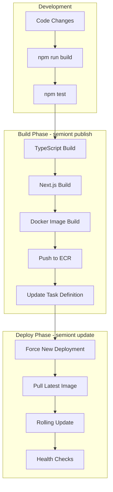
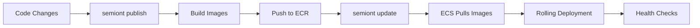

# Semiont Deployment Guide

This guide provides comprehensive instructions for deploying Semiont to AWS and managing deployments.

## Important Note About Repository Structure

When using Semiont, you typically have **two separate repositories**:

1. **Your Project Repository** - Contains your configuration (`environments/`, `semiont.json`)
2. **Semiont Platform Repository** - Contains the platform code (Dockerfiles, frontend/backend apps)

Most `semiont` commands are run from your project directory, and the `--semiont-repo` parameter tells the CLI where to find the platform code for building images.

## Table of Contents
- [Quick Start](#quick-start)
- [Core Commands](#core-commands)
- [Understanding Build & Deploy](#understanding-build--deploy)
- [Prerequisites](#prerequisites)
- [Initial Setup](#initial-setup)
- [Deployment Workflow](#deployment-workflow)
- [Monitoring & Maintenance](#monitoring--maintenance)
- [Troubleshooting](#troubleshooting)

## Quick Start

```bash
# First time setup
semiont init --name "my-project"
export SEMIONT_ENV=production

# Deploy to AWS
semiont provision   # One-time: Create AWS infrastructure (~10-15 min)
semiont publish --semiont-repo /path/to/semiont  # Build and push images (~5-8 min)
semiont update      # Force ECS to pull and deploy new images (~2-3 min)

# Monitor deployment
semiont check       # Check service health and status
semiont watch       # Watch real-time logs
```

## Core Commands

### `semiont provision`
Creates AWS infrastructure (VPC, RDS, EFS, ECS cluster, ALB, etc.).

```bash
semiont provision                        # Provision all services
semiont provision --service database     # Provision specific service
semiont provision --force               # Force re-provisioning
semiont provision --destroy             # Tear down infrastructure
```

**What it creates:**
- Data Stack: VPC, RDS, EFS, Secrets Manager
- Application Stack: ECS Cluster, ALB, WAF, CloudWatch

### `semiont publish`
Builds applications locally and creates container images for deployment.

#### Deployment Pipeline Flow



```bash
semiont publish --semiont-repo /path/to/semiont           # Build and push all services
semiont publish --service backend --semiont-repo /path/to/semiont  # Specific service
semiont publish --tag v1.2.3 --semiont-repo /path/to/semiont      # Custom tag
semiont publish --no-cache --semiont-repo /path/to/semiont        # Force clean build
```

**Important Options:**
- `--semiont-repo`: Path to Semiont platform code (required when not in Semiont repo)
- `--tag`: Override image tag (default depends on environment config)
- `--no-cache`: Skip Docker build cache for clean builds

**What it does:**
1. Builds TypeScript/Next.js locally with proper environment variables
2. Creates optimized Docker images with pre-built artifacts
3. Tags images based on environment configuration:
   - Development: Uses `latest` tag (mutable)
   - Production: Uses git commit hash (immutable)
4. Pushes images to AWS ECR
5. Updates ECS task definition to use new image

### `semiont update`
Forces ECS services to redeploy with current task definitions.

```bash
semiont update                           # Update all services
semiont update --service frontend        # Update specific service
semiont update --wait                    # Wait for deployment to complete
semiont update --timeout 600             # Custom timeout in seconds (with --wait)
semiont update --force                   # Continue on errors (don't stop on first failure)
```

**Important Options:**
- `--wait`: Wait for deployment to complete with enhanced monitoring
- `--timeout`: Maximum time to wait (default: 300 seconds)
- `--force`: Continue updating other services even if one fails

**What it does:**
1. Forces ECS to create new deployment with current task definition
2. For `latest` tags: ECS pulls newest image from ECR
3. For immutable tags (git hash): ECS performs rolling restart
4. With `--wait`: Monitors deployment phases:
   - Image pull detection (extends timeout if needed)
   - Task provisioning and health checks
   - Old deployment draining
5. Returns when deployment is fully complete

### `semiont check`
Verifies deployment health and service status.

```bash
semiont check                            # Check all services
semiont check --service backend          # Check specific service
semiont check --section health           # Check only health endpoints
semiont check --verbose                  # Show detailed diagnostics
```

**Checks performed:**
- AWS resource status (ECS tasks, RDS, EFS)
- Container health and status
- Service health endpoints
- Recent error logs
- Resource utilization

### `semiont watch`
Monitors real-time logs and metrics.

```bash
semiont watch                            # Interactive dashboard
semiont watch logs                       # Stream logs from all services
semiont watch logs --service backend    # Watch specific service logs
semiont watch metrics                    # View CloudWatch metrics
```

**Features:**
- Real-time log streaming from CloudWatch
- Interactive dashboard with service status
- Aggregated logs from multiple services
- Error highlighting and filtering

## Understanding Build & Deploy

### Deployment Flow



### When Building Happens

**Local Development** - No build needed:
- Frontend runs with Next.js dev server (hot reload)
- Backend runs with nodemon (auto-restart)
- Changes reflect immediately without building
- Use `semiont start` for local development

**Production Deployment** - Explicit building:
- `semiont publish` builds and pushes images
- `semiont update` triggers deployment of new images
- Two-step process gives you control over when to deploy

### Container Runtime Support

Semiont automatically detects and uses Docker or Podman:
- Auto-detection tries Docker first, then Podman
- Force specific runtime: `CONTAINER_RUNTIME=podman semiont publish`
- All commands work with both runtimes

## Prerequisites

### Required Tools
- Node.js 20+ and npm 9+
- Docker or Podman (for container builds)
- AWS CLI configured with credentials
- Semiont CLI installed (`npm install -g semiont-cli` or local install)

### AWS Account Setup
- AWS account with appropriate IAM permissions
- Services needed: VPC, ECS, RDS, ECR, ALB, CloudFront, WAF, Secrets Manager
- Estimated cost: ~$120/month for small deployments

### AWS Credentials

The CLI uses standard AWS credential chain:
```bash
# Option 1: AWS CLI configuration
aws configure

# Option 2: AWS SSO
aws sso login --profile production

# Option 3: Environment variables
export AWS_ACCESS_KEY_ID=xxx
export AWS_SECRET_ACCESS_KEY=xxx
export AWS_REGION=us-east-1

# Option 4: IAM roles (for EC2/ECS)
# Automatic when running on AWS infrastructure
```

## Initial Setup

### 1. Initialize Project

```bash
semiont init --name "my-project" --domain "example.com"
```

This creates:
- `environments/` directory with environment configurations
- Default `local.json` and `production.json` configs
- `.env` file for local development

### 2. Configure AWS Settings

Edit `environments/production.json`:
```json
{
  "site": {
    "name": "My Project",
    "domain": "example.com"
  },
  "aws": {
    "region": "us-east-1",
    "accountId": "123456789012",
    "stacks": {
      "data": "MyProjectDataStack",
      "app": "MyProjectAppStack"
    }
  }
}
```

### 3. Set Environment

```bash
# Set default environment
export SEMIONT_ENV=production

# Or specify per command
semiont publish --environment production
```

## Image Tagging Strategy

Semiont uses different image tagging strategies based on environment configuration:

### Development/Staging (Mutable Tags)

```json
// environments/dev.json
{
  "deployment": {
    "imageTagStrategy": "mutable"  // Uses 'latest' tag
  }
}
```

**Workflow:**
```bash
# Publish creates/updates 'latest' tag
semiont publish --environment dev --semiont-repo /path/to/semiont
# Image: myapp:latest

# Update forces ECS to re-pull 'latest' (gets new code)
semiont update --environment dev --wait
```

### Production (Immutable Tags)

```json
// environments/production.json
{
  "deployment": {
    "imageTagStrategy": "immutable"  // Uses git commit hash
  }
}
```

**Workflow:**
```bash
# Commit your changes first (in the Semiont repo)
cd /path/to/semiont
git add .
git commit -m "Fix critical bug"

# From your project directory, publish with git hash tag
cd /path/to/my-project
semiont publish --environment production --semiont-repo /path/to/semiont
# Image: myapp:abc123f

# Update performs rolling restart with specific version
semiont update --environment production --wait
```

### Benefits of This Approach

1. **Development Flexibility**: `latest` tag allows quick iterations without tracking versions
2. **Production Traceability**: Git hash tags provide exact code version tracking
3. **No Magic Strings**: Environment files control behavior, not hardcoded environment names
4. **Clear Separation**: Publish creates images, Update deploys them
5. **Rollback Capability**: Production images are immutable and can be rolled back

### Override Tag Strategy

You can override the configured strategy with explicit tags:

```bash
# Force specific tag regardless of environment config
semiont publish --environment production --tag v2.0.0 --semiont-repo /path/to/semiont
```

## Deployment Workflow

### First-Time Deployment

#### Step 1: Provision Data Infrastructure
```bash
semiont provision
```

Creates all AWS resources (~10-15 minutes):
- VPC with public/private subnets
- RDS PostgreSQL database
- EFS for shared storage
- ECS cluster for containers
- Application Load Balancer
- CloudFront CDN
- WAF for security

#### Step 2: Configure Secrets
```bash
# Set required secrets
semiont configure set database-password
semiont configure set jwt-secret

# OAuth configuration (required for authentication)
## Google OAuth Setup:
# 1. Go to https://console.cloud.google.com/
# 2. Create or select a project
# 3. Navigate to APIs & Services → Credentials
# 4. Create OAuth 2.0 Client ID (Web application)
# 5. Set Authorized redirect URIs:
#    - https://yourdomain.com/api/auth/callback/google
#    - http://localhost:3000/api/auth/callback/google (for local dev)
# 6. Copy Client ID and Client Secret
semiont configure set oauth/google

# Optional: GitHub OAuth
semiont configure set oauth/github

# Verify configuration
semiont configure show
```

#### Step 2a: Bootstrap Admin User

**Initial Admin Setup:**
The first admin user is set up via a database migration. Edit the migration file at `apps/backend/prisma/migrations/20240820000000_grant_initial_admin/migration.sql` to specify your admin email address before deploying.

**Managing Additional Admins:**
After the initial deployment, you can manage admin users via the database directly. Since the RDS database is in a private subnet for security, you'll need to:

1. Use AWS RDS Query Editor (if available)
2. Connect through a bastion host or VPN
3. Use ECS Exec to run commands in the backend container

Future versions will include a proper admin management interface.
```

**Important Notes:**
- Admin emails must match the email addresses used for OAuth authentication
- Users with these email addresses will automatically receive admin privileges on first login
- The admin password is only used if OAuth is not configured or as a fallback
- You can update the admin list at any time using the same commands
- In production, always use OAuth for better security

#### Step 3: Deploy Application
```bash
# Build and push images (from your project directory)
semiont publish --semiont-repo /path/to/semiont

# Deploy to ECS
semiont update

# Verify deployment
semiont check
```

#### Step 4: Access Admin Dashboard
After successful deployment, access the admin dashboard:

```bash
# Get your application URL
semiont check --section endpoints

# Access the admin dashboard at:
# https://your-domain.com/admin

# For local development:
# http://localhost:3000/admin
```

**First Login:**
1. Navigate to your deployed application and sign in using OAuth (Google/GitHub)
2. If you've set up the admin migration with your email, you should automatically have admin privileges
3. Navigate to `/admin` - you should now have access to:
   - User management dashboard at `/admin/users`
   - Security settings at `/admin/security`
   - System monitoring and configuration

**Admin Capabilities:**
- View and manage all users
- Access security settings and audit logs
- Configure system-wide settings
- Monitor application health and performance
- Manage role assignments (when RBAC is fully implemented)

### Updating Deployments

#### Development/Staging Updates

For environments using mutable tags (`latest`):
```bash
# Make your code changes (in Semiont repo)
cd /path/to/semiont
git add .
git commit -m "Your changes"

# Build and deploy (from your project directory)
cd /path/to/my-project
semiont publish --environment dev --semiont-repo /path/to/semiont
semiont update --environment dev --wait

# Quick one-liner for dev
semiont publish --semiont-repo /path/to/semiont && semiont update --wait
```

#### Production Updates

For environments using immutable tags (git hash):
```bash
# Make and commit your changes (in Semiont repo)
cd /path/to/semiont
git add .
git commit -m "Fix: Critical bug in payment processing"
git push  # Important: commit must exist in git

# Build and deploy with git hash (from your project directory)
cd /path/to/my-project
semiont publish --environment production --semiont-repo /path/to/semiont
semiont update --environment production --wait

# Monitor deployment
semiont watch
```

**Key Differences:**
- **Dev**: Image tag is reused (`latest`), update pulls new code
- **Prod**: Each deployment has unique tag (git hash), fully traceable
- **Rollback**: Production can rollback to any previous git hash

The deployment process:
- Builds TypeScript locally before Docker packaging
- Uses container layer caching for faster builds
- Performs zero-downtime rolling updates
- Enhanced `--wait` monitoring shows deployment phases
- Maintains image history in ECR for rollbacks

### Environment-Specific Deployments

```bash
# Deploy to different environments
semiont publish --environment staging --semiont-repo /path/to/semiont
semiont update --environment staging

semiont publish --environment production --semiont-repo /path/to/semiont
semiont update --environment production

# Or use SEMIONT_ENV
export SEMIONT_ENV=staging
semiont publish --semiont-repo /path/to/semiont
semiont update
```

## Monitoring & Maintenance

### Real-Time Monitoring

```bash
# Interactive dashboard
semiont watch

# Stream logs
semiont watch logs

# Filter by service
semiont watch logs --service backend

# Check service health
semiont check --verbose
```

### Service Management

```bash
# Start services locally
semiont start

# Stop services
semiont stop

# Restart services
semiont restart

# Execute commands in containers
semiont exec backend -- npm run migrate
```

### Backup and Restore

```bash
# Backup database
semiont backup create

# List backups
semiont backup list

# Restore from backup
semiont backup restore --id backup-20240101
```

### Cost Management

```bash
# Check AWS costs
semiont check costs

# Scale down for development
semiont update --scale-down

# Stop non-production services
semiont stop --environment staging
```

## Troubleshooting

### Common Issues

#### Build Failures

If `semiont publish` fails during build:
```bash
# Check for Docker/Podman
docker version
podman version

# Try building manually to see detailed errors
cd apps/frontend && npm run build
cd apps/backend && npm run build

# Check Docker daemon
docker ps

# Force rebuild without cache
semiont publish --no-cache
```

#### Deployment Failures

If services won't start after update:
```bash
# Check service status
semiont check --verbose

# View deployment logs
semiont watch logs --service backend

# Force update with new task definition
semiont update --force

# Rollback to previous version
semiont publish --tag previous
semiont update
```

#### Health Check Failures

If services fail health checks:
```bash
# Check application logs
semiont watch logs

# Test health endpoint directly
curl http://localhost:4000/health

# Check database connectivity
semiont exec backend -- npm run db:test

# Verify environment variables
semiont exec backend -- env | grep DB_
```

#### ECR Push Failures

If unable to push to ECR:
```bash
# Check AWS credentials
aws sts get-caller-identity

# Login to ECR manually
aws ecr get-login-password --region us-east-1 | \
  docker login --username AWS --password-stdin \
  123456789012.dkr.ecr.us-east-1.amazonaws.com

# Check ECR repository exists
aws ecr describe-repositories

# Create repository manually if needed
aws ecr create-repository --repository-name semiont-backend
```

### Debug Mode

Enable verbose output for debugging:
```bash
# Verbose output for all commands
semiont publish --verbose
semiont update --verbose
semiont check --verbose

# Dry run mode (preview without executing)
semiont provision --dry-run
semiont publish --dry-run
semiont update --dry-run
```

### Logs and Diagnostics

```bash
# Get recent logs
semiont watch logs --since 1h

# Check CloudWatch for errors
aws logs tail /ecs/semiont-backend --follow

# ECS task details
aws ecs describe-tasks --cluster semiont-cluster \
  --tasks $(aws ecs list-tasks --cluster semiont-cluster --query 'taskArns[0]' --output text)

# Database connection test
semiont exec backend -- npx prisma db pull
```

## Advanced Topics

### Custom Docker Images

If you need custom Docker configurations:
```dockerfile
# apps/frontend/Dockerfile.custom
FROM node:20-alpine AS builder
# Your custom build steps...
```

```bash
# Build with custom Dockerfile
docker build -f Dockerfile.custom -t semiont-frontend:custom .

# Push with skip-build flag
semiont publish --skip-build --tag custom
```

### Blue-Green Deployments

For zero-risk deployments:
```bash
# Deploy to green environment
semiont provision --stack-suffix green
semiont publish --tag green
semiont update --stack-suffix green

# Test green environment
semiont check --stack-suffix green

# Switch traffic (manual DNS/ALB update required)
# Then clean up blue environment
semiont provision --destroy --stack-suffix blue
```

### CI/CD Integration

GitHub Actions example:
```yaml
name: Deploy to Production
on:
  push:
    branches: [main]

jobs:
  deploy:
    runs-on: ubuntu-latest
    steps:
      - uses: actions/checkout@v2
      - uses: actions/setup-node@v2
      - run: npm ci
      - run: npm test
      - run: npm install -g semiont-cli
      - run: semiont publish --environment production
        env:
          AWS_ACCESS_KEY_ID: ${{ secrets.AWS_ACCESS_KEY_ID }}
          AWS_SECRET_ACCESS_KEY: ${{ secrets.AWS_SECRET_ACCESS_KEY }}
      - run: semiont update --environment production
```

## Command Reference

### Global Options

All commands support these options:
- `--environment <name>`: Specify environment (default: from SEMIONT_ENV or 'local')
- `--verbose`: Show detailed output
- `--dry-run`: Preview without executing
- `--output <format>`: Output format (summary|table|json|yaml)

### Service Names

Standard service names:
- `backend`: API server
- `frontend`: Web application
- `database`: PostgreSQL database
- `filesystem`: EFS/local storage
- `monitoring`: CloudWatch/logging

## Support

For issues or questions:
- Documentation: https://github.com/semiont/semiont/docs
- Issues: https://github.com/semiont/semiont/issues
- Logs: Check `semiont watch logs` for diagnostics