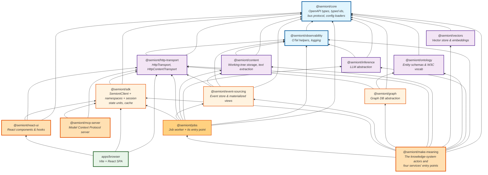
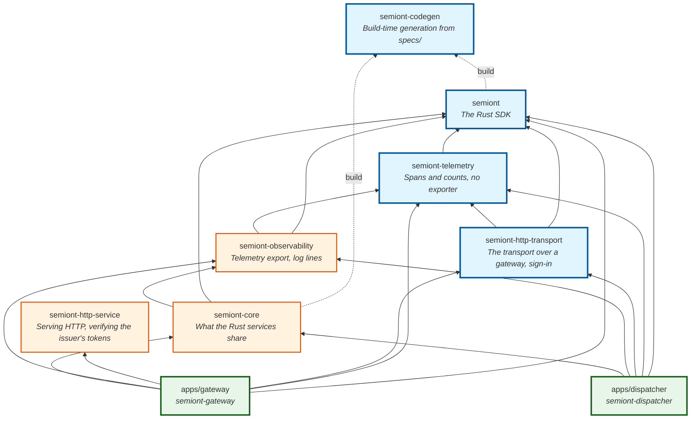

# Package Architecture

Semiont is a monorepo with two workspaces: the npm packages, and the Rust crates. Neither depends on the other. Both are built against [`specs/`](../../specs/src/openapi.json), the protocol each implements from its side.

For the per-package descriptions and npm metadata, see **[../../packages/README.md](../../packages/README.md)** — alphabetized table with one-line descriptions of every published `@semiont/*` package.

## The npm packages

Workspace packages are organized in layers from low-level primitives to application logic; the Browser (`apps/browser`) sits on top.

Each edge is an entry in that package's `package.json` `dependencies`.

## The Rust crates

Four crates are published to crates.io: `semiont`, `semiont-http-transport`, `semiont-telemetry` and `semiont-codegen`. `semiont-core`, `semiont-observability` and `semiont-http-service` are the services' own. The dispatcher also has two crates of its own beside its binary, for its handlers and its JetStream queue. The Archivist has two as well, for its record and its staging drivers.

## The Python package

`packages/sdk-python` is one distribution, `semiont`: the client, its transport over a gateway, sign-in, and telemetry with no exporter, which Rust keeps in four crates. It depends on `httpx`, `pydantic` and `opentelemetry-api`, and on nothing else in this repository. What it holds of `specs/` is generated, committed and held by drift gates.

## What each service image runs

| Image | Runs | From |
|---|---|---|
| `semiont-librarian` | `librarian-main` | `@semiont/make-meaning` |
| `semiont-smelter` | `smelter-main` | `@semiont/make-meaning` |
| `semiont-weaver` | `weaver-main` | `@semiont/make-meaning` |
| `semiont-worker` | `worker-main` | `@semiont/jobs` |
| `semiont-browser` | the built SPA | `apps/browser` |
| `semiont-gateway` | a Rust binary | `apps/gateway` |
| `semiont-archivist` | a Rust binary | `apps/archivist` |
| `semiont-dispatcher` | a Rust binary | `apps/dispatcher` |

## Architectural principles

1. **One composition root per process.** Each service's entry point builds what that process needs and nothing else.

2. **Strict API boundary.** `apps/browser` never imports a service's package. Its only `@semiont/*` imports are `@semiont/sdk`, `@semiont/http-transport` and `@semiont/react-ui` — every interaction with a knowledge base goes through the SDK over `HttpTransport`.

3. **Layered dependencies.** A package depends only on packages in lower layers. No circular dependencies.

4. **The spec is the boundary between languages.** No crate depends on an npm package, and no npm package on a crate. What they agree on is in `specs/`, and each side generates its types from it.

5. **Platform independence.** Foundation packages work in both browser and Node.js. Infrastructure packages (content, event-sourcing, graph, inference, jobs, make-meaning) are Node-only.

## See also

- **[../../packages/README.md](../../packages/README.md)** — alphabetized package catalog with one-line descriptions and npm links.
- **[KNOWLEDGE-SYSTEM.md](KNOWLEDGE-SYSTEM.md)** — what runs *inside* `@semiont/make-meaning` (the seven KB actors).
- **[CONTAINER-TOPOLOGY.md](../operator/CONTAINER-TOPOLOGY.md)** — how the service images fit together in a running stack.
