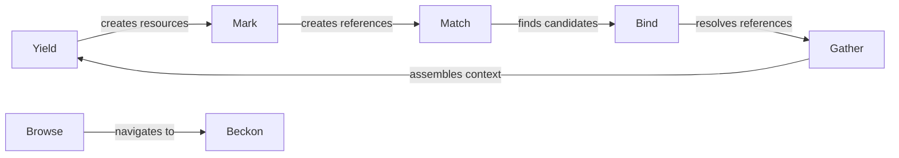

# Flows

The seven flows are verbs that actors perform. Each flow is a conversation between one or more intelligent actors and the knowledge base, mediated by the event bus. Flows are composable: a Marker Agent does mark + browse + beckon; a Generator Agent does yield + gather. New actor types can mix flows freely. The bus doesn't care who emits an event or who consumes it — only that the event conforms to the [event map](../../packages/core/src/bus-protocol.ts).

| Flow | Who does it | What happens |
|------|-------------|-------------|
| **[Mark](MARK.md)** | Analyst, Author, Marker Agent | Create W3C annotations on resources |
| **[Browse](BROWSE.md)** | Reader, Analyst, Marker Agent | Route attention to panels, annotations, resources |
| **[Beckon](BECKON.md)** | Reader, Analyst, Marker Agent | Coordinate which annotation has visual attention |
| **[Match](MATCHER.md)** | Analyst, Linker Agent, Matcher | Retrieve and rank candidate resources for an entity reference |
| **[Bind](BIND.md)** | Analyst, Linker Agent, Matcher | Resolve references to concrete resources |
| **[Gather](GATHER.md)** | Generator Agent, Linker Agent, Gatherer | Assemble surrounding context for downstream use |
| **[Yield](YIELD.md)** | Author, Generator Agent, Content Streams | Produce new resources in the knowledge base |

## How Flows Relate

**Yield** introduces content. **Mark** annotates it — highlights, assessments, comments, tags, entity references. **Match** searches for candidate resources when a reference is ambiguous. **Bind** resolves the reference to a concrete target. **Gather** assembles context around a focal annotation. That context feeds back into **Yield** to generate new resources, closing the loop. **Browse** and **Beckon** handle navigation and attention — directing the user (or agent) to the right place.

## Actor Roles

Actors fall into three categories:

- **Intelligent actors** — humans or AI agents that read, interpret, and annotate content
- **Knowledge base actors** — Stower, Gatherer, Matcher, Browser, Smelter — reactive actors that mediate access to KB stores
- **Content streams** — external sources (uploads, API ingestion, web fetches) that yield new resources

Human and AI actors are peers: they perform the same flows, produce the same events, and create the same W3C annotations. The system does not privilege one over the other.

See [Architecture](../ARCHITECTURE.md) for the full actor topology and knowledge system design.
