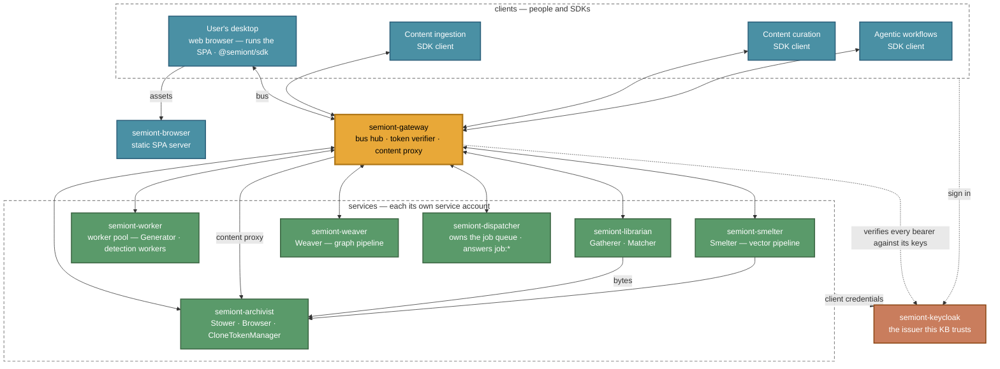
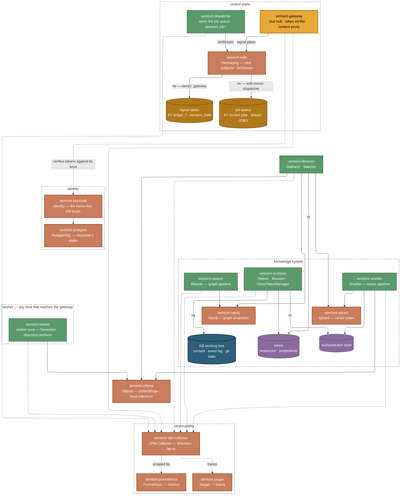

# Container Topology

How a Semiont stack splits into containers, and how those containers communicate. Two diagrams of one stack: who talks to whom, and what attaches to what.

For what each container needs (its port, configuration, mounts and health check), see [the service catalog](services/OVERVIEW.md). For what the actors inside the containers do, see [Knowledge System](../architecture/KNOWLEDGE-SYSTEM.md); for the Browser, [Human UI](../architecture/HUMAN-UI.md).

## Multi-container layout

A stack the launcher runs, on the config `semiont init` writes, is:

- **seven service containers**: the gateway, the dispatcher, the archivist, the librarian, the worker, the smelter and the weaver;
- **the Browser**, which serves every knowledge base on the machine;
- **six infrastructure containers**: Keycloak and its PostgreSQL, NATS, Neo4j, Qdrant and Ollama (none for Ollama when one is installed on the machine);
- **three for telemetry**: the OpenTelemetry Collector, Jaeger and Prometheus. `--no-observe` leaves out the last two; the collector still runs.

Semiont's eight are published images that a stack pulls and configures at run time. Nothing about a knowledge base is built into them ([Container Images](administration/IMAGES.md)).

### Who talks to whom

The communication plane: the SDK clients, the SPA server, and every process-to-process edge — bus and bytes.

Reading the diagram:

- **Dotted edges are identity, and they come first.** Nobody reaches the gateway without visiting the issuer. People and SDK clients sign in there. Every service obtains its own service-account token there, then exchanges it at `POST /api/tokens/agent` for the agent identity its work is attributed to. The gateway verifies each bearer against the issuer's published keys and keeps no account of its own.
- **Bidirectional edges are the bus**: `POST /bus/emit`, and `POST /bus/subscribe` as Server-Sent Events. The gateway hosts no actors. Every service subscribes over those two endpoints like any other participant, and each rectangle names what runs inside it.
- **The blue rectangles are the bus's clients**, and each speaks an SDK — TypeScript (`@semiont/sdk`), Rust (`semiont`) or Go: the Browser in a person's web browser, and the same client without a UI for ingestion, curation and agentic workflows. The `semiont` launcher's verbs and the MCP server are two of them.
- **Edges pointing at the archivist are plain HTTP.** The gateway proxies content for its clients, the workers among them, and reads from the archivist the events a reconnecting stream missed. The smelter and the librarian dial the archivist directly for bytes.
- **The dispatcher has no edge to the archivist.** Job ids, types, parameters and status flow through it, and content never does. A worker claims a job there, then reads bytes on the gateway and writes annotations through the bus.
- **`semiont-browser` only serves static files.** The app runs in the person's web browser and connects to gateways from there, so the container needs no config and no connection of its own.

Two mechanisms behind the gateway hub are not drawn as edges:

- **The signal plane** is the fan-out behind the two bus endpoints, and it is a driver. `[signal] type = "nats"`, which `semiont init` writes, carries frames on core NATS subjects and keeps the gateway's in-flight state (the correlation ledger, and each principal's open-stream count) in JetStream key-value tables that every replica shares, so the gateway can run as several replicas. `in-process` keeps both inside one gateway's memory. The bus contract is the same either way, and no client sees the choice.
- **The job queue** is the dispatcher's, held in NATS JetStream. Jobs are created at the dispatcher, announced on `job:queued`, and claimed by exactly one worker over the bus. The dispatcher admits a claim only from a token carrying the worker role.

One NATS daemon, the `messaging` role, serves both. The second diagram draws it.

### What attaches to what

The state plane: the same seven service containers against file state and the third-party infrastructure.

Reading the diagram:

- **Cylinders are files on the host**, and their edges are mounts. `rw` and `ro` are marked where it matters.
- **The deep-blue cylinder is the knowledge base's working tree**: the git-tracked system of record, with exactly one writer, the archivist.
- **Purple cylinders are derived state**, rebuildable from the record.
- **Amber cylinders are neither.** They are operational state held in JetStream on the broker's `/data`, each with one owner. The job queue is the dispatcher's: a key-value bucket of jobs, where every transition is a compare-and-set, and a work-queue stream whose deliveries are the leases. Pending jobs live only there. The event log records that a job started, completed or failed, never that it was created, so the queue is durable. The signal tables are the gateway's, and every entry in them expires. They hold only what is in flight: who may see the reply to which request, replies kept for a client that reconnects, and each principal's open streams. Sharing them is what lets any gateway replica answer as the others would.
- **Rectangle-to-rectangle edges** are each service's infrastructure. Dotted edges are telemetry: OTLP into the collector, traces forwarded to Jaeger, metrics scraped by Prometheus.
- **The gateway attaches to two things**: the broker, for the signal plane and its tables, and the issuer, whose keys it verifies tokens against. It holds no database and no queue.
- **The worker's frame is a deployment boundary.** A worker holds no mount and no broker credential. Everything it dials (the gateway, for the bus and for bytes, and an inference provider) is a network address, so it can run on a machine the rest of the stack never shares. A worker that is not the deployment's own joins the same way: its client is granted the worker role at the issuer, and the dispatcher admits its claims by that role.
- **The Ollama edges show the fully local case.** On a config that names a remote API such as Anthropic's, inference for the workers and the librarian goes there instead. Embeddings stay on Ollama unless the config names Voyage.

Every service authenticates in two steps. It signs in at the knowledge base's issuer as its own service account (client credentials, `SEMIONT_OIDC_CLIENT_ID` and `SEMIONT_OIDC_CLIENT_SECRET`). It then presents that token at `POST /api/tokens/agent` with a `(provider, model)` identity and receives a token carrying a software-agent DID. The smelter presents its embedding config, the weaver `(semiont, weaver)`, the dispatcher `(semiont, dispatcher)`. The gateway verifies that token as it would a person's. The two identities are deliberate: the service account is the process, and the agent DID is the work.

The partition is why the gateway stays responsive: keeping the record, retrieval, model calls, embedding and graph projection each run in their own process.

### Who mounts what

The second diagram draws the mounts; this table states the rule. Exactly one container mounts the knowledge base's tree, which a launcher test holds, and every other byte crosses HTTP or the bus. A store that two services share has one owner, the stamp holder: when the owner's image changes, the launcher clears the store and the owner rebuilds it.

| Container | `/kb` (git tree) | anchored-text | state (views) |
|---|---|---|---|
| archivist | **rw — sole owner** | read | **stamp holder** — writes views |
| gateway | — | — | — (its signal tables are JetStream on `semiont-nats`, not a mount) |
| dispatcher | — | — | — (the job queue is JetStream on `semiont-nats`, not a mount) |
| librarian | — | — | shared — reads views |
| smelter | — | **stamp holder** — writes | — |
| worker · weaver · browser | — | — | — |

Every service also mounts its own staged configuration, read-only. Each infrastructure container has a data directory of its own.

## One bus, one kind of participant

The gateway exposes two endpoints that carry the work: `POST /bus/emit` and `POST /bus/subscribe`. Every other route is for sign-in metadata, tokens, content bytes or health. Every participant uses those two endpoints through an SDK, whether it is the Browser, a script, an agent, or one of Semiont's own services. A new kind of participant joins the same way, with no change to the gateway.

The wire protocol is [EVENT-BUS.md](../protocol/EVENT-BUS.md). The actors, and why people and agents are the same kind of participant, are in [the actor model](../architecture/ACTOR-MODEL.md).

## In a codespace

A codespace stack has the same topology, and the launcher runs at two layers:

- **On your machine**, `semiont start --runtime codespace` handles the outside: it creates or resumes the codespace, waits for the stack to be healthy, and forwards the knowledge base and its issuer to `localhost`.
- **Inside the codespace**, the codespace's own launcher brings the stack up with Docker, from the knowledge base's post-start hook, exactly as on a laptop.

The outer launcher never reaches into the containers. When something must happen inside, such as creating a user, it asks the inner launcher over `gh codespace ssh`.

## Inside each container

Each image runs `tini` as its first process, which runs the one service: a Rust binary for the gateway, the dispatcher and the Archivist, a Node entry point for the rest. When the launcher starts a stack it also sets `SEMIONT_SUPERVISE`, which has the container restart a crashed service and kill a hung one, because a laptop has no scheduler to do that. On a platform that has one, leave it unset ([Deployment](administration/DEPLOYMENT.md#what-your-platform-provides)).

## Related

- [The service catalog](services/OVERVIEW.md): each container's port, configuration, mounts and health check
- [Deploying Semiont](administration/DEPLOYMENT.md): the three ways to run a stack
- [Container Images](administration/IMAGES.md): what is published, and verifying it
- [Where a knowledge base lives on disk](../architecture/FILESYSTEM.md): the stores in the second diagram
