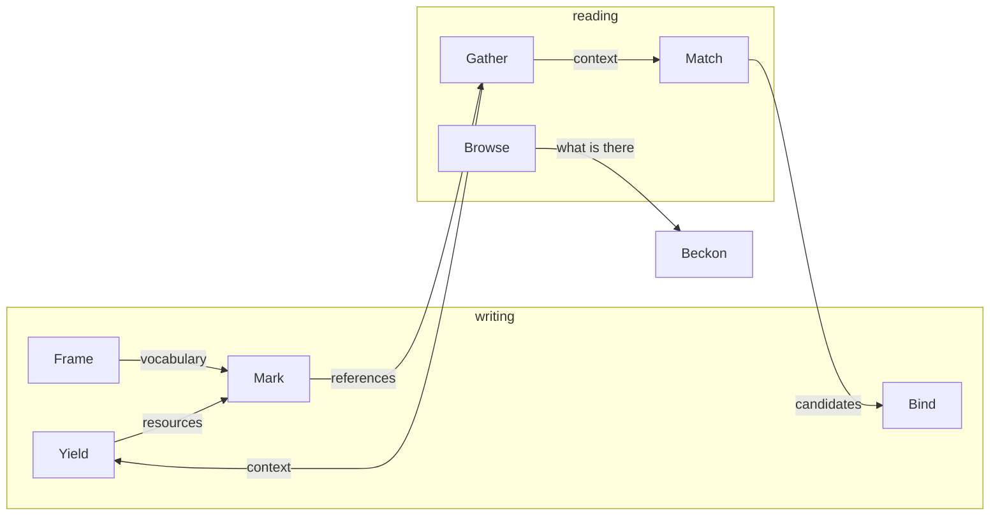

# The eight verbs

Every operation on a knowledge base belongs to one of eight verbs. Each is a conversation between a participant and the knowledge base, carried on the event bus. They fall into three groups, by what they do to the knowledge base:

**Writing verbs** add to the record.

| Verb | Does | Who does it |
|---|---|---|
| **[Yield](YIELD.md)** | Brings a resource into the knowledge base: by upload, by generation, by cloning | Author, Generator, Feeder |
| **[Mark](MARK.md)** | Annotates a passage or a region: a highlight, a comment, an assessment, a tag, a reference | Analyst, Author, Marker |
| **[Bind](BIND.md)** | Says what a reference refers to | Analyst, Linker |
| **[Frame](FRAME.md)** | Defines the vocabulary: entity types and tag schemas | Analyst, or an agent given the task |

**Reading verbs** find and assemble what is already there. They leave nothing behind.

| Verb | Does | Who does it |
|---|---|---|
| **[Browse](BROWSE.md)** | Reads the record: resources, annotations, history and vocabulary | every participant |
| **[Match](MATCH.md)** | Searches: for resources by text, and for what a reference could refer to, ranking the candidates | Analyst, Linker |
| **[Gather](GATHER.md)** | Assembles the context around an annotation or a resource, and lists what refers to a resource | Analyst, Generator, Linker |

**The attention-directing verb** writes nothing and reads nothing.

| Verb | Does | Who does it |
|---|---|---|
| **[Beckon](BECKON.md)** | Points another participant at a passage, or opens a resource on their screen | Analyst, Marker, a guide |

A participant mixes them freely. An agent that annotates uses Mark, Browse and Beckon. One that writes new resources uses Gather and Yield. The bus does not care who emits a frame, only that the frame is what its channel carries.

## How they feed each other

**Frame** sets the vocabulary. **Yield** brings resources in. **Mark** annotates them, drawing on the vocabulary, and some of those annotations are references that refer to nothing yet. **Gather** assembles the context around a reference. **Match** searches with that context, and **Bind** attaches the candidate that was chosen. The same context can go to **Yield** instead, to generate the resource the reference is about, which closes the loop. **Browse** reads all of it, and **Beckon** shows another participant where to look.

## Who the participants are

People and AI agents are the same kind of participant. They use the same verbs, emit the same frames, and produce the same annotations, and the record attributes each act to whoever did it. The roles in the tables above are the actor model's: see [the actor model](../../architecture/ACTOR-MODEL.md).

Behind the bus, the knowledge base's own services answer: the archivist records writes and answers reads of the record, the librarian answers Gather and Match, and the dispatcher hands delegated work to workers. See [the knowledge system](../../architecture/KNOWLEDGE-SYSTEM.md).

## What every verb shares

- The channels each verb uses, and what each carries, are declared in [`specs/src/bus/registry.json`](../../../specs/src/bus/registry.json). The registry marks every channel a client can emit as a write or a read, and the grouping above is that mark.
- The methods an SDK gives each verb, and what each returns, are declared in [`specs/src/client/surface.json`](../../../specs/src/client/surface.json). Every SDK is held to it.
- How frames are named, stamped with identity, correlated and delivered is in [the event-bus protocol](../EVENT-BUS.md).
- Work an agent is delegated runs as a job: [Jobs](../JOBS.md).
