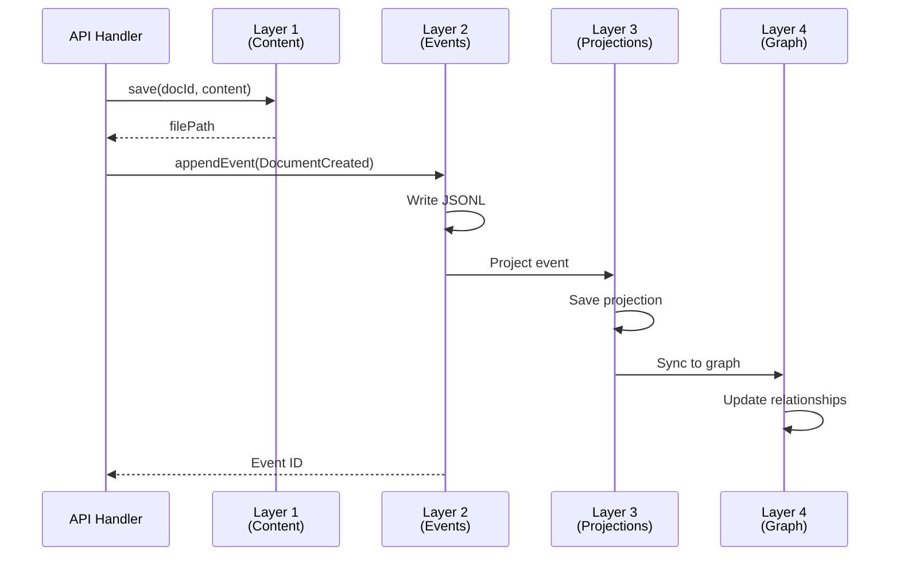
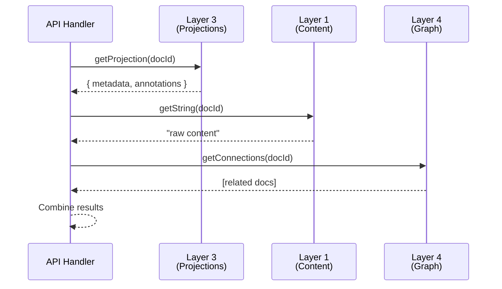

# Content Storage Architecture (Layer 1)

**Layer 1** of the Semiont data architecture provides raw document content storage using a filesystem-based approach with 4-hex sharding for horizontal scalability.

## Overview

Content Storage is the foundation layer that stores raw document content (text, binary, PDFs, images) separately from metadata and structure. It provides O(1) read/write operations by document ID through Jump Consistent Hash sharding across 65,536 buckets.

**Key Characteristics:**
- **Storage Format**: Binary/text files with `.dat` extension
- **Sharding**: 4-hex Jump Consistent Hash (65,536 shards)
- **Performance**: O(1) read/write by document ID
- **Independence**: No dependencies on other layers
- **Stream Support**: Efficient handling of large files

**Related Documentation:**
- [Event Store (Layer 2)](./EVENT-STORE.md) - Immutable event log
- [Projection Storage (Layer 3)](./PROJECTION.md) - Materialized views
- [Graph Database (Layer 4)](./GRAPH.md) - Relationship traversal
- [Architecture Overview](./ARCHITECTURE.md) - Complete system architecture

## Module Organization

Content Storage follows the same modular pattern as Layer 2 (Event Store), with clear separation of concerns:

```
apps/backend/src/storage/
├── content/                          # Layer 1: Content storage
│   ├── content-manager.ts            # Orchestration layer (127 lines)
│   ├── content-storage.ts            # File I/O operations (145 lines)
│   └── content-streaming.ts          # Stream operations (74 lines)
├── shared/                           # Shared utilities
│   ├── path-builder.ts               # Path construction & sharding (155 lines)
│   └── shard-utils.ts                # Jump consistent hash
└── projection/                       # Layer 3 (separate)
```

### Module Responsibilities

| Module | Lines | Responsibility | Dependencies |
|--------|-------|----------------|--------------|
| **ContentManager** | 127 | Orchestration and coordination | ContentStorage, ContentStreaming |
| **ContentStorage** | 145 | File I/O (save, get, delete, exists) | PathBuilder |
| **ContentStreaming** | 74 | Stream operations for large files | ContentStorage |
| **PathBuilder** | 155 | Path construction, sharding, scanning | shard-utils |
| **shard-utils** | ~50 | Jump Consistent Hash implementation | None |

**Design Principle**: Each module has a single, focused responsibility. No singletons, no global state.

## Storage Structure

### Filesystem Layout

```
{basePath}/
└── documents/                        # Content namespace
    ├── 00/
    │   ├── 00/
    │   │   └── doc-00000001.dat     # Shard [00,00]
    │   ├── 01/
    │   │   └── doc-00000102.dat     # Shard [00,01]
    │   └── ff/
    │       └── doc-00ff5678.dat     # Shard [00,ff]
    ├── ab/
    │   ├── cd/
    │   │   └── doc-abcd1234.dat     # Shard [ab,cd]
    │   └── ef/
    │       └── doc-abef5678.dat     # Shard [ab,ef]
    └── ff/
        └── ff/
            └── doc-ffffffff.dat     # Shard [ff,ff]
```

### Sharding Strategy

**4-Hex Jump Consistent Hash** distributes documents across 65,536 shards:

1. **Input**: Document ID (any format: UUID, hash, custom)
2. **Hash**: Jump Consistent Hash → bucket number (0-65535)
3. **Convert**: Bucket → 4 hex digits (e.g., 0 → 0000, 43981 → abcd)
4. **Split**: First 2 hex → subdirectory, last 2 hex → subdirectory
5. **Path**: `basePath/documents/ab/cd/doc-abcd1234.dat`

**Benefits:**
- **Balanced Distribution**: Jump Consistent Hash ensures even distribution
- **Horizontal Scalability**: 65,536 shards allow filesystem-level distribution
- **O(1) Access**: Direct path calculation without database lookups
- **Shard Stability**: Adding/removing shards minimally impacts existing documents

### File Format

Content files (`.dat`) store raw document content without additional metadata:

- **Text documents**: UTF-8 encoded strings
- **Binary documents**: Raw bytes (PDFs, images, archives)
- **No wrapping**: Pure content, no JSON/XML envelope
- **No metadata**: File path IS the only identifier

**Example:**
```typescript
// Saving text content
await contentManager.save('doc-123', 'Document text content');
// Result: basePath/documents/xx/xx/doc-123.dat

// Saving binary content
const pdfBuffer = await fs.readFile('input.pdf');
await contentManager.save('doc-456', pdfBuffer);
// Result: basePath/documents/yy/yy/doc-456.dat
```

## API Reference

### Factory Function

```typescript
import { createContentManager } from '../services/storage-service';

// Create instance (NO singleton pattern)
const contentManager = createContentManager({
  basePath: '/data/storage'
});
```

### ContentManager

**Main coordination interface for content operations.**

#### Basic Operations

```typescript
// Save content (string or Buffer)
await contentManager.save(documentId: string, content: string | Buffer): Promise<string>

// Get content as Buffer
const buffer = await contentManager.get(documentId: string): Promise<Buffer>

// Get content as string
const text = await contentManager.getString(documentId: string): Promise<string>

// Delete content
await contentManager.delete(documentId: string): Promise<void>

// Check existence
const exists = await contentManager.exists(documentId: string): Promise<boolean>

// List all document IDs
const ids = await contentManager.getAllDocumentIds(): Promise<string[]>
```

#### Stream Operations

```typescript
// Create read stream (efficient for large files)
const readStream = contentManager.createReadStream(documentId: string): NodeJS.ReadableStream

// Create write stream
const writeStream = contentManager.createWriteStream(documentId: string): NodeJS.WritableStream

// Save from stream
await contentManager.saveStream(documentId: string, stream: NodeJS.ReadableStream): Promise<string>
```

### ContentStorage

**Direct file I/O operations (usually accessed via ContentManager).**

```typescript
import { ContentStorage } from '../storage/content/content-storage';

const storage = new ContentStorage({
  basePath: '/data/storage'
});

// Same methods as ContentManager (storage operations)
await storage.save(documentId, content);
const buffer = await storage.get(documentId);
const text = await storage.getString(documentId);
await storage.delete(documentId);
const exists = await storage.exists(documentId);
const ids = await storage.getAllDocumentIds();

// Get file path (used internally by streaming)
const filePath = storage.getPath(documentId);
```

### ContentStreaming

**Stream operations for large files (usually accessed via ContentManager).**

```typescript
import { ContentStreaming } from '../storage/content/content-streaming';

const streaming = new ContentStreaming(storage);

// Create streams
const readStream = streaming.createReadStream(documentId);
const writeStream = streaming.createWriteStream(documentId);

// Save from stream
await streaming.saveStream(documentId, sourceStream);
```

## Usage Patterns

### Basic Document Storage

```typescript
import { createContentManager } from '../services/storage-service';

const contentManager = createContentManager({
  basePath: process.env.DATA_DIR || './data'
});

// Save text document
const docId = 'doc-' + generateId();
await contentManager.save(docId, 'My document content');

// Retrieve later
const content = await contentManager.getString(docId);
console.log(content); // "My document content"
```

### Binary Content (PDFs, Images)

```typescript
// Save PDF
const pdfBuffer = await fs.readFile('report.pdf');
await contentManager.save('report-2024', pdfBuffer);

// Retrieve PDF
const retrievedPdf = await contentManager.get('report-2024');
await fs.writeFile('output.pdf', retrievedPdf);
```

### Large File Streaming

```typescript
// Upload large file without loading into memory
const uploadStream = req.body; // Incoming HTTP stream
await contentManager.saveStream(documentId, uploadStream);

// Download large file
const downloadStream = contentManager.createReadStream(documentId);
downloadStream.pipe(res); // HTTP response
```

### Bulk Operations

```typescript
// Get all document IDs
const allIds = await contentManager.getAllDocumentIds();

// Process in batches
for (const docId of allIds) {
  const content = await contentManager.getString(docId);
  // Process content...
}
```

### Existence Checking

```typescript
// Check before operations
if (await contentManager.exists(documentId)) {
  await contentManager.delete(documentId);
}

// Or handle errors
try {
  const content = await contentManager.getString(documentId);
} catch (error) {
  if (error.message.includes('not found')) {
    // Handle missing document
  }
}
```

## Integration with Other Layers

### Layer 1 → Layer 2 (Event Store)

Content storage is **independent** of the event store. Events reference content by ID:

```typescript
// Layer 1: Save content
await contentManager.save('doc-123', 'Document content');

// Layer 2: Record event
await eventStore.appendEvent({
  type: 'DocumentCreated',
  aggregateId: 'doc-123',
  data: {
    contentId: 'doc-123',  // Reference to Layer 1
    title: 'My Document',
    mimeType: 'text/plain'
  }
});
```

**Key Point**: Layer 1 does NOT know about events. Layer 2 knows about Layer 1 IDs.

### Layer 2 → Layer 1 (Content Retrieval)

Event handlers can retrieve content when needed:

```typescript
// In event consumer
eventStore.subscribe('DocumentCreated', async (event) => {
  const contentId = event.data.contentId;

  // Retrieve content from Layer 1
  const content = await contentManager.getString(contentId);

  // Process content (indexing, analysis, etc.)
  await processContent(content);
});
```

### Layer 1 + Layer 3 (Projections)

Projections (Layer 3) store metadata, content storage (Layer 1) stores raw content:

```typescript
// Layer 1: Raw content
await contentManager.save('doc-123', documentText);

// Layer 3: Metadata projection
await projectionManager.save('doc-123', {
  document: {
    id: 'doc-123',
    title: 'My Document',
    mimeType: 'text/plain',
    size: documentText.length,
    created: new Date().toISOString()
  },
  annotations: []
});
```

**Separation of Concerns:**
- Layer 1 = "What is the content?" (raw bytes/text)
- Layer 3 = "What do we know about it?" (metadata, annotations)

### Complete Write Flow



### Complete Read Flow



## Performance Characteristics

### Time Complexity

| Operation | Complexity | Notes |
|-----------|-----------|-------|
| **save()** | O(1) | Direct path calculation + write |
| **get()** | O(1) | Direct path calculation + read |
| **getString()** | O(1) | Same as get() + encoding |
| **delete()** | O(1) | Direct path calculation + unlink |
| **exists()** | O(1) | Direct path calculation + access check |
| **getAllDocumentIds()** | O(n) | Full filesystem scan (use sparingly) |
| **createReadStream()** | O(1) | Stream creation (reading is O(n) on file size) |
| **saveStream()** | O(n) | Streaming write (n = file size) |

### Space Complexity

- **Per document**: File size + filesystem overhead (~4KB minimum per file on most systems)
- **Total**: Sum of all document sizes + directory structure overhead
- **Sharding overhead**: 65,536 directories max (minimal compared to content)

### Scalability Considerations

**Horizontal Scaling:**
- **65,536 shards** allow distribution across multiple mount points
- Use shard prefixes to distribute to different disks/servers:
  - Shards `00/00` - `3f/ff` → Disk 1
  - Shards `40/00` - `7f/ff` → Disk 2
  - Shards `80/00` - `bf/ff` → Disk 3
  - Shards `c0/00` - `ff/ff` → Disk 4

**Filesystem Limits:**
- Most filesystems handle millions of files per directory
- 65,536 shards = ~1,500 files per shard at 100M documents
- Ext4 limit: ~10M files per directory (plenty of headroom)

**Network Storage:**
- Works with EFS, NFS, Ceph, GlusterFS
- Stream operations minimize memory usage
- No database dependencies = simpler infrastructure

## Error Handling

### Common Errors

```typescript
// Document not found
try {
  await contentManager.get('nonexistent-doc');
} catch (error) {
  // Error: "Document nonexistent-doc not found in storage"
}

// File system errors
try {
  await contentManager.save(docId, content);
} catch (error) {
  // Possible: ENOSPC (no space), EACCES (permissions), etc.
}
```

### Best Practices

1. **Check existence before operations:**
   ```typescript
   if (await contentManager.exists(docId)) {
     await contentManager.delete(docId);
   }
   ```

2. **Handle ENOENT gracefully:**
   ```typescript
   try {
     return await contentManager.getString(docId);
   } catch (error) {
     if (error.code === 'ENOENT' || error.message.includes('not found')) {
       return null; // or default value
     }
     throw error;
   }
   ```

3. **Use streams for large files:**
   ```typescript
   // BAD: Loads entire file into memory
   const largeFile = await contentManager.get(docId);

   // GOOD: Streams efficiently
   const stream = contentManager.createReadStream(docId);
   stream.pipe(response);
   ```

4. **Ensure directory structure:**
   ```typescript
   // PathBuilder handles this automatically
   await contentManager.save(docId, content);
   // Directory created if needed
   ```

## Testing

### Unit Tests

```typescript
import { describe, it, expect, beforeEach, afterEach } from 'vitest';
import { ContentStorage } from '../content-storage';
import { rm, mkdir } from 'fs/promises';

describe('ContentStorage', () => {
  const testDir = './test-data';
  let storage: ContentStorage;

  beforeEach(async () => {
    await mkdir(testDir, { recursive: true });
    storage = new ContentStorage({ basePath: testDir });
  });

  afterEach(async () => {
    await rm(testDir, { recursive: true, force: true });
  });

  it('should save and retrieve text content', async () => {
    const docId = 'test-doc-1';
    const content = 'Test content';

    await storage.save(docId, content);
    const retrieved = await storage.getString(docId);

    expect(retrieved).toBe(content);
  });

  it('should save and retrieve binary content', async () => {
    const docId = 'test-doc-2';
    const content = Buffer.from([0x00, 0x01, 0x02, 0xff]);

    await storage.save(docId, content);
    const retrieved = await storage.get(docId);

    expect(Buffer.compare(retrieved, content)).toBe(0);
  });

  it('should check existence correctly', async () => {
    const docId = 'test-doc-3';

    expect(await storage.exists(docId)).toBe(false);

    await storage.save(docId, 'content');
    expect(await storage.exists(docId)).toBe(true);

    await storage.delete(docId);
    expect(await storage.exists(docId)).toBe(false);
  });

  it('should distribute across shards', async () => {
    // Save multiple documents
    await storage.save('doc-00000001', 'content1');
    await storage.save('doc-abcd1234', 'content2');
    await storage.save('doc-ffffffff', 'content3');

    const allIds = await storage.getAllDocumentIds();
    expect(allIds).toHaveLength(3);
    expect(allIds).toContain('doc-00000001');
    expect(allIds).toContain('doc-abcd1234');
    expect(allIds).toContain('doc-ffffffff');
  });
});
```

## Migration from Old Storage

### Old Pattern (Singleton)

```typescript
// OLD: Singleton pattern (deprecated)
import { getStorageService } from '../storage/filesystem';

const storage = getStorageService();
await storage.saveDocument(docId, content);
const doc = await storage.getDocument(docId);
```

### New Pattern (Factory)

```typescript
// NEW: Factory function
import { createContentManager } from '../services/storage-service';

const contentManager = createContentManager({
  basePath: config.dataDir
});
await contentManager.save(docId, content);
const doc = await contentManager.get(docId);
```

### Migration Steps

1. **Replace imports:**
   ```typescript
   - import { getStorageService } from '../storage/filesystem';
   + import { createContentManager } from '../services/storage-service';
   ```

2. **Update instantiation:**
   ```typescript
   - const storage = getStorageService();
   + const contentManager = createContentManager({ basePath: dataDir });
   ```

3. **Update method calls:**
   ```typescript
   - storage.saveDocument(id, content)
   + contentManager.save(id, content)

   - storage.getDocument(id)
   + contentManager.get(id)

   - storage.deleteDocument(id)
   + contentManager.delete(id)
   ```

4. **Update return types:**
   - Old: `getDocument()` returned `Buffer`
   - New: `get()` returns `Buffer`, `getString()` returns `string`

## Configuration

### Environment Variables

```bash
# Data directory (default: ./data)
DATA_DIR=/mnt/storage/semiont-data

# Alternative: Configure per instance
CONTENT_BASE_PATH=/mnt/storage/content
```

### Application Configuration

```typescript
// config/storage.ts
export const storageConfig = {
  basePath: process.env.DATA_DIR || './data',
  // Future: Additional configuration
  // shardCount: 65536,
  // mountPoints: ['/disk1', '/disk2'],
};

// Usage
const contentManager = createContentManager(storageConfig);
```

### AWS EFS Configuration

```typescript
// Works seamlessly with EFS mount
const contentManager = createContentManager({
  basePath: '/mnt/efs/semiont'  // EFS mount point
});

// Automatic directory creation handles EFS permissions
```

## Design Decisions

### Why Filesystem Storage?

1. **Simplicity**: No database overhead for large binary objects
2. **Performance**: O(1) access without database queries
3. **Scalability**: Easy horizontal scaling with sharding
4. **Compatibility**: Works with any filesystem (local, NFS, EFS, Ceph)
5. **Debugging**: Files are directly accessible for inspection
6. **Backups**: Standard filesystem backup tools work

### Why Not Database BLOBs?

- **Size limits**: PostgreSQL BYTEA max 1GB, filesystem unlimited
- **Memory overhead**: Database loads BLOBs into memory
- **Backup complexity**: Database backups include large binaries
- **Query performance**: BLOBs slow down table scans
- **Cost**: Database storage more expensive than filesystem

### Why .dat Extension?

- **Neutral format**: Doesn't imply text or specific binary type
- **Clear distinction**: Different from .json (projections) and .jsonl (events)
- **Flexibility**: Can store any content type without misleading extension
- **Convention**: Common for generic binary/data files

### Why Jump Consistent Hash?

- **Balanced distribution**: Better than modulo for uneven document IDs
- **Stability**: Minimal redistribution when adding/removing shards
- **Speed**: Fast hash computation (integer math only)
- **Standard**: Well-known algorithm with proven properties

### Why NO Caching?

Content Storage is **deliberately cache-free**:

1. **Operating system caches**: OS page cache handles hot data
2. **Layer separation**: Caching belongs in application layer, not storage layer
3. **Simplicity**: No cache invalidation complexity
4. **Memory efficiency**: Application controls memory usage
5. **Predictability**: No cache warming or eviction surprises

If caching is needed, implement it in API handlers or add a separate caching layer.

## Troubleshooting

### Documents Not Found

**Problem**: `Document X not found in storage`

**Solutions:**
1. Check file permissions: `ls -la {basePath}/documents/`
2. Verify basePath configuration: `echo $DATA_DIR`
3. Check shard path: Calculate expected path and verify file exists
4. Check disk space: `df -h`

### Permission Errors

**Problem**: `EACCES: permission denied`

**Solutions:**
1. Fix directory permissions: `chmod -R 755 {basePath}`
2. Fix ownership: `chown -R appuser:appuser {basePath}`
3. Check parent directory permissions
4. Verify process user has write access

### Disk Space Issues

**Problem**: `ENOSPC: no space left on device`

**Solutions:**
1. Check disk space: `df -h`
2. Clean up old content: Delete archived documents
3. Move shards to additional disk: Symlink shard directories
4. Increase storage allocation (EFS, disk resize)

### Slow Performance

**Problem**: Slow save/get operations

**Investigation:**
1. Check disk I/O: `iostat -x 1`
2. Check filesystem type: `df -T`
3. Check for many small files in one shard
4. Monitor network latency (if using network filesystem)

**Solutions:**
1. Use SSDs instead of HDDs
2. Increase filesystem cache
3. Enable filesystem optimizations (noatime, etc.)
4. Use local disk instead of network filesystem for hot data

### Shard Distribution Issues

**Problem**: Uneven distribution across shards

**Investigation:**
```bash
# Count files per shard
find {basePath}/documents -name "*.dat" | \
  sed 's|.*/documents/\(..\)/\(..\)/.*|\1/\2|' | \
  sort | uniq -c | sort -n
```

**Expected**: Roughly equal distribution across all shards

**If uneven**: Jump Consistent Hash should provide good distribution. If significantly uneven, investigate document ID generation (IDs may not be random).

## Related Documentation

- [Architecture Overview](./ARCHITECTURE.md) - Complete system architecture
- [Event Store (Layer 2)](./EVENT-STORE.md) - Event sourcing patterns
- [Projection Storage (Layer 3)](./PROJECTION.md) - Metadata and query layer
- [Graph Database (Layer 4)](./GRAPH.md) - Relationship traversal
- [W3C Web Annotation](../specs/docs/W3C-WEB-ANNOTATION.md) - Annotation data model
- [Database Management](./DATABASE.md) - PostgreSQL and migrations

## Future Enhancements

### Potential Features

1. **Content Versioning**: Store multiple versions of same document
2. **Deduplication**: Hash-based deduplication for identical content
3. **Compression**: Transparent compression for text documents
4. **Encryption**: At-rest encryption for sensitive content
5. **Tiering**: Automatic migration to cheaper storage for old content
6. **Replication**: Multi-datacenter content replication
7. **Checksums**: Content integrity verification with SHA-256
8. **Metadata Sidecar**: Store MIME type, size, hash alongside content

### Architectural Evolution

- **Object Storage**: Support S3-compatible backends (MinIO, Ceph)
- **Multi-backend**: Route content to different storage backends by type
- **Content CDN**: Integrate with CloudFront for public content
- **Smart Sharding**: Dynamic shard allocation based on content type/size

---

**Document Version**: 1.0
**Last Updated**: 2025-10-23
**Layer**: 1 (Content Storage)
