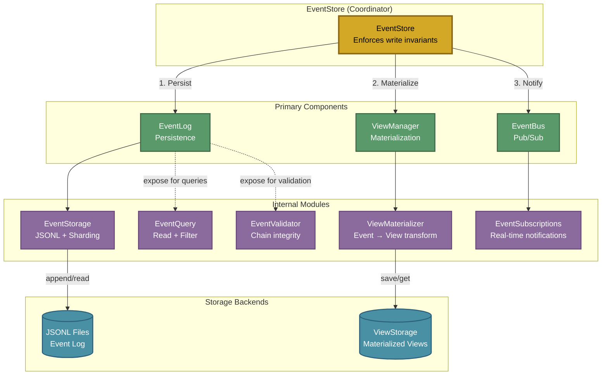

# Event Store

## Overview

The Event Store provides the foundation for Semiont's data architecture: an immutable append-only log paired with materialized views for fast queries.

**Core Components:**

- **EventLog**: Persist events to JSONL files
- **EventBus**: Pub/sub notifications for real-time updates
- **ViewManager**: Maintain materialized views from events
- **EventStore**: Coordinates write-path (persist → view → notify)

**Architecture Position**: The Event Store works with [RepresentationStore](./REPRESENTATION-STORE.md) (content), [ViewStorage](./VIEW-STORAGE.md) (materialized state), and [Graph](./GRAPH.md) (relationships). See [ARCHITECTURE.md](../ARCHITECTURE.md) for complete system architecture.

## Component Architecture



**Coordination Pattern**: EventStore enforces the write invariant (persist → materialize → notify) while exposing components for independent read access.

**Implementation**:

- [EventStore](../../apps/backend/src/events/event-store.ts) - Coordinator
- [EventLog](../../apps/backend/src/events/event-log.ts) - Persistence layer
- [EventBus](../../apps/backend/src/events/event-bus.ts) - Pub/sub layer
- [ViewManager](../../apps/backend/src/events/view-manager.ts) - Materialization layer

## Core Concepts

### Immutable Event Log

All changes are recorded as events in an append-only JSONL log:

- Events are NEVER modified or deleted
- Each event contains `prevEventHash` linking to previous event's checksum
- Complete audit trail for all system changes
- Events can be replayed to rebuild state at any point

**Storage Format**: [EventStorage](../../apps/backend/src/events/storage/event-storage.ts) handles JSONL persistence with 4-hex sharding (65,536 shards) and file rotation.

### Materialized Views

Current state is built from events and stored for fast queries:

- Views optimized for specific query patterns
- Can be rebuilt at any time from the event log
- Updated incrementally as new events arrive
- Stored via [ViewStorage](../../apps/backend/src/storage/view-storage.ts)

**Implementation**: [ViewMaterializer](../../apps/backend/src/events/views/view-materializer.ts) transforms events into views.

### Pub/Sub Notifications

Real-time event notifications via publish-subscribe pattern:

- Resource-scoped subscriptions (per-resource callbacks)
- Global subscriptions (system-wide events)
- Fire-and-forget notification pattern (non-blocking)
- Powers Server-Sent Events (SSE) for browser clients

**Implementation**: [EventSubscriptions](../../apps/backend/src/events/subscriptions/event-subscriptions.ts) manages subscription registry.

## Key APIs

### EventStore Coordination

File: [event-store.ts](../../apps/backend/src/events/event-store.ts)

```typescript
import { EventStore } from './events/event-store';
import type { ResourceId, ResourceEvent, StoredEvent } from '@semiont/core';

// Write (coordinated)
const stored: StoredEvent = await eventStore.appendEvent({
  type: 'annotation.added',
  userId: userId('user-123'),
  resourceId: resourceId('doc-456'),
  payload: { annotation }
});

// Read (direct access to components)
const events = await eventStore.log.getEvents(resourceId('doc-456'));
const view = await eventStore.views.getOrMaterialize(resourceId('doc-456'), events);
const sub = eventStore.bus.subscribe(resourceId('doc-456'), callback);
```

### EventLog Persistence

File: [event-log.ts](../../apps/backend/src/events/event-log.ts)

```typescript
// Append event
const stored = await eventStore.log.append(event, resourceId('doc-456'));

// Get all events
const events = await eventStore.log.getEvents(resourceId('doc-456'));

// Query with filters
const filtered = await eventStore.log.queryEvents(resourceId('doc-456'), {
  eventTypes: ['annotation.added'],
  fromTimestamp: '2025-01-01T00:00:00Z'
});
```

### EventBus Subscriptions

File: [event-bus.ts](../../apps/backend/src/events/event-bus.ts)

```typescript
// Subscribe to resource events
const sub = eventStore.bus.subscribe(resourceId('doc-456'), async (event) => {
  console.log('Event:', event.event.type);
});

// Subscribe to system events
const globalSub = eventStore.bus.subscribeGlobal(async (event) => {
  console.log('System event:', event.event.type);
});

// Cleanup
sub.unsubscribe();
```

### ViewManager Materialization

File: [view-manager.ts](../../apps/backend/src/events/view-manager.ts)

```typescript
// Update view (typically via EventStore.appendEvent)
await eventStore.views.materializeResource(
  resourceId('doc-456'),
  event,
  () => eventStore.log.getEvents(resourceId('doc-456'))
);

// Get or rebuild view
const view = await eventStore.views.getOrMaterialize(
  resourceId('doc-456'),
  events
);
```

## Data Format

### Event Structure

**StoredEvent**: Event + metadata

```typescript
{
  event: ResourceEvent,      // The actual event
  metadata: EventMetadata    // Storage metadata (sequence, checksum, etc.)
}
```

**ResourceEvent**: Core event data

```typescript
{
  id: EventId,               // UUID (branded type from @semiont/core)
  type: EventType,           // 'resource.created', 'annotation.added', etc.
  userId: UserId,            // Who triggered (branded type from @semiont/core)
  resourceId?: ResourceId,   // Which resource (branded type, undefined for system events)
  timestamp: string,         // ISO 8601 timestamp
  payload: Record<string, any>  // Event-specific data
}
```

**EventMetadata**: Storage tracking

```typescript
{
  sequenceNumber: number,    // Per-resource sequence (starts at 1)
  streamPosition: number,    // Position in file (for rotation)
  timestamp: string,         // When stored
  prevEventHash?: string,    // SHA-256 of previous event (chain integrity)
  checksum?: string          // SHA-256 of this event
}
```

### JSONL Event File

Events stored as JSON Lines (one JSON object per line):

```jsonl
{"event":{"id":"evt-abc123","type":"resource.created","userId":"user-456","resourceId":"doc-789","timestamp":"2025-01-15T10:30:00Z","payload":{"name":"My Resource","format":"text/markdown"}},"metadata":{"sequenceNumber":1,"streamPosition":0,"timestamp":"2025-01-15T10:30:00Z","checksum":"sha256abc"}}
{"event":{"id":"evt-def456","type":"annotation.added","userId":"user-456","resourceId":"doc-789","timestamp":"2025-01-15T10:31:00Z","payload":{"annotation":{"id":"anno-123","target":{"source":"doc-789","selector":[...]},"body":[...]}}},"metadata":{"sequenceNumber":2,"streamPosition":1,"timestamp":"2025-01-15T10:31:00Z","prevEventHash":"sha256abc","checksum":"sha256def"}}
```

### Storage Structure

```
dataDir/
├── events/
│   ├── 00/
│   │   ├── 00/
│   │   │   └── doc-abc123/
│   │   │       ├── events-000001.jsonl    # First 10,000 events
│   │   │       └── events-000002.jsonl    # Next 10,000 events
│   │   ├── 01/
│   │   │   └── doc-def456/
│   │   │       └── events-000001.jsonl
│   │   └── ...
│   ├── __system__/
│   │   └── events-000001.jsonl            # System events bypass sharding
│   └── ...
```

**Sharding**: 4-hex sharding (65,536 shards) using jump consistent hash for uniform distribution. See [EventStorage](../../apps/backend/src/events/storage/event-storage.ts) for implementation.

**Rotation**: Files rotate after 10,000 events (configurable via `maxEventsPerFile`).

## Event Types

### Resource Events

File: [resource-event.ts](../../packages/core/src/events/resource-event.ts)

- `resource.created` - New resource created
- `resource.cloned` - Resource cloned from another
- `resource.archived` - Resource archived
- `resource.unarchived` - Resource unarchived
- `entitytag.added` - Entity type tag added to resource
- `entitytag.removed` - Entity type tag removed from resource

### Annotation Events

File: [resource-event.ts](../../packages/core/src/events/resource-event.ts)

- `annotation.added` - New W3C annotation added
- `annotation.removed` - Annotation deleted
- `annotation.body.updated` - Annotation body modified (entity tags or references)

### System Events

File: [system-event.ts](../../packages/core/src/events/system-event.ts)

- `entitytype.added` - New entity type registered globally

**Special Handling**: System events have no `resourceId`. EventStore uses `'__system__'` as a special identifier that bypasses sharding. See [event-store.ts:71](../../apps/backend/src/events/event-store.ts#L71).

## Common Operations

### Initialization

File: [event-store-service.ts](../../apps/backend/src/services/event-store-service.ts)

```typescript
import { createEventStore } from './services/event-store-service';
import type { EnvironmentConfig } from '@semiont/core';

const config: EnvironmentConfig = {
  services: {
    filesystem: { path: '/path/to/data' },
    backend: { publicURL: 'http://localhost:4000' }
  }
};

const eventStore = await createEventStore(config);
```

### Appending Events

```typescript
import { resourceId, userId } from '@semiont/core';

// Resource event
const stored = await eventStore.appendEvent({
  type: 'annotation.added',
  userId: userId('user-123'),
  resourceId: resourceId('doc-456'),
  payload: {
    annotation: {
      id: 'anno-789',
      target: { source: 'doc-456', selector: [...] },
      body: [...]
    }
  }
});

// System event (no resourceId)
await eventStore.appendEvent({
  type: 'entitytype.added',
  userId: userId('user-123'),
  payload: { entityType: 'NewEntityType' }
});
```

### Reading Events

File: [event-query.ts](../../apps/backend/src/events/query/event-query.ts)

```typescript
import { EventQuery } from './events/query/event-query';
import { resourceId } from '@semiont/core';

const query = new EventQuery(eventStore.log.storage);

// Get all events
const events = await query.getResourceEvents(resourceId('doc-456'));

// Query with filters
const filtered = await query.queryEvents({
  resourceId: resourceId('doc-456'),
  eventTypes: ['annotation.added'],
  fromTimestamp: '2025-01-01T00:00:00Z',
  limit: 10
});

// Get latest event
const latest = await query.getLatestEvent(resourceId('doc-456'));
```

### Validating Event Chain

File: [event-validator.ts](../../apps/backend/src/events/validation/event-validator.ts)

```typescript
import { EventValidator } from './events/validation/event-validator';

const validator = new EventValidator();
const events = await query.getResourceEvents(resourceId('doc-456'));
const result = validator.validateEventChain(events);

if (!result.valid) {
  console.error('Chain validation failed:', result.errors);
}
```

### Subscribing to Events

```typescript
import { resourceId } from '@semiont/core';

// Resource-scoped subscription
const sub = eventStore.bus.subscribe(resourceId('doc-456'), (event) => {
  console.log('Resource event:', event.event.type);
});

// Global subscription
const globalSub = eventStore.bus.subscribeGlobal((event) => {
  console.log('System event:', event.event.type);
});

// Cleanup
sub.unsubscribe();
globalSub.unsubscribe();
```

## Integration Points

### API Routes

API routes append events via EventStore:

- [POST /resources](../../apps/backend/src/routes/resources/routes/post.ts) - `resource.created`
- [POST /resources/:id/annotations](../../apps/backend/src/routes/resources/routes/annotations/post.ts) - `annotation.added`
- [DELETE /resources/:resourceId/annotations/:id](../../apps/backend/src/routes/resources/routes/annotations/delete.ts) - `annotation.removed`
- [PATCH /resources/:resourceId/annotations/:id/body](../../apps/backend/src/routes/resources/routes/annotations/patch-body.ts) - `annotation.body.updated`

### ViewStorage

Views built from events are stored via [ViewStorage](../../apps/backend/src/storage/view-storage.ts):

- Resource metadata (name, format, entity types, archived status)
- Annotation collections (W3C annotations)
- System views (entity types collection)

See [VIEW-STORAGE.md](./VIEW-STORAGE.md) for complete view architecture.

### Graph Database

Graph consumer subscribes to events and updates graph:

- Subscribes via `eventStore.bus.subscribe()` and `eventStore.bus.subscribeGlobal()`
- Creates Resource and Annotation vertices from views
- Establishes BELONGS_TO and REFERENCES edges

See [GRAPH.md](./GRAPH.md) for graph database implementation.

### Server-Sent Events (SSE)

Real-time updates streamed to browser clients:

- [GET /resources/:id/events/stream](../../apps/backend/src/routes/resources/routes/events-stream.ts)
- Subscribes via `eventStore.bus.subscribe(resourceId, callback)`
- Streams events to connected SSE clients

See [W3C-WEB-ANNOTATION.md](../../specs/docs/W3C-WEB-ANNOTATION.md) for event payload details.

## Related Documentation

- [Architecture Overview](../ARCHITECTURE.md) - Complete system architecture
- [ViewStorage](./VIEW-STORAGE.md) - Materialized view storage
- [RepresentationStore](./REPRESENTATION-STORE.md) - Content-addressed storage
- [Graph Database](./GRAPH.md) - Relationship queries
- [W3C Web Annotation](../../specs/docs/W3C-WEB-ANNOTATION.md) - Annotation event details
