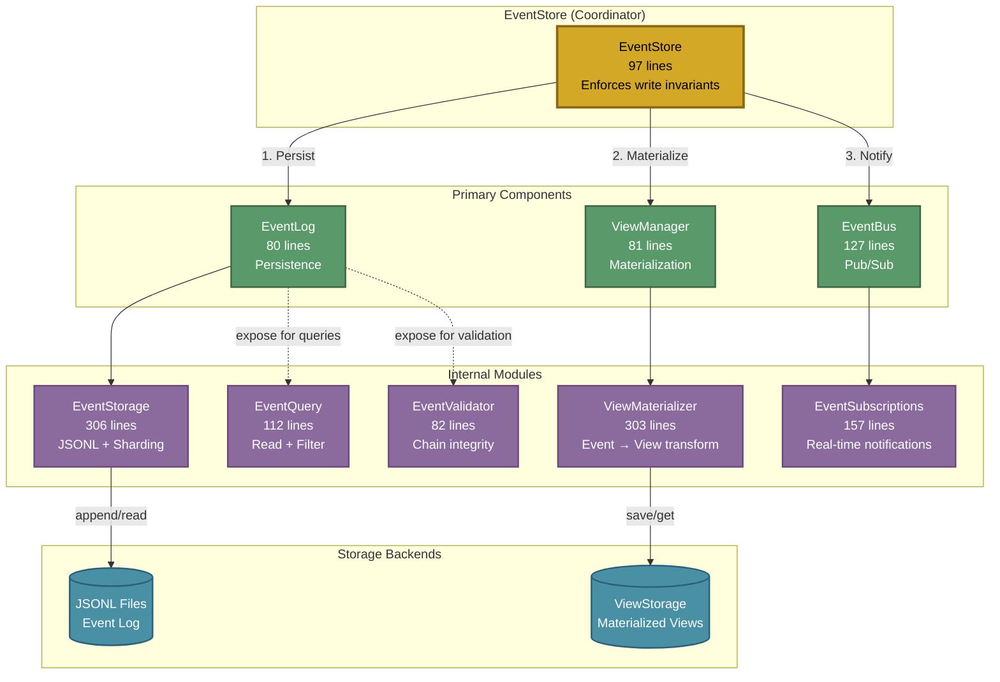
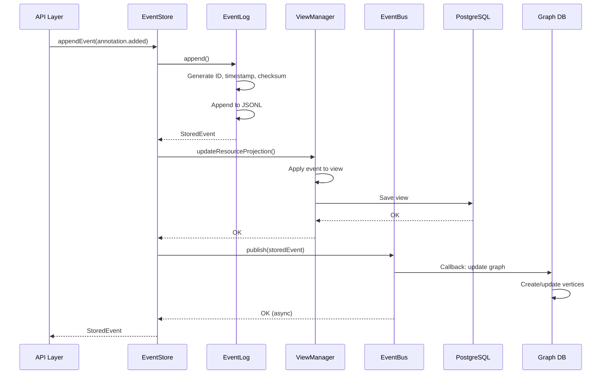
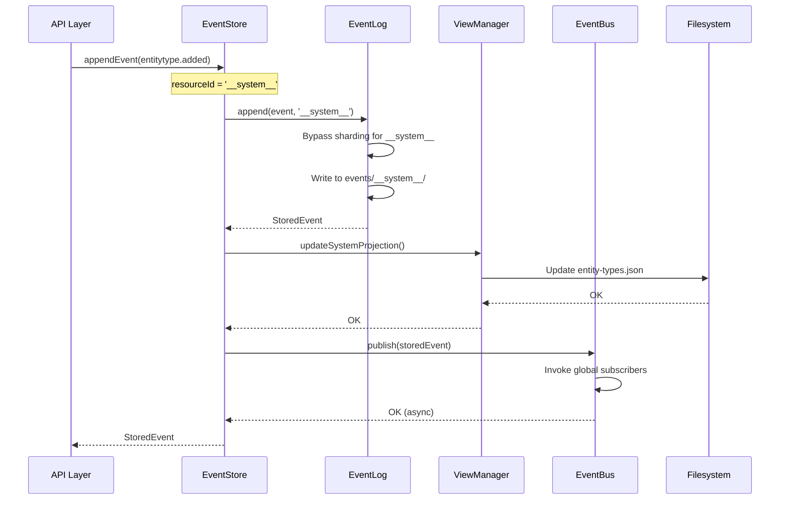

# Event Store Architecture

## Overview

Semiont's Event Store provides event sourcing for resource and annotation changes. It uses an immutable append-only event log as the source of truth, from which materialized views are built.

**Architecture Position**: The Event Store provides the event persistence and sourcing foundation. It works with the RepresentationStore (content storage), Projections (materialized state), and Graph (relationships). See [REPRESENTATION-STORE.md](./REPRESENTATION-STORE.md), [ARCHITECTURE.md](../ARCHITECTURE.md), and [W3C-WEB-ANNOTATION.md](../../specs/docs/W3C-WEB-ANNOTATION.md) for complete architectural details.

**Quick Navigation:**
- [Core Design Principles](#core-design-principles) - Why this architecture works
- [Component Architecture](#component-architecture) - Three focused components + orchestrator
- [Event Flow](#event-flow) - How events move through the system
- [Storage Format](#storage-format) - JSONL files and sharding
- [System Events](#system-events) - Special handling for system-level events
- [Common Operations](#common-operations) - Using the Event Store API

## Core Design Principles

### 1. Single Responsibility Principle

The Event Store architecture ruthlessly applies Single Responsibility Principle. The system is decomposed into focused components, each with one clear purpose:

**Primary Components**:

| Component | Lines | Single Responsibility |
|-----------|-------|----------------------|
| [EventLog](#eventlog) | 80 | Event persistence only (append, retrieve, query) |
| [EventBus](#eventbus) | 127 | Pub/sub notifications only (publish, subscribe) |
| [ViewManager](#viewmanager) | 81 | Projection updates only (resource and system) |
| [EventStore](#eventstore) | 97 | **Coordinate the above three** (write-path invariant enforcement) |

**Internal Modules** (wrapped by components):

| Module | Lines | Single Responsibility |
|--------|-------|----------------------|
| [EventStorage](#eventstorage) | 306 | File I/O, sharding, sequence tracking, checksums |
| [ViewMaterializer](#eventprojector) | 303 | Transform events → views |
| [EventSubscriptions](#eventsubscriptions) | 157 | Real-time pub/sub notifications |
| [EventValidator](#eventvalidator) | 82 | Chain integrity validation |
| [EventQuery](#eventquery) | 112 | Read operations with filtering |

**Why This Matters:**
- Each component/module has **one reason to change**
- Testing happens in isolation
- Components are independently usable
- No God Objects - every class earns its existence

### 2. The Coordinated Container Pattern

EventStore is not a monolith or a facade - it's a **Coordinated Container**:

```typescript
export class EventStore {
  readonly log: EventLog;              // Persistence component
  readonly bus: EventBus;              // Pub/sub component
  readonly views: ViewManager;  // Projection component

  async appendEvent(event): Promise<StoredEvent> {
    const stored = await this.log.append(event, resourceId);  // 1. Persist
    await this.views.update(...);                       // 2. Project
    await this.bus.publish(stored);                           // 3. Notify
    return stored;
  }
}
```

**Container**: Groups cohesive components (log, bus, views belong together conceptually)
**Coordinator**: Enforces write-path invariants (persist → project → notify is non-negotiable)
**Not a Facade**: Exposes components for independent read access

**The Pattern**:
- **Write Invariants**: Must be coordinated (enforced by `appendEvent()`)
- **Read Flexibility**: Can access components independently (via `log`, `bus`, `views`)
- **Honest Design**: Doesn't hide complexity, makes coordination explicit

### 3. Event Sourcing Architecture

The Event Store implements true event sourcing:

**Immutable Event Log**:
- All changes recorded as events
- Events NEVER modified or deleted
- Single source of truth for system state
- Cryptographically linked chain (each event contains prevEventHash)

**Materialized Projections**:
- Current state built from events
- Optimized for fast queries
- Can be rebuilt at any time from events
- Stored in filesystem using sharded JSON files
- See [PROJECTION.md](./PROJECTION.md) for complete view architecture

**Graph Database**:
- Relationship traversal and discovery
- Built from views
- See [GRAPH.md](./GRAPH.md) for implementation details

**Why This Matters:**
- Complete audit trail of all changes
- Time-travel debugging (replay events to any point)
- Enables eventual consistency patterns
- Allows multiple view types from same events

### 4. Zero Cruft Philosophy

**NO backward compatibility layers:**
- No singleton patterns
- No re-exported types (except public API boundary)
- No wrapper methods that add no value
- No aliases for deprecated APIs

**Direct fixes only:**
- Wrong? Fix it immediately
- Redundant? Delete it immediately
- Changed? Update all call sites

**Result**: EventStore is 97 lines of pure coordination logic. Nothing more.

## Component Architecture

### Component Diagram



**Key Relationships**:

- **EventStore** (coordinator) enforces the write-path invariant: persist → materialize → notify
- **Primary Components** are exposed as public properties (`log`, `bus`, `views`) for independent read access
- **Internal Modules** are wrapped by primary components (single responsibility, implementation detail)
- **Storage Backends** are abstracted by internal modules (JSONL for events, ViewStorage for views)

**Write Path** (coordinated):

1. EventStore → EventLog → EventStorage → JSONL files
2. EventStore → ViewManager → ViewMaterializer → ViewStorage
3. EventStore → EventBus → EventSubscriptions → Subscribers

**Read Path** (flexible):

- Direct access to any component: `eventStore.log.getEvents()`, `eventStore.bus.subscribe()`, `eventStore.views.getOrMaterialize()`
- EventQuery provides filtered reads over EventStorage
- EventValidator provides chain integrity checks

### EventStore

**Location**: [apps/backend/src/events/event-store.ts](../../apps/backend/src/events/event-store.ts)

**Purpose**: Orchestrates event sourcing operations across three focused components.

**Size**: 97 lines

**Pattern**: Coordinated Container (enforces write invariants, exposes read flexibility)

**Responsibilities**:
- Coordinate persistence → view → notification flow
- Handle system events vs resource events branching
- Enforce write-path invariants (can't skip view or notification)
- Provide public API surface

**Key Method**:
```typescript
async appendEvent(event: Omit<ResourceEvent, 'id' | 'timestamp'>): Promise<StoredEvent>
```

**Flow**:
1. Determine resourceId (use `'__system__'` for system events)
2. Call `log.append()` to persist event
3. Branch on system vs resource:
   - **System**: Update system views, publish to global subscribers
   - **Resource**: Update resource views, publish to resource subscribers
4. Return stored event

**Public API**:
```typescript
const eventStore = new EventStore(config, viewStorage, identifierConfig);

// Write: MUST use coordination (invariant enforced)
const stored = await eventStore.appendEvent({
  type: 'annotation.added',
  userId: 'user-123',
  resourceId: 'doc-456',
  payload: { annotation }
});

// Read: Access components independently (flexible)
const events = await eventStore.log.getEvents(resourceId);
const sub = eventStore.bus.subscribe(resourceId, callback);
const view = await eventStore.views.getResourceProjection(resourceId, events);
```

### EventLog

**Location**: [apps/backend/src/events/event-log.ts](../../apps/backend/src/events/event-log.ts)

**Purpose**: Event persistence layer (no pub/sub, no views).

**Size**: 80 lines

**Responsibilities**:
- Append events to storage (JSONL files)
- Retrieve events by resource
- Query events with filters
- Expose storage for read operations

**Does NOT Handle**:
- Pub/sub notifications (see EventBus)
- Projection updates (see ViewManager)

**Key Methods**:
```typescript
// Append event to log
async append(event: Omit<ResourceEvent, 'id' | 'timestamp'>, resourceId: ResourceId): Promise<StoredEvent>

// Get all events for a resource
async getEvents(resourceId: ResourceId): Promise<StoredEvent[]>

// Get all resource IDs
async getAllResourceIds(): Promise<ResourceId[]>

// Query events with filter
async queryEvents(resourceId: ResourceId, filter?: EventQuery): Promise<StoredEvent[]>
```

**Internal Structure**:
- Wraps EventStorage with clean API
- Exposes `storage` property for EventQuery access
- All methods use branded types from `@semiont/core`

**Usage**:
```typescript
const log = eventStore.log;

// Append (typically via EventStore.appendEvent)
const stored = await log.append(event, resourceId);

// Read
const events = await log.getEvents(resourceId);
const filtered = await log.queryEvents(resourceId, { eventTypes: ['annotation.added'] });
```

### EventBus

**Location**: [apps/backend/src/events/event-bus.ts](../../apps/backend/src/events/event-bus.ts)

**Purpose**: Event pub/sub layer (no persistence, no views).

**Size**: 127 lines

**Responsibilities**:
- Publish events to subscribers
- Manage subscriptions (resource-scoped and global)
- Convert ResourceId to ResourceUri internally
- Fire-and-forget notification pattern

**Does NOT Handle**:
- Event persistence (see EventLog)
- Projection updates (see ViewManager)

**Key Methods**:
```typescript
// Publish event to subscribers (resource or global)
async publish(event: StoredEvent): Promise<void>

// Subscribe to events for a specific resource
subscribe(resourceId: ResourceId, callback: EventCallback): EventSubscription

// Subscribe to all system-level events
subscribeGlobal(callback: EventCallback): EventSubscription

// Unsubscribe from resource events
unsubscribe(resourceId: ResourceId, callback: EventCallback): void

// Get subscriber count
getSubscriberCount(resourceId: ResourceId): number
```

**Internal Structure**:
- Wraps EventSubscriptions with ID-to-URI conversion
- Exposes `subscriptions` property for direct access
- Uses type guards: `isResourceEvent()`, `isSystemEvent()`

**Usage**:
```typescript
const bus = eventStore.bus;

// Publish (typically via EventStore.appendEvent)
await bus.publish(storedEvent);

// Subscribe
const sub = bus.subscribe(resourceId, async (event) => {
  console.log('Event:', event.event.type);
});

// Global subscribe
const globalSub = bus.subscribeGlobal(async (event) => {
  console.log('System event:', event.event.type);
});

// Cleanup
sub.unsubscribe();
```

### ViewManager

**Location**: [apps/backend/src/events/view-manager.ts](../../apps/backend/src/events/view-manager.ts)

**Purpose**: Projection management layer (no persistence, no pub/sub).

**Size**: 81 lines

**Responsibilities**:
- Update resource views from events
- Update system views (entity types)
- Rebuild views when needed
- Expose projector for direct access

**Does NOT Handle**:
- Event persistence (see EventLog)
- Pub/sub notifications (see EventBus)

**Key Methods**:
```typescript
// Update resource view with new event
async updateResourceProjection(
  resourceId: ResourceId,
  event: ResourceEvent,
  getAllEvents: () => Promise<StoredEvent[]>
): Promise<void>

// Update system-level view
async updateSystemProjection(eventType: string, payload: any): Promise<void>

// Get resource view (builds from events if needed)
async getResourceProjection(resourceId: ResourceId, events: StoredEvent[]): Promise<ResourceState | null>
```

**Internal Structure**:
- Wraps ViewMaterializer with clean API
- Exposes `projector` property for direct access
- Handles both resource and system views

**Usage**:
```typescript
const views = eventStore.views;

// Update (typically via EventStore.appendEvent)
await views.updateResourceProjection(resourceId, event, () => log.getEvents(resourceId));

// Get view
const state = await views.getResourceProjection(resourceId, events);
```

### EventStorage

**Location**: [apps/backend/src/events/storage/event-storage.ts](../../apps/backend/src/events/storage/event-storage.ts)

**Purpose**: Physical storage of events in JSONL files with sharding and sequence tracking.

**Size**: 306 lines

**Wrapped By**: EventLog

**Responsibilities**:
- Write events to disk (JSONL format)
- 4-hex sharding (65,536 shards) using jump consistent hash
- File rotation when maxEventsPerFile threshold reached
- Sequence number tracking per resource
- Last event hash tracking for chain integrity
- Event ID and timestamp generation
- Checksum calculation
- Read operations (get all events, read specific file)

**Key Methods**:
```typescript
// Append event - handles EVERYTHING for event creation
async appendEvent(event: Omit<ResourceEvent, 'id' | 'timestamp'>, resourceId: ResourceId): Promise<StoredEvent>

// Get all events for a resource
async getAllEvents(resourceId: ResourceId): Promise<StoredEvent[]>

// Calculate shard path for resourceId
getShardPath(resourceId: ResourceId): string
```

**Storage Structure**:
```
dataDir/
├── events/
│   ├── 00/
│   │   ├── 00/
│   │   │   └── resource-abc123/
│   │   │       ├── events-000001.jsonl
│   │   │       └── events-000002.jsonl
│   │   ├── 01/
│   │   │   └── resource-def456/
│   │   │       └── events-000001.jsonl
│   │   └── ...
│   ├── __system__/
│   │   └── events-000001.jsonl    (system events bypass sharding)
│   └── ...
```

**Access**:
```typescript
// Via EventLog
const storage = eventStore.log.storage;
const events = await storage.getAllEvents(resourceId);
```

### ViewMaterializer

**Location**: [apps/backend/src/events/views/event-projector.ts](../../apps/backend/src/events/views/event-projector.ts)

**Purpose**: Build and maintain views from events.

**Size**: 303 lines

**Wrapped By**: ViewManager

**Responsibilities**:
- Full view rebuild from event list
- Incremental view updates (apply single event)
- Resource metadata view (name, format, entityTypes, etc.)
- Annotation collection view (add/remove/update annotations)
- System views (entity types collection)
- Save views to filesystem and database

**Key Methods**:
```typescript
// Build view from events
async projectResource(events: StoredEvent[], resourceId: ResourceId): Promise<ResourceState | null>

// Apply single event incrementally
async updateProjectionIncremental(
  resourceId: ResourceId,
  event: ResourceEvent,
  getAllEvents: () => Promise<StoredEvent[]>
): Promise<void>

// Update system-level entity types view
async updateEntityTypesProjection(entityType: string): Promise<void>
```

**Access**:
```typescript
// Via ViewManager
const projector = eventStore.views.projector;
const view = await projector.projectResource(events, resourceId);
```

### EventSubscriptions

**Location**: [apps/backend/src/events/subscriptions/event-subscriptions.ts](../../apps/backend/src/events/subscriptions/event-subscriptions.ts)

**Purpose**: Real-time pub/sub notifications for resource-scoped and global events.

**Size**: 157 lines

**Wrapped By**: EventBus

**Responsibilities**:
- Resource-scoped subscriptions (per-resource callbacks)
- Global subscriptions (system-level events)
- Fire-and-forget notification pattern (non-blocking)
- Automatic cleanup of empty subscription sets
- Subscriber counting and debugging utilities

**Key Methods**:
```typescript
// Subscribe to events for specific resource (uses ResourceUri)
subscribe(resourceUri: ResourceUri, callback: EventCallback): EventSubscription

// Subscribe to all system-level events
subscribeGlobal(callback: EventCallback): EventSubscription

// Notify subscribers (called by EventBus)
async notifySubscribers(resourceUri: ResourceUri, event: StoredEvent): Promise<void>
async notifyGlobalSubscribers(event: StoredEvent): Promise<void>
```

**Access**:
```typescript
// Via EventBus (handles ID-to-URI conversion)
const subscriptions = eventStore.bus.subscriptions;
const sub = subscriptions.subscribe(resourceUri, callback);
```

### EventValidator

**Location**: [apps/backend/src/events/validation/event-validator.ts](../../apps/backend/src/events/validation/event-validator.ts)

**Purpose**: Validate event chain integrity using cryptographic checksums.

**Size**: 82 lines

**Responsibilities**:
- Validate complete event chains
- Verify prevEventHash links to previous event's checksum
- Verify event checksums against payloads
- Single event validation
- Event link validation

**Key Methods**:
```typescript
// Validate entire event chain for a resource
validateEventChain(events: StoredEvent[]): ValidationResult

// Validate single event's checksum
validateEventChecksum(event: StoredEvent): boolean

// Validate event links to previous event
validateEventLink(currentEvent: StoredEvent, previousEvent: StoredEvent | null): boolean
```

**Usage**:
```typescript
const validator = new EventValidator();
const result = validator.validateEventChain(events);

if (!result.valid) {
  console.error('Chain validation failed:', result.errors);
}
```

### EventQuery

**Location**: [apps/backend/src/events/query/event-query.ts](../../apps/backend/src/events/query/event-query.ts)

**Purpose**: Read operations with filtering for event queries.

**Size**: 112 lines

**Responsibilities**:
- Query events with filters (type, user, timestamp, sequence)
- Get all events for resource
- Get latest event
- Get event count
- Check if resource has events

**Key Methods**:
```typescript
// Query with filters
async queryEvents(query: EventQueryType): Promise<StoredEvent[]>

// Get all events (no filters)
async getResourceEvents(resourceId: ResourceId): Promise<StoredEvent[]>

// Get latest event
async getLatestEvent(resourceId: ResourceId): Promise<StoredEvent | null>
```

**Usage**:
```typescript
const query = new EventQuery(eventStore.log.storage);
const events = await query.queryEvents({
  resourceId,
  eventTypes: ['annotation.added'],
  limit: 10
});
```

## Event Flow

### Resource Event Flow



**Steps**:
1. **API** calls `eventStore.appendEvent()` with event payload
2. **EventStore** determines resourceId, delegates to EventLog
3. **EventLog** persists event via EventStorage (ID, timestamp, checksum, JSONL write)
4. **EventStore** updates view via ViewManager
5. **ViewManager** applies event to existing view or rebuilds from scratch
6. **ViewManager** saves updated view to PostgreSQL/filesystem
7. **EventStore** publishes event via EventBus
8. **EventBus** invokes subscribers (e.g., graph consumer updates graph database)
9. **EventStore** returns stored event to API

### System Event Flow



**System Events** (`entitytype.added`):
- No resourceId in payload
- EventStore uses `'__system__'` as resourceId
- Storage bypasses sharding (no hash needed)
- Stored at `dataDir/events/__system__/events-000001.jsonl`
- Updates system-level views (entity types collection)
- Publishes to **global** subscribers (not resource subscribers)

## Storage Format

### JSONL Event File

Events are stored in **JSON Lines** format (one JSON object per line):

```jsonl
{"event":{"id":"abc123","type":"resource.created","userId":"user-456","resourceId":"resource-789","timestamp":"2025-01-15T10:30:00Z","payload":{"name":"My Resource"}},"metadata":{"sequenceNumber":1,"streamPosition":0,"timestamp":"2025-01-15T10:30:00Z","checksum":"sha256abc"}}
{"event":{"id":"def456","type":"annotation.added","userId":"user-456","resourceId":"resource-789","timestamp":"2025-01-15T10:31:00Z","payload":{"annotation":{...}}},"metadata":{"sequenceNumber":2,"streamPosition":1,"timestamp":"2025-01-15T10:31:00Z","prevEventHash":"sha256abc","checksum":"sha256def"}}
```

**Format Benefits**:
- Append-only (no updates or deletes)
- Line-by-line streaming reads
- Easy to parse and validate
- Human-readable for debugging
- No complex indexing required

### Event Structure

**StoredEvent**:
```typescript
{
  event: ResourceEvent,      // The actual event
  metadata: EventMetadata    // Storage metadata
}
```

**ResourceEvent**:
```typescript
{
  id: string,                // UUID generated by EventStorage
  type: EventType,           // 'resource.created', 'annotation.added', etc.
  userId: string,            // Who triggered the event
  resourceId?: ResourceId,   // Which resource (undefined for system events)
  timestamp: string,         // ISO 8601 timestamp
  payload: Record<string, any>  // Event-specific data
}
```

**EventMetadata**:
```typescript
{
  sequenceNumber: number,    // Per-resource sequence (starts at 1)
  streamPosition: number,    // Position in file (for file rotation)
  timestamp: string,         // When stored (may differ from event.timestamp)
  prevEventHash?: string,    // SHA-256 of previous event (undefined for first event)
  checksum?: string          // SHA-256 of this event for integrity
}
```

### Event Types

**Resource Events**:
- `resource.created` - New resource created
- `resource.cloned` - Resource cloned from another
- `resource.archived` - Resource archived
- `resource.unarchived` - Resource unarchived
- `entitytag.added` - Entity type tag added to resource
- `entitytag.removed` - Entity type tag removed from resource

**Annotation Events**:
- `annotation.added` - New annotation added (W3C Web Annotation)
- `annotation.removed` - Annotation deleted
- `annotation.body.updated` - Annotation body modified (entity tags or references)

**System Events**:
- `entitytype.added` - New entity type registered globally

See [W3C-WEB-ANNOTATION.md](../specs/docs/W3C-WEB-ANNOTATION.md) for complete annotation event details.

## System Events

### Special Handling

System events have **no resourceId** because they represent global system state, not resource-specific changes.

**Problem**: EventStorage requires resourceId for sharding. System events have none.

**Solution**: Use `'__system__'` as a special resourceId that bypasses sharding.

**Implementation**:
```typescript
// In EventStore.appendEvent()
const resourceId: ResourceId | '__system__' = event.resourceId || '__system__';

// In EventStorage.getShardPath()
if (resourceId === '__system__' || !this.config.enableSharding) {
  return '';  // No shard directory
}
```

**Storage Location**:
```
dataDir/
├── events/
│   ├── __system__/
│   │   └── events-000001.jsonl    ← System events here
│   ├── 00/
│   │   └── 00/
│   │       └── resource-abc/
│   │           └── events-000001.jsonl
│   └── ...
```

**Benefits**:
- System events stored alongside resource events
- Same sequence tracking and validation
- Same JSONL format and rotation
- No special code paths for storage/retrieval
- Clean separation: `__system__` vs resource IDs

## Common Operations

### Initialization

```typescript
import { createEventStore } from './services/event-store-service';
import type { EnvironmentConfig } from '@semiont/core';

const config: EnvironmentConfig = {
  services: {
    filesystem: { path: '/path/to/data' },
    backend: { publicURL: 'http://localhost:4000' }
  }
};

const eventStore = await createEventStore(config);
```

### Appending Events

```typescript
// Resource event
const stored = await eventStore.appendEvent({
  type: 'annotation.added',
  userId: 'user-123',
  resourceId: resourceId('resource-456'),
  payload: {
    annotation: {
      id: 'anno-789',
      target: { source: 'resource-456', selector: {...} },
      body: [...]
    }
  }
});

// System event (no resourceId)
await eventStore.appendEvent({
  type: 'entitytype.added',
  userId: 'user-123',
  payload: { entityType: 'NewEntityType' }
});
```

### Reading Events

```typescript
import { EventQuery } from './events/query/event-query';

const query = new EventQuery(eventStore.log.storage);

// Get all events for resource
const events = await query.getResourceEvents(resourceId('resource-456'));

// Query with filters
const filtered = await query.queryEvents({
  resourceId: resourceId('resource-456'),
  eventTypes: ['annotation.added'],
  fromTimestamp: '2025-01-01T00:00:00Z',
  limit: 10
});

// Get latest event
const latest = await query.getLatestEvent(resourceId('resource-456'));
```

### Validating Event Chain

```typescript
import { EventValidator } from './events/validation/event-validator';

const validator = new EventValidator();
const events = await query.getResourceEvents(resourceId('resource-456'));
const result = validator.validateEventChain(events);

if (!result.valid) {
  console.error('Chain validation failed:', result.errors);
}
```

### Subscribing to Events

```typescript
// Resource-scoped subscription
const sub = eventStore.bus.subscribe(resourceId('resource-456'), (event) => {
  console.log('Resource event:', event.event.type);
});

// Global subscription
const globalSub = eventStore.bus.subscribeGlobal((event) => {
  console.log('System event:', event.event.type);
});

// Cleanup
sub.unsubscribe();
globalSub.unsubscribe();
```

### Rebuilding Projections

```typescript
const events = await eventStore.log.getEvents(resourceId('resource-456'));
const view = await eventStore.views.projector.projectResource(
  events,
  resourceId('resource-456')
);

console.log('Rebuilt view:', view);
```

## Integration Points

### API Layer

**Routes** append events via EventStore:
- [POST /api/resources](../../apps/backend/src/routes/resources/routes/post.ts) - `resource.created`
- [POST /api/resources/:id/annotations](../../apps/backend/src/routes/annotations/post.ts) - `annotation.added`
- [DELETE /api/resources/:id/annotations/:annoId](../../apps/backend/src/routes/annotations/delete.ts) - `annotation.removed`
- [PATCH /api/resources/:id/annotations/:annoId/body](../../apps/backend/src/routes/annotations/patch.ts) - `annotation.body.updated`

### Projection Storage

**Database** stores views built from events:
- See [DATABASE.md](./DATABASE.md) for PostgreSQL schema
- Projections stored in `resources` and `annotations` tables
- Rebuilt from events on demand or incrementally updated

### Graph Database

**Graph Consumer** subscribes to events and updates graph:
- See [GRAPH.md](./GRAPH.md) for graph database implementations
- Subscribes to resource events to maintain graph state
- Creates Resource and Annotation vertices from views
- Establishes BELONGS_TO and REFERENCES edges

### Server-Sent Events (SSE)

**Real-time Updates** via EventBus:
- [GET /api/resources/:id/events-stream](../../apps/backend/src/routes/resources/routes/events-stream.ts)
- Subscribes to resource events via `eventStore.bus.subscribe()`
- Streams events to connected clients
- See [W3C-WEB-ANNOTATION.md](../specs/docs/W3C-WEB-ANNOTATION.md) for event payload details

## Performance Considerations

### Sharding

**Why 4-hex sharding?**
- Uniform distribution across 65,536 shards
- Jump consistent hash ensures stable assignments
- Reduces filesystem bottlenecks (too many files in one directory)
- Scales to millions of resources

**Trade-offs**:
- Adds directory depth (2 levels: `ab/cd/`)
- Requires hash calculation on every write
- Benefits appear at scale (10K+ resources)

### File Rotation

**Why rotate at 10,000 events?**
- JSONL files grow indefinitely without rotation
- Large files slow down reads (must scan entire file)
- Rotation creates time-based checkpoints
- Enables selective reads (read last file only for recent events)

**File Naming Pattern**:
```
resource-abc123/
├── events-000001.jsonl  ← First 10,000 events
├── events-000002.jsonl  ← Next 10,000 events
└── events-000003.jsonl  ← Most recent events
```

**Trade-offs**:
- Adds complexity (multiple files per resource)
- Requires tracking current file and event count
- Benefits appear with high-volume resources (100+ events)
- Configurable via `maxEventsPerFile` config option

### Incremental Projections

**Why incremental updates?**
- Full rebuild from 10,000 events takes ~100ms
- Incremental update takes ~1ms
- 100x speedup for high-volume resources

**Trade-offs**:
- More complex logic (apply event to existing state)
- Requires existing view (fallback to rebuild)
- Small risk of drift (mitigated by validation)

## Testing

### Unit Tests

Test each component independently:

```typescript
// EventLog
it('should append event and track sequence', async () => {
  const log = new EventLog(config);
  const stored = await log.append(event, resourceId('resource-123'));
  expect(stored.metadata.sequenceNumber).toBe(1);
});

// EventBus
it('should notify subscribers', async () => {
  const bus = new EventBus({ identifierConfig });
  let notified = false;
  bus.subscribe(resourceId('resource-123'), () => { notified = true; });
  await bus.publish(storedEvent);
  expect(notified).toBe(true);
});

// ViewManager
it('should update view', async () => {
  const pm = new ViewManager(storage, config);
  await pm.updateResourceProjection(resourceId, event, getAllEvents);
  const view = await storage.getProjection(resourceId);
  expect(view.annotations.annotations).toHaveLength(1);
});
```

### Integration Tests

Test coordination between components:

```typescript
it('should coordinate persistence → view → notification', async () => {
  const eventStore = new EventStore(config, viewStorage, identifierConfig);

  let notified = false;
  eventStore.bus.subscribe(resourceId('resource-123'), () => {
    notified = true;
  });

  await eventStore.appendEvent({ type: 'annotation.added', ... });

  expect(notified).toBe(true);
  const view = await viewStorage.getProjection(resourceId('resource-123'));
  expect(view.annotations.annotations).toHaveLength(1);
});
```

See [TESTING.md](./TESTING.md) for complete testing strategy.

## Related Documentation

- [Architecture Overview](./ARCHITECTURE.md) - Complete system architecture
- [W3C Web Annotation](../../specs/docs/W3C-WEB-ANNOTATION.md) - Annotation event details and layer flow
- [Database Management](./DATABASE.md) - Layer 3 view storage
- [Graph Implementation](./GRAPH.md) - Layer 4 graph database
- [Testing Strategy](./TESTING.md) - Testing guidelines
