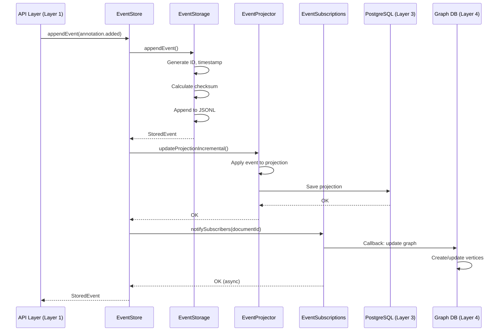
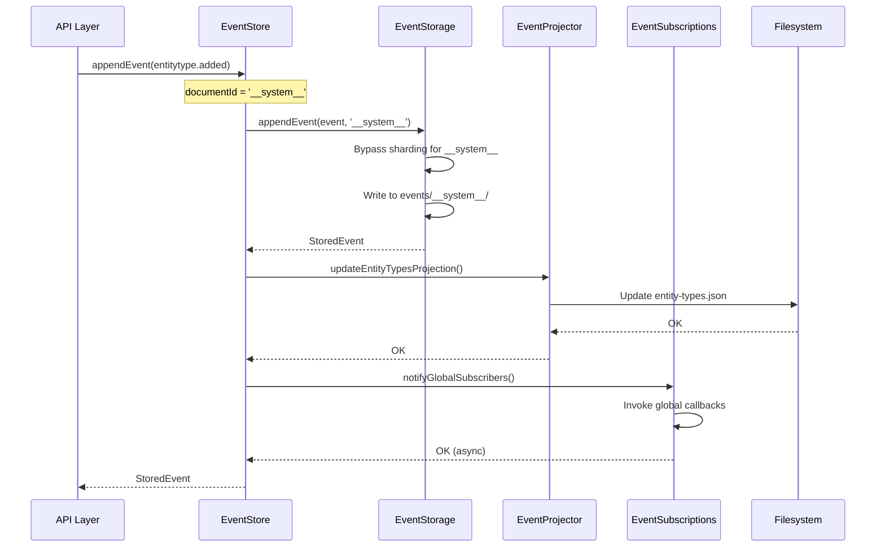

# Event Store Architecture

## Overview

Semiont's Event Store is a **Layer 2** component in the multi-layered architecture that provides event sourcing for document and annotation changes. It uses an immutable append-only event log as the source of truth, from which materialized projections (Layer 3) are built.

**Architecture Position**: The Event Store sits between Layer 1 (Content Storage) and Layer 3 (Projections/Database). Layer 1 stores raw document content, Layer 2 records what happened, and Layer 3 materializes current state. See [CONTENT-STORE.md](./CONTENT-STORE.md), [ARCHITECTURE.md](../ARCHITECTURE.md), and [W3C-WEB-ANNOTATION.md](../../specs/docs/W3C-WEB-ANNOTATION.md) for complete layer details.

**Quick Navigation:**
- [Core Design Principles](#core-design-principles) - Why this architecture works
- [Module Architecture](#module-architecture) - Six focused modules
- [Event Flow](#event-flow) - How events move through the system
- [Storage Format](#storage-format) - JSONL files and sharding
- [System Events](#system-events) - Special handling for system-level events
- [Common Operations](#common-operations) - Using the Event Store API

## Core Design Principles

### 1. Single Responsibility Principle

The Event Store architecture ruthlessly applies Single Responsibility Principle. The system is decomposed into six focused modules, each with one clear purpose:

| Module | Lines | Single Responsibility |
|--------|-------|----------------------|
| [EventStorage](#eventstorage) | 306 | File I/O, sharding, sequence tracking, checksums |
| [EventProjector](#eventprojector) | 303 | Transform events → projections (Layer 2 → Layer 3) |
| [EventSubscriptions](#eventsubscriptions) | 157 | Real-time pub/sub notifications |
| [EventValidator](#eventvalidator) | 82 | Chain integrity validation |
| [EventQuery](#eventquery) | 112 | Read operations with filtering |
| [EventStore](#eventstore) | 82 | **Coordinate the above five** |

**Why This Matters:**
- Each module has **one reason to change**
- Testing happens in isolation
- Extensions don't require modifying coordination logic
- No God Objects - every class earns its existence

### 2. Event Sourcing Architecture

The Event Store implements true event sourcing:

**Immutable Event Log (Layer 2)**:
- All changes recorded as events
- Events NEVER modified or deleted
- Single source of truth for system state
- Cryptographically linked chain (each event contains prevEventHash)

**Materialized Projections (Layer 3)**:
- Current state built from events
- Optimized for fast queries
- Can be rebuilt at any time from Layer 2
- Stored in filesystem using sharded JSON files
- See [PROJECTION.md](./PROJECTION.md) for complete Layer 3 architecture

**Graph Database (Layer 4)**:
- Relationship traversal and discovery
- Built from projections
- See [GRAPH.md](./GRAPH.md) for implementation details

**Why This Matters:**
- Complete audit trail of all changes
- Time-travel debugging (replay events to any point)
- Enables eventual consistency patterns
- Allows multiple projection types from same events

### 3. Zero Cruft Philosophy

**NO backward compatibility layers:**
- No singleton patterns
- No re-exported types (except public API boundary)
- No wrapper methods
- No aliases for deprecated APIs

**Direct fixes only:**
- Wrong? Fix it immediately
- Redundant? Delete it immediately
- Changed? Update all call sites

**Result**: EventStore is 82 lines of pure coordination logic. Nothing more.

## Module Architecture

### EventStore

**Location**: [apps/backend/src/events/event-store.ts](../apps/backend/src/events/event-store.ts)

**Purpose**: Orchestrates event sourcing operations across five specialized modules.

**Size**: 82 lines

**Responsibilities**:
- Coordinate storage → projection → notification flow
- Handle system events vs document events branching
- Provide public API surface

**Key Method**:
```typescript
async appendEvent(event: Omit<DocumentEvent, 'id' | 'timestamp'>): Promise<StoredEvent>
```

**Flow**:
1. Determine documentId (use `'__system__'` for system events)
2. Call `storage.appendEvent()` to persist event
3. Branch on system vs document:
   - **System**: Update system projections, notify global subscribers
   - **Document**: Update document projections, notify document subscribers
4. Return stored event

**Public API**:
```typescript
const eventStore = new EventStore(config, projectionStorage);

// Append event (coordination layer)
const stored = await eventStore.appendEvent({
  type: 'annotation.added',
  userId: 'user-123',
  documentId: 'doc-456',
  payload: { annotation }
});

// Access modules directly (no wrappers)
eventStore.storage.getAllEvents(documentId);
eventStore.projector.projectDocument(events, documentId);
eventStore.subscriptions.subscribe(documentId, callback);
```

### EventStorage

**Location**: [apps/backend/src/events/storage/event-storage.ts](../apps/backend/src/events/storage/event-storage.ts)

**Purpose**: Physical storage of events in JSONL files with sharding and sequence tracking.

**Size**: 306 lines

**Responsibilities**:
- Write events to disk (JSONL format)
- 4-hex sharding (65,536 shards) using jump consistent hash
- File rotation when maxEventsPerFile threshold reached
- Sequence number tracking per document
- Last event hash tracking for chain integrity
- Event ID and timestamp generation
- Checksum calculation
- Read operations (get all events, read specific file)

**Key Methods**:
```typescript
// Append event - handles EVERYTHING for event creation
async appendEvent(event: Omit<DocumentEvent, 'id' | 'timestamp'>, documentId: string): Promise<StoredEvent>

// Get all events for a document
async getAllEvents(documentId: string): Promise<StoredEvent[]>

// Calculate shard path for documentId
getShardPath(documentId: string): string
```

**Storage Structure**:
```
dataDir/
├── events/
│   ├── 00/
│   │   ├── 00/
│   │   │   └── doc-abc123/
│   │   │       ├── events-000001.jsonl
│   │   │       └── events-000002.jsonl
│   │   ├── 01/
│   │   │   └── doc-def456/
│   │   │       └── events-000001.jsonl
│   │   └── ...
│   ├── __system__/
│   │   └── events-000001.jsonl    (system events bypass sharding)
│   └── ...
```

**Sharding Details**:
- Uses jump consistent hash for uniform distribution ([`getShardPath`](../../apps/backend/src/events/storage/event-storage.ts#L58-L72))
- 4-hex sharding: `ab/cd/documentId/` (e.g., `00/a3/doc-123/`)
- 65,536 shards (2^16) by default
- System events use `'__system__'` and bypass sharding
- File rotation at 10,000 events per file (configurable via `maxEventsPerFile`)

**File Rotation Implementation** ([`writeEvent`](../../apps/backend/src/events/storage/event-storage.ts#L178-L210)):
- Counts events in current file: [`countEventsInFile()`](../../apps/backend/src/events/storage/event-storage.ts#L215-L236)
- When `eventCount >= maxEventsPerFile`, creates new file: [`createNewEventFile()`](../../apps/backend/src/events/storage/event-storage.ts#L297-L308)
- New files named sequentially: `events-000001.jsonl`, `events-000002.jsonl`, etc.
- Each document can have multiple event files across its lifetime

**Cryptographic Chain Integrity** ([`appendEvent`](../../apps/backend/src/events/storage/event-storage.ts#L135-L172)):
- Each event stores SHA-256 hash of previous event in `metadata.prevEventHash`
- First event has no `prevEventHash` (line 156: `prevEventHash || undefined`)
- Subsequent events: `prevEventHash = this.getLastEventHash(documentId)` (line 150)
- After writing: `this.setLastEventHash(documentId, metadata.checksum!)` (line 169)
- Validated by [`EventValidator.validateEventChain()`](../../apps/backend/src/events/validation/event-validator.ts#L34-L60)
- Tamper detection: chain breaks if any event is modified or events are reordered

**Sequence Tracking**:
- Per-document sequence numbers stored in memory
- Initialized from last event on first access
- Incremented atomically on each append: [`getNextSequenceNumber()`](../../apps/backend/src/events/storage/event-storage.ts#L384-L394)
- Used for ordering and validation

### EventProjector

**Location**: [apps/backend/src/events/projections/event-projector.ts](../apps/backend/src/events/projections/event-projector.ts)

**Purpose**: Build and maintain Layer 3 projections from Layer 2 events.

**Size**: 303 lines

**Responsibilities**:
- Full projection rebuild from event list
- Incremental projection updates (apply single event)
- Document metadata projection (name, format, entityTypes, etc.)
- Annotation collection projection (add/remove/update annotations)
- System projections (entity types collection)
- Save projections to Layer 3 (filesystem + database)

**Key Methods**:
```typescript
// Build projection from events (Layer 2 → Layer 3)
async projectDocument(events: StoredEvent[], documentId: string): Promise<DocumentState | null>

// Apply single event incrementally
async updateProjectionIncremental(
  documentId: string,
  event: DocumentEvent,
  getAllEvents: () => Promise<StoredEvent[]>
): Promise<void>

// Update system-level entity types projection
async updateEntityTypesProjection(entityType: string): Promise<void>
```

**Event Application**:
- `applyEventToDocument()`: Updates document metadata only
- `applyEventToAnnotations()`: Updates annotation collections only
- Events applied in sequence number order
- Incremental updates prefer existing projection + delta over full rebuild

**Projection Format** (DocumentState):
```typescript
{
  document: Document,           // Layer 3 metadata
  annotations: DocumentAnnotations  // Layer 3 annotation collection
}
```

**Integration**: Works with ProjectionManager (Layer 3) to persist projections to filesystem. See [PROJECTION.md](./PROJECTION.md) for complete Layer 3 architecture and [DATABASE.md](./DATABASE.md) for schema details.

### EventSubscriptions

**Location**: [apps/backend/src/events/subscriptions/event-subscriptions.ts](../apps/backend/src/events/subscriptions/event-subscriptions.ts)

**Purpose**: Real-time pub/sub notifications for document-scoped and global events.

**Size**: 157 lines

**Responsibilities**:
- Document-scoped subscriptions (per-document callbacks)
- Global subscriptions (system-level events)
- Fire-and-forget notification pattern (non-blocking)
- Automatic cleanup of empty subscription sets
- Subscriber counting and debugging utilities

**Key Methods**:
```typescript
// Subscribe to events for specific document
subscribe(documentId: string, callback: EventCallback): EventSubscription

// Subscribe to all system-level events
subscribeGlobal(callback: EventCallback): EventSubscription

// Notify subscribers (called by EventStore)
async notifySubscribers(documentId: string, event: StoredEvent): Promise<void>
async notifyGlobalSubscribers(event: StoredEvent): Promise<void>
```

**Subscription Pattern**:
```typescript
const subscription = eventStore.subscriptions.subscribe('doc-123', (event) => {
  console.log('New event:', event.event.type);
});

// Cleanup
subscription.unsubscribe();
```

**Fire-and-Forget**:
- Callbacks invoked asynchronously
- Errors in one callback don't affect others
- No blocking on slow subscribers
- Prevents hanging event emission

**Use Cases**:
- Real-time UI updates via SSE
- Graph database updates (Layer 4 consumer)
- External system integrations
- Audit logging

### EventValidator

**Location**: [apps/backend/src/events/validation/event-validator.ts](../apps/backend/src/events/validation/event-validator.ts)

**Purpose**: Validate event chain integrity using cryptographic checksums.

**Size**: 82 lines

**Responsibilities**:
- Validate complete event chains
- Verify prevEventHash links to previous event's checksum
- Verify event checksums against payloads
- Single event validation
- Event link validation

**Key Methods**:
```typescript
// Validate entire event chain for a document
validateEventChain(events: StoredEvent[]): ValidationResult

// Validate single event's checksum
validateEventChecksum(event: StoredEvent): boolean

// Validate event links to previous event
validateEventLink(currentEvent: StoredEvent, previousEvent: StoredEvent | null): boolean
```

**Validation Result**:
```typescript
{
  valid: boolean,
  errors: string[]  // Detailed error messages for debugging
}
```

**Chain Integrity**:
- First event: No prevEventHash
- Subsequent events: prevEventHash === previous.metadata.checksum
- Detects broken chains and tampered events
- Ensures immutability guarantee

**Checksum Algorithm**: SHA-256 hash of event payload (see [shard-utils.ts](../apps/backend/src/storage/shard-utils.ts))

### EventQuery

**Location**: [apps/backend/src/events/query/event-query.ts](../apps/backend/src/events/query/event-query.ts)

**Purpose**: Read operations with filtering for event queries.

**Size**: 112 lines

**Responsibilities**:
- Query events with filters (type, user, timestamp, sequence)
- Get all events for document
- Get latest event
- Get event count
- Check if document has events

**Key Methods**:
```typescript
// Query with filters
async queryEvents(query: EventQueryType): Promise<StoredEvent[]>

// Get all events (no filters)
async getDocumentEvents(documentId: string): Promise<StoredEvent[]>

// Get latest event
async getLatestEvent(documentId: string): Promise<StoredEvent | null>
```

**Query Filters**:
```typescript
{
  documentId: string;           // Required
  userId?: string;              // Filter by user
  eventTypes?: string[];        // Filter by event types
  fromTimestamp?: string;       // Filter by time range
  toTimestamp?: string;
  fromSequence?: number;        // Filter by sequence number
  limit?: number;               // Limit result count
}
```

**Example**:
```typescript
const query = createEventQuery(eventStore);

// Get last 10 annotation events
const events = await query.queryEvents({
  documentId: 'doc-123',
  eventTypes: ['annotation.added', 'annotation.removed'],
  limit: 10
});
```

## Event Flow

### Document Event Flow



**Steps**:
1. **API** calls `eventStore.appendEvent()` with event payload
2. **EventStore** determines documentId, calls storage
3. **EventStorage** creates complete event (ID, timestamp, checksum) and writes to disk
4. **EventStore** updates projection via EventProjector
5. **EventProjector** applies event to existing projection or rebuilds from scratch
6. **EventProjector** saves updated projection to PostgreSQL/filesystem
7. **EventStore** notifies subscribers via EventSubscriptions
8. **EventSubscriptions** invokes callbacks (e.g., graph consumer updates Layer 4)
9. **EventStore** returns stored event to API

### System Event Flow



**System Events** (`entitytype.added`):
- No documentId in payload
- EventStore uses `'__system__'` as documentId
- Storage bypasses sharding (no hash needed)
- Stored at `dataDir/events/__system__/events-000001.jsonl`
- Updates system-level projections (entity types collection)
- Notifies **global** subscribers (not document subscribers)

## Storage Format

### JSONL Event File

Events are stored in **JSON Lines** format (one JSON object per line):

```jsonl
{"event":{"id":"abc123","type":"document.created","userId":"user-456","documentId":"doc-789","timestamp":"2025-01-15T10:30:00Z","payload":{"name":"My Document"}},"metadata":{"sequenceNumber":1,"streamPosition":0,"timestamp":"2025-01-15T10:30:00Z","checksum":"sha256abc"}}
{"event":{"id":"def456","type":"annotation.added","userId":"user-456","documentId":"doc-789","timestamp":"2025-01-15T10:31:00Z","payload":{"annotation":{...}}},"metadata":{"sequenceNumber":2,"streamPosition":1,"timestamp":"2025-01-15T10:31:00Z","prevEventHash":"sha256abc","checksum":"sha256def"}}
```

**Format Benefits**:
- Append-only (no updates or deletes)
- Line-by-line streaming reads
- Easy to parse and validate
- Human-readable for debugging
- No complex indexing required

### Event Structure

**StoredEvent**:
```typescript
{
  event: DocumentEvent,      // The actual event
  metadata: EventMetadata    // Storage metadata
}
```

**DocumentEvent**:
```typescript
{
  id: string,                // UUID generated by EventStorage
  type: EventType,           // 'document.created', 'annotation.added', etc.
  userId: string,            // Who triggered the event
  documentId?: string,       // Which document (undefined for system events)
  timestamp: string,         // ISO 8601 timestamp
  payload: Record<string, any>  // Event-specific data
}
```

**EventMetadata** ([source](../../packages/core/src/events.ts#L169-L175)):
```typescript
{
  sequenceNumber: number,    // Per-document sequence (starts at 1)
  streamPosition: number,    // Position in file (for file rotation)
  timestamp: string,         // When stored (may differ from event.timestamp)
  prevEventHash?: string,    // SHA-256 of previous event (undefined for first event)
  checksum?: string          // SHA-256 of this event for integrity
}
```

**Chain Integrity Details**:
- First event in stream: `prevEventHash` is `undefined`
- All subsequent events: `prevEventHash` equals previous event's `checksum`
- Validation: [`EventValidator.validateEventLink()`](../../apps/backend/src/events/validation/event-validator.ts#L76-L83) checks chain
- Breaking the chain: modifying any event or reordering events invalidates all subsequent events

### Event Types

**Document Events**:
- `document.created` - New document created
- `document.cloned` - Document cloned from another
- `document.archived` - Document archived
- `document.unarchived` - Document unarchived
- `entitytag.added` - Entity type tag added to document
- `entitytag.removed` - Entity type tag removed from document

**Annotation Events**:
- `annotation.added` - New annotation added (W3C Web Annotation)
- `annotation.removed` - Annotation deleted
- `annotation.body.updated` - Annotation body modified (entity tags or references)

**System Events**:
- `entitytype.added` - New entity type registered globally

See [W3C-WEB-ANNOTATION.md](../specs/docs/W3C-WEB-ANNOTATION.md) for complete annotation event details.

## System Events

### Special Handling

System events have **no documentId** because they represent global system state, not document-specific changes.

**Problem**: EventStorage requires documentId for sharding. System events have none.

**Solution**: Use `'__system__'` as a special documentId that bypasses sharding.

**Implementation**:
```typescript
// In EventStore.appendEvent()
const documentId = event.documentId || '__system__';

// In EventStorage.getShardPath()
if (documentId === '__system__' || !this.config.enableSharding) {
  return '';  // No shard directory
}
```

**Storage Location**:
```
dataDir/
├── events/
│   ├── __system__/
│   │   └── events-000001.jsonl    ← System events here
│   ├── 00/
│   │   └── 00/
│   │       └── doc-abc/
│   │           └── events-000001.jsonl
│   └── ...
```

**Benefits**:
- System events stored alongside document events
- Same sequence tracking and validation
- Same JSONL format and rotation
- No special code paths for storage/retrieval
- Clean separation: `__system__` vs document IDs

## Common Operations

### Initialization

```typescript
import { EventStore } from './events/event-store';
import { ProjectionStorage } from './storage/projection-storage';

const config = {
  dataDir: '/path/to/data',
  maxEventsPerFile: 10000,
  enableSharding: true,
  numShards: 65536,
  enableCompression: true
};

const projectionStorage = new ProjectionStorage(config.dataDir);
const eventStore = new EventStore(config, projectionStorage);
```

### Appending Events

```typescript
// Document event
const stored = await eventStore.appendEvent({
  type: 'annotation.added',
  userId: 'user-123',
  documentId: 'doc-456',
  payload: {
    annotation: {
      id: 'anno-789',
      target: { source: 'doc-456', selector: {...} },
      body: [...]
    }
  }
});

// System event (no documentId)
await eventStore.appendEvent({
  type: 'entitytype.added',
  userId: 'user-123',
  payload: { tag: 'NewEntityType' }
});
```

### Reading Events

```typescript
const query = new EventQuery(eventStore.storage);

// Get all events for document
const events = await query.getDocumentEvents('doc-456');

// Query with filters
const filtered = await query.queryEvents({
  documentId: 'doc-456',
  eventTypes: ['annotation.added'],
  fromTimestamp: '2025-01-01T00:00:00Z',
  limit: 10
});

// Get latest event
const latest = await query.getLatestEvent('doc-456');
```

### Validating Event Chain

```typescript
const validator = new EventValidator();

const events = await query.getDocumentEvents('doc-456');
const result = validator.validateEventChain(events);

if (!result.valid) {
  console.error('Chain validation failed:', result.errors);
}
```

### Subscribing to Events

```typescript
// Document-scoped subscription
const sub = eventStore.subscriptions.subscribe('doc-456', (event) => {
  console.log('Document event:', event.event.type);
});

// Global subscription
const globalSub = eventStore.subscriptions.subscribeGlobal((event) => {
  console.log('System event:', event.event.type);
});

// Cleanup
sub.unsubscribe();
globalSub.unsubscribe();
```

### Rebuilding Projections

```typescript
const events = await eventStore.storage.getAllEvents('doc-456');
const projection = await eventStore.projector.projectDocument(events, 'doc-456');

console.log('Rebuilt projection:', projection);
```

## Integration Points

### API Layer (Layer 1)

**Routes** append events via EventStore:
- [POST /api/documents](../apps/backend/src/routes/documents/post.ts) - `document.created`
- [POST /api/documents/:id/annotations](../apps/backend/src/routes/annotations/post.ts) - `annotation.added`
- [DELETE /api/documents/:id/annotations/:annoId](../apps/backend/src/routes/annotations/delete.ts) - `annotation.removed`
- [PATCH /api/documents/:id/annotations/:annoId/body](../apps/backend/src/routes/annotations/patch.ts) - `annotation.body.updated`

### Projection Layer (Layer 3)

**Database** stores projections built from events:
- See [DATABASE.md](./DATABASE.md) for PostgreSQL schema
- Projections stored in `documents` and `annotations` tables
- Rebuilt from events on demand or incrementally updated

### Graph Layer (Layer 4)

**Graph Consumer** subscribes to events and updates graph:
- See [GRAPH.md](./GRAPH.md) for graph database implementations
- Subscribes to document events to maintain graph state
- Creates Document and Annotation vertices from projections
- Establishes BELONGS_TO and REFERENCES edges

### Server-Sent Events (SSE)

**Real-time Updates** via EventSubscriptions:
- [GET /api/documents/:id/events-stream](../apps/backend/src/routes/events/events-stream.ts)
- Subscribes to document events
- Streams events to connected clients
- See [W3C-WEB-ANNOTATION.md](../specs/docs/W3C-WEB-ANNOTATION.md) for event payload details

## Performance Considerations

### Sharding

**Why 4-hex sharding?**
- Uniform distribution across 65,536 shards
- Jump consistent hash ensures stable assignments
- Reduces filesystem bottlenecks (too many files in one directory)
- Scales to millions of documents

**Trade-offs**:
- Adds directory depth (2 levels: `ab/cd/`)
- Requires hash calculation on every write
- Benefits appear at scale (10K+ documents)

### File Rotation

**Why rotate at 10,000 events?**
- JSONL files grow indefinitely without rotation
- Large files slow down reads (must scan entire file)
- Rotation creates time-based checkpoints
- Enables selective reads (read last file only for recent events)

**Implementation** ([`EventStorage.writeEvent`](../../apps/backend/src/events/storage/event-storage.ts#L178-L210)):
1. Get current event files for document: [`getEventFiles()`](../../apps/backend/src/events/storage/event-storage.ts#L238-L260)
2. Count events in latest file: [`countEventsInFile()`](../../apps/backend/src/events/storage/event-storage.ts#L215-L236)
3. If `eventCount >= maxEventsPerFile` (default 10,000):
   - Create new file: [`createNewEventFile()`](../../apps/backend/src/events/storage/event-storage.ts#L297-L308)
   - New file gets incremented number: `events-000002.jsonl`, `events-000003.jsonl`, etc.
4. Append event to target file (current or newly created)

**File Naming Pattern**:
```
doc-abc123/
├── events-000001.jsonl  ← First 10,000 events
├── events-000002.jsonl  ← Next 10,000 events
└── events-000003.jsonl  ← Most recent events
```

**Reading Rotated Files**:
- [`getAllEvents()`](../../apps/backend/src/events/storage/event-storage.ts#L262-L295) reads ALL files in order
- Events across files maintain sequential `sequenceNumber`
- `prevEventHash` chain works across file boundaries

**Trade-offs**:
- Adds complexity (multiple files per document)
- Requires tracking current file and event count
- Benefits appear with high-volume documents (100+ events)
- Configurable via `maxEventsPerFile` config option

### Incremental Projections

**Why incremental updates?**
- Full rebuild from 10,000 events takes ~100ms
- Incremental update takes ~1ms
- 100x speedup for high-volume documents

**Trade-offs**:
- More complex logic (apply event to existing state)
- Requires existing projection (fallback to rebuild)
- Small risk of drift (mitigated by validation)

### Cryptographic Chain Integrity

**Purpose**: Detect tampering, corruption, or unauthorized modifications to event history

**How It Works** ([`EventStorage.appendEvent`](../../apps/backend/src/events/storage/event-storage.ts#L135-L172)):
1. **First Event**: No `prevEventHash` (line 156: `prevEventHash || undefined`)
2. **Subsequent Events**:
   - Get previous event's checksum: `prevEventHash = this.getLastEventHash(documentId)` (line 150)
   - Calculate current event's checksum: `checksum: sha256(completeEvent)` (line 157)
   - Store both in metadata
   - Update tracking: `this.setLastEventHash(documentId, metadata.checksum!)` (line 169)

**Validation** ([`EventValidator.validateEventChain`](../../apps/backend/src/events/validation/event-validator.ts#L34-L60)):
```typescript
// For each event (except first):
if (curr.metadata.prevEventHash !== prev.metadata.checksum) {
  // Chain is broken - tampering detected
}
```

**What This Detects**:
- **Event modification**: Changing any field breaks the checksum
- **Event deletion**: Missing event breaks the chain
- **Event reordering**: prevEventHash won't match previous event
- **Event insertion**: New event won't have correct prevEventHash

**Hash Algorithm**: SHA-256 via [`sha256()`](../../apps/backend/src/storage/shard-utils.ts) utility

**Limitations**:
- In-memory tracking (not persisted across server restarts)
- No protection against coordinated multi-event tampering (would require signatures)
- Future: Add optional cryptographic signatures for federation ([`EventSignature`](../../packages/core/src/events.ts#L178-L183))

## Testing

### Unit Tests

Test each module independently:

```typescript
// EventStorage
it('should append event and track sequence', async () => {
  const storage = new EventStorage(config);
  const stored = await storage.appendEvent(event, 'doc-123');
  expect(stored.metadata.sequenceNumber).toBe(1);
});

// EventProjector
it('should apply annotation.added event', () => {
  const projector = new EventProjector(storage, config);
  const projection = projector.projectDocument(events, 'doc-123');
  expect(projection.annotations.annotations).toHaveLength(1);
});

// EventValidator
it('should detect broken chain', () => {
  const validator = new EventValidator();
  events[1].metadata.prevEventHash = 'wrong';
  const result = validator.validateEventChain(events);
  expect(result.valid).toBe(false);
});
```

See [TESTING.md](./TESTING.md) for complete testing strategy.

### Integration Tests

Test coordination between modules:

```typescript
it('should coordinate storage → projection → notification', async () => {
  const eventStore = new EventStore(config, projectionStorage);

  let notified = false;
  eventStore.subscriptions.subscribe('doc-123', () => {
    notified = true;
  });

  await eventStore.appendEvent({ type: 'annotation.added', ... });

  expect(notified).toBe(true);
  const projection = await projectionStorage.getProjection('doc-123');
  expect(projection.annotations.annotations).toHaveLength(1);
});
```

## Troubleshooting

### Chain Validation Errors

**Symptom**: `validateEventChain()` returns errors

**Causes**:
- Events written out of order
- Concurrent writes without locking
- Manual event file edits
- Storage corruption

**Solution**:
```typescript
const validator = new EventValidator();
const events = await query.getDocumentEvents('doc-123');
const result = validator.validateEventChain(events);

if (!result.valid) {
  console.error('Validation errors:', result.errors);
  // Option 1: Rebuild projections from valid events
  // Option 2: Investigate storage corruption
  // Option 3: Restore from backup
}
```

### Projection Drift

**Symptom**: Projection doesn't match events

**Causes**:
- Incremental update bug
- Projection update failure (partial write)
- Event loss

**Solution**:
```typescript
// Force full rebuild
const events = await eventStore.storage.getAllEvents('doc-123');
const projection = await eventStore.projector.projectDocument(events, 'doc-123');
await projectionStorage.saveProjection('doc-123', projection);
```

### Missing Events

**Symptom**: Event count doesn't match expectations

**Causes**:
- Write failure (disk full, permission denied)
- File rotation bug
- Sharding misconfiguration

**Solution**:
```bash
# Check filesystem
du -sh dataDir/events/

# Count events manually
find dataDir/events -name '*.jsonl' -exec wc -l {} +

# Validate all event files
for file in $(find dataDir/events -name '*.jsonl'); do
  jq -c . "$file" > /dev/null || echo "Invalid JSON in $file"
done
```

## Future Enhancements

### Compression

**Goal**: Reduce storage footprint for rotated files

**Implementation**:
- Gzip rotated files (events-000001.jsonl → events-000001.jsonl.gz)
- Transparent decompression on read
- Configurable via `enableCompression` config option

**Trade-offs**:
- Slower reads for historical events
- Better storage efficiency (5-10x reduction)

### Event Replay

**Goal**: Rebuild all projections from events (disaster recovery)

**Implementation**:
```typescript
async function rebuildAllProjections() {
  const documentIds = await eventStore.storage.getAllDocumentIds();
  for (const documentId of documentIds) {
    const events = await eventStore.storage.getAllEvents(documentId);
    await eventStore.projector.projectDocument(events, documentId);
  }
}
```

**Use Cases**:
- Projection corruption recovery
- Schema migration (change projection format)
- Adding new projection types

### Event Archival

**Goal**: Move old events to cold storage (S3, Glacier)

**Implementation**:
- Archive events older than N days
- Keep recent events in filesystem
- Lazy load from archive on demand

**Trade-offs**:
- Reduced storage costs
- Slower access to historical events
- Added complexity

## Related Documentation

- [Architecture Overview](./ARCHITECTURE.md) - Complete system architecture
- [W3C Web Annotation](../specs/docs/W3C-WEB-ANNOTATION.md) - Annotation event details and layer flow
- [Database Management](./DATABASE.md) - Layer 3 projection storage
- [Graph Implementation](./GRAPH.md) - Layer 4 graph database
- [Testing Strategy](./TESTING.md) - Testing guidelines
