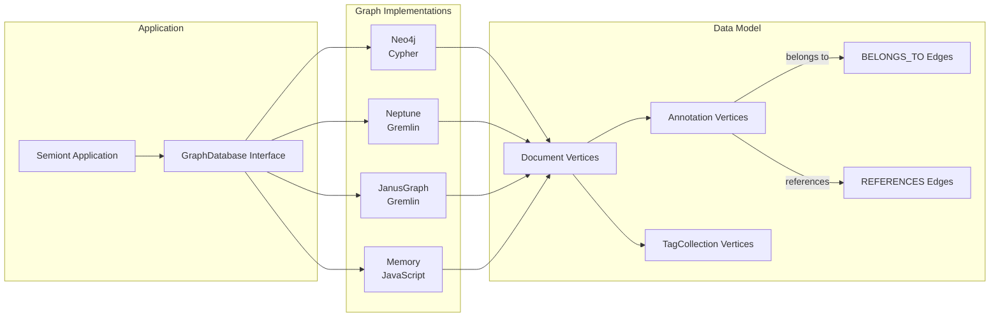
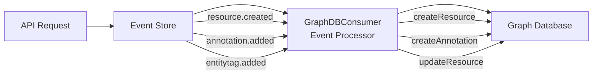

# Graph Database Implementation Guide

## Overview

Semiont uses a graph database to model relationships between documents and annotations. The graph stores W3C-compliant Web Annotations with entity type tags and document links, enabling rich knowledge graph traversal and discovery.

The system supports four different graph database implementations that share a common pattern while accommodating technology-specific differences. All implementations reconstruct W3C-compliant multi-body annotations from graph relationships.

For complete details on how data flows through the system:

- [REPRESENTATION-STORE.md](./REPRESENTATION-STORE.md) - Raw document content storage
- [EVENT-STORE.md](./EVENT-STORE.md) - Event sourcing architecture
- [PROJECTION.md](./PROJECTION.md) - Projection storage and queries
- [W3C-WEB-ANNOTATION.md](../specs/docs/W3C-WEB-ANNOTATION.md) - Complete annotation flow (UI, API, Event Store, Projection, Graph)

## Graph Architecture



## Event-Driven Projection (Event Store → Graph)

The Graph is an **event-sourced projection** of Event Store events. The `GraphDBConsumer` subscribes to resource events and applies them to the graph database in real-time.

### Event Flow



### GraphDBConsumer Architecture

The consumer processes events with the following guarantees:

1. **Sequential Processing per Resource**: Events for the same resource are processed in order
2. **System Event Routing**: System-level events (e.g., `entitytype.added`) are processed immediately
3. **Fail-Fast**: Errors propagate to prevent silent data corruption
4. **Idempotent Operations**: Repeated events produce the same result

**Event Handlers:**

| Event Type | Handler | GraphDB Operation |
|------------|---------|-------------------|
| `resource.created` | `handleResourceCreated()` | Creates Document vertex with W3C ResourceDescriptor |
| `resource.cloned` | `handleResourceCloned()` | Creates Document vertex (clone) |
| `resource.archived` | `handleResourceArchived()` | Updates Document.archived = true |
| `resource.unarchived` | `handleResourceUnarchived()` | Updates Document.archived = false |
| `annotation.added` | `handleAnnotationAdded()` | Creates Annotation vertex |
| `annotation.removed` | `handleAnnotationRemoved()` | Deletes Annotation vertex |
| `annotation.body.updated` | `handleAnnotationBodyUpdated()` | Updates Annotation body array |
| `entitytag.added` | `handleEntityTagAdded()` | Adds entity type to Document |
| `entitytag.removed` | `handleEntityTagRemoved()` | Removes entity type from Document |
| `entitytype.added` | `handleEntityTypeAdded()` | Adds to global TagCollection |

**Key Code:**
- [graph-consumer.ts](../../apps/backend/src/events/consumers/graph-consumer.ts) - Event consumer implementation
- [event-store.ts](../../apps/backend/src/events/event-store.ts) - Event routing with type discriminators

**Type Discriminators:**

Events are routed using explicit type guards instead of implicit field checks:

```typescript
// System-level events (no resource scope)
if (isSystemEvent(event)) {
  await subscriptions.notifyGlobalSubscribers(event);
}

// Resource-scoped events (require resourceId)
if (isResourceScopedEvent(event)) {
  await subscriptions.notifySubscribers(resourceId, event);
}
```

This replaces the brittle pattern of checking `if (!resourceId)`.

## Common Graph Pattern

### Vertex Types

All implementations use three primary vertex types:

1. **Document** - Represents a document in the system
   - Immutable after creation (only archiving allowed)
   - Contains metadata, content type, entity types, and provenance information
   - No ID prefixes - vertex label identifies type

2. **Annotation** - Represents a W3C Web Annotation (highlight or reference within a document)
   - Can be updated (unlike documents)
   - W3C-compliant with multi-body arrays combining entity type tags and document links
   - Links source document to optional target document via body SpecificResource
   - Entity types stored as [:TAGGED_AS] relationships to EntityType vertices (see [W3C-WEB-ANNOTATION.md](../specs/docs/W3C-WEB-ANNOTATION.md))

3. **TagCollection** - Stores collections of entity types and reference types
   - Two collections: 'entity-types' and 'reference-types'
   - Append-only collections for maintaining controlled vocabularies

### Edge Types

All implementations use consistent edge labels:

1. **BELONGS_TO** - Links an Annotation to its source Document
   - Direction: `(Annotation)-[:BELONGS_TO]->(Document)`
   - Every annotation must belong to exactly one document

2. **REFERENCES** - Links an Annotation to its target Document (if resolved)
   - Direction: `(Annotation)-[:REFERENCES]->(Document)`
   - Only present for resolved annotations (references)

### Data Model Principles

1. **Document Immutability**: Documents are never updated, only cloned with proper provenance tracking
2. **Type Safety**: All required fields must be present; no defensive defaults for mandatory data
3. **Vertex Labels for Type Identification**: Use graph-native vertex labels instead of ID prefixes
4. **Consistent Edge Directions**: Annotations point TO documents, not vice versa
5. **W3C Compliance**: All annotations follow W3C Web Annotation Data Model. Multi-body arrays are reconstructed from entity type relationships ([:TAGGED_AS] edges to EntityType vertices) and document link properties (source in body). See [W3C-WEB-ANNOTATION.md](../specs/docs/W3C-WEB-ANNOTATION.md) for full specification details.

## Implementation-Specific Details

### Neo4j

**Technology**: Native graph database with Cypher query language

**Key Characteristics**:
- Native array support for properties (entityTypes, referenceTags)
- ACID transactions with explicit session management
- Cypher queries for all operations
- Direct array storage without serialization

**Connection**:
```typescript
neo4j://localhost:7687
```

**Unique Features**:
- `MERGE` operations for upsert behavior
- Native indexing on properties
- Built-in shortest path algorithms
- Transaction rollback on errors

### Neptune (AWS)

**Technology**: Managed graph database supporting both Gremlin and SPARQL

**Key Characteristics**:
- JSON serialization for array properties
- Gremlin traversal API
- Cardinality specifications for multi-valued properties
- Property value unwrapping required (Neptune wraps values)

**Connection**:
```typescript
wss://[cluster-endpoint]:8182/gremlin
```

**Unique Features**:
- Managed service with automatic backups
- Read replicas for scaling
- IAM authentication support
- Special handling for property arrays (returns `[{value: ...}]` format)

### JanusGraph

**Technology**: Distributed graph database with pluggable storage/index backends

**Key Characteristics**:
- JSON serialization for array properties
- Gremlin traversal API
- Configurable storage backend (Cassandra, HBase, BerkeleyDB)
- Configurable index backend (Elasticsearch, Solr, Lucene)

**Connection**:
```typescript
ws://localhost:8182/gremlin
```

**Unique Features**:
- Horizontal scalability
- Mixed indexes for complex queries
- Schema management capabilities
- Vertex-centric indices for large datasets

### Memory (Development)

**Technology**: In-memory JavaScript implementation

**Key Characteristics**:
- JavaScript Map structures for storage
- Direct object references (no serialization)
- No actual graph traversals (uses array operations)
- Synchronous operations wrapped in Promises

**Unique Features**:
- Zero setup required
- Instant operations
- Perfect for testing
- No persistence

## Property Storage Patterns

### Array Properties

Different databases handle array properties differently:

| Database | Storage Method | Retrieval Method |
|----------|---------------|------------------|
| Neo4j | Native arrays | Direct access |
| Neptune | JSON strings | Parse after retrieval |
| JanusGraph | JSON strings | Parse after retrieval |
| Memory | JavaScript arrays | Direct access |

### Example: entityTypes Storage

```typescript
// Neo4j - Native array
CREATE (d:Document { entityTypes: ['Person', 'Organization'] })

// Neptune/JanusGraph - JSON string
g.addV('Document').property('entityTypes', '["Person","Organization"]')

// Memory - JavaScript array
document.entityTypes = ['Person', 'Organization'];
```

## Tag Collections Implementation

### Persistent Storage (Neo4j, Neptune, JanusGraph)

These implementations store tag collections as TagCollection vertices:

```typescript
// Structure
TagCollection {
  type: 'entity-types' | 'reference-types'
  tags: string[] // Stored as JSON in Neptune/JanusGraph
}
```

**Initialization Process**:
1. Load existing collections from database
2. Merge with DEFAULT_ENTITY_TYPES and DEFAULT_REFERENCE_TYPES
3. Cache in memory for performance
4. Persist merged collection back to database

### In-Memory Storage (Memory)

Uses JavaScript Sets initialized from defaults:

```typescript
private entityTypesCollection: Set<string>
private referenceTypesCollection: Set<string>
```

## Query Patterns

### Finding Annotations for a Document

**Neo4j**:
```cypher
MATCH (a:Annotation)
WHERE a.target.source = $resourceId
RETURN a
```

**Gremlin (Neptune/JanusGraph)**:
```javascript
g.V().hasLabel('Annotation')
  .has('target.source', resourceId)
```

**Memory**:
```typescript
Array.from(annotations.values())
  .filter(ann => ann.target?.source === resourceId)
```

### Finding Document Connections

**Neo4j**:
```cypher
MATCH (d:Document {id: $documentId})
OPTIONAL MATCH (d)<-[:BELONGS_TO]-(a:Annotation)-[:REFERENCES]->(other:Document)
RETURN other, a
```

**Gremlin**:
```javascript
g.V().hasLabel('Document').has('id', documentId)
  .inE('BELONGS_TO').outV()
  .outE('REFERENCES').inV()
  .path()
```

## ID Generation

All implementations use custom UUID generation without prefixes:

```typescript
generateId(): string {
  return uuidv4().replace(/-/g, '').substring(0, 12);
}
```

- No prefixes (previously used 'doc_', 'sel_')
- 12-character alphanumeric IDs
- Vertex labels provide type identification
- Supports import/export scenarios

## Error Handling

### Event Processing Errors

The GraphDBConsumer handles errors at different levels:

1. **Transient Errors** (network, GraphDB down):
   - Events remain in event store (source of truth)
   - Consumer can be restarted to replay events
   - Use `rebuildResource()` or `rebuildAll()` for recovery

2. **Data Errors** (missing annotation, invalid payload):
   - Logged with full stack trace via `console.error()`
   - Currently swallowed to prevent consumer crashes
   - ⚠️ Can lead to GraphDB inconsistencies

**Recovery Operations:**

```typescript
// Rebuild single resource from events
await consumer.rebuildResource(resourceId);

// Nuclear option: rebuild entire GraphDB
await consumer.rebuildAll();
```

**Health Monitoring:**

```typescript
const health = consumer.getHealthMetrics();
// {
//   subscriptions: 42,
//   lastProcessed: { 'doc-123': 15, 'doc-456': 23 },
//   processing: ['doc-789']
// }
```

## Best Practices

1. **Always Read Before Update**: Use the Read tool before modifying files
2. **Trace Type Errors**: Fix type errors at source rather than adding defensive defaults
3. **Use Nullish Coalescing**: Use `??` for optional fields that could be falsy
4. **Batch Operations**: Use bulk operations when creating multiple annotations
5. **Cache Tag Collections**: Load once and cache in memory for performance
6. **Handle Technology Differences**: Account for property wrapping in Neptune, JSON serialization, etc.
7. **Event-Driven Updates**: Never write directly to GraphDB - emit events instead
8. **Type Discriminators**: Use `isSystemEvent()` and `isResourceScopedEvent()` for routing
9. **Consumer Recovery**: Use `rebuildResource()` for fixing inconsistencies
10. **Fail-Fast Validation**: Validate event payloads early, let errors propagate

## Migration Considerations

When switching between implementations:

1. **Data Export/Import**: All implementations support the same logical model
2. **ID Preservation**: Custom IDs ensure portability between systems
3. **Array Property Handling**: Account for JSON serialization differences
4. **Transaction Semantics**: Neo4j has explicit transactions, others auto-commit
5. **Performance Characteristics**: Memory is fastest but not persistent, Neptune is managed but has network latency

## Testing Strategy

1. **Unit Tests**: Test each implementation against the GraphDatabase interface
2. **Integration Tests**: Verify cross-implementation compatibility
3. **Memory for Development**: Use memory implementation for rapid development
4. **Type Safety**: TypeScript ensures consistent interfaces across implementations
