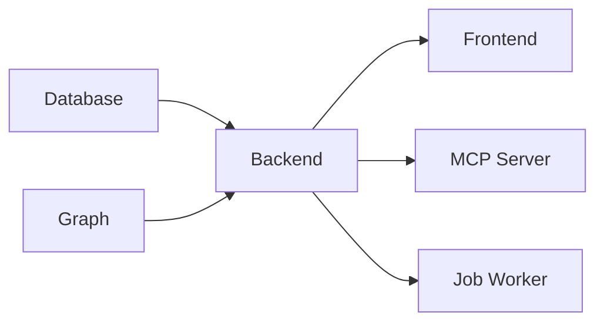

# Services Overview

This document provides a deployment-focused overview of Semiont services. For API documentation, see the individual package documentation.

## Service Catalog

### Application Layer

| Service | Type | Package/Location | Documentation |
|---------|------|-----------------|---------------|
| **Frontend** | Web App | `apps/frontend/` | [README](../../apps/frontend/README.md) |
| **Backend** | API Server | `apps/backend/` | [README](../../apps/backend/README.md) |
| **MCP Server** | AI Integration | `@semiont/mcp-server` | [Package](../../packages/mcp-server/) |

### Data Layer

| Service | Type | Package | API Docs |
|---------|------|---------|----------|
| **Content Store** | Filesystem | `@semiont/content` | [API](../../packages/content/docs/API.md) |
| **Event Store** | Filesystem | `@semiont/event-sourcing` | [API](../../packages/event-sourcing/docs/API.md), [Architecture](../../packages/event-sourcing/docs/ARCHITECTURE.md) |
| **Graph Database** | Multiple Providers | `@semiont/graph` | [API](../../packages/graph/docs/API.md), [Architecture](../../packages/graph/docs/ARCHITECTURE.md) |
| **PostgreSQL** | User Auth Only | Backend Implementation | [Database Guide](../../apps/backend/docs/DATABASE.md) |

### Compute Layer

| Service | Type | Package | API Docs |
|---------|------|---------|----------|
| **Inference** | LLM Service | `@semiont/inference` | [API](../../packages/inference/docs/API.md) |
| **Job Worker** | Background Jobs | `@semiont/jobs` | [API](../../packages/jobs/docs/API.md) |

## Service Management

All services are managed through the Semiont CLI:

### Basic Commands

```bash
# Start all services
semiont start --environment local

# Start specific service
semiont start --service backend --environment local

# Check service status
semiont check --service all --environment local

# Stop services
semiont stop --service all --environment local

# View logs
semiont logs --service backend --environment local

# Watch service status
semiont watch --environment local
```

### Service Configuration

Services are configured per environment in `environments/*.json`:

```json
{
  "services": {
    "backend": {
      "platform": { "type": "posix" },
      "command": "npm run dev",
      "port": 4000,
      "env": {
        "DATABASE_URL": "postgresql://...",
        "JWT_SECRET": "..."
      }
    },
    "graph": {
      "platform": { "type": "container" },
      "image": "neo4j:5",
      "port": 7687
    }
  }
}
```

## Platform Support

Services can run on different platforms:

### Development (POSIX)
- Local processes
- Filesystem storage
- In-memory graph
- SQLite or PostgreSQL

### Containers (Docker)
- Docker Compose
- Volume mounts
- Network isolation
- Container orchestration

### Production (AWS)
- ECS Fargate tasks
- RDS PostgreSQL
- S3/EFS storage
- Neptune graph database
- Secrets Manager

## Service Dependencies

### Startup Order



### Runtime Dependencies

- **Frontend** → Backend API
- **Backend** → Database (users), Event Store, Graph (optional)
- **Job Worker** → Event Store, Inference
- **MCP Server** → Backend API

## Service Communication

### REST API
- Frontend to Backend
- MCP Server to Backend
- External clients to Backend

### Server-Sent Events (SSE)
- Backend to Frontend (real-time updates)
- Job progress streaming

### Event Bus
- Event Store to Graph Consumer
- Event Store to SSE subscribers

## Health Checks

All services expose health endpoints:

| Service | Health Endpoint | Checks |
|---------|----------------|---------|
| Frontend | `/api/health` | Next.js status |
| Backend | `/api/health` | Database, Event Store |
| MCP Server | `/health` | Backend connectivity |

## Monitoring

### Logs
- Application logs: stdout/stderr
- Structured logging: JSON format
- Log aggregation: CloudWatch (AWS)

### Metrics
- Service uptime
- Request latency
- Error rates
- Queue depths

## Deployment Patterns

### Local Development

```bash
# Start core services
semiont start --service database --environment local
semiont start --service backend --environment local
semiont start --service frontend --environment local

# Optional services
semiont start --service graph --environment local
```

### Staging

```bash
# Deploy to staging
semiont deploy --environment staging

# Run migrations
semiont exec --service backend --environment staging \
  "npx prisma migrate deploy"

# Check deployment
semiont check --environment staging
```

### Production

```bash
# Blue-green deployment
semiont deploy --environment production --strategy blue-green

# Monitor deployment
semiont watch --environment production

# Rollback if needed
semiont rollback --environment production
```

## Service-Specific Documentation

### Backend Implementation
- [Database Management](../../apps/backend/docs/DATABASE.md) - PostgreSQL setup
- [Filesystem Patterns](../../apps/backend/docs/FILESYSTEM.md) - Storage implementation
- [Data Flow](../../apps/backend/docs/DATA-FLOW.md) - Event processing

### Package APIs
- [@semiont/event-sourcing](../../packages/event-sourcing/docs/) - Event store patterns
- [@semiont/graph](../../packages/graph/docs/) - Graph database providers
- [@semiont/inference](../../packages/inference/docs/) - LLM integration
- [@semiont/jobs](../../packages/jobs/docs/) - Job queue patterns
- [@semiont/content](../../packages/content/docs/) - Content addressing

### CLI Integration
- [CLI README](../../apps/cli/README.md) - Complete CLI documentation
- [Adding Services](../../apps/cli/docs/ADDING_SERVICES.md) - Extend service types
- [Service Management](../../apps/cli/docs/SERVICE_MANAGEMENT.md) - Advanced patterns

## Troubleshooting

### Common Issues

**Service won't start**
```bash
# Check logs
semiont logs --service backend --tail 100

# Check environment
semiont config --environment local

# Verify dependencies
semiont check --service all
```

**Database connection failed**
```bash
# Check database service
semiont check --service database

# Test connection
semiont exec --service backend "npx prisma db pull"
```

**Graph database unavailable**
- Graph is optional - core features work without it
- Check [Graph Architecture](../../packages/graph/docs/ARCHITECTURE.md#graceful-degradation)

## Migration Notes

### From Service Docs to Package Docs

The detailed technical documentation has moved to package-specific locations:

| Old Location | New Location |
|--------------|--------------|
| `docs/services/EVENT-STORE.md` | `packages/event-sourcing/docs/` |
| `docs/services/GRAPH.md` | `packages/graph/docs/` |
| `docs/services/INFERENCE.md` | `packages/inference/docs/` |
| `docs/services/JOB-WORKER.md` | `packages/jobs/docs/` |
| `docs/services/REPRESENTATION-STORE.md` | `packages/content/docs/` |
| `docs/services/DATABASE.md` | `apps/backend/docs/DATABASE.md` |

This reorganization follows the principle of colocating documentation with code for better maintainability.