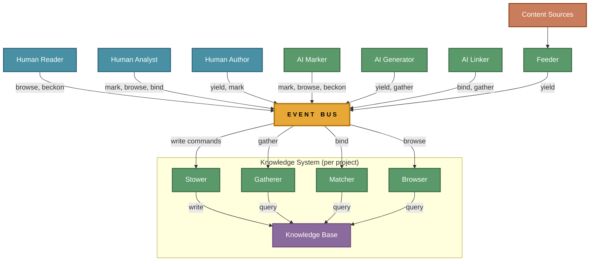

# Actor Model

Semiont's architecture is organized around **actors** communicating through a central **event bus**. This page explains who the actors are, how they relate, and why this shape was chosen.

For the SPA-side wiring, see [HUMAN-UI.md](HUMAN-UI.md). For the read/write actors that mediate the knowledge base, see [KNOWLEDGE-SYSTEM.md](KNOWLEDGE-SYSTEM.md). For the deployment layout that hosts these actors, see [CONTAINER-TOPOLOGY.md](CONTAINER-TOPOLOGY.md).

## Topology

Three categories of actor:

1. **Intelligent actors** — humans or AI agents that read, interpret, and annotate content. They produce events that carry semantic intent (mark, browse, yield, match, bind, gather, beckon).
2. **The knowledge base** — a passive actor that listens to events and materializes durable state. It has no intelligence; it simply records what the intelligent actors decide. Five reactive sub-actors mediate access (see [KNOWLEDGE-SYSTEM.md](KNOWLEDGE-SYSTEM.md)).
3. **Content streams** — external sources that yield new resources into the system (uploads, web fetches, API ingestion). Mediated by the **Feeder** actor.

The event bus is the only coupling between actors. An actor does not know who else is listening.

## Intelligent actors

| | Actor | Flows | What they do |
|-|-------|-------|-------------|
| 🧠 | **Reader** | browse, beckon | Navigates resources and annotations. Clicks, hovers, scrolls. Consumes the knowledge base without modifying it. |
| 🧠 | **Analyst** | mark, browse, beckon, bind | Reads content, creates annotations (highlights, comments, assessments, tags), and resolves references to existing resources. The primary human intelligence in the system. |
| 🧠 | **Author** | yield, mark | Composes new resources manually (via the compose page) and annotates them. Produces content that the knowledge base records. |
| 🤖 | **Marker Agent** | mark, browse, beckon | Scans documents and proposes annotations — highlights, assessments, comments, tags, and entity references. Produces the same W3C annotations that human analysts do. |
| 🤖 | **Generator Agent** | yield, gather | Assembles context around a reference annotation (gather), then synthesizes a new resource from it (yield). Creates content that the knowledge base records. |
| 🤖 | **Linker Agent** | bind, gather | Resolves unresolved references by searching for matching resources and linking them. Performs entity resolution and coreference — the binding of a mention to its referent. |

AI actors connect to the event bus over the same `/bus/emit` + `/bus/subscribe` endpoints human actors use, authenticated via REST + JWT or MCP. The knowledge base cannot distinguish a human-created annotation from an AI-created one — both are W3C annotations with a `creator` field that identifies the agent.

## Content streams

External sources of new resources: file uploads, API ingestion, web fetches. The **Feeder** actor sits between content streams and the event bus. It accepts raw content from a source, emits `yield:create` on the bus, and the Stower handles persistence. The Feeder normalizes the intake — regardless of how content arrives, it enters the system as a yield event.

Content sources:

- **Upload** — a human drags a file into the browser
- **API Ingestion** — an external system pushes content via REST
- **Web Fetch** — the system retrieves content from a URL

## Flows

Seven composable flows define how actors interact with the knowledge base: **Mark**, **Browse**, **Beckon**, **Match**, **Bind**, **Gather**, and **Yield**. See **[../protocol/flows/README.md](../protocol/flows/README.md)** for the full table, relationships, and individual flow documentation.

For the wire-level definition (channel naming, `correlationId` / `_userId` conventions, `_trace` carrier), see **[../protocol/EVENT-BUS.md](../protocol/EVENT-BUS.md)**.

## Why this shape

The actor model makes three things visible that a layered architecture obscures:

1. **Human and AI are peers.** They perform the same flows, produce the same events, and create the same W3C annotations. The system does not privilege one over the other. A future actor — a different AI model, a rule engine, a crowdsourcing pipeline — slots in by subscribing to and emitting events.

2. **The knowledge base is inert.** It records; it does not decide. All intelligence lives in the actors. This means the knowledge base can be simple, append-only, and rebuildable — properties that are hard to maintain when "smart" behavior leaks into the data layer.

3. **Flows are composable.** A Marker Agent does mark + browse + beckon. A Generator Agent does yield + gather. New actor types can mix flows freely. The bus doesn't care who emits an event or who consumes it — only that the event conforms to the [event-bus protocol](../protocol/EVENT-BUS.md).
