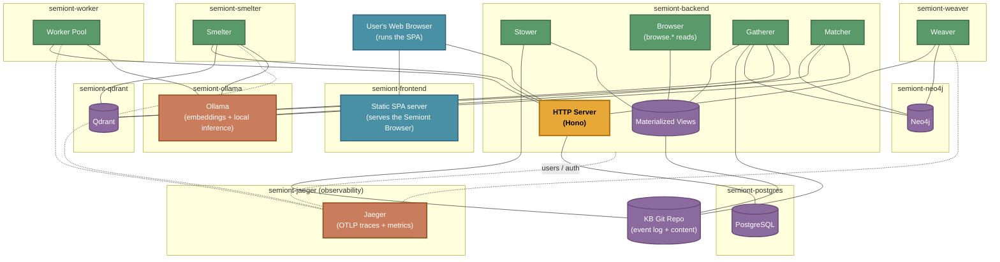

# Container Topology

How a Semiont deployment splits into containers, how those containers communicate, and which deployment platforms host them.

> **Containers are one adapter, not the architecture.** Semiont aspires to a [hexagonal architecture](https://alistair.cockburn.us/hexagonal-architecture/): the substance is the npm packages — `@semiont/make-meaning`, `@semiont/sdk`, `@semiont/jobs`, `@semiont/event-sourcing`, etc. — that define the **actors, flows, and ports**. A "container" here is a deployment adapter — a Node process running a particular bundle of those packages, talking to the rest of the system through the same ports (the bus contract `/bus/emit` + `/bus/subscribe`, the `ITransport` and `IContentTransport` interfaces, the `SessionStorage` adapter, and the injectable `EventStore` / `GraphDatabase` / `WorkingTreeStore` / `InferenceClient` interfaces) that any other adapter would use. Nothing in the architecture requires Docker — the same packages run as bare Node processes on a developer's machine, as ECS Fargate tasks on AWS, as AWS Lambda functions for short-lived per-request flows, as Kubernetes pods, or as long-running services on any compute substrate that hosts Node.js. The diagrams on this page show the *typical* container-per-actor partition because that's what local-dev and AWS-Fargate use today; other partitions are valid and require no domain changes.
>
> See [PACKAGE-ARCHITECTURE.md](PACKAGE-ARCHITECTURE.md) for the package layering that defines what each container actually contains.

For the actor responsibilities running inside the backend / worker / smelter / weaver containers, see [KNOWLEDGE-SYSTEM.md](KNOWLEDGE-SYSTEM.md). For the Semiont Browser SPA (served by the frontend container, executed in the user's web browser), see [HUMAN-UI.md](HUMAN-UI.md).

## Multi-container layout

A local deployment runs four containers of Semiont code, five with the frontend, nine with the infrastructure dependencies — and ten with the Jaeger observability sidecar, which local KB stacks run **by default** (`--no-observe` skips it): the backend, worker, smelter, and weaver all export OTLP traces + metrics to it. All five Semiont containers are **published, attested images** (`ghcr.io/the-ai-alliance/semiont-*`) that knowledge-base stacks pull — selecting the version via `SEMIONT_VERSION` — and configure by bind-mounting per-KB TOML at runtime; KBs do not build images (see [Container Images](administration/IMAGES.md)):



Three reading notes on the diagram. First, the SPA *executes in the user's web browser* — `semiont-frontend` only serves its static assets; the browser then talks to the backend directly (`localhost:4000`), which is why the frontend container needs no config and no backend connection of its own. Second, the rectangle the external edges terminate on is the backend's **HTTP server** — a [Hono](https://hono.dev/) app on `@hono/node-server` — and every one of those edges is event-bus traffic (`POST /bus/emit`, `GET /bus/subscribe` as SSE). The bus itself is deliberately **not** a box: it is connective fabric, not a component. Those two endpoints bridge external participants onto the same in-process `EventBus` (`@semiont/core`) that the backend's own actors — Stower, Browser, Gatherer, Matcher — subscribe to directly, with no HTTP hop. Third, the Ollama edges show the fully-local default: with the anthropic config, LLM inference for the workers, Gatherer, and Matcher goes to the Anthropic API instead, while embeddings stay on Ollama either way.

The worker, smelter, and weaver communicate with the backend exclusively through the unified bus it exposes (`/bus/emit`, `/bus/subscribe`). Workers, the smelter, and the weaver authenticate via `POST /api/tokens/agent`, which exchanges a shared secret (`SEMIONT_WORKER_SECRET`) plus a `(provider, model)` identity for a JWT carrying a typed Software-agent DID (the smelter presents its embedding config; the weaver presents `(semiont, weaver)`); the existing auth middleware validates that JWT exactly as it would a user's. This split isolates long-running LLM, embedding, and graph-projection work from the request-serving event loop — the backend stays responsive to human users while workers, the smelter, and the weaver run in separate V8 isolates.

## Unified bus and SemiontSession

Every actor that runs Semiont code — the Semiont Browser SPA, CLI, MCP, worker pool, smelter, and weaver — is a bus participant using the same primitives in `@semiont/sdk`. The backend exposes exactly two runtime endpoints that carry domain traffic: `POST /bus/emit` and `GET /bus/subscribe` (an SSE stream with dynamic channel subscriptions and Last-Event-ID replay on reconnect). Every other HTTP route exists for auth, admin, exchange, binary content, or infrastructure — not for domain commands. Commands and domain events flow through the bus.

The common abstraction for "I am a Semiont actor" is `SemiontSession`, which lives in `@semiont/sdk` and carries per-KB authentication, token refresh, bus access, and cross-process state synchronization. A session is constructed against a storage adapter (`SessionStorage`): `WebBrowserStorage` in the browser, filesystem storage for CLI and MCP, in-memory storage in workers and tests. `SemiontClient` exposes namespace methods (e.g. `client.browse.resource(...)`, `client.mark.annotation(...)`) over the bus; raw `emit`/`on`/`stream` are internal to the SDK and not part of the consumer surface.

A new kind of actor slots in the same way in every environment: construct a session with the right storage adapter, authenticate, subscribe to the channels it cares about, emit the commands it produces. The worker, smelter, and weaver containers are the clearest demonstration — same session, same bus primitives, same authentication pattern as the frontend; just different storage and different channels. (The weaver is also the proof by induction: it was added as a standalone actor after the pattern existed, and slotted in without any new plumbing.)

For the wire-level event protocol, see **[../protocol/EVENT-BUS.md](../protocol/EVENT-BUS.md)**.

## Deployment platforms

Services run on different platforms, configured in `~/.semiontconfig` per environment. Each platform is a different adapter for hosting the same npm packages — the partition into "frontend / backend / worker / smelter" is a deployment choice (which adapter you pick), not an architectural one.

### Platform types

The currently supported platforms:

- **POSIX** — Local processes (monorepo development). Each Semiont service is a Node process started directly on the host. See [platforms/POSIX.md](platforms/POSIX.md) and [LOCAL-SEMIONT.md](LOCAL-SEMIONT.md) for running Semiont locally.
- **Container** — Docker / Podman / Apple containers. Each service is a containerized Node process; the diagram above shows this layout. This is what KB stacks use — locally via `.semiont/scripts/start.sh` (any of the three runtimes) and in **GitHub Codespaces** via `docker compose` in the devcontainer. See [platforms/Container.md](platforms/Container.md).
- **AWS** — ECS Fargate tasks, RDS, S3, Neptune. The same containers, scheduled by ECS. See [platforms/AWS.md](platforms/AWS.md).

These three are what the Semiont CLI knows how to provision and manage today. They share the same containers because they share the same npm packages — the difference is where the Node processes run, not what they run.

Other deployment shapes are valid and require no architectural changes — they just don't have first-class CLI tooling yet:

- **Kubernetes** — pods running the published Semiont images, with the same `/bus/emit` + `/bus/subscribe` contract between them.
- **Cloud-native serverless** — short-lived flows (e.g. a Generator-Agent yield) could run as AWS Lambda, Cloud Run, or Cloud Functions invocations against a hosted backend; the SDK works the same against an HTTP transport regardless of where the caller lives.
- **Bare Node** — long-running services on any VM. The CLI's POSIX platform is essentially this, just with process supervision wired in.

The constraint is the **port contracts** — the bus (`/bus/emit`, `/bus/subscribe`), the OpenAPI HTTP surface, and the in-process interfaces (`ITransport`, `SessionStorage`, the storage abstractions) — not which adapter implements them. Any compute substrate that can run Node and speak those ports can host a Semiont actor.

### Environments

| Environment | Compute | Storage | Graph | Users DB |
|-------------|---------|---------|-------|----------|
| **Local (KB stack)** | Containers (Apple `container` / Docker / Podman) | Filesystem (KB git repo, bind-mounted) | Neo4j (container) | PostgreSQL (container) |
| **Production (AWS)** | ECS Fargate | S3/EFS | Neptune | RDS PostgreSQL |

### Service management

Two layers, easy to conflate:

- **Operator entry points.** A KB stack is driven by its repo's scripts — `.semiont/scripts/start.sh` / `logs.sh` / `stop.sh` (runtime-portable, `--runtime` to force one) — or by `docker compose` against `.semiont/compose/backend.yml` (Codespaces uses this). Operators do not invoke the Semiont CLI directly.
- **The CLI inside the containers.** Each published image's entrypoint uses the Semiont CLI to provision and start its own service (e.g. the backend runs `semiont provision --service backend && semiont start --service backend`). Monorepo developers on the POSIX platform can drive the same CLI directly:

```bash
semiont start --environment local
semiont check --service all
```

See **[CLI Documentation](../../apps/cli/README.md)** and **[administration/CONFIGURATION.md](administration/CONFIGURATION.md)** for full configuration details.

For the per-service catalog (storage, AI, infrastructure), see **[services/OVERVIEW.md](services/OVERVIEW.md)**.
For deployment playbooks (CI/CD, image publishing, AWS provisioning), see **[administration/DEPLOYMENT.md](administration/DEPLOYMENT.md)** and **[administration/IMAGES.md](administration/IMAGES.md)**.
