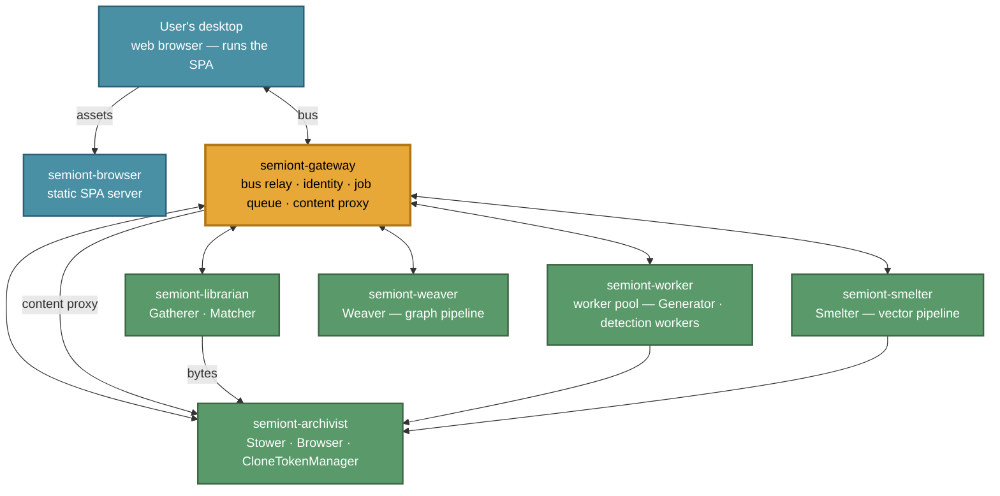
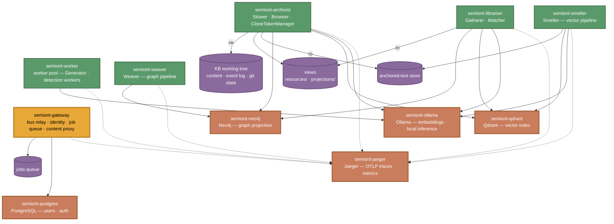

# Container Topology

How a Semiont deployment splits into containers, how those containers communicate, and which deployment platforms host them.

> **Containers are one adapter, not the architecture.** Semiont aspires to a [hexagonal architecture](https://alistair.cockburn.us/hexagonal-architecture/): the substance is the npm packages — `@semiont/make-meaning`, `@semiont/sdk`, `@semiont/jobs`, `@semiont/event-sourcing`, etc. — that define the **actors, flows, and ports**. A "container" here is a deployment adapter — a Node process running a particular bundle of those packages, talking to the rest of the system through the same ports (the bus contract `/bus/emit` + `/bus/subscribe`, the `ITransport` and `IContentTransport` interfaces, the `SessionStorage` adapter, and the injectable `EventStore` / `GraphDatabase` / `WorkingTreeStore` / `InferenceClient` interfaces) that any other adapter would use. Nothing in the architecture requires Docker — the same packages run as bare Node processes on a developer's machine, as ECS Fargate tasks on AWS, as AWS Lambda functions for short-lived per-request flows, as Kubernetes pods, or as long-running services on any compute substrate that hosts Node.js. The diagrams on this page show the *typical* container-per-service partition (each service container hosting its actors) because that's what local-dev and AWS-Fargate use today; other partitions are valid and require no domain changes.
>
> See [PACKAGE-ARCHITECTURE.md](PACKAGE-ARCHITECTURE.md) for the package layering that defines what each container actually contains.

For the actor responsibilities running inside the archivist / librarian / worker / smelter / weaver containers, see [KNOWLEDGE-SYSTEM.md](KNOWLEDGE-SYSTEM.md). For the Semiont Browser SPA (served by the Browser container, executed in the user's web browser), see [HUMAN-UI.md](HUMAN-UI.md).

## Multi-container layout

A local deployment runs six containers of Semiont code, seven with the Browser, eleven with the infrastructure dependencies — and twelve with the Jaeger observability sidecar, which local KB stacks run **by default** (`--no-observe` skips it): the gateway, archivist, librarian, worker, smelter, and weaver all export OTLP traces + metrics to it. All seven Semiont containers are **published, attested images** (`ghcr.io/the-ai-alliance/semiont-*`) that knowledge-base stacks pull — selecting the version via `SEMIONT_VERSION` — and configure by bind-mounting per-KB TOML at runtime; KBs do not build images (see [Container Images](administration/IMAGES.md)). Two views of one stack follow: who talks to whom, and what attaches to what.

### Who talks to whom

The communication plane: the user, the SPA server, and every process-to-process edge — bus and bytes.

```mermaid
graph TB
    USER["User's desktop<br/>web browser — runs the SPA"]

    BROWSERC["semiont-browser<br/>static SPA server"]
    GW["semiont-gateway<br/>bus relay · identity · job queue · content proxy"]

    LIB["semiont-librarian<br/>Gatherer · Matcher"]
    WORKER["semiont-worker<br/>worker pool — Generator · detection workers"]
    SMELT["semiont-smelter<br/>Smelter — vector pipeline"]
    WEAVE["semiont-weaver<br/>Weaver — graph pipeline"]
    ARCH["semiont-archivist<br/>Stower · Browser · CloneTokenManager"]

    USER -->|assets| BROWSERC
    USER <-->|bus| GW

    GW <--> LIB
    GW <--> WORKER
    GW <--> SMELT
    GW <--> WEAVE
    GW <--> ARCH

    GW -->|content proxy| ARCH
    LIB -->|bytes| ARCH
    WORKER --> ARCH
    SMELT --> ARCH

    classDef user fill:#4a90a4,stroke:#2c5f7a,stroke-width:2px,color:#fff
    classDef svc fill:#5a9a6a,stroke:#3d6644,stroke-width:2px,color:#fff
    classDef hub fill:#e8a838,stroke:#b07818,stroke-width:3px,color:#000

    class USER,BROWSERC user
    class LIB,WORKER,SMELT,WEAVE,ARCH svc
    class GW hub
```

The bidirectional edges are the bus (`POST /bus/emit`, `POST /bus/subscribe` as SSE) — connective fabric, not a box, and the gateway hosts **no actors**: every service subscribes over those two endpoints like any other participant, with each rectangle enumerating what runs inside it. The archivist-pointing edges are the byte plane: the gateway proxies content for external clients; the smelter, librarian, and workers dial the archivist directly. The SPA *executes in the user's web browser* — `semiont-browser` only serves its static assets, which is why it needs no config and no gateway connection of its own.

### What attaches to what

The state plane: the same six service containers against file state and the third-party infrastructure.

```mermaid
graph TB
    GW["semiont-gateway<br/>bus relay · identity · job queue · content proxy"]
    LIB["semiont-librarian<br/>Gatherer · Matcher"]
    WORKER["semiont-worker<br/>worker pool — Generator · detection workers"]
    SMELT["semiont-smelter<br/>Smelter — vector pipeline"]
    WEAVE["semiont-weaver<br/>Weaver — graph pipeline"]
    ARCH["semiont-archivist<br/>Stower · Browser · CloneTokenManager"]

    TREE[("KB working tree<br/>content · event log · git state")]
    ANCH[("anchored-text store")]
    VIEWS[("views<br/>resources/ · projections/")]
    JOBS[("jobs queue")]

    NEO["semiont-neo4j<br/>Neo4j — graph projection"]
    QD["semiont-qdrant<br/>Qdrant — vector index"]
    OL["semiont-ollama<br/>Ollama — embeddings · local inference"]
    PG["semiont-postgres<br/>PostgreSQL — users · auth"]
    JAG["semiont-jaeger<br/>Jaeger — OTLP traces · metrics"]

    ARCH -->|rw| TREE
    ARCH --> VIEWS
    LIB -->|ro| VIEWS
    SMELT --> ANCH
    ARCH -->|ro| ANCH
    GW --> JOBS

    WEAVE --> NEO
    ARCH --> NEO
    LIB --> NEO
    SMELT --> QD
    ARCH --> QD
    LIB --> QD
    SMELT --> OL
    ARCH --> OL
    LIB --> OL
    WORKER --> OL
    GW --> PG

    GW -.-> JAG
    ARCH -.-> JAG
    LIB -.-> JAG
    WORKER -.-> JAG
    SMELT -.-> JAG
    WEAVE -.-> JAG

    classDef svc fill:#5a9a6a,stroke:#3d6644,stroke-width:2px,color:#fff
    classDef hub fill:#e8a838,stroke:#b07818,stroke-width:3px,color:#000
    classDef infra fill:#c97d5d,stroke:#8b4513,stroke-width:2px,color:#fff
    classDef store fill:#8b6b9d,stroke:#6b4a7a,stroke-width:2px,color:#fff

    class LIB,WORKER,SMELT,WEAVE,ARCH svc
    class GW hub
    class NEO,QD,OL,PG,JAG infra
    class TREE,ANCH,VIEWS,JOBS store

    TREE ~~~ NEO
    VIEWS ~~~ QD
    ANCH ~~~ OL
    JOBS ~~~ PG
    QD ~~~ JAG
    OL ~~~ JAG
```

Cylinders are file state on the host; their edges are mounts and the direction of use — `rw`/`ro` marked where it matters, and the working tree has exactly one writer. Rectangle-to-rectangle edges are each service's infrastructure attachments; dotted edges are OTLP export to Jaeger. The Ollama edges show the fully-local default: with the anthropic config, LLM inference for the workers, Gatherer, and Matcher goes to the Anthropic API instead, while embeddings stay on Ollama either way.

Every service-to-gateway bus edge in the first diagram authenticates via `POST /api/tokens/agent`, which exchanges a shared secret (`SEMIONT_WORKER_SECRET`) plus a `(provider, model)` identity for a JWT carrying a typed Software-agent DID (the smelter presents its embedding config; the weaver presents `(semiont, weaver)`); the existing auth middleware validates that JWT exactly as it would a user's. One nuance the drawing flattens: besides content bytes, the archivist's event read path also rides plain HTTP, by design. The split itself is why the partition exists — the record, retrieval, LLM, embedding, and graph-projection work run in separate V8 isolates, and the gateway stays responsive to human users.

### Who mounts what

The second diagram draws the mounts; this table adds the discipline. Exactly one container mounts the KB tree — pinned by a launcher test; every other byte crosses HTTP or the bus. Shared stores have exactly one stamp holder, whose image change clears and rebuilds them.

| Container | `/kb` (git tree) | anchored-text | state (views · jobs) |
|---|---|---|---|
| archivist | **rw — sole owner** | read | **stamp holder** — writes views |
| gateway | — | — | shared — jobs queue |
| librarian | — | — | shared — reads views |
| smelter | — | **stamp holder** — writes | — |
| worker · weaver · browser | — | — | — |

Every service also mounts its launcher-staged config TOML read-only; the infrastructure containers own their private data dirs.

## Unified bus and SemiontSession

Every actor that runs Semiont code — the Semiont Browser SPA, CLI, MCP, worker pool, smelter, weaver, archivist, and librarian — is a bus participant using the same primitives in `@semiont/sdk`. The gateway exposes exactly two runtime endpoints that carry domain traffic: `POST /bus/emit` and `POST /bus/subscribe` (an SSE stream with dynamic channel subscriptions and Last-Event-ID replay on reconnect). Every other HTTP route exists for auth, admin, exchange, binary content, or infrastructure — not for domain commands. Commands and domain events flow through the bus.

The common abstraction for "I am a Semiont actor" is `SemiontSession`, which lives in `@semiont/sdk` and carries per-KB authentication, token refresh, bus access, and cross-process state synchronization. A session is constructed against a storage adapter (`SessionStorage`): `WebBrowserStorage` in the browser, filesystem storage for CLI and MCP, in-memory storage in workers and tests. `SemiontClient` exposes namespace methods (e.g. `client.browse.resource(...)`, `client.mark.annotation(...)`) over the bus; raw `emit`/`on`/`stream` are internal to the SDK and not part of the consumer surface.

A new kind of actor slots in the same way in every environment: construct a session with the right storage adapter, authenticate, subscribe to the channels it cares about, emit the commands it produces. The worker, smelter, weaver, archivist, and librarian containers are the clearest demonstration — same session, same bus primitives, same authentication pattern as the Browser; just different storage and different channels. (The weaver was the proof by induction — added as a standalone actor after the pattern existed, with no new plumbing — and the archivist and librarian extractions repeated it.)

For the wire-level event protocol, see **[../protocol/EVENT-BUS.md](../protocol/EVENT-BUS.md)**.

## Deployment platforms

Services run on different platforms, configured per environment in the KB's `.semiont/semiontconfig/<name>.toml`. Each platform is a different adapter for hosting the same npm packages — the container-per-service partition is a deployment choice (which adapter you pick), not an architectural one.

### How stacks are run

Every Semiont service runs as a **container** — Docker, Podman, or Apple Container. The diagrams above show the layout. A KB stack is brought up either by the host-installed `semiont` launcher (any of the three runtimes, locally or in a GitHub Codespace) or by `docker compose` against the KB's `.semiont/compose/backend.yml`. See [platforms/README.md](platforms/README.md) and [LOCAL-SEMIONT.md](LOCAL-SEMIONT.md).

**There is no platform abstraction, and no cloud platform.** A retired CLI once carried a per-platform handler matrix (`posix`, `container`, `aws`, `external`, `mock`) plus `publish`/`update` for AWS; all of it has been deleted, the CLI included. The published images can of course be scheduled by a cloud container platform such as ECS Fargate, but that is your own integration — see [Running Semiont on AWS](platforms/AWS.md).

Other deployment shapes are valid and require no architectural changes — they just don't have first-class CLI tooling yet:

- **Kubernetes** — pods running the published Semiont images, with the same `/bus/emit` + `/bus/subscribe` contract between them.
- **Cloud-native serverless** — short-lived flows (e.g. a Generator-Agent yield) could run as AWS Lambda, Cloud Run, or Cloud Functions invocations against a hosted gateway; the SDK works the same against an HTTP transport regardless of where the caller lives.
- **Bare Node** — long-running services on any VM. The CLI's POSIX platform is essentially this, just with process supervision wired in.

The constraint is the **port contracts** — the bus (`/bus/emit`, `/bus/subscribe`), the OpenAPI HTTP surface, and the in-process interfaces (`ITransport`, `SessionStorage`, the storage abstractions) — not which adapter implements them. Any compute substrate that can run Node and speak those ports can host a Semiont actor.

### Environments

| Environment | Compute | Storage | Graph | Users DB |
|-------------|---------|---------|-------|----------|
| **Local (KB stack)** | Containers (Apple `container` / Docker / Podman) | Filesystem (KB git repo, bind-mounted) | Neo4j (container) | PostgreSQL (container) |
| **Production (AWS)** | ECS Fargate | S3/EFS | Neptune | RDS PostgreSQL |

### Service management

Two layers, easy to conflate:

- **Operator entry points.** A KB stack is driven by the host-installed [`semiont` launcher](../../apps/launcher/README.md) — `semiont start` / `logs` / `status` / `stop` (runtime-portable, `--runtime` to force one) — or by `docker compose` against `.semiont/compose/backend.yml`.
  In **Codespaces both are true at once**, at different layers: `semiont start --runtime codespace` drives the outside (create/resume the VM, wait for health, forward the KB, read credentials, stop or delete), while *inside* the codespace the devcontainer hooks bring the stack up with `docker compose` exactly as above. The launcher never reaches into the container to manage services.
- **No CLI inside the containers.** Each published image runs its own service directly, as PID 1. The gateway image derives `DATABASE_URL`, applies pending Prisma migrations, then `exec`s `node dist/index.js`; the Browser image runs `node node_modules/@semiont/browser/server.js`. Nothing in an image shells out to a Semiont CLI.

See **[the launcher](../../apps/launcher/README.md)** and **[administration/CONFIGURATION.md](administration/CONFIGURATION.md)** for full configuration details.

For the per-service catalog (storage, AI, infrastructure), see **[services/OVERVIEW.md](services/OVERVIEW.md)**.
For how stacks are deployed, and what running them elsewhere would require of you, see **[administration/DEPLOYMENT.md](administration/DEPLOYMENT.md)**; for how the images are built and published, **[administration/IMAGES.md](administration/IMAGES.md)**.
