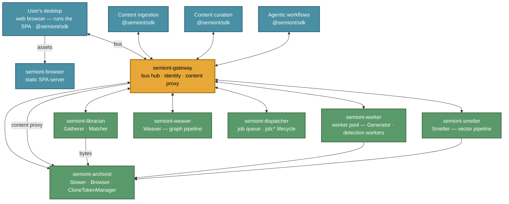
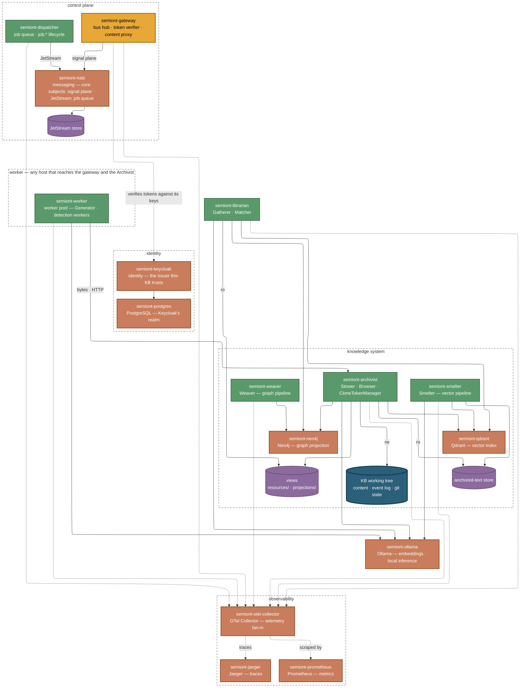

# Container Topology

How a Semiont deployment splits into containers, how those containers communicate, and which deployment platforms host them.

> **Containers are one adapter, not the architecture.** Semiont aspires to a [hexagonal architecture](https://alistair.cockburn.us/hexagonal-architecture/): the substance is the npm packages — `@semiont/make-meaning`, `@semiont/sdk`, `@semiont/jobs`, `@semiont/event-sourcing`, etc. — that define the **actors, flows, and ports**. A "container" here is a deployment adapter — a Node process running a particular bundle of those packages, talking to the rest of the system through the same ports (the bus contract `/bus/emit` + `/bus/subscribe`, the `ITransport` and `IContentTransport` interfaces, the `SessionStorage` adapter, and the injectable `EventStore` / `GraphDatabase` / `WorkingTreeStore` / `InferenceClient` interfaces) that any other adapter would use. Nothing in the architecture requires Docker — the same packages run as bare Node processes on a developer's machine, as ECS Fargate tasks on AWS, as AWS Lambda functions for short-lived per-request flows, as Kubernetes pods, or as long-running services on any compute substrate that hosts Node.js. The diagrams on this page show the *typical* container-per-service partition (each service container hosting its actors) because that's what local-dev and AWS-Fargate use today; other partitions are valid and require no domain changes.
>
> See [PACKAGE-ARCHITECTURE.md](PACKAGE-ARCHITECTURE.md) for the package layering that defines what each container actually contains.

For the actor responsibilities running inside the archivist / librarian / worker / smelter / weaver containers, see [KNOWLEDGE-SYSTEM.md](KNOWLEDGE-SYSTEM.md). For the Semiont Browser SPA (served by the Browser container, executed in the user's web browser), see [HUMAN-UI.md](HUMAN-UI.md).

## Multi-container layout

A local deployment runs seven containers of Semiont code, eight with the Browser, thirteen with the infrastructure dependencies (the OTel collector is always among them; a NATS `messaging` daemon joins when a broker-backed driver is selected — the config the launcher template ships, drawn in the second diagram), and fifteen with the observability pair — Jaeger for traces and Prometheus for metrics — which local stacks run **by default**: all seven service containers export OTLP to the collector, which forwards traces to Jaeger and serves a readout Prometheus scrapes. `--no-observe` skips only the pair; the collector still runs and discards traces. All eight Semiont containers are **published, attested images** (`ghcr.io/the-ai-alliance/semiont-*`) that knowledge-base stacks pull — selecting the version via `SEMIONT_VERSION` — and configure by bind-mounting per-KB TOML at runtime; KBs do not build images (see [Container Images](administration/IMAGES.md)). Two views of one stack follow: who talks to whom, and what attaches to what.

### Who talks to whom

The communication plane: the SDK clients, the SPA server, and every process-to-process edge — bus and bytes.

```mermaid
graph TB
    USER["User's desktop<br/>web browser — runs the SPA · @semiont/sdk"]
    INGEST["Content ingestion<br/>@semiont/sdk"]
    CURATE["Content curation<br/>@semiont/sdk"]
    AGENT["Agentic workflows<br/>@semiont/sdk"]

    BROWSERC["semiont-browser<br/>static SPA server"]
    GW["semiont-gateway<br/>bus hub · identity · content proxy"]

    LIB["semiont-librarian<br/>Gatherer · Matcher"]
    WORKER["semiont-worker<br/>worker pool — Generator · detection workers"]
    SMELT["semiont-smelter<br/>Smelter — vector pipeline"]
    WEAVE["semiont-weaver<br/>Weaver — graph pipeline"]
    ARCH["semiont-archivist<br/>Stower · Browser · CloneTokenManager"]
    DISP["semiont-dispatcher<br/>job queue · job:* lifecycle"]

    USER -->|assets| BROWSERC
    USER <-->|bus| GW
    INGEST <--> GW
    CURATE <--> GW
    AGENT <--> GW

    GW <--> LIB
    GW <--> WORKER
    GW <--> SMELT
    GW <--> WEAVE
    GW <--> ARCH
    GW <--> DISP

    GW -->|content proxy| ARCH
    LIB -->|bytes| ARCH
    WORKER --> ARCH
    SMELT --> ARCH

    classDef client fill:#4a90a4,stroke:#2c5f7a,stroke-width:2px,color:#fff
    classDef svc fill:#5a9a6a,stroke:#3d6644,stroke-width:2px,color:#fff
    classDef hub fill:#e8a838,stroke:#b07818,stroke-width:3px,color:#000

    class USER,INGEST,CURATE,AGENT,BROWSERC client
    class LIB,WORKER,SMELT,WEAVE,ARCH,DISP svc
    class GW hub
```

The bidirectional edges are the bus (`POST /bus/emit`, `POST /bus/subscribe` as SSE) — connective fabric, not a box, and the gateway hosts **no actors**: every service subscribes over those two endpoints like any other participant, with each rectangle enumerating what runs inside it. The blue rectangles are the bus's clients, and every one of them speaks `@semiont/sdk` — the SPA in the user's browser, and the same client shape without a UI for content ingestion, content curation, and agentic workflows (scripts and agents driving the KB; the CLI and MCP server are instances of it). The archivist-pointing edges are the byte plane: the gateway proxies content for external clients; the smelter, librarian, and workers dial the archivist directly. The dispatcher is the one service with no edge to the archivist: a control plane through which job ids, types, params and status flow and content never does — a worker claims there, then pulls bytes from and writes annotations to the archivist itself. The SPA *executes in the user's web browser* — `semiont-browser` only serves its static assets, which is why it needs no config and no gateway connection of its own.

Two mechanisms behind the gateway hub are selected by config, not drawn as edges:

- **The Signal Plane** is the fan-out behind those two bus endpoints — a driver seam. By default (`[signal] type = "in-process"`) it is the gateway's own per-process RxJS bus; `[signal] type = "nats"` moves fan-out onto core NATS subjects so the gateway can run as multiple replicas. The bus contract above is identical either way; clients never see the choice.
- **The job queue** the dispatcher owns is likewise driver-backed (`[jobs] type`): `jetstream` (NATS JetStream — what the launcher template ships, and the only driver the mountless dispatcher can run) or `fs` (a filesystem queue kept as the reference implementation; it needs a writable state tree). Jobs are created at the dispatcher, announced on `job:queued`, and claimed by exactly one worker over the bus — a claim the dispatcher admits only from a token carrying the worker role.

The second diagram draws the NATS `messaging` daemon the two share (`[jobs] = "jetstream"`, `[signal] = "nats"` — what the launcher template ships). Select neither and it is absent: the in-process bus and one gateway — though an `fs` queue then needs a state tree the launcher's dispatcher does not mount, so a launcher-run stack selects `jetstream`.

### What attaches to what

The state plane: the same seven service containers against file state and the third-party infrastructure.

```mermaid
---
config:
  layout: elk
---
graph TB
    subgraph G1 ["control plane"]
        GW["semiont-gateway<br/>bus hub · token verifier · content proxy"]
        DISP["semiont-dispatcher<br/>job queue · job:* lifecycle"]
        NATS["semiont-nats<br/>messaging — core subjects: signal plane · JetStream: job queue"]
        JS[("JetStream store")]
    end

    subgraph G4 ["identity"]
        KC["semiont-keycloak<br/>identity — the issuer this KB trusts"]
        PG["semiont-postgres<br/>PostgreSQL — Keycloak's realm"]
    end

    subgraph G2 ["knowledge system"]
        ARCH["semiont-archivist<br/>Stower · Browser · CloneTokenManager"]
        TREE[("KB working tree<br/>content · event log · git state")]
        VIEWS[("views<br/>resources/ · projections/")]
        ANCH[("anchored-text store")]
        WEAVE["semiont-weaver<br/>Weaver — graph pipeline"]
        SMELT["semiont-smelter<br/>Smelter — vector pipeline"]
        NEO["semiont-neo4j<br/>Neo4j — graph projection"]
        QD["semiont-qdrant<br/>Qdrant — vector index"]
    end

    LIB["semiont-librarian<br/>Gatherer · Matcher"]
    OL["semiont-ollama<br/>Ollama — embeddings · local inference"]

    subgraph G3 ["worker — any host that reaches the gateway and the Archivist"]
        WORKER["semiont-worker<br/>worker pool — Generator · detection workers"]
    end

    subgraph G5 ["observability"]
        COLL["semiont-otel-collector<br/>OTel Collector — telemetry fan-in"]
        TRACES["semiont-jaeger<br/>Jaeger — traces"]
        METRICS["semiont-prometheus<br/>Prometheus — metrics"]
    end

    ARCH -->|rw| TREE
    ARCH --> VIEWS
    LIB -->|ro| VIEWS
    SMELT --> ANCH
    ARCH -->|ro| ANCH
    WORKER -->|bytes · HTTP| ARCH
    GW -->|signal plane| NATS
    DISP -->|JetStream| NATS
    NATS --> JS

    WEAVE --> NEO
    ARCH --> NEO
    LIB --> NEO
    SMELT --> QD
    ARCH --> QD
    LIB --> QD
    SMELT --> OL
    ARCH --> OL
    LIB --> OL
    WORKER --> OL
    KC --> PG
    GW -.->|verifies tokens against its keys| KC

    GW -.-> COLL
    ARCH -.-> COLL
    LIB -.-> COLL
    WORKER -.-> COLL
    SMELT -.-> COLL
    WEAVE -.-> COLL
    DISP -.-> COLL
    COLL -.->|traces| TRACES
    COLL -.->|"scraped by"| METRICS

    classDef svc fill:#5a9a6a,stroke:#3d6644,stroke-width:2px,color:#fff
    classDef hub fill:#e8a838,stroke:#b07818,stroke-width:3px,color:#000
    classDef infra fill:#c97d5d,stroke:#8b4513,stroke-width:2px,color:#fff
    classDef store fill:#8b6b9d,stroke:#6b4a7a,stroke-width:2px,color:#fff
    classDef record fill:#2c5f7a,stroke:#16394f,stroke-width:3px,color:#fff

    class LIB,WORKER,SMELT,WEAVE,ARCH,DISP svc
    class GW hub
    class NEO,QD,OL,PG,KC,COLL,TRACES,METRICS,NATS infra
    class ANCH,VIEWS,JS store
    class TREE record

    NEO ~~~ TREE
    NEO ~~~ VIEWS
    QD ~~~ ANCH
    NATS ~~~ JS
    GW ~~~ WORKER
    OL ~~~ COLL
    GW ~~~ LIB
    GW ~~~ ARCH

    style G1 fill:none,stroke:#888,stroke-width:1.5px,stroke-dasharray:6 4
    style G2 fill:none,stroke:#888,stroke-width:1.5px,stroke-dasharray:6 4
    style G3 fill:none,stroke:#888,stroke-width:1.5px,stroke-dasharray:6 4
    style G4 fill:none,stroke:#888,stroke-width:1.5px,stroke-dasharray:6 4
    style G5 fill:none,stroke:#888,stroke-width:1.5px,stroke-dasharray:6 4
```

Cylinders are file state on the host; their edges are mounts and the direction of use — `rw`/`ro` marked where it matters, and the working tree has exactly one writer. The deep-blue cylinder is the KB working tree — the git-tracked system of record; every purple cylinder is derived state, rebuildable from it. Rectangle-to-rectangle edges are each service's infrastructure attachments; dotted edges are telemetry — OTLP into the collector, traces forwarded to Jaeger, metrics scraped by Prometheus off the collector's readout (a pull, drawn in the direction the data flows). The dashed frames group by concern — control plane, identity, knowledge system, observability, and the worker — not by component; the edges alone carry the attachment facts. The gateway attaches to exactly two things: the broker, for the signal plane when `[signal] type = "nats"`, and the issuer, whose published keys it verifies tokens against. It holds no database — the PostgreSQL in a stack is Keycloak's — and no queue: the dispatcher owns the queue and dials JetStream on the same broker. The worker's frame is the deployment boundary: it holds no mount and no broker credential, and everything it dials — the gateway's bus, the Archivist's byte surface, an inference provider — is a network address, so it can run on a host the rest of the stack never shares. A worker that is not the deployment's own joins the same way, its client granted the worker role at the issuer; the dispatcher admits its claims by that role. The Ollama edges show the fully-local default: with the anthropic config, LLM inference for the workers, Gatherer, and Matcher goes to the Anthropic API instead, while embeddings stay on Ollama either way.

Every service-to-gateway bus edge in the first diagram authenticates via `POST /api/tokens/agent`. Each sidecar first authenticates at the knowledge base's issuer as its own service account (client credentials, `SEMIONT_OIDC_CLIENT_ID` / `SEMIONT_OIDC_CLIENT_SECRET`), then presents that issuer token as a bearer here along with a `(provider, model)` identity, and receives a JWT carrying a typed Software-agent DID (the smelter presents its embedding config; the weaver presents `(semiont, weaver)`; the dispatcher `(semiont, dispatcher)`); the existing auth middleware validates that JWT exactly as it would a person's. Two identities, deliberately: the service account is the process, the agent DID is the work. One nuance the drawing flattens: besides content bytes, the archivist's event read path also rides plain HTTP, by design. The split itself is why the partition exists — the record, retrieval, LLM, embedding, and graph-projection work run in separate V8 isolates, and the gateway stays responsive to human users.

### Who mounts what

The second diagram draws the mounts; this table adds the discipline. Exactly one container mounts the KB tree — pinned by a launcher test; every other byte crosses HTTP or the bus. Shared stores have exactly one stamp holder, whose image change clears and rebuilds them.

| Container | `/kb` (git tree) | anchored-text | state (views) |
|---|---|---|---|
| archivist | **rw — sole owner** | read | **stamp holder** — writes views |
| gateway | — | — | — |
| dispatcher | — | — | — (the job queue is JetStream on `semiont-nats`, not a mount) |
| librarian | — | — | shared — reads views |
| smelter | — | **stamp holder** — writes | — |
| worker · weaver · browser | — | — | — |

Every service also mounts its launcher-staged config read-only — the services' TOML, the collector's and Prometheus's YAML; the infrastructure containers own their private data dirs.

## Unified bus and SemiontSession

Every actor that runs Semiont code — the Semiont Browser SPA, CLI, MCP, worker pool, smelter, weaver, archivist, librarian, and dispatcher — is a bus participant using the same primitives in `@semiont/sdk`. The gateway exposes exactly two runtime endpoints that carry domain traffic: `POST /bus/emit` and `POST /bus/subscribe` (an SSE stream with dynamic channel subscriptions and Last-Event-ID replay on reconnect). Every other HTTP route exists for auth, admin, exchange, binary content, or infrastructure — not for domain commands. Commands and domain events flow through the bus.

The common abstraction for "I am a Semiont actor" is `SemiontSession`, which lives in `@semiont/sdk` and carries per-KB authentication, token refresh, bus access, and cross-process state synchronization. A session is constructed against a storage adapter (`SessionStorage`): `WebBrowserStorage` in the browser, filesystem storage for CLI and MCP, in-memory storage in workers and tests. `SemiontClient` exposes namespace methods (e.g. `client.browse.resource(...)`, `client.mark.annotation(...)`) over the bus; raw `emit`/`on`/`stream` are internal to the SDK and not part of the consumer surface.

A new kind of actor slots in the same way in every environment: construct a session with the right storage adapter, authenticate, subscribe to the channels it cares about, emit the commands it produces. The worker, smelter, weaver, archivist, librarian, and dispatcher containers are the clearest demonstration — same session, same bus primitives, same authentication pattern as the Browser; just different storage and different channels. (The weaver was the proof by induction — added as a standalone actor after the pattern existed, with no new plumbing — and the archivist and librarian extractions repeated it.)

For the wire-level event protocol, see **[../protocol/EVENT-BUS.md](../protocol/EVENT-BUS.md)**.

## Deployment platforms

Services run on different platforms, configured per environment in the KB's `.semiont/semiontconfig/<name>.toml`. Each platform is a different adapter for hosting the same npm packages — the container-per-service partition is a deployment choice (which adapter you pick), not an architectural one.

### How stacks are run

Every Semiont service runs as a **container** — Docker, Podman, or Apple Container. The diagrams above show the layout. A KB stack is brought up either by the host-installed `semiont` launcher (any of the three runtimes, locally or in a GitHub Codespace) or by `docker compose` against the KB's `.semiont/compose/backend.yml`. See [platforms/README.md](platforms/README.md) and [LOCAL-SEMIONT.md](LOCAL-SEMIONT.md).

**There is no platform abstraction, and no cloud platform.** A retired CLI once carried a per-platform handler matrix (`posix`, `container`, `aws`, `external`, `mock`) plus `publish`/`update` for AWS; all of it has been deleted, the CLI included. The published images can of course be scheduled by a cloud container platform such as ECS Fargate, but that is your own integration — see [Running Semiont on AWS](platforms/AWS.md).

Other deployment shapes are valid and require no architectural changes — they just don't have first-class CLI tooling yet:

- **Kubernetes** — pods running the published Semiont images, with the same `/bus/emit` + `/bus/subscribe` contract between them.
- **Cloud-native serverless** — short-lived flows (e.g. a Generator-Agent yield) could run as AWS Lambda, Cloud Run, or Cloud Functions invocations against a hosted gateway; the SDK works the same against an HTTP transport regardless of where the caller lives.
- **Bare Node** — long-running services on any VM. The CLI's POSIX platform is essentially this, just with process supervision wired in.

The constraint is the **port contracts** — the bus (`/bus/emit`, `/bus/subscribe`), the OpenAPI HTTP surface, and the in-process interfaces (`ITransport`, `SessionStorage`, the storage abstractions) — not which adapter implements them. Any compute substrate that can run Node and speak those ports can host a Semiont actor.

### Environments

| Environment | Compute | Storage | Graph | Users DB |
|-------------|---------|---------|-------|----------|
| **Local (KB stack)** | Containers (Apple `container` / Docker / Podman) | Filesystem (KB git repo, bind-mounted) | Neo4j (container) | PostgreSQL (container) |
| **Your own integration** | Any container platform (see [DEPLOYMENT.md](administration/DEPLOYMENT.md)) | Volumes you provision; the KB tree reaches the Archivist | Neo4j | PostgreSQL (managed works) |

### Service management

Two layers, easy to conflate:

- **Operator entry points.** A KB stack is driven by the host-installed [`semiont` launcher](../../apps/launcher/README.md) — `semiont start` / `logs` / `status` / `stop` (runtime-portable, `--runtime` to force one) — or by `docker compose` against `.semiont/compose/backend.yml`.
  In **Codespaces both are true at once**, at different layers: `semiont start --runtime codespace` drives the outside (create/resume the VM, wait for health, forward the KB, read credentials, stop or delete), while *inside* the codespace the devcontainer hooks bring the stack up with `docker compose` exactly as above. The launcher never reaches into the container to manage services.
- **No CLI inside the containers.** Each published image runs `tini` as PID 1, exec'ing its own service — directly by default, or under the shared in-container supervisor when the launcher sets `SEMIONT_SUPERVISE` for local runs. The gateway image hands straight off to `node dist/index.js` — it derives no database URL and runs no migration step, because it holds no database; the Browser image runs `node node_modules/@semiont/browser/server.js`. Nothing in an image shells out to a Semiont CLI.

See **[the launcher](../../apps/launcher/README.md)** and **[administration/CONFIGURATION.md](administration/CONFIGURATION.md)** for full configuration details.

For the per-service catalog (storage, AI, infrastructure), see **[services/OVERVIEW.md](services/OVERVIEW.md)**.
For how stacks are deployed, and what running them elsewhere would require of you, see **[administration/DEPLOYMENT.md](administration/DEPLOYMENT.md)**; for how the images are built and published, **[administration/IMAGES.md](administration/IMAGES.md)**.
