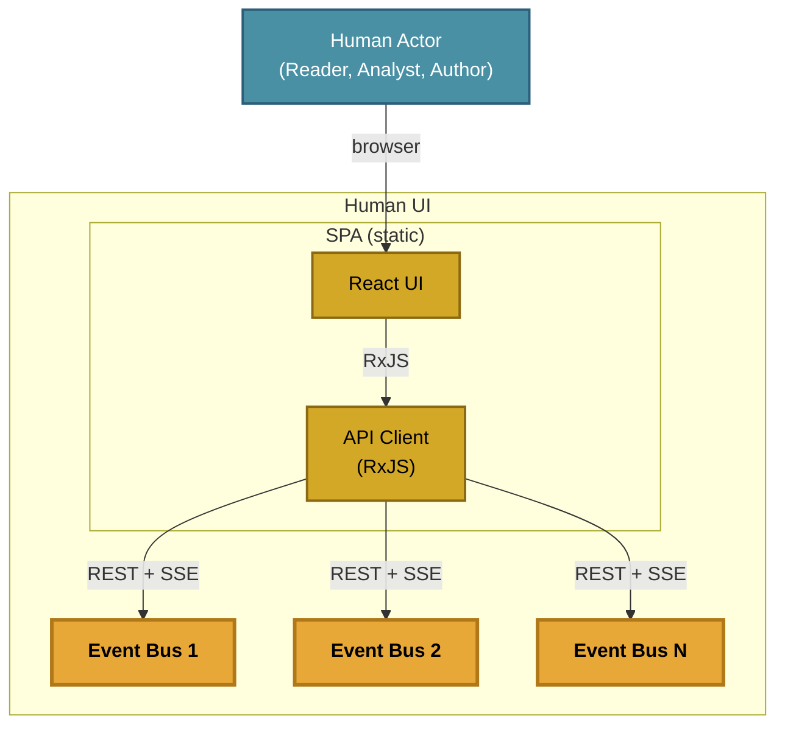

# Human UI

How human actors connect to the event bus. This page covers the Semiont Browser SPA, the state-unit split that organizes its code, and the multi-KB session model.

For the actor categories that drive the UI (Reader, Analyst, Author), see [ACTOR-MODEL.md](ACTOR-MODEL.md). For the cross-process bus contract that the SPA uses (and that workers + smelter share), see [CONTAINER-TOPOLOGY.md](CONTAINER-TOPOLOGY.md). For the reactive KB actors the SPA's events drive, see [KNOWLEDGE-SYSTEM.md](KNOWLEDGE-SYSTEM.md).

## SPA Architecture

Human actors interact through the **Semiont Browser** — the `apps/frontend` single-page app (Vite + React), packaged as the `ghcr.io/the-ai-alliance/semiont-frontend` container image. A user connects to one or more Knowledge Bases (each a separate backend); DOM interactions become bus commands through the same `/bus/emit` + `/bus/subscribe` endpoints every other Semiont actor uses. Because it's a static SPA, it can equivalently be served from any file server or CDN — the container is the deployment-ready packaging for the "download and run" path.

For end-user-facing browser docs (running it locally, accessibility, keyboard shortcuts), see **[../browser/](../browser/)**.

## State-unit split

The SPA is internally a literal Model–View–StateUnit split:

- **Model** — `@semiont/sdk` namespaces (frame, browse, mark, bind, gather, match, yield, beckon), typed RxJS Observables, per-key caches, and bus-driven invalidation.
- **StateUnit** — one factory per verb (`createBrowseStateUnit`, `createMarkStateUnit`, `createBindStateUnit`, `createGatherStateUnit`, `createMatchStateUnit`, `createYieldStateUnit`, `createBeckonStateUnit`) plus page-level composite state units; pure RxJS, framework-agnostic, unit-testable without a renderer.
- **View** — React components in `@semiont/react-ui` and `apps/frontend`, reduced to two adapters (`useStateUnit`, `useObservable`) plus JSX. No component-owned fetching, caching, or subscription management.

The state unit layer is what makes the same SDK that drives the browser also drive the CLI, MCP server, and worker pool — none of those have a renderer, but they all consume the same Model + StateUnit layer. See **[../../packages/sdk/docs/Usage.md](../../packages/sdk/docs/Usage.md)** for the SDK surface.

## Multi-KB sessions

A Semiont Browser instance can connect to multiple knowledge bases concurrently — each a separate backend with its own JWT session, its own event-bus connection, and its own resource state. Per-KB authentication and state live in `SemiontSession` (defined in `@semiont/sdk`), the same abstraction workers and the smelter use.

Storage adapters thread the same `SemiontSession` through every host environment:

- **`WebBrowserStorage`** — localStorage in the SPA.
- **Filesystem storage** — for CLI and MCP processes that need session state across invocations.
- **In-memory storage** — for workers, the smelter, and tests.

`SemiontClient` exposes namespace methods (e.g. `client.browse.resource(...)`, `client.mark.annotation(...)`) over the bus; raw `emit`/`on`/`stream` are internal to the SDK and not part of the consumer surface. The full session lifecycle — sign-in, refresh, expiry, cross-tab sync — is documented in [SemiontSession's source](../../packages/sdk/src/session/semiont-session.ts) and the [long-running session skill](../protocol/skills/semiont-session/SKILL.md).
