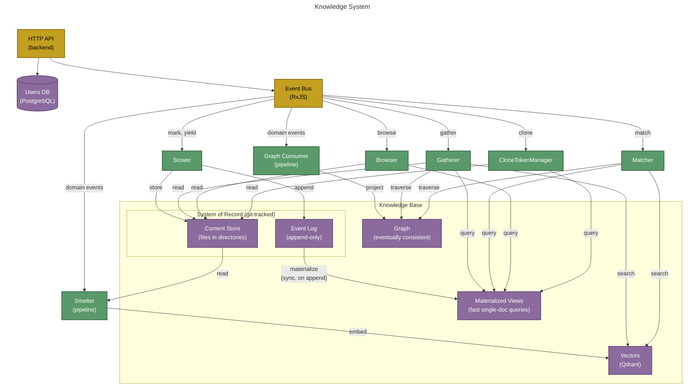

# Knowledge System

The **Knowledge System** binds the Knowledge Base to its seven reactive actors. Nothing outside the Knowledge System reads or writes the Knowledge Base directly.

The knowledge base itself is not an intelligent actor. It has no goals, preferences, or decisions. It never initiates an event. It is inert storage — the durable record of what intelligent actors decide. Seven reactive sub-actors serve it, in two categories:

- **Five access actors** mediate every read and write: **Stower** (write), **Browser** (read), **Gatherer** (context assembly), **Matcher** (search), and **CloneTokenManager** (clone tokens). They are the bus-facing interface of the knowledge base — commands and requests in, replies out, correlated by `correlationId`.
- **Two projection pipelines** keep the eventually-consistent read models in sync with the event log: the **Graph Consumer** (events → graph) and the **Smelter** (events → vectors). Pipelines are addressed by no one and reply to nothing; they consume already-persisted domain events.

All seven subscribe to the bus via RxJS pipelines and expose no public business methods — `initialize()` and `stop()` for lifecycle, plus a startup recovery entry point on the pipelines (`GraphDBConsumer.rebuildAll()`, `Smelter.reconcile()`). Callers never call into an actor directly; they put a message on the bus and trust the actor is listening.

The third derived read model — the materialized views — is deliberately **not** pipeline-maintained: the EventStore's `ViewManager` materializes views synchronously inside `appendEvent()`, before the event is published, so subscribers get a read-your-writes guarantee that a fire-and-forget pipeline cannot provide.

For the broader actor model that frames these seven, see [ACTOR-MODEL.md](ACTOR-MODEL.md). For the deployment layout (which actors live in which container), see [CONTAINER-TOPOLOGY.md](CONTAINER-TOPOLOGY.md).

## Topology

## Storage layout

| Store | Purpose | Access Pattern |
|-------|---------|---------------|
| **Event Log** | Immutable append-only log of all domain events; system of record, committed to version control | Stower appends; startup rebuilds and pipelines replay it |
| **Materialized Views** | Denormalized projections for fast reads; materialized **synchronously on append** by the EventStore's ViewManager (read-your-writes) | Gatherer/Matcher/Browser/CloneTokenManager query by resource id |
| **Content Store** | Working-tree files addressed by `storageUri` (documents, images, PDFs) | Stower registers; Gatherer/Browser/Smelter read |
| **Graph** | Eventually consistent relationship projection for traversal queries (backlinks, entity networks) | Graph Consumer projects; Gatherer/Matcher traverse and search |
| **Vectors** | Embedding vectors in Qdrant for semantic similarity search; eventually consistent | Smelter projects; Gatherer/Matcher search |

## The seven KB actors

Five access actors mediate reads and writes; two projection pipelines follow the event log.

### Stower

The Stower is the single write gateway to the knowledge base. It subscribes to command events on the bus (`mark:create`, `yield:create`, `mark:delete`, `mark:update-body`, `job:start`, `job:complete`, etc.) and translates them into domain events on the event log and content registrations in the content store. It emits reply events back onto the bus (`yield:create-ok`, `mark:delete-ok`, `*-failed`, etc.) so callers can confirm completion; the appended domain events themselves (`yield:created`, `mark:added`, ...) are republished onto the bus by the EventStore. No other code calls `eventStore.appendEvent()` or writes to the content store.

### Gatherer

The Gatherer is the read actor for context assembly. When a Generator Agent or Linker Agent emits a **gather** event, the Gatherer receives it from the bus, queries the relevant KB stores (materialized views, content store, graph, vectors), and assembles the context needed for downstream work. It emits the assembled context back onto the bus.

### Matcher

The Matcher is the read actor for entity resolution. When an Analyst or Linker Agent emits a **match** event (`match:search-requested`), the Matcher receives it from the bus, retrieves candidates from multiple KB sources (name match, entity types, graph neighborhood, vector similarity), scores them against the supplied `GatheredContext`, and emits ranked results back onto the bus — the search half of resolving a mention to its referent. (The **bind** flow that records the chosen referent is a write, handled through the Stower.) The Matcher does not need the content store directly; it works with metadata, relationships, and embeddings to find the right target.

### Browser

The Browser is the read actor for all deterministic KB queries — resources, annotations, events, annotation history, referenced-by lookups, entity-type and tag-schema listings — plus directory browse: everything the UI and CLI need to present the knowledge base to a user. If a question can be answered by one query against one index, the Browser answers it; multi-source fusion and scoring belong to the Matcher. For directory requests, it performs a prefix scan of the materialized views for tracked resources under the requested path, reads their content from the content store, and merges the result with untracked entries. Each entry is either bare (`tracked: false`) or enriched with KB metadata (resource ID, entity types, annotation count, creator). It enforces a path confinement invariant: all resolved paths must remain within `project.root`.

### CloneTokenManager

The CloneTokenManager handles the clone-token lifecycle in the yield flow. On `yield:clone-token-requested` it validates the source resource and its content, then issues a short-lived token (15-minute expiry, held in an in-memory map). `yield:clone-resource-requested` validates a token and returns the source resource; `yield:clone-create` validates the token and creates the cloned resource through the normal write path. Tokens never touch durable storage — losing them on restart is harmless.

### Graph Consumer (projection pipeline)

The Graph Consumer follows the event log and keeps the graph projection in sync. It subscribes to the graph-relevant domain events on the bus, batches bursts per resource (`groupBy(resourceId)` + adaptive burst buffering + `concatMap`), and applies them to the graph database. Because the graph is eventually consistent and rebuildable, `rebuildAll()` replays the entire event log at startup — a wiped graph volume recovers by restarting the backend. It lives on the `KnowledgeBase` record (`kb.graphConsumer`), constructed inside `createKnowledgeBase()`.

### Smelter (projection pipeline)

The Smelter is the vector projection actor. It runs in its own container (`semiont-smelter`) — not in the backend process — and reaches the backend through the unified bus, the same way workers do. Beyond the bus it has two privileged attachments: the vector store (Qdrant, direct) and the content store (the KB working tree, bind-mounted; `SEMIONT_ROOT`). When a resource is created or an annotation is added, the Smelter receives the event, reads the content from the working tree, chunks the text into overlapping passages, computes embedding vectors via the configured embedding provider (Voyage AI or Ollama), and indexes them into the vector store. Vectors are a pure projection — nothing is written back to the event log. Because Qdrant is ephemeral, the Smelter reconciles it against the KS catalog on every startup: it lists what is indexed, lists what should be (via the `browse:*` channels), re-embeds what's missing or stale (each upsert is stamped with the embedded bytes' checksum, so content changed while the worker was down is detected), and deletes orphans — so a wiped Qdrant volume, or events missed while the worker was down, recover by restarting the smelter. The Smelter follows the same RxJS burst-buffer pattern as the Graph Consumer for per-resource ordering and batch efficiency.

## See also

- The seven actors live inside `@semiont/make-meaning` — see [packages/make-meaning/docs/architecture.md](../../packages/make-meaning/docs/architecture.md) for the actor implementation pattern.
- The eight [flows](../protocol/flows/README.md) describe what each actor's events mean at the protocol level.
