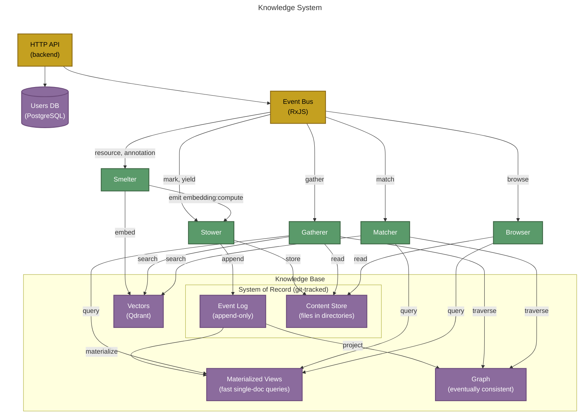

# Knowledge System

The **Knowledge System** binds the Knowledge Base to its five reactive actors. Nothing outside the Knowledge System reads or writes the Knowledge Base directly.

The knowledge base itself is not an intelligent actor. It has no goals, preferences, or decisions. It never initiates an event. It is inert storage — the durable record of what intelligent actors decide. Five reactive sub-actors mediate all access: **Stower** (write), **Gatherer** (read context), **Matcher** (read search), **Browser** (read directory), and **Smelter** (vector projection). All five subscribe to the EventBus via RxJS pipelines in `initialize()`, process events through private handlers, and communicate results back by emitting on the bus. They expose no public business methods — only `initialize()` and `stop()` for lifecycle management. Callers never call into an actor directly; they put a message on the bus and trust the actor is listening.

For the broader actor model that frames these five, see [ACTOR-MODEL.md](ACTOR-MODEL.md). For the deployment layout (which actors live in which container), see [CONTAINER-TOPOLOGY.md](CONTAINER-TOPOLOGY.md).

## Topology

## Storage layout

| Store | Purpose | Access Pattern |
|-------|---------|---------------|
| **Event Log** | Immutable append-only log of all domain events; system of record, committed to version control | Stower appends; Gatherer/Matcher read |
| **Materialized Views** | Denormalized projections for fast reads | Gatherer/Matcher/Browser query by resource URI |
| **Content Store** | Content-addressed binary storage (documents, images, PDFs) | Stower writes; Gatherer reads by SHA-256 checksum |
| **Graph** | Eventually consistent relationship projection for traversal queries (backlinks, entity networks) | Gatherer/Matcher traverse and search |
| **Vectors** | Embedding vectors in Qdrant for semantic similarity search | Smelter projects; Gatherer/Matcher search |

## The five KB actors

### Stower

The Stower is the single write gateway to the knowledge base. It subscribes to command events on the bus (`mark:create`, `yield:create`, `mark:delete`, `mark:update-body`, `job:start`, `job:complete`, etc.) and translates them into domain events on the event log and content writes to the content store. After successful persistence, it emits result events back onto the bus (`mark:created`, `yield:created`, `mark:deleted`, etc.) so callers can confirm completion. No other code calls `eventStore.appendEvent()` or `contentStore.store()`.

### Gatherer

The Gatherer is the read actor for context assembly. When a Generator Agent or Linker Agent emits a **gather** event, the Gatherer receives it from the bus, queries the relevant KB stores (materialized views, content store, graph, vectors), and assembles the context needed for downstream work. It emits the assembled context back onto the bus.

### Matcher

The Matcher is the read actor for entity resolution. When an Analyst or Linker Agent emits a **bind** event, the Matcher receives it from the bus, searches the KB stores (materialized views, graph, vectors) for matching resources, and resolves references — linking a mention to its referent. The Matcher does not need the content store directly; it works with metadata, relationships, and embeddings to find the right target. It emits search results back onto the bus.

### Browser

The Browser is the read actor for navigation and content retrieval. It handles directory listings, resource reads, and annotation lookups — everything the UI and CLI need to present the knowledge base to a user. For directory requests, it performs a prefix scan of the materialized views for tracked resources under the requested path, reads their content from the content store, and merges the result with untracked entries. Each entry is either bare (`tracked: false`) or enriched with KB metadata (resource ID, entity types, annotation count, creator). It enforces a path confinement invariant: all resolved paths must remain within `project.root`.

### Smelter

The Smelter is the vector projection actor. It runs in its own container (`semiont-smelter`) — not in the backend process — and reaches the backend through the unified bus, the same way workers do. When a resource is created or an annotation is added, the Smelter receives the event, chunks the text into overlapping passages, computes embedding vectors via the configured embedding provider (Voyage AI or Ollama), and indexes them into the vector store (Qdrant). It emits `embedding:compute` commands on the bus so the Stower can persist them as `embedding:computed` domain events in `.semiont/events/` — making them part of the system of record. The Smelter follows the same RxJS burst-buffer pattern as the Graph Consumer for per-resource ordering and batch efficiency.

## See also

- The five actors live inside `@semiont/make-meaning` — see [packages/make-meaning/docs/architecture.md](../../packages/make-meaning/docs/architecture.md) for the actor implementation pattern.
- The seven [flows](../protocol/flows/README.md) describe what each actor's events mean at the protocol level.
