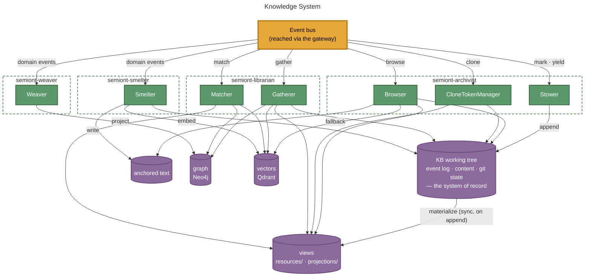

# Knowledge System

The **Knowledge System** binds the Knowledge Base to its seven reactive actors. Nothing outside the Knowledge System reads or writes the Knowledge Base directly. Operationally, a knowledge base is everything behind a gateway — the actors and stores on this page; clients see only the bus.

The knowledge base itself is inert — no goals, no decisions, never initiating an event; it is the durable record of what intelligent actors decide. Seven reactive sub-actors serve it, in two categories:

- **Five access actors** mediate every read and write: **Stower** (write), **Browser** (read), **Gatherer** (context assembly), **Matcher** (search), and **CloneTokenManager** (clone tokens). They are the bus-facing interface of the knowledge base — commands and requests in, replies out, correlated by `correlationId`.
- **Two projection pipelines** keep the eventually-consistent read models in sync with the event log: the **Weaver** (events → graph) and the **Smelter** (events → vectors). Pipelines are addressed by no one and reply to nothing; they consume already-persisted domain events.

All seven subscribe to the bus via RxJS pipelines and expose no public business methods — `initialize()` and `stop()` for lifecycle, plus a startup recovery entry point on the pipelines (`Weaver.catchUp()`, `Smelter.reconcile()`). All seven run standalone, none in the gateway, split by store affinity: the record's actors (Stower, Browser, CloneTokenManager) in `archivist-main`, the LLM-bound pair (Gatherer, Matcher) in `librarian-main`, and each projection as part of its store's stack (`weaver-main`, `smelter-main`). Callers never call into an actor directly; they put a message on the bus and trust the actor is listening.

The third derived read model — the materialized views — is deliberately **not** pipeline-maintained: the EventStore's `ViewManager` materializes views synchronously inside `appendEvent()`, before the event is published, so subscribers get a read-your-writes guarantee that a fire-and-forget pipeline cannot provide.

**The seam rule (standing).** Any new read path that consumes an eventually-consistent projection (the graph, the vectors) for content that may have *just been written* MUST declare its ordering semantics at design time, in its plan — one of exactly two choices:

1. **Eventual** — the read tolerates projection lag. Say so, and say why lag is acceptable for that consumer.
2. **Read-your-writes** — via the projection's progress fold: `weaveProgress.whenApplied(...)` for the graph, `smeltProgress.whenSettled(...)` for the vectors — with a **bounded, observable degrade** when the barrier times out (a breadcrumb plus a counter, never a silent thin result and never an unbounded wait).

"Undeclared" is not an option — both existing seams paid for its absence (a graph race shipped as a product bug; a vector race was caught only in review). Unit-level axioms cannot own this property: every one of them holds *while* the race happens, so ordering across an actor boundary belongs to the seam. Views are exempt (synchronous by construction); any future projection inherits this rule on day one.

For the broader actor model that frames these seven, see [ACTOR-MODEL.md](ACTOR-MODEL.md). For the deployment layout (which actors live in which container), see [CONTAINER-TOPOLOGY.md](CONTAINER-TOPOLOGY.md).

## Topology

```mermaid
---
title: Knowledge System
---
graph TB
    BE["Event bus<br/>(reached via the gateway)"]

    subgraph ARCHG ["semiont-archivist"]
        STOWER["Stower"]
        BROWSER["Browser"]
        CTM["CloneTokenManager"]
    end

    subgraph LIBG ["semiont-librarian"]
        GATHERER["Gatherer"]
        MATCHER["Matcher"]
    end

    subgraph WEAVG ["semiont-weaver"]
        WEAVER["Weaver"]
    end
    subgraph SMELG ["semiont-smelter"]
        SMELT["Smelter"]
    end

    TREE[("KB working tree<br/>event log · content · git state<br/>— the system of record")]
    VIEWS[("views<br/>resources/ · projections/")]
    ANCH[("anchored text")]
    GRAPH[("graph<br/>Neo4j")]
    VECTORS[("vectors<br/>Qdrant")]

    BE -->|"mark · yield"| STOWER
    BE -->|browse| BROWSER
    BE -->|clone| CTM
    BE -->|gather| GATHERER
    BE -->|match| MATCHER
    BE -->|"domain events"| WEAVER
    BE -->|"domain events"| SMELT

    STOWER -->|append| TREE
    TREE -->|"materialize (sync, on append)"| VIEWS
    BROWSER --> VIEWS
    BROWSER --> TREE
    BROWSER -->|fallback| VECTORS
    BROWSER --> ANCH
    CTM --> VIEWS
    CTM --> TREE
    GATHERER --> VIEWS
    GATHERER --> TREE
    GATHERER --> GRAPH
    GATHERER --> VECTORS
    MATCHER --> VIEWS
    MATCHER --> GRAPH
    MATCHER --> VECTORS
    WEAVER -->|project| GRAPH
    SMELT --> TREE
    SMELT -->|embed| VECTORS
    SMELT -->|write| ANCH

    classDef hub fill:#e8a838,stroke:#b07818,stroke-width:3px,color:#000
    classDef svc fill:#5a9a6a,stroke:#3d6644,stroke-width:2px,color:#fff
    classDef store fill:#8b6b9d,stroke:#6b4a7a,stroke-width:2px,color:#fff

    class BE hub
    class STOWER,BROWSER,CTM,GATHERER,MATCHER,WEAVER,SMELT svc
    class TREE,VIEWS,ANCH,GRAPH,VECTORS store

    style ARCHG fill:none,stroke:#3d6644,stroke-width:1.5px,stroke-dasharray:6 4
    style LIBG fill:none,stroke:#3d6644,stroke-width:1.5px,stroke-dasharray:6 4
    style WEAVG fill:none,stroke:#3d6644,stroke-width:1.5px,stroke-dasharray:6 4
    style SMELG fill:none,stroke:#3d6644,stroke-width:1.5px,stroke-dasharray:6 4
```

Same grammar as [CONTAINER-TOPOLOGY.md](CONTAINER-TOPOLOGY.md)'s state view: rectangles act, cylinders persist, and each actor sits inside the dashed frame of the service container that hosts it. The working-tree cylinder is the system of record; every other store is derived from it.

## Storage layout

| Store | Purpose | Access Pattern |
|-------|---------|---------------|
| **Event Log** | Immutable append-only log of all domain events; system of record, committed to version control | Stower appends; startup rebuilds and pipelines replay it |
| **Materialized Views** | Denormalized projections for fast reads; materialized **synchronously on append** by the EventStore's ViewManager (read-your-writes) | Gatherer/Matcher/Browser/CloneTokenManager query by resource id |
| **Content Store** | Working-tree files addressed by `storageUri` (documents, images, PDFs); the Archivist's container is the only one that mounts the tree | Stower registers; all other byte reads ride the Archivist's HTTP surface (the gateway proxies for external clients) |
| **Graph** | Eventually consistent relationship projection for traversal queries (backlinks, entity networks) | Weaver projects; Gatherer/Matcher traverse and search |
| **Vectors** | Embedding vectors in Qdrant for semantic similarity search; eventually consistent | Smelter projects; Gatherer/Matcher search |
| **Anchored text** | Per-representation geometry maps from PDF/OCR extraction, keyed by content checksum (see [ANCHORING.md](ANCHORING.md)) | Smelter writes (sole producer); Archivist answers the `browse:anchored-text-*` bus reads |

## The seven KB actors

Five access actors mediate reads and writes — the record's three (Stower, Browser, CloneTokenManager) run in the **archivist**, the LLM-bound pair (Gatherer, Matcher) in the **librarian**. The two projection pipelines run in their stores' own containers.

### Stower (archivist)

The single write gateway. Bus commands (`mark:create`, `mark:commit`, `yield:create`, `job:complete`, …) become domain events on the event log and content registrations; replies (`*-ok` / `*-failed`) confirm completion, and the EventStore republishes the appended domain events. No other code calls `eventStore.appendEvent()` or writes the content store.

### Browser (archivist)

The read actor for deterministic single-index queries — resources, annotations, events, history, referenced-by, entity-type and tag-schema listings, the collaborator directory, directory browse — plus the semantic fallback when lexical search finds nothing. Multi-source fusion belongs to the Matcher. Directory browse prefix-scans the views and merges untracked entries, under a path-confinement invariant: every resolved path stays within `project.root`.

### CloneTokenManager (archivist)

The clone-token lifecycle in the yield flow: issue a 15-minute in-memory token, validate it, create the clone through the normal write path. Tokens never touch durable storage — losing them on restart is harmless. That expiry is written down here and nowhere else; it is minted at [`packages/make-meaning/src/clone-token-manager.ts:96`](../../packages/make-meaning/src/clone-token-manager.ts#L96) — check this paragraph against that literal, not against another document.

### Gatherer (librarian)

Context assembly for the gather flows: queries views, graph, and vectors, reads content bytes from the archivist, and emits the assembled context back onto the bus for the Generator and Linker Agents.

### Matcher (librarian)

Candidate search and scoring for the match flow: retrieves candidates by name, entity types, graph neighborhood, and vector similarity, scores them against the supplied `GatheredContext`, and emits ranked results. The **bind** that records a chosen referent is a write, handled through the Stower.

### Weaver (projection pipeline)

Follows the domain events and keeps the graph projection in sync; beyond the bus its single privileged attachment is Neo4j. Bursts are batched per resource (`groupBy` + burst buffer + `concatMap`), every apply emits `weave:applied`, and the `whenApplied` barrier lets graph readers wait out projection lag. Startup runs a checkpointed catch-up over `browse:*` (no event-store attachment); `weave:rebuild` is the full rebuild command.

### Smelter (projection pipeline)

The vector pipeline, and a pure network peer: events arrive over SSE, content bytes are fetched from the archivist verbatim (the checksum stamped onto every upsert must hash exactly the stored bytes), chunks are embedded (Voyage AI or Ollama) and indexed into Qdrant. It is also the sole producer of the anchored-text store, derived during the same ingest read. On every startup it reconciles Qdrant against the catalog — membership *and* content freshness via the checksum stamps — re-embedding what's missing or stale and purging orphans, so a wiped volume or missed events recover by restart. Same per-resource burst-buffer pattern as the Weaver.

## See also

- The seven actors live inside `@semiont/make-meaning` — see [packages/make-meaning/docs/architecture.md](../../packages/make-meaning/docs/architecture.md) for the actor implementation pattern.
- The eight [flows](../protocol/flows/README.md) describe what each actor's events mean at the protocol level.
