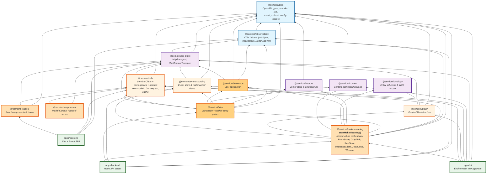

# Package Architecture

Semiont is a monorepo. Workspace packages are organized in layers from low-level primitives to high-level application logic; consumers (`apps/backend`, `apps/frontend`, `apps/cli`) sit on top.

For the per-package descriptions and npm metadata, see **[../../packages/README.md](../../packages/README.md)** — alphabetized table with one-line descriptions of every published `@semiont/*` package.

## Layered dependency graph

Edges in the graph reflect the actual `package.json` `dependencies` field for each workspace package.

## Architectural principles

1. **Single Orchestration Point.** `@semiont/make-meaning`'s `startMakeMeaning()` is the **infrastructure owner** — it initializes and manages the lifecycle of every subsystem (EventStore, GraphDB, RepStore, InferenceClient, JobQueue, Workers, GraphConsumer).

2. **Strict API Boundary.** `apps/frontend` never imports backend packages directly. Its only `@semiont/*` imports are `@semiont/sdk`, `@semiont/api-client`, `@semiont/react-ui`, and `@semiont/observability` — every interaction with the backend goes through the SDK over `HttpTransport`.

3. **Layered Dependencies.** Packages can only depend on packages in lower layers. No circular dependencies.

4. **Single-Owner Initialization.** Infrastructure components are created once by `startMakeMeaning()` and passed to consumers as function arguments or via Hono context — never re-created or re-instantiated by callers.

5. **Platform Independence.** Foundation and domain packages work in both browser and Node.js. Infrastructure packages (event-sourcing, graph, inference, jobs, make-meaning) are Node-only.

## See also

- **[../../packages/README.md](../../packages/README.md)** — alphabetized package catalog with one-line descriptions and npm links.
- **[KNOWLEDGE-SYSTEM.md](KNOWLEDGE-SYSTEM.md)** — what runs *inside* `@semiont/make-meaning` (the five KB actors).
- **[CONTAINER-TOPOLOGY.md](CONTAINER-TOPOLOGY.md)** — how these packages get assembled into the four Semiont-code containers.
