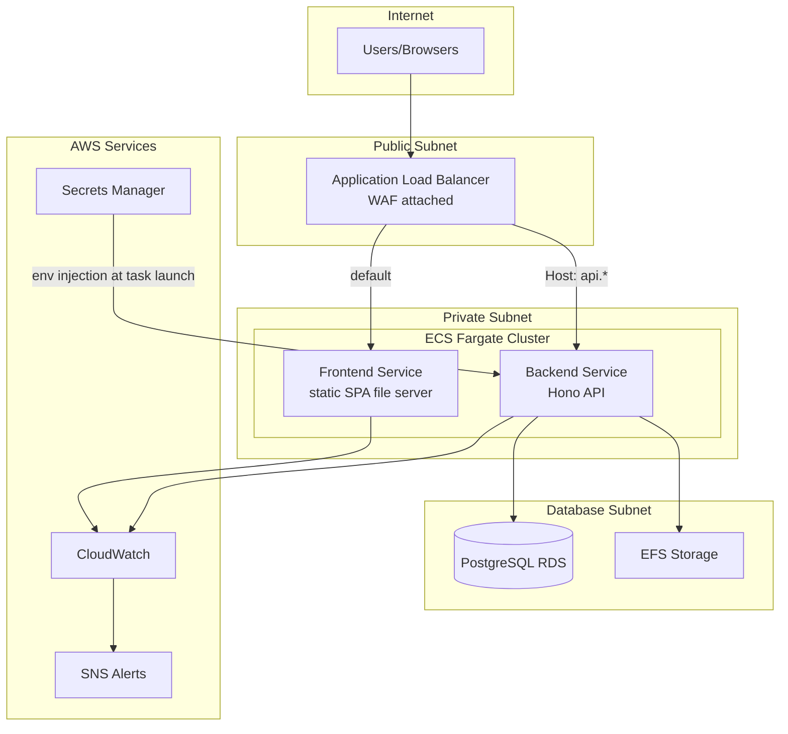
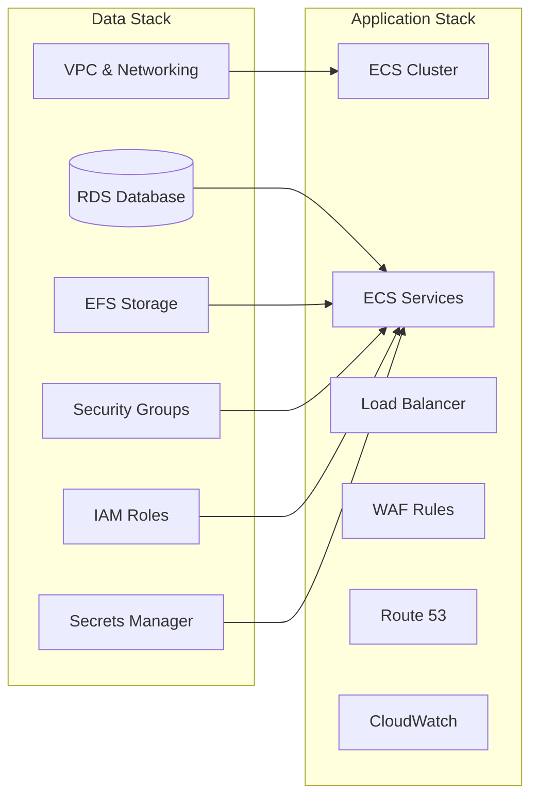
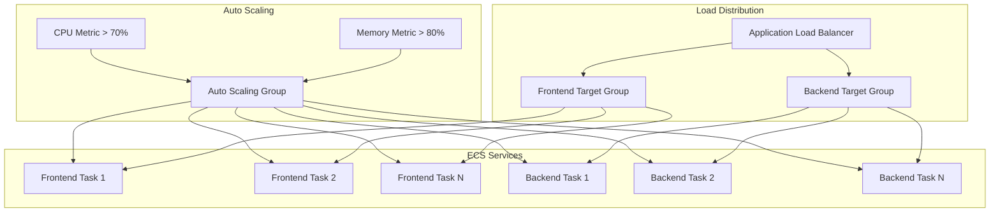

# AWS Deployment Architecture

This document describes the AWS-specific deployment architecture for Semiont, including infrastructure components, networking, security, and operational procedures.

For the platform-agnostic application architecture, see the [system architecture overview](../README.md).

## Overview

Semiont's AWS deployment uses Infrastructure as Code (CDK) with a two-stack model that separates long-lived data infrastructure from frequently updated application code.

**Key AWS Services:**
- **Compute**: ECS Fargate (serverless containers)
- **Networking**: VPC, ALB, Route 53
- **Data**: RDS PostgreSQL, EFS
- **Security**: WAF, Secrets Manager, IAM
- **Monitoring**: CloudWatch, SNS

## AWS Infrastructure Diagram



## Two-Stack Architecture

The deployment uses a **two-stack model** that separates infrastructure lifecycle:



### Data Stack (`SemiontDataStack`)

**Purpose**: Provisions foundational AWS data resources that rarely change

**Components**:
- **VPC with 3-tier networking**:
  - Public subnets (ALB, NAT gateways)
  - Private subnets (ECS tasks)
  - Database subnets (RDS, isolated)
- **PostgreSQL RDS Database**:
  - PostgreSQL 15 on t3.micro instance
  - Encrypted storage with 7-day backup retention
  - Multi-AZ disabled for cost optimization
  - Isolated in database subnets
- **EFS File System**: Encrypted persistent storage for uploads
- **AWS Secrets Manager**: All credentials and secrets
- **Security Groups**: Network access control
- **IAM Roles**: Service permissions

**CDK Code Location**: `cdk/data-stack.ts` in your scaffolded project (template: `apps/cli/templates/cdk/data-stack.ts` in the Semiont repo)

### Application Stack (`SemiontAppStack`)

**Purpose**: Deploys containerized applications and associated resources

**Components**:
- **ECS Fargate Cluster**: Container orchestration
- **Dual ECS Services**: Frontend and backend containers
- **Application Load Balancer**: Hostname-based traffic routing and SSL termination
- **WAF**: Web application firewall with rate limiting
- **Route 53**: A records for `<domain>` and `api.<domain>`, both aliased to the ALB
- **CloudWatch**: Logging and monitoring
- **SNS/Budgets**: Alerting and cost management

**CDK Code Location**: `cdk/app-stack.ts` in your scaffolded project (template: `apps/cli/templates/cdk/app-stack.ts` in the Semiont repo)

### Benefits of Two-Stack Model

1. **Faster Deployments**: App stack deploys in ~5 minutes vs full data infrastructure
2. **Lower Risk**: Database and core data infrastructure remain stable
3. **Cost Control**: Avoid accidental deletion of expensive resources
4. **Easier Rollbacks**: Application rollbacks don't affect data infrastructure
5. **Environment Isolation**: Different app stacks can share data infrastructure

## AWS Services Used

### Compute & Containers

| Service | Purpose | Configuration |
|---------|---------|---------------|
| **ECS Fargate** | Serverless container platform | 256 CPU / 512MB RAM per task |
| **ECR** | Container image registry | Automatic via CDK |
| **ECS Exec** | Container debugging | Enabled for both services |

### Networking

| Service | Purpose | Configuration |
|---------|---------|---------------|
| **VPC** | Virtual private cloud | Multi-AZ with 3-tier subnet design |
| **ALB** | Application Load Balancer | SSL termination, hostname-based routing, 300s idle timeout for SSE |
| **Route 53** | DNS management | A records for `<domain>` and `api.<domain>` |
| **Certificate Manager** | SSL/TLS certificates | Imported by ARN; must cover both hostnames |

### Data & Storage

| Service | Purpose | Configuration |
|---------|---------|---------------|
| **RDS PostgreSQL** | Relational database | t3.micro, single-AZ |
| **EFS** | File system | Encrypted, lifecycle policies |
| **Secrets Manager** | Credential storage | Automatic rotation supported |

### Security

| Service | Purpose | Configuration |
|---------|---------|---------------|
| **WAF** | Web Application Firewall | AWS managed rule sets, rate limiting |
| **Security Groups** | Network firewall | Principle of least privilege |
| **IAM** | Access management | Task execution roles |
| **VPC Flow Logs** | Network monitoring | Optional (not enabled by default) |

### Monitoring & Management

| Service | Purpose | Configuration |
|---------|---------|---------------|
| **CloudWatch** | Logging and metrics | 1-month retention |
| **CloudWatch Alarms** | Automated alerting | CPU, memory, error thresholds |
| **SNS** | Notification service | Email/SMS alerts |
| **AWS Budgets** | Cost monitoring | Monthly budget alerts |

## ALB Routing Configuration

One ALB serves both services, split by **hostname** rather than path. Route 53 publishes two A records — `<domain>` and `api.<domain>` — both aliased to the same ALB, and the ACM certificate must cover both names:

```typescript
// Priority 10: everything on the api hostname goes to the backend —
// HTTP routes (auth, admin, exchange, binary content) and the event bus
// (POST /bus/emit, GET /bus/subscribe)
ListenerCondition.hostHeaders([`api.${domainName}`])

// Default action: the static SPA serves every path on every other hostname
```

The frontend is a config-less static file server for the prebuilt SPA (the only variable it reads is `PORT`); it never proxies API traffic. The user's browser connects **directly** to the backend origin (`https://api.<domain>`) — the backend allows cross-origin requests from any origin (`origin: '*'`), and per-KB tokens live in the browser's `localStorage`. The two services never talk to each other. See [CONTAINER-TOPOLOGY.md](../CONTAINER-TOPOLOGY.md) and [apps/frontend/docs/CONTAINER.md](../../../apps/frontend/docs/CONTAINER.md).

The ALB's `idleTimeout` is raised to **300 seconds** because `GET /bus/subscribe` is a long-lived SSE stream. The backend heartbeats every 15s, so the 60s default would work — the headroom keeps a replay pause or event-loop stall from severing every connected client (streams the ALB does cut are resumed by the SDK via `Last-Event-ID` replay).

**Benefits**:
- **No backend path-prefix list to maintain**: one host-header rule covers `/api/*`, `/bus/emit`, `/bus/subscribe`, and every other backend route
- **No path conflicts**: the SPA's client-side routes can't shadow backend routes, or vice versa
- **Clear separation**: each service has its own browser-reachable HTTPS origin
- **Independent scaling**: Frontend and backend scale separately

## Security Architecture

### Network Security

- **3-Tier VPC**: Public, private, and database subnets
- **Security Groups**: Principle of least privilege
- **Private Database**: No internet access, ECS-only connections
- **NAT Gateways**: Outbound internet for private subnets

### WAF Protection

Web Application Firewall (regional, associated with the ALB) with multiple security rules:
- AWS Managed Core Rule Set (common vulnerabilities)
- AWS Managed Known Bad Inputs protection
- Rate limiting (2000 requests per 5-minute window per IP)
- An allow rule for MCP OAuth callbacks with localhost redirect targets
- Enhanced exclusions for file uploads to prevent false positives

### Application Security

- **HTTPS Everywhere**: SSL termination at ALB
- **Secret Management**: All credentials in AWS Secrets Manager
- **IAM Roles**: Task-level permissions, no hardcoded credentials
- **VPC Isolation**: Backend and database in private subnets

### Data Security

- **Encryption at Rest**: RDS and EFS encrypted with AWS KMS
- **Encryption in Transit**: HTTPS/TLS for all connections
- **Database Isolation**: Private subnets with no internet access
- **Backup Encryption**: Automated encrypted backups

## Scalability Design



### Horizontal Scaling

- **ECS Auto Scaling**: CPU/memory-based task scaling
  - Backend: 1-10 tasks, scales at 70% CPU or 80% memory
  - Frontend: 1-5 tasks, scales at 70% CPU or 80% memory
- **ALB Distribution**: Traffic spread across healthy instances
- **Multi-AZ Database**: High availability (optional, disabled for cost)

### Deployment Resilience

- **Circuit Breaker**: Both services configured with automatic rollback on failed deployments
- **Rolling Deployments**: 100% minimum healthy, 200% maximum during deployments
- **Health Check Grace Period**: 2-minute grace period for service startup
- **ECS Exec**: Enabled for debugging and maintenance access

### Vertical Scaling

- **Fargate**: Easy CPU/memory adjustments without downtime
- **RDS Instance Types**: Seamless database instance upgrades
- **EFS Performance**: Automatic throughput scaling

## Monitoring & Observability

### CloudWatch Logging

- **Log Group**: Single log group (`SemiontLogGroup`) with 1-month retention
- **Service-Specific Streams**:
  - Frontend: `semiont-frontend` prefix
  - Backend: `semiont-backend` prefix
- **Log Drivers**: AWS Logs driver for automatic CloudWatch integration
- **Structured Logging**: JSON-formatted log entries with service-specific prefixes

### Metrics & Dashboards

- **ECS Service Metrics**: CPU, memory, task count
- **ALB Metrics**: Request count, latency, error rates
- **RDS Metrics**: Database performance and connections
- **WAF Metrics**: Request filtering and security events
- **Custom Dashboards**: Operational visibility

### Alerting

- **CloudWatch Alarms**: Automated threshold monitoring
- **SNS Notifications**: Email/SMS alerts
- **Cost Budgets**: Spending limit notifications
- **Health Check Failures**: Service availability alerts

## Deployment Pipeline

### Infrastructure as Code (CDK)

All infrastructure defined in TypeScript using AWS CDK:

**Advantages**:
- **Type Safety**: Compile-time validation
- **Reusability**: Shared constructs and patterns
- **Version Control**: All changes tracked in Git
- **Automated Rollbacks**: CloudFormation change sets

**CDK Structure** (scaffolded into your project by `semiont init`, from `apps/cli/templates/` in the Semiont repo):
```
<project-root>/
├── cdk.json                # CDK configuration (app entry: cdk/app.ts)
└── cdk/
    ├── app.ts              # CDK app entry point
    ├── data-stack.ts       # Data Stack (VPC, RDS, EFS, secrets)
    └── app-stack.ts        # Application Stack (ECS, ALB, WAF, Route 53)
```

### Deployment Commands

For complete deployment procedures, see [DEPLOYMENT.md](../administration/DEPLOYMENT.md).

```bash
# Set default environment
export SEMIONT_ENV=production

# Deploy infrastructure (rare)
semiont provision

# Deploy application (frequent)
semiont publish

# Service management
semiont restart  # All services
semiont restart --service frontend  # Specific service
semiont watch logs  # Monitor logs
```

### Management Operations

AWS operations are built into the Semiont CLI's AWS platform handlers:
- **Dynamic Resource Discovery**: No hardcoded ARNs
- **Service-Specific Operations**: Frontend/backend command targeting
- **Stack Provisioning**: `semiont provision` drives `cdk deploy` from the project root

**Code Location**: `apps/cli/src/platforms/aws/` in the Semiont repo

## Cost Optimization

### Resource Sizing

- **t3.micro RDS**: Minimal database instance for development ($15/month)
- **256 CPU / 512MB ECS**: Right-sized containers ($0.01/hour per task)
- **Single AZ**: Reduced NAT gateway and data transfer costs
- **EFS Lifecycle**: Automatic transition to cheaper storage tiers

### Operational Efficiency

- **Fargate Spot**: Cost savings for non-critical workloads (future)
- **Reserved Capacity**: Long-term cost reduction (future)
- **Budget Alerts**: Proactive cost monitoring

### Cost Breakdown (Estimated Monthly)

| Service | Configuration | Est. Cost |
|---------|---------------|-----------|
| RDS (t3.micro) | Single-AZ, 20GB storage | $15 |
| ECS Fargate | 2 tasks, 24/7 | $15 |
| ALB | Standard load balancer | $20 |
| NAT Gateway | Single-AZ | $35 |
| EFS | 10GB standard | $3 |
| Route 53 | 1 hosted zone | $0.50 |
| **Total** | | **~$89/month** |

*Costs may vary based on actual usage and region*

## Environment Configuration

### Secrets Management

All secrets are created by the Data Stack in AWS Secrets Manager (CloudFormation-generated names) and shared with the App Stack via CloudFormation exports:

- Database credentials (username + password)
- JWT signing secret
- Admin bootstrap password
- Google OAuth client credentials
- Admin email list

**Access Pattern**: ECS injects secret values into the backend container as environment variables at task launch — the application never calls the Secrets Manager API at runtime:

```typescript
// cdk/app-stack.ts — backend container definition
secrets: {
  DB_USER: ecs.Secret.fromSecretsManager(dbCredentials, 'username'),
  DB_PASSWORD: ecs.Secret.fromSecretsManager(dbCredentials, 'password'),
  JWT_SECRET: ecs.Secret.fromSecretsManager(jwtSecret, 'jwtSecret'),
  // ... GOOGLE_CLIENT_ID/SECRET, ADMIN_EMAIL, ADMIN_PASSWORD
}
```

### Environment Variables

**Backend** (set via the ECS task definition):

- `NODE_ENV` - Runtime environment
- `DB_HOST` / `DB_PORT` / `DB_NAME` - PostgreSQL endpoint (from Data Stack exports)
- `DB_USER` / `DB_PASSWORD` / `JWT_SECRET` / `GOOGLE_CLIENT_ID` / `GOOGLE_CLIENT_SECRET` / `ADMIN_EMAIL` / `ADMIN_PASSWORD` - Injected from Secrets Manager
- `OAUTH_ALLOWED_DOMAINS` - Comma-separated OAuth email domains
- `AWS_REGION` - For AWS SDK clients (S3 storage, Neptune graph)

EFS is mounted at `/kb` (the backend image's working directory) for the knowledge-base git repo and working tree.

**Frontend**: none. The image is a config-less static file server — the only variable it reads is `PORT` (default 3000). There is no backend URL to inject; users add knowledge-base origins in the app's connection panel and the browser talks to the backend directly.

## Health Checks

### ALB Health Checks

Each target group has its own check (30-second interval, 10-second timeout, healthy after 2 successes, unhealthy after 5 failures):

- **Backend**: `GET /api/health`
- **Frontend**: `GET /`

### ECS Health Checks

- **Container health check**: node-based HTTP probe (the alpine images ship no curl) — 30-second interval, 5-second timeout, 3 retries, 1-minute start period
- **Grace period**: 120 seconds for service startup
- **Failure action**: Automatic task replacement

## Disaster Recovery

### Backup Strategy

- **RDS Automated Backups**: Daily snapshots, 7-day retention
- **EFS**: Automatic replication within region
- **CloudFormation Stacks**: Version controlled in Git
- **Container Images**: Stored in ECR with versioning

### Recovery Procedures

1. **Database Restoration**:
   ```bash
   aws rds restore-db-instance-from-db-snapshot \
     --db-instance-identifier semiont-restored \
     --db-snapshot-identifier semiont-snapshot-2025-10-23
   ```

2. **Infrastructure Redeployment**:
   ```bash
   # From the project root (cdk.json lives there; stacks in cdk/)
   npx cdk deploy SemiontDataStack
   npx cdk deploy SemiontAppStack
   # or equivalently: semiont provision
   ```

3. **Application Rollback**:
   ```bash
   semiont publish --image-tag previous-version
   ```

## Future Enhancements

### Scalability

- **Multi-AZ RDS**: High availability for production
- **ElastiCache**: Redis caching layer
- **CloudFront Edge Functions**: Global compute distribution
- **S3 + CloudFront for the static SPA**: Reduce ECS/ALB load

### Security

- **AWS Config**: Compliance and configuration drift detection
- **GuardDuty**: Threat detection and monitoring
- **Secrets Rotation**: Automatic credential rotation
- **VPC Flow Logs**: Network traffic analysis

### Operational

- **CI/CD Pipeline**: GitHub Actions → ECR → ECS
- **Blue/Green Deployments**: Zero-downtime updates
- **Canary Releases**: Gradual rollout strategies
- **X-Ray**: Distributed tracing

## Troubleshooting

### Common Issues

**ECS Task Fails to Start**:
- Check CloudWatch logs: `semiont watch logs`
- Verify secrets are accessible
- Check security group rules

**ALB Health Checks Failing**:
- Verify the health endpoint responds (`/api/health` for the backend, `/` for the frontend)
- Check ECS task is running
- Review security group ingress rules

**RDS Connection Timeout**:
- Verify security group allows ECS → RDS
- Check RDS is in correct subnet
- Confirm connection string is correct

**High Costs**:
- Review CloudWatch metrics for over-provisioning
- Check NAT Gateway data transfer
- Consider single-AZ for non-production

## Related Documentation

- [Architecture Overview](../README.md) - Platform-agnostic application architecture
- [Deployment Guide](../administration/DEPLOYMENT.md) - Step-by-step deployment instructions
- [Configuration Guide](../administration/CONFIGURATION.md) - Environment and secret management
- [Database Management](../administration/DATABASE.md) - PostgreSQL management on RDS
- [Troubleshooting](../administration/TROUBLESHOOTING.md) - Common issues and solutions

---

**Document Version**: 1.1
**Last Updated**: 2026-07-16
**Target Platform**: AWS (ECS Fargate, RDS, EFS)
