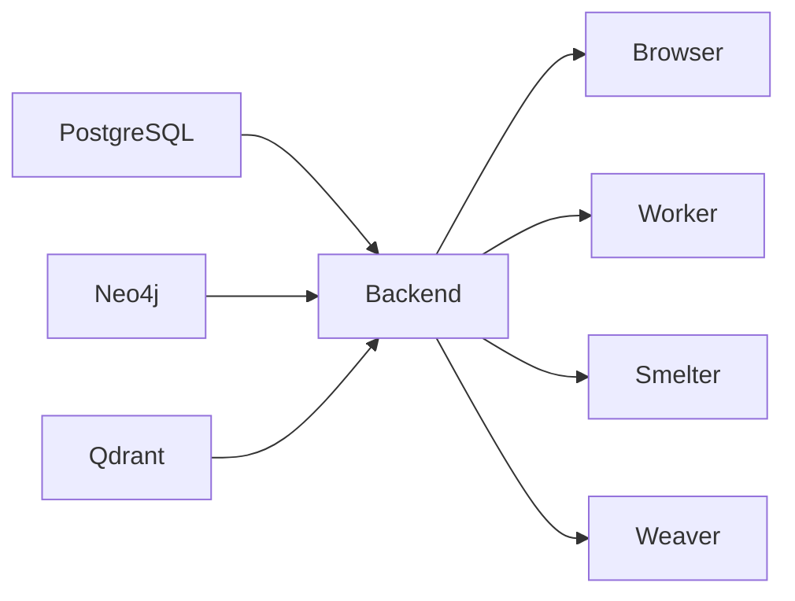

# Services Overview

A deployment-focused overview of Semiont's services. For API documentation, see the individual package docs.

## Service catalog

Five services run Semiont code. Each is a published container image; see [Container Images](../administration/IMAGES.md) and [Container Topology](../CONTAINER-TOPOLOGY.md).

| Service | Port | What runs | Bundled package | Docs |
|---|---|---|---|---|
| **browser** | 3000 | Static server for the Semiont Browser SPA | `semiont-browser` | [README](../../../apps/browser/README.md) |
| **backend** | 4000 | API server + unified bus gateway; Stower, Browser, Gatherer, Matcher | `semiont-backend` | [README](../../../apps/gateway/README.md) |
| **worker** | 9090 | Annotation/generation worker pool | `@semiont/jobs` | [API](../../../packages/jobs/docs/API.md) |
| **smelter** | 9091 | Embedding/vector pipeline actor | `@semiont/make-meaning` | [Package](../../../packages/make-meaning/) |
| **weaver** | 9092 | Graph-projection actor | `@semiont/make-meaning` | [Package](../../../packages/make-meaning/) |

For what the actors inside those containers are responsible for, see [Knowledge System](../KNOWLEDGE-SYSTEM.md).

### Infrastructure dependencies

| Role | Product | Port | Purpose |
|---|---|---|---|
| **database** | PostgreSQL | 5432 | User authentication only — see [Database Guide](../administration/DATABASE.md) |
| **graph** | Neo4j | 7474, 7687 | Graph projection of the event log |
| **vectors** | Qdrant | 6333 | Embeddings and semantic search |
| **inference** | Ollama | 11434 | Local LLM + embeddings (or Anthropic instead, for LLM) |
| **traces** | Jaeger | 16686, 4318 | OTLP traces + metrics; on by default, `--no-observe` skips it |

`embedding` is a role with no container of its own: in practice it is either the Ollama that `inference` already provides, or a remote service.

### Storage substrate

| Store | Package | Where it lives |
|---|---|---|
| **Event log** | `@semiont/event-sourcing` | `.semiont/events/` in the KB git repo — the system of record ([Storage Layout](../../../packages/event-sourcing/docs/STORAGE-LAYOUT.md)) |
| **Content store** | `@semiont/content` | Content-addressed blobs ([API](../../../packages/content/docs/API.md)) |
| **Graph** | `@semiont/graph` | Neo4j or in-memory ([API](../../../packages/graph/docs/API.md), [Architecture](../../../packages/graph/docs/ARCHITECTURE.md)) |
| **Vectors** | `@semiont/vectors` | Qdrant or in-memory ([Package](../../../packages/vectors/)) |
| **Users** | Prisma / PostgreSQL | The `users` table, nothing else |

The event log is the system of record; the graph, the vector store, and the materialized views are projections of it. A disagreement between a projection and the log is a bug in the projection.

## Service management

The stack is managed by the `semiont` launcher — a single static binary, installed with Homebrew, that drives your container runtime:

```bash
brew install the-ai-alliance/semiont/semiont
```

Run these from a knowledge-base directory:

```bash
semiont start                      # Whole stack
semiont start --list-configs       # Which inference configs this KB ships
semiont start --config anthropic   # Bring it up on a named config

semiont status                     # Container state + per-service health
semiont logs                       # Follow every service
semiont logs --service backend     # One service

semiont start --service backend    # Restart just one service, leaving the rest up
semiont stop                       # Tear the stack down
semiont stop --service worker      # Stop one service
semiont clean                      # Remove persistent state (PostgreSQL, Qdrant, Neo4j)
```

`--service` takes one of `backend`, `worker`, `smelter`, `weaver`, `browser`, `database`, `graph`, `vectors`, `inference`, or `traces`. Omitting it means the whole stack — there is no `--service all`. `semiont stop` deliberately leaves persistent state behind so the next `start` reuses it; `semiont clean` is the only thing that removes it.

Run `semiont <command> --help` for a command's options and `semiont --help` for the full verb list.

Services log to stdout, so `semiont logs` is the way to read them — there are no per-service log files.

The launcher has no `exec` verb. To get a shell in a running service, use your container engine; containers are named `semiont-<service>`:

```bash
container exec -it semiont-backend sh    # or: docker exec -it semiont-backend sh
```

### Configuration

Services are configured per environment in the KB's `.semiont/semiontconfig/<name>.toml`. `semiont init` generates one and `semiont start --config <name>` selects it; the shape is:

```toml
[defaults]
environment = "local"

[environments.local.backend]
platform = "posix"
port = 4000
publicURL = "http://${BACKEND_HOST:-localhost}:4000"

[environments.local.graph]
platform = "external"
type = "neo4j"
uri = "bolt://${NEO4J_HOST}:7687"
username = "neo4j"
password = "localpass"
database = "neo4j"

[environments.local.vectors]
type = "qdrant"          # or: memory
host = "${QDRANT_HOST}"
port = 6333

[environments.local.embedding]
platform = "external"
type = "ollama"
model = "nomic-embed-text"
baseURL = "http://${OLLAMA_HOST}:11434"

[environments.local.embedding.chunking]
chunkSize = 512
overlap = 64

# Provider credentials
[environments.local.inference.anthropic]
platform = "external"
apiKey = "${ANTHROPIC_API_KEY}"

# Bindings: which provider and model each consumer uses
[environments.local.actors.gatherer.inference]
type = "anthropic"
model = "claude-haiku-4-5-20251001"

[environments.local.workers.default.inference]
type = "anthropic"
model = "claude-haiku-4-5-20251001"

[environments.local.database]
platform = "external"
host = "${POSTGRES_HOST}"
port = 5432
name = "semiont"
user = "postgres"
password = "localpass"
```

Note the split: `[environments.local.inference.<provider>]` carries a provider's credentials, while `[environments.local.{actors.<actor>,workers.<pool>}.inference]` binds one consumer to a `(type, model)` pair. That is what lets a lighter model serve high-volume annotation workers while the Gatherer uses a stronger one.

See the [Configuration Guide](../administration/CONFIGURATION.md) for the full schema.

## Service dependencies

### Startup order



`semiont start` handles this ordering: the infrastructure containers come up first, then the backend, then everything that talks to the backend's bus.

### Runtime dependencies

- **Browser** → nothing. It serves static assets; the SPA in the user's browser talks to the backend directly.
- **Backend** → PostgreSQL (users), event log, graph, vector store, inference
- **Worker** → backend bus, inference
- **Smelter** → backend bus, vector store, embeddings
- **Weaver** → backend bus, graph
- **MCP server** → backend bus

## Service communication

Every actor that runs Semiont code is a bus participant. The backend exposes exactly two runtime endpoints carrying domain traffic — `POST /bus/emit` and `GET /bus/subscribe` (SSE, with dynamic channel subscription and Last-Event-ID replay). Every other HTTP route serves auth, admin, exchange, binary content, or infrastructure.

The worker, smelter, and weaver authenticate via `POST /api/tokens/agent`, exchanging `SEMIONT_WORKER_SECRET` plus a `(provider, model)` identity for a JWT carrying a typed Software-agent DID.

See [Container Topology](../CONTAINER-TOPOLOGY.md) for the full picture.

## Health checks

`semiont status` probes each role at a fixed endpoint and reports the result alongside container state. The probes it uses:

| Role | Probe |
|---|---|
| backend | `http://localhost:4000/api/health` |
| worker | `http://localhost:9090/health` |
| smelter | `http://localhost:9091/health` |
| weaver | `http://localhost:9092/health` |
| database | TCP connect on 5432 |
| graph | `http://localhost:7474` |
| vectors | `http://localhost:6333/readyz` |
| inference / embedding | `http://localhost:11434/api/version` |
| traces | `http://localhost:16686` |

Every role but `traces` counts toward the exit status, so `semiont status` is usable as a gate in a script. The Browser has no probe — it is a static file server with nothing to be unhealthy about.

The backend's `/api/health` reports database reachability and the environment name; the rest are liveness.

## Observability

Local stacks run Jaeger by default (`--no-observe` skips it). The backend, worker, smelter, and weaver export OTLP traces and metrics to it; the UI is at http://localhost:16686. Application logs go to stdout as structured JSON — read them with `semiont logs`.

## Platform support

The launcher runs the stack in containers on **Apple Container, Docker, or Podman** (`--runtime`), locally or on a GitHub-hosted machine (`--runtime codespace`).

Nothing in the architecture requires containers: the packages are plain Node, so the same code can run as bare processes, as ECS Fargate tasks, or as Kubernetes pods. What the launcher supports today is the container path; running the published images anywhere else is not supported by this repo. See [Deployment](../administration/DEPLOYMENT.md) and [Platforms](../platforms/README.md).

## Troubleshooting

**A service won't start**

```bash
semiont status                     # Which service is unhealthy
semiont logs --service backend     # Why
```

Containers are started without `--rm`, so a crashed container stays inspectable and its logs survive.

**Database connection failed**

```bash
semiont status
container exec semiont-postgres pg_isready -U postgres
semiont logs --service database
```

See the [Database Guide](../administration/DATABASE.md).

**Graph or vectors unavailable**

Both degrade rather than fail — core features work without them. See [Graph Architecture](../../../packages/graph/docs/ARCHITECTURE.md#graceful-degradation).

More at [TROUBLESHOOTING.md](../administration/TROUBLESHOOTING.md).

## Related

- [Container Topology](../CONTAINER-TOPOLOGY.md) — how the containers are partitioned and how they talk
- [Container Images](../administration/IMAGES.md) — what is published, and its supply-chain attestations
- [Knowledge System](../KNOWLEDGE-SYSTEM.md) — the actors and how knowledge flows
- [Configuration Guide](../administration/CONFIGURATION.md) — the full config schema
- [Database Guide](../administration/DATABASE.md) — PostgreSQL and Prisma
- [Filesystem Patterns](../FILESYSTEM.md) — storage layout on disk
- [launcher README](../../../apps/launcher/README.md) — every verb, in detail
