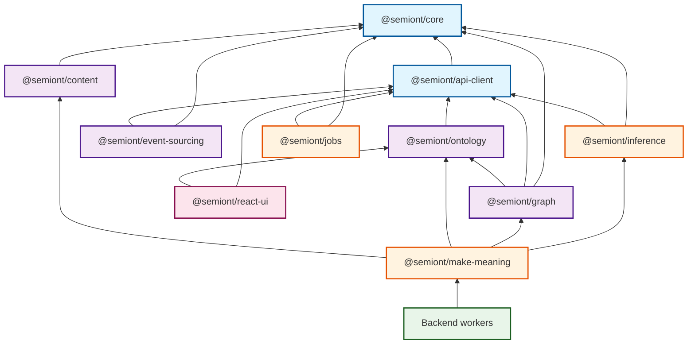

# @semiont Packages

Modular packages for the Semiont platform, organized in a layered architecture from low-level primitives to high-level application logic.

## Dependency Graph

## Published Packages

| Package | Version | Source | Description |
| ------- | ------- | ------ | ----------- |
| [@semiont/api-client](https://www.npmjs.com/package/@semiont/api-client) |  | [api-client](./api-client/) | OpenAPI-generated types and API client |
| [@semiont/core](https://www.npmjs.com/package/@semiont/core) |  | [core](./core/) | Core types, utilities, and domain models (ResourceId, AnnotationId, config) |
| [@semiont/ontology](https://www.npmjs.com/package/@semiont/ontology) |  | [ontology](./ontology/) | Entity types, tag schemas, W3C annotation vocabularies |
| [@semiont/content](https://www.npmjs.com/package/@semiont/content) |  | [content](./content/) | Content-addressed storage using checksums |
| [@semiont/event-sourcing](https://www.npmjs.com/package/@semiont/event-sourcing) |  | [event-sourcing](./event-sourcing/) | Event store, event bus, view storage (filesystem-based) |
| [@semiont/graph](https://www.npmjs.com/package/@semiont/graph) |  | [graph](./graph/) | Graph database abstraction (Neo4j, Neptune, JanusGraph, in-memory) |
| [@semiont/inference](https://www.npmjs.com/package/@semiont/inference) |  | [inference](./inference/) | AI primitives: prompts, parsers, generateText (OpenAI, Claude, local LLMs) |
| [@semiont/jobs](https://www.npmjs.com/package/@semiont/jobs) |  | [jobs](./jobs/) | Filesystem-based job queue for long-running operations |
| [@semiont/make-meaning](https://www.npmjs.com/package/@semiont/make-meaning) |  | [make-meaning](./make-meaning/) | Context assembly, pattern detection, and reasoning APIs |
| [@semiont/react-ui](https://www.npmjs.com/package/@semiont/react-ui) |  | [react-ui](./react-ui/) | React components and hooks for Semiont UIs |
| [@semiont/cli](https://www.npmjs.com/package/@semiont/cli) |  | [cli](../apps/cli/) | Command-line interface for Semiont |
| [@semiont/test-utils](https://www.npmjs.com/package/@semiont/test-utils) | - | [test-utils](./test-utils/) | Shared test utilities, mock factories, fixtures |
| [@semiont/mcp-server](https://www.npmjs.com/package/@semiont/mcp-server) | - | [mcp-server](./mcp-server/) | Model Context Protocol server for Claude Desktop integration |

## Getting Started

See [Package Development Guide](./docs/DEVELOPMENT.md) for detailed development instructions, guidelines, and philosophy.

## License

Apache-2.0

## Contributing

See [CONTRIBUTING.md](../CONTRIBUTING.md)
