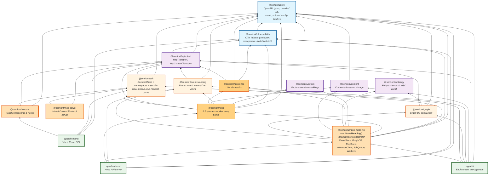

# @semiont Packages

Modular packages for the Semiont platform, organized in a layered architecture from low-level primitives to high-level application logic.

## Architecture Overview

### Layered Dependency Graph

```mermaid
graph BT
    %% Layer 5: Application Consumers
    backend["apps/backend<br/><i>Hono API server</i>"]
    frontend["apps/frontend<br/><i>Vite + React SPA</i>"]
    cli["apps/cli<br/><i>Environment management</i>"]

    %% Layer 4: Application Logic
    meaning["@semiont/make-meaning<br/><b>startMakeMeaning()</b><br/><i>Infrastructure orchestrator</i><br/>EventStore, GraphDB, RepStore,<br/>InferenceClient, JobQueue, Workers"]
    react["@semiont/react-ui<br/><i>React components & hooks</i>"]
    mcp["@semiont/mcp-server<br/><i>Model Context Protocol server</i>"]

    %% Layer 3: AI + Workers
    inference["@semiont/inference<br/><i>LLM abstraction</i>"]
    jobs["@semiont/jobs<br/><i>Job queue + worker entry points</i>"]

    %% Layer 2: SDK + Domain Storage
    sdk["@semiont/sdk<br/><i>SemiontClient + namespaces + session<br/>view-models, bus-request, cache</i>"]
    graph_pkg["@semiont/graph<br/><i>Graph DB abstraction</i>"]
    event["@semiont/event-sourcing<br/><i>Event store & materialized views</i>"]

    %% Layer 1: Wire + Storage Primitives
    api["@semiont/api-client<br/><i>HttpTransport, HttpContentTransport</i>"]
    content["@semiont/content<br/><i>Content-addressed storage</i>"]
    vectors["@semiont/vectors<br/><i>Vector store & embeddings</i>"]
    ontology["@semiont/ontology<br/><i>Entity schemas & W3C vocab</i>"]

    %% Layer 0: Foundation
    core["@semiont/core<br/><i>OpenAPI types, branded IDs,<br/>event protocol, config loaders</i>"]
    obs["@semiont/observability<br/><i>OTel helpers (withSpan,<br/>traceparent, Node/Web init)</i>"]

    %% Application dependencies
    backend --> meaning
    backend --> jobs
    backend --> event
    backend --> obs
    backend --> core
    frontend --> react
    frontend --> sdk
    frontend --> api
    frontend --> obs
    cli --> meaning
    cli --> sdk
    cli --> graph_pkg
    cli --> event
    cli --> content
    cli --> api
    cli --> core

    %% Application logic dependencies
    meaning --> event
    meaning --> graph_pkg
    meaning --> content
    meaning --> ontology
    meaning --> inference
    meaning --> vectors
    meaning --> jobs
    meaning --> sdk
    meaning --> obs
    meaning --> core
    react --> sdk
    react --> api
    react --> core
    mcp --> sdk
    mcp --> api

    %% AI + Workers dependencies
    inference --> api
    inference --> core
    inference --> obs
    jobs --> sdk
    jobs --> api
    jobs --> inference
    jobs --> content
    jobs --> event
    jobs --> vectors
    jobs --> obs
    jobs --> core

    %% SDK + Domain Storage dependencies
    sdk --> api
    sdk --> core
    graph_pkg --> api
    graph_pkg --> ontology
    graph_pkg --> core
    event --> api
    event --> core

    %% Wire + Primitives dependencies
    api --> obs
    api --> core
    content --> core
    vectors --> core
    %% ontology has no @semiont/* deps

    %% Foundation
    obs --> core

    %% Styling by layer
    classDef layer0 fill:#e1f5fe,stroke:#01579b,stroke-width:3px
    classDef layer1 fill:#f3e5f5,stroke:#4a148c,stroke-width:2px
    classDef layer2 fill:#fff3e0,stroke:#e65100,stroke-width:2px
    classDef layer3 fill:#ffd180,stroke:#e65100,stroke-width:2px
    classDef layer4 fill:#ffe0b2,stroke:#e65100,stroke-width:3px
    classDef layer5 fill:#e8f5e9,stroke:#1b5e20,stroke-width:3px

    class core,obs layer0
    class api,content,vectors,ontology layer1
    class sdk,event,graph_pkg layer2
    class inference,jobs layer3
    class meaning,react,mcp layer4
    class backend,frontend,cli layer5
```

Edges in the graph reflect the actual `package.json` `dependencies` field for each workspace package.

### Key Architectural Principles

1. **Single Orchestration Point**: `@semiont/make-meaning`'s `startMakeMeaning()` function is the **infrastructure owner** - it initializes and manages the lifecycle of ALL subsystems (EventStore, GraphDB, RepStore, InferenceClient, JobQueue, Workers, GraphConsumer)

2. **Strict API Boundary**: `apps/frontend` never imports backend packages directly. Its only `@semiont/*` imports are `@semiont/sdk`, `@semiont/api-client`, `@semiont/react-ui`, and `@semiont/observability` — every interaction with the backend goes through the SDK over `HttpTransport`

3. **Layered Dependencies**: Packages can only depend on packages in lower layers (no circular dependencies)

4. **Single-Owner Initialization**: Infrastructure components are created once by `startMakeMeaning()` and passed to consumers as function arguments or via Hono context

5. **Platform Independence**: Foundation and domain packages work in both browser and Node.js (infrastructure packages are Node-only)

## Published Packages

Grouped by layer (foundation first), matching the dependency graph above.

### Foundation

| Package | Version | Source | Description |
| ------- | ------- | ------ | ----------- |
| [@semiont/core](https://www.npmjs.com/package/@semiont/core) |  | [core](./core/) | OpenAPI-generated types, branded IDs, EventBus + ITransport contract, event protocol, W3C / locale / text helpers, config loaders |
| [@semiont/observability](https://www.npmjs.com/package/@semiont/observability) |  | [observability](./observability/) | OpenTelemetry helpers — `withSpan`, traceparent inject/extract, Node + Web SDK init. No-op when no exporter is configured |

### Wire + Storage primitives

| Package | Version | Source | Description |
| ------- | ------- | ------ | ----------- |
| [@semiont/api-client](https://www.npmjs.com/package/@semiont/api-client) |  | [api-client](./api-client/) | HTTP transport adapter — `HttpTransport` (REST + SSE), `HttpContentTransport` (binary I/O). Consumed by `@semiont/sdk` |
| [@semiont/content](https://www.npmjs.com/package/@semiont/content) |  | [content](./content/) | Content-addressed storage for resource representations (SHA-256, deduplicated) |
| [@semiont/vectors](https://www.npmjs.com/package/@semiont/vectors) |  | [vectors](./vectors/) | Vector storage (Qdrant + in-memory), embedding providers (Voyage, Ollama), chunking, semantic search |
| [@semiont/ontology](https://www.npmjs.com/package/@semiont/ontology) |  | [ontology](./ontology/) | Entity types, tag schemas, W3C annotation vocabularies |

### SDK + Domain storage

| Package | Version | Source | Description |
| ------- | ------- | ------ | ----------- |
| [@semiont/sdk](https://www.npmjs.com/package/@semiont/sdk) |  | [sdk](./sdk/) | `SemiontClient`, verb-oriented namespaces, `SemiontSession` + `SemiontBrowser`, view-models (MVVM), `bus-request` + cache. Transport-agnostic — pair with `@semiont/api-client` (HTTP) or `@semiont/make-meaning` (in-process) |
| [@semiont/event-sourcing](https://www.npmjs.com/package/@semiont/event-sourcing) |  | [event-sourcing](./event-sourcing/) | Event store, event bus, materialized views (filesystem-based) |
| [@semiont/graph](https://www.npmjs.com/package/@semiont/graph) |  | [graph](./graph/) | Graph database abstraction (Neo4j, Neptune, JanusGraph, in-memory) |

### AI + Workers

| Package | Version | Source | Description |
| ------- | ------- | ------ | ----------- |
| [@semiont/inference](https://www.npmjs.com/package/@semiont/inference) |  | [inference](./inference/) | LLM abstraction — text generation, entity extraction, resource creation (Anthropic, Ollama) |
| [@semiont/jobs](https://www.npmjs.com/package/@semiont/jobs) |  | [jobs](./jobs/) | Filesystem-based job queue plus standalone container entry points (`worker-main`, `smelter-main`) for `semiont-worker` and `semiont-smelter` |

### Application logic

| Package | Version | Source | Description |
| ------- | ------- | ------ | ----------- |
| [@semiont/make-meaning](https://www.npmjs.com/package/@semiont/make-meaning) |  | [make-meaning](./make-meaning/) | Knowledge-base actor implementations (Stower, Gatherer, Matcher, Browser, Smelter) and the `startMakeMeaning()` infrastructure orchestrator |
| [@semiont/react-ui](https://www.npmjs.com/package/@semiont/react-ui) |  | [react-ui](./react-ui/) | React components and hooks; `useViewModel` / `useObservable` adapters over the SDK's MVVM layer |
| [@semiont/mcp-server](https://www.npmjs.com/package/@semiont/mcp-server) | - | [mcp-server](./mcp-server/) | Model Context Protocol server — exposes Semiont as an MCP tool for Claude Desktop and other MCP clients |
| [@semiont/test-utils](https://www.npmjs.com/package/@semiont/test-utils) | - | [test-utils](./test-utils/) | Shared test utilities, mock factories, fixtures |

## Getting Started

See [Package Development Guide](./docs/DEVELOPMENT.md) for detailed development instructions, guidelines, and philosophy.

## License

Apache-2.0

## Contributing

See [CONTRIBUTING.md](../CONTRIBUTING.md)
