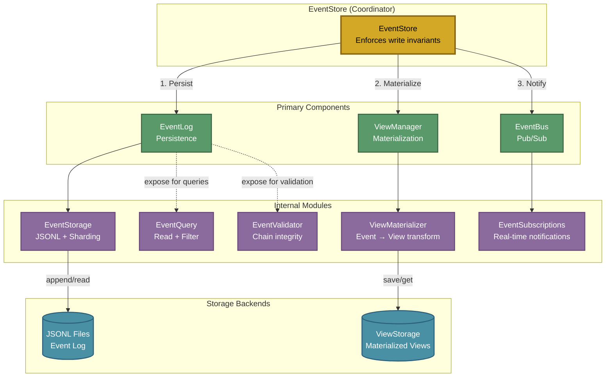

# Event Sourcing Architecture

## Component Architecture



## Core Concepts

### Immutable Event Log

All changes are recorded as events in an append-only JSONL log:

- Events are NEVER modified or deleted
- Each event contains `prevEventHash` linking to previous event's checksum
- Complete audit trail for all system changes
- Events can be replayed to rebuild state at any point

### Materialized Views

Current state is built from events and stored for fast queries:

- Views optimized for specific query patterns
- Can be rebuilt at any time from the event log
- Updated incrementally as new events arrive
- Stored via ViewStorage abstraction

### Pub/Sub Notifications

Real-time event notifications via publish-subscribe pattern:

- Resource-scoped subscriptions (per-resource callbacks)
- Global subscriptions (system-wide events)
- Fire-and-forget notification pattern (non-blocking)
- Powers Server-Sent Events (SSE) for browser clients

## Write Path Coordination

The EventStore enforces a strict write invariant:

1. **Persist** - Event written to immutable log
2. **Materialize** - View updated with new event
3. **Notify** - Subscribers notified of change

This ensures consistency across all components.

## Event Chain Validation

Events form a hash chain for integrity:

- Each event includes SHA-256 of previous event
- Chain can be validated to detect tampering
- Sequence numbers ensure no events are missing
- Per-resource chains for isolation

## JSONL Storage Format

Events stored as JSON Lines (one JSON object per line):

```jsonl
{"event":{"id":"evt-abc123","type":"resource.created","userId":"user-456","resourceId":"doc-789","timestamp":"2025-01-15T10:30:00Z","payload":{}},"metadata":{"sequenceNumber":1,"streamPosition":0,"timestamp":"2025-01-15T10:30:00Z","checksum":"sha256abc"}}
{"event":{"id":"evt-def456","type":"annotation.added","userId":"user-456","resourceId":"doc-789","timestamp":"2025-01-15T10:31:00Z","payload":{}},"metadata":{"sequenceNumber":2,"streamPosition":1,"timestamp":"2025-01-15T10:31:00Z","prevEventHash":"sha256abc","checksum":"sha256def"}}
```

Benefits:
- Human-readable
- Streamable
- Append-only
- Tool-friendly (grep, jq, etc.)