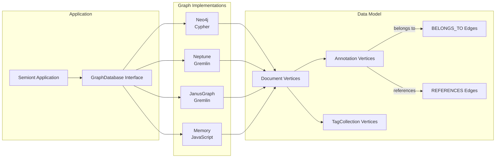
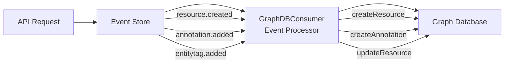

# Graph Database Architecture

## Overview

The graph database serves as an optional read-only projection for relationship traversal and cross-resource queries. It is NOT required for core operations.

## Critical Principle: Optional Projection

**The graph database is an OPTIONAL read-only projection, NOT a critical dependency.**

### What Works WITHOUT the Graph

Core document and annotation operations function completely without graph availability:

- ✅ Viewing resources and annotations - Uses filesystem projections
- ✅ Creating annotations - Event store + filesystem projection
- ✅ Updating annotations - Event store + filesystem projection
- ✅ Deleting annotations - Event store + filesystem projection
- ✅ Single-document workflows - Browse, annotate, reference panels
- ✅ Real-time SSE updates - Event broadcast to connected clients

### What Requires the Graph

Only cross-resource query features depend on graph availability:

- ❌ Cross-document relationship queries
- ❌ Entity-based search across resources
- ❌ Graph visualization
- ❌ Network analysis

## Multi-Provider Architecture



## Event-Driven Projection

The graph is populated from Event Store events:



### Event Processing Guarantees

1. **Event Type Pre-Filter**: Only the 9 graph-relevant event types are processed; all others (`job.*`, `detection.*`, `generation.*`) are discarded before entering the processing pipeline
2. **RxJS Pipeline**: Events flow through `groupBy(resourceId) → burstBuffer → concatMap`, providing per-resource ordering and cross-resource parallelism declaratively
3. **Adaptive Burst Buffering**: First event after idle passes through immediately (zero latency for interactive use). Subsequent events in a burst are batched and flushed together, using batch graph operations where available (e.g., Neo4j UNWIND)
4. **Sequential Processing per Resource**: Events for the same resource processed in order via `concatMap` within each resource group
5. **System Event Routing**: System events (no `resourceId`) processed immediately without burst buffering
6. **Error Isolation**: Failed events are logged but don't kill the pipeline — processing continues
7. **Idempotent Operations**: Repeated events produce same result
8. **Order-Independent Projections**: MERGE-based operations handle events in any order

For details on handling race conditions and eventual consistency, see [Eventual Consistency](./EVENTUAL-CONSISTENCY.md).

## Data Model Principles

### Vertex Types

1. **Document** - Immutable after creation (only archiving allowed)
2. **Annotation** - Can be updated (W3C Web Annotations)
3. **TagCollection** - Append-only entity/reference type collections

### Edge Types

1. **BELONGS_TO** - Annotation → Document (source)
2. **REFERENCES** - Annotation → Document (target, if resolved)

### Design Principles

- Document immutability
- Type safety (no defensive defaults)
- Vertex labels for type identification
- Consistent edge directions
- W3C compliance

## Provider Comparison

| Feature | Neo4j | Neptune | JanusGraph | Memory |
|---------|-------|---------|------------|---------|
| Query Language | Cypher | Gremlin | Gremlin | JavaScript |
| Arrays | Native | JSON | JSON | Native |
| Transactions | Explicit | Auto-commit | Auto-commit | N/A |
| Scaling | Vertical | Managed | Horizontal | None |
| Setup | Docker | AWS | Complex | None |

## Graceful Degradation

When the graph database is unavailable:

1. **User Impact**: Core features work normally
2. **Server Behavior**: Event processing continues
3. **Recovery**: Replay events when graph returns
4. **No Data Loss**: Event store remains authoritative

### Recovery Operations

```typescript
// Rebuild single resource from events
await consumer.rebuildResource(resourceId);

// Nuclear option: rebuild entire GraphDB
await consumer.rebuildAll();
```

### Health Monitoring

```typescript
const health = consumer.getHealthMetrics();
// {
//   subscriptions: 1,       // Single global subscription (with event type pre-filter)
//   lastProcessed: { 'doc-123': 15 },
//   pipelineActive: true    // RxJS burst-buffered pipeline is running
// }
```

## Best Practices

1. **Event-Driven Updates**: Never write directly to graph
2. **Read-Only Queries**: Graph is for reading only
3. **Graceful Degradation**: Handle graph unavailability
4. **Provider Abstraction**: Code to interface, not implementation
5. **Cache Tag Collections**: Load once for performance