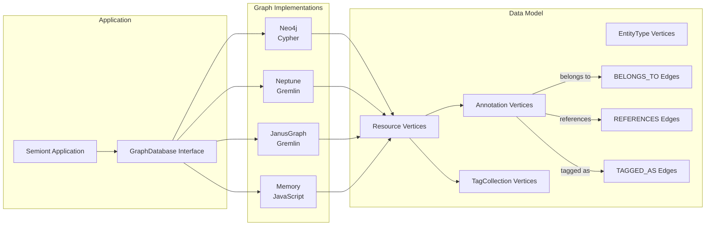
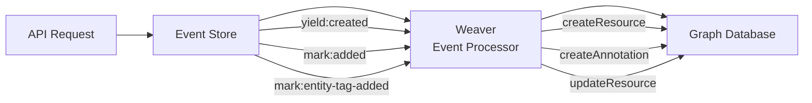

# Graph Database Architecture

## Overview

The graph database is a read-only projection of the event log, for relationship traversal and cross-resource queries. It is NEVER the source of truth.

## Critical Principle: Derived Projection

**The graph database is a read-only projection DERIVED from the event log, NOT a system of record.**

A stack still needs one: the Weaver, the Archivist and the Librarian each connect to it when they start, and exit when they cannot.

### What Is Answered WITHOUT the Graph

Single-resource reads and every write are served from the event log and the materialized views, with no graph query:

- ✅ Viewing a resource and its annotations - Uses filesystem projections
- ✅ Creating annotations - Event store + filesystem projection
- ✅ Updating annotations - Event store + filesystem projection
- ✅ Deleting annotations - Event store + filesystem projection
- ✅ Single-document workflows - Browse, annotate
- ✅ Real-time SSE updates - Event broadcast to connected clients

### What Requires the Graph

Cross-resource queries are answered by the graph:

- ❌ Cross-document relationship queries (referenced-by, connections)
- ❌ Resource search by name, path or entity type
- ❌ Candidate search for a reference (Matcher)
- ❌ The knowledge-graph neighborhood in a gathered context

## Multi-Provider Architecture


```mermaid
graph LR
    subgraph "Application"
        APP[Semiont Application]
        GDI[GraphDatabase Interface]
    end

    subgraph "Graph Implementations"
        NEO[Neo4j<br/>Cypher]
        NEP[Neptune<br/>Gremlin]
        JAN[JanusGraph<br/>Gremlin]
        MEM[Memory<br/>JavaScript]
    end

    subgraph "Data Model"
        RES[Resource Vertices]
        ANN[Annotation Vertices]
        ET[EntityType Vertices]
        TAG[TagCollection Vertices]
        BT[BELONGS_TO Edges]
        REF[REFERENCES Edges]
        TA[TAGGED_AS Edges]
    end

    APP --> GDI
    GDI --> NEO
    GDI --> NEP
    GDI --> JAN
    GDI --> MEM

    NEO --> RES
    NEP --> RES
    JAN --> RES
    MEM --> RES

    RES --> ANN
    ANN -->|belongs to| BT
    ANN -->|references| REF
    ANN -->|tagged as| TA
    RES --> TAG
```

## Event-Driven Projection

The graph is populated from Event Store events:


```mermaid
graph LR
    API[API Request] --> ES[Event Store]
    ES --> WEAVER[Weaver<br/>Event Processor]
    WEAVER --> GDB[Graph Database]

    ES -->|yield:created| WEAVER
    ES -->|mark:added| WEAVER
    ES -->|mark:entity-tag-added| WEAVER

    WEAVER -->|createResource| GDB
    WEAVER -->|createAnnotation| GDB
    WEAVER -->|updateResource| GDB
```

### Event Processing Guarantees

1. **Channel Selection**: The Weaver's event stream is merged from the 9 graph-relevant channels (`WEAVER_CHANNELS`) and nothing else, so no other event enters the processing pipeline
2. **RxJS Pipeline**: Events flow through `groupBy(resourceId) → burstBuffer → concatMap`, providing per-resource ordering and cross-resource parallelism declaratively
3. **Adaptive Burst Buffering**: First event after idle passes through immediately (zero latency for interactive use). Subsequent events in a burst are batched and flushed together, using batch graph operations where available (e.g., Neo4j UNWIND)
4. **Sequential Processing per Resource**: Events for the same resource processed in order via `concatMap` within each resource group
5. **System Event Routing**: System events (no `resourceId`) processed immediately without burst buffering
6. **Error Isolation**: Failed events are logged but don't kill the pipeline — processing continues
7. **Idempotent Operations**: Repeated events produce same result
8. **Order-Independent Projections**: MERGE-based operations handle events in any order

For details on handling race conditions and eventual consistency, see [Eventual Consistency](./EVENTUAL-CONSISTENCY.md).

## Data Model Principles

### Vertex Types

1. **Resource** - Immutable after creation, apart from archival state and entity tags
2. **Annotation** - Can be updated (W3C Web Annotations)
3. **EntityType** - One vertex per entity type tag
4. **TagCollection** - Append-only entity type collections

### Edge Types

1. **BELONGS_TO** - Annotation → Resource (source)
2. **REFERENCES** - Annotation → Resource (target, if resolved)
3. **TAGGED_AS** - Annotation → EntityType

### Design Principles

- Resource immutability
- Type safety (no defensive defaults)
- Vertex labels for type identification
- Consistent edge directions
- W3C compliance

## Provider Comparison

| Feature | Neo4j | Neptune | JanusGraph | Memory |
|---------|-------|---------|------------|---------|
| Query Language | Cypher | Gremlin | Gremlin | JavaScript |
| Arrays | Native | JSON | JSON | Native |
| Transactions | Auto-commit | Auto-commit | Auto-commit | N/A |
| Scaling | Vertical | Managed | Horizontal | None |
| Setup | Docker | AWS | Complex | None |

## Graceful Degradation

When the graph database becomes unavailable while a stack is running:

1. **User Impact**: Writes and view-backed reads continue; graph-backed queries fail
2. **Weaver Behavior**: A failed apply is logged and counted, and the applied mark never advances past it
3. **Recovery**: The Weaver's catch-up at its next start replays from the last cleanly applied sequence
4. **No Data Loss**: Event store remains authoritative

### Recovery Operations

The Weaver rebuilds on the `weave:rebuild` bus command. `packages/make-meaning/src/cli/rebuild-graph.ts` sends it to a running stack:

```bash
# Rebuild single resource from events
npm run rebuild-graph --workspace=@semiont/make-meaning -- <resourceId>

# Nuclear option: rebuild entire GraphDB
npm run rebuild-graph --workspace=@semiont/make-meaning
```

### Health Monitoring

`weaver-main` serves `Weaver.getHealthMetrics()` at `/health`:

```typescript
const health = weaver.getHealthMetrics();
// {
//   subscriptions: 1,       // One injected event stream (the 9-channel fan-in)
//   resourcesTracked: 42,   // Resources with an applied mark
//   pipelineActive: true,   // RxJS burst-buffered pipeline is running
//   applyFailures: 0        // Applies that failed and were not checkpointed
// }
```

## Best Practices

1. **Event-Driven Updates**: Never write directly to graph
2. **Read-Only Queries**: Graph is for reading only
3. **Graceful Degradation**: Handle graph unavailability
4. **Provider Abstraction**: Code to interface, not implementation
5. **Cache Tag Collections**: Load once for performance