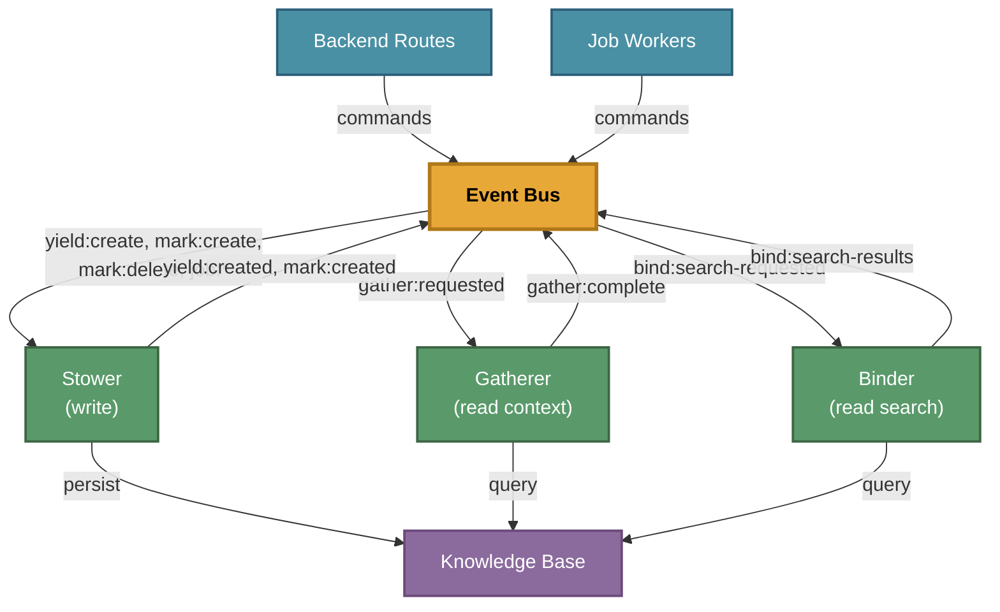

# @semiont/make-meaning

[](https://github.com/The-AI-Alliance/semiont/actions/workflows/package-tests.yml?query=branch%3Amain+is%3Asuccess+job%3A%22Test+make-meaning%22)
[](https://codecov.io/gh/The-AI-Alliance/semiont?flag=make-meaning)
[](https://www.npmjs.com/package/@semiont/make-meaning)
[](https://www.npmjs.com/package/@semiont/make-meaning)
[](https://github.com/The-AI-Alliance/semiont/blob/main/LICENSE)

**Making meaning from resources through actors, context assembly, and relationship reasoning.**

This package implements the actor model from [ARCHITECTURE-NEXT.md](../../docs/ARCHITECTURE-NEXT.md). It owns the **Knowledge Base** and the three actors that interface with it:

- **Stower** (write) — the single write gateway to the Knowledge Base
- **Gatherer** (read context) — assembles context from KB stores for AI processing
- **Binder** (read search) — searches KB stores for entity resolution

All three actors subscribe to the EventBus via RxJS pipelines. They expose only `initialize()` and `stop()` — no public business methods. Callers communicate with actors by putting events on the bus.

## Quick Start

```bash
npm install @semiont/make-meaning
```

### Start Make-Meaning Service

```typescript
import { startMakeMeaning } from '@semiont/make-meaning';
import { EventBus } from '@semiont/core';
import type { EnvironmentConfig, Logger } from '@semiont/core';

// EventBus is created outside make-meaning — it is not encapsulated by this package
const eventBus = new EventBus();

// Start all infrastructure
const makeMeaning = await startMakeMeaning(config, eventBus, logger);

// Access components
const { kb, jobQueue, stower, gatherer, binder } = makeMeaning;

// Graceful shutdown
await makeMeaning.stop();
```

This single call initializes:
- **KnowledgeBase** — groups EventStore, ViewStorage, RepresentationStore, GraphDatabase
- **Stower** — subscribes to write commands on EventBus
- **Gatherer** — subscribes to gather events on EventBus
- **Binder** — subscribes to bind events on EventBus
- **GraphDBConsumer** — event-to-graph synchronization (RxJS burst-buffered pipeline)
- **JobQueue** — background job processing queue
- **6 annotation workers** — poll job queue for async AI tasks

### Create a Resource (via EventBus)

```typescript
import { ResourceOperations } from '@semiont/make-meaning';
import { userId } from '@semiont/core';

const result = await ResourceOperations.createResource(
  {
    name: 'My Document',
    content: Buffer.from('Document content here'),
    format: 'text/plain',
    language: 'en',
  },
  userId('user-123'),
  eventBus,
  config.services.backend.publicURL,
);
```

`ResourceOperations.createResource` emits `yield:create` on the EventBus. The Stower subscribes to this event, persists the resource to the EventStore and ContentStore, and emits `yield:created` back on the bus.

### Gather Context (via EventBus)

```typescript
import { firstValueFrom, race, filter, timeout } from 'rxjs';

// Emit gather request
eventBus.get('gather:requested').next({
  annotationUri,
  resourceId,
  options: { contextLines: 5 },
});

// Await result
const result = await firstValueFrom(
  race(
    eventBus.get('gather:complete').pipe(filter(e => e.annotationUri === annotationUri)),
    eventBus.get('gather:failed').pipe(filter(e => e.annotationUri === annotationUri)),
  ).pipe(timeout(30_000)),
);
```

## Architecture

### Actor Model

All meaningful actions flow through the EventBus. The three KB actors are reactive — they subscribe via RxJS pipelines in `initialize()` and communicate results by emitting on the bus.


```mermaid
graph TB
    Routes["Backend Routes"] -->|commands| BUS["Event Bus"]
    Workers["Job Workers"] -->|commands| BUS

    BUS -->|"yield:create, mark:create,<br/>mark:delete, job:*"| STOWER["Stower<br/>(write)"]
    BUS -->|"gather:requested"| GATHERER["Gatherer<br/>(read context)"]
    BUS -->|"bind:search-requested"| BINDER["Binder<br/>(read search)"]

    STOWER -->|persist| KB["Knowledge Base"]
    GATHERER -->|query| KB
    BINDER -->|query| KB

    STOWER -->|"yield:created, mark:created"| BUS
    GATHERER -->|"gather:complete"| BUS
    BINDER -->|"bind:search-results"| BUS

    classDef bus fill:#e8a838,stroke:#b07818,stroke-width:3px,color:#000,font-weight:bold
    classDef actor fill:#5a9a6a,stroke:#3d6644,stroke-width:2px,color:#fff
    classDef kb fill:#8b6b9d,stroke:#6b4a7a,stroke-width:2px,color:#fff
    classDef caller fill:#4a90a4,stroke:#2c5f7a,stroke-width:2px,color:#fff

    class BUS bus
    class STOWER,GATHERER,BINDER actor
    class KB kb
    class Routes,Workers caller
```

### Knowledge Base

The Knowledge Base is an inert store — it has no intelligence, no goals, no decisions. It groups four subsystems:

| Store | Implementation | Purpose |
|-------|---------------|---------|
| **Event Log** | `EventStore` | Immutable append-only log of all domain events |
| **Materialized Views** | `ViewStorage` | Denormalized projections for fast reads |
| **Content Store** | `RepresentationStore` | Content-addressed binary storage (SHA-256) |
| **Graph** | `GraphDatabase` | Eventually consistent relationship projection |

```typescript
import { createKnowledgeBase } from '@semiont/make-meaning';

const kb = createKnowledgeBase(eventStore, basePath, projectRoot, graphDb, logger);
// kb.eventStore, kb.views, kb.content, kb.graph
```

### EventBus Ownership

The EventBus is created by the backend (or script) and passed into `startMakeMeaning()` as a dependency. Make-meaning does not own or encapsulate the EventBus — it is shared across the entire system.

## Documentation

- **[Architecture](./docs/architecture.md)** — Actor model, data flow, storage architecture
- **[API Reference](./docs/api-reference.md)** — Context modules and operations
- **[Examples](./docs/examples.md)** — Common use cases and patterns
- **[Job Workers](./docs/job-workers.md)** — Async annotation workers (in @semiont/jobs)
- **[Scripting](./docs/SCRIPTING.md)** — Direct scripting without HTTP backend

## Exports

### Service (Primary)

- `startMakeMeaning(config, eventBus, logger)` — Initialize all infrastructure
- `MakeMeaningService` — Type for service return value

### Knowledge Base

- `createKnowledgeBase(...)` — Factory function
- `KnowledgeBase` — Interface grouping the four KB stores

### Actors

- `Stower` — Write gateway actor
- `Gatherer` — Context assembly actor
- `Binder` — Entity resolution actor

### Operations

- `ResourceOperations` — Resource CRUD (emits commands to EventBus)
- `AnnotationOperations` — Annotation CRUD (emits commands to EventBus)

### Context Assembly

- `ResourceContext` — Resource metadata queries from ViewStorage
- `AnnotationContext` — Annotation queries and LLM context building
- `GraphContext` — Graph traversal and search
- `LLMContext` — Resource-level LLM context assembly

### Generation

- `generateResourceSummary` — Resource summarization
- `generateReferenceSuggestions` — Smart suggestion generation

### Graph

- `GraphDBConsumer` — Event-to-graph synchronization

## Dependencies

- **[@semiont/core](../core/)** — Core types, EventBus, utilities
- **[@semiont/api-client](../api-client/)** — OpenAPI-generated types
- **[@semiont/event-sourcing](../event-sourcing/)** — Event store and view storage
- **[@semiont/content](../content/)** — Content-addressed storage
- **[@semiont/graph](../graph/)** — Graph database abstraction
- **[@semiont/ontology](../ontology/)** — Schema definitions for tags
- **[@semiont/inference](../inference/)** — AI primitives (generateText)
- **[@semiont/jobs](../jobs/)** — Job queue and annotation workers

## Testing

```bash
npm test                # Run tests
npm run test:watch      # Watch mode
npm run test:coverage   # Coverage report
```

## License

Apache-2.0
