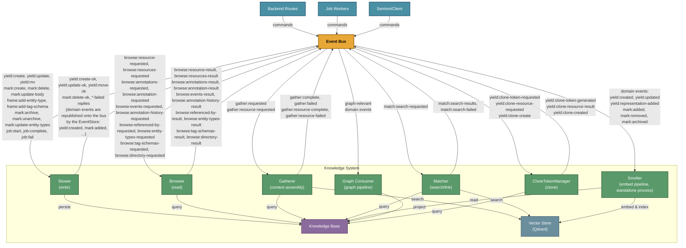

# @semiont/make-meaning

[](https://github.com/The-AI-Alliance/semiont/actions/workflows/package-tests.yml?query=branch%3Amain+is%3Asuccess+job%3A%22Test+make-meaning%22)
[](https://codecov.io/gh/The-AI-Alliance/semiont?flag=make-meaning)
[](https://www.npmjs.com/package/@semiont/make-meaning)
[](https://www.npmjs.com/package/@semiont/make-meaning)
[](https://github.com/The-AI-Alliance/semiont/blob/main/LICENSE)

**Making meaning from resources through actors, context assembly, and relationship reasoning.**

This package implements the actor model from [ACTOR-MODEL.md](../../docs/system/ACTOR-MODEL.md). It owns the **Knowledge Base** and the seven actors that serve it.

Five **access actors** mediate every read and write — the bus-facing interface of the Knowledge Base:

- **Stower** (write) — the single write gateway to the Knowledge Base; handles all resource and annotation mutations and job lifecycle events
- **Browser** (read) — handles all KB read queries: resources, annotations, events, annotation history, referenced-by lookups, entity type and tag-schema listing, and directory browse (merging filesystem listings with KB metadata)
- **Gatherer** (context assembly) — assembles gathered context for annotations (`gather:requested`) and resources (`gather:resource-requested`); searches vectors for semantically similar passages (adds `semanticContext` to `GatheredContext`)
- **Matcher** (search/link) — context-driven candidate search with multi-source retrieval, composite structural scoring, and optional LLM semantic scoring
- **CloneTokenManager** (yield) — manages clone token lifecycle for resource cloning

Two **projection pipelines** follow the event log to keep the eventually-consistent read models in sync — addressed by no one, replying to nothing:

- **Graph Consumer** (project) — subscribes to graph-relevant domain events and projects them into the graph database; carried on the KB record (`kb.graphConsumer`) and rebuilt from the event log at startup (`rebuildAll()`)
- **Smelter** (embed) — standalone embedding pipeline run via `@semiont/make-meaning/smelter-main` (not started by `startMakeMeaning`); subscribes to domain events, reads content from the KB working tree via `WorkerContentTransport`, chunks text, embeds via `@semiont/vectors`, and indexes into the vector store (Qdrant). On startup it reconciles Qdrant against the KS catalog — re-embedding what's missing or stale (every upsert is stamped with the embedded bytes' checksum, so changed content is detected) and deleting orphans — so a wiped Qdrant volume, or events missed while the worker was down, recover by restarting the smelter

(The third derived read model — the materialized views — is not pipeline-maintained: the EventStore's `ViewManager` materializes views synchronously inside `appendEvent()` for a read-your-writes guarantee.)

All seven actors subscribe to the EventBus via RxJS pipelines and expose no public business methods — only `initialize()` and `stop()`, plus a startup recovery entry point on the pipelines (`rebuildAll()` / `reconcile()`). Callers communicate with the access actors by putting events on the bus.

The EventBus is a **complete interface** for all knowledge-domain operations. HTTP routes in the backend are thin wrappers that delegate to EventBus actors. The `@semiont/http-transport` exposes the same operations via verb-oriented namespaces (`semiont.browse`, `semiont.mark`, `semiont.gather`, etc.).

## Quick Start

```bash
npm install @semiont/make-meaning
```

### Start Make-Meaning Service

```typescript
import { startMakeMeaning } from '@semiont/make-meaning';
import { SemiontProject } from '@semiont/core/node';
import { EventBus } from '@semiont/core';
import type { Logger } from '@semiont/core';

// EventBus is created outside make-meaning — it is not encapsulated by this package
const eventBus = new EventBus();
const project = new SemiontProject('/path/to/project');

// Start all infrastructure
const makeMeaning = await startMakeMeaning(project, config, eventBus, logger);

// Access components
const { knowledgeSystem, jobQueue } = makeMeaning;
const { kb, stower, browser, gatherer, matcher, cloneTokenManager } = knowledgeSystem;

// Graceful shutdown
await makeMeaning.stop();
```

This single call initializes:
- **KnowledgeSystem** — groups the Knowledge Base and its actors
  - **KnowledgeBase** — groups EventStore, ViewStorage, WorkingTreeStore, GraphDatabase, GraphDBConsumer, and optionally VectorStore
  - **Stower** — subscribes to write commands on EventBus
  - **Browser** — subscribes to all KB read queries and directory browse requests on EventBus
  - **Gatherer** — subscribes to annotation and resource gather requests on EventBus; searches vectors for semantically similar passages
  - **Matcher** — subscribes to candidate search requests on EventBus
  - **CloneTokenManager** — subscribes to clone token operations on EventBus
- **JobQueue** — background job processing queue + job status subscription
- **Bus command handlers** — request-channel translators registered via `registerBusHandlers`

It does **not** start the Smelter (a standalone process — `@semiont/make-meaning/smelter-main`) or the job workers (the worker process in [@semiont/jobs](../jobs/) — see [Job Workers](./docs/job-workers.md)).

### Gather Context (via EventBus)

```typescript
import { firstValueFrom, race, filter, timeout } from 'rxjs';

const correlationId = crypto.randomUUID();

// Emit gather request for an annotation
eventBus.get('gather:requested').next({
  correlationId,
  annotationId,
  resourceId,
  options: { contextWindow: 1000 },
});

// Await result
const result = await firstValueFrom(
  race(
    eventBus.get('gather:complete').pipe(filter(e => e.correlationId === correlationId)),
    eventBus.get('gather:failed').pipe(filter(e => e.correlationId === correlationId)),
  ).pipe(timeout(30_000)),
);
```

## Architecture

### Actor Model

All meaningful actions flow through the EventBus. The KB actors are reactive — they subscribe via RxJS pipelines in `initialize()` and communicate results by emitting on the bus.


```mermaid
graph TB
    Routes["Backend Routes"] -->|commands| BUS["Event Bus"]
    Workers["Job Workers"] -->|commands| BUS
    EBC["SemiontClient"] -->|commands| BUS

    subgraph ks ["Knowledge System"]
        STOWER["Stower<br/>(write)"]
        BROWSER["Browser<br/>(read)"]
        GATHERER["Gatherer<br/>(context assembly)"]
        MATCHER["Matcher<br/>(search/link)"]
        SMELTER["Smelter<br/>(embed pipeline, standalone process)"]
        GC["Graph Consumer<br/>(graph pipeline)"]
        CTM["CloneTokenManager<br/>(clone)"]
        KB["Knowledge Base"]
        VECTORS["Vector Store<br/>(Qdrant)"]
        STOWER -->|persist| KB
        BROWSER -->|query| KB
        GATHERER -->|query| KB
        GATHERER -->|search| VECTORS
        MATCHER -->|query| KB
        MATCHER -->|search| VECTORS
        SMELTER -->|embed & index| VECTORS
        SMELTER -->|read| KB
        GC -->|project| KB
        CTM -->|query| KB
    end

    BUS -->|"yield:create, yield:update, yield:mv<br/>mark:create, mark:delete, mark:update-body<br/>frame:add-entity-type, frame:add-tag-schema<br/>mark:archive, mark:unarchive, mark:update-entity-types<br/>job:start, job:complete, job:fail"| STOWER
    BUS -->|"browse:resource-requested, browse:resources-requested<br/>browse:annotations-requested, browse:annotation-requested<br/>browse:events-requested, browse:annotation-history-requested<br/>browse:referenced-by-requested, browse:entity-types-requested<br/>browse:tag-schemas-requested, browse:directory-requested"| BROWSER
    BUS -->|"gather:requested<br/>gather:resource-requested"| GATHERER
    BUS -->|"match:search-requested"| MATCHER
    BUS -->|"domain events:<br/>yield:created, yield:updated<br/>yield:representation-added<br/>mark:added, mark:removed, mark:archived"| SMELTER
    BUS -->|"graph-relevant<br/>domain events"| GC
    BUS -->|"yield:clone-token-requested<br/>yield:clone-resource-requested<br/>yield:clone-create"| CTM

    STOWER -->|"yield:create-ok, yield:update-ok, yield:move-ok<br/>mark:delete-ok, *-failed replies<br/>(domain events are republished onto the bus<br/>by the EventStore: yield:created, mark:added, ...)"| BUS
    BROWSER -->|"browse:resource-result, browse:resources-result<br/>browse:annotations-result, browse:annotation-result<br/>browse:events-result, browse:annotation-history-result<br/>browse:referenced-by-result, browse:entity-types-result<br/>browse:tag-schemas-result, browse:directory-result"| BUS
    GATHERER -->|"gather:complete, gather:failed<br/>gather:resource-complete, gather:resource-failed"| BUS
    MATCHER -->|"match:search-results, match:search-failed"| BUS
    CTM -->|"yield:clone-token-generated<br/>yield:clone-resource-result<br/>yield:clone-created"| BUS

    classDef bus fill:#e8a838,stroke:#b07818,stroke-width:3px,color:#000,font-weight:bold
    classDef actor fill:#5a9a6a,stroke:#3d6644,stroke-width:2px,color:#fff
    classDef kb fill:#8b6b9d,stroke:#6b4a7a,stroke-width:2px,color:#fff
    classDef caller fill:#4a90a4,stroke:#2c5f7a,stroke-width:2px,color:#fff

    class BUS bus
    classDef vectorstore fill:#6b8e9d,stroke:#4a6a7a,stroke-width:2px,color:#fff
    class STOWER,BROWSER,GATHERER,MATCHER,SMELTER,GC,CTM actor
    class KB kb
    class VECTORS vectorstore
    class Routes,Workers,EBC caller
```

### Knowledge System and Knowledge Base

The **Knowledge System** binds the Knowledge Base to its actors. Nothing outside the Knowledge System reads or writes the Knowledge Base directly.

The **Knowledge Base** is an inert store — it has no intelligence, no goals, no decisions. It groups five core subsystems and one optional one:

| Store | Implementation | Purpose |
|-------|---------------|---------|
| **Event Log** | `EventStore` | Immutable append-only log of all domain events |
| **Materialized Views** | `ViewStorage` | Denormalized projections for fast reads (materialized synchronously on append) |
| **Content Store** | `WorkingTreeStore` | Working-tree files addressed by URI |
| **Graph** | `GraphDatabase` | Eventually consistent relationship projection |
| **Graph Consumer** | `GraphDBConsumer` | Event-to-graph projection pipeline (one of the two pipeline actors; carried on the KB record because `createKnowledgeBase()` constructs and starts it) |
| **Vectors** *(optional)* | `VectorStore` | Semantic vector index (Qdrant + memory) via `@semiont/vectors` |

Its sibling pipeline, the Smelter (event-to-vector projection), is **not** a KB member — it runs as a standalone process via `@semiont/make-meaning/smelter-main`.

```typescript
import { createKnowledgeBase } from '@semiont/make-meaning';

const kb = await createKnowledgeBase(eventStore, project, graphDb, eventBus, logger, options);
// kb.eventStore, kb.views, kb.content, kb.graph, kb.graphConsumer
// kb.vectors (optional), kb.projectionsDir
```

### EventBus Ownership

The EventBus is created by the backend (or script) and passed into `startMakeMeaning()` as a dependency. Make-meaning does not own or encapsulate the EventBus — it is shared across the entire system.

### Pure projection validators

The dispatcher in [`src/handlers/job-commands.ts`](src/handlers/job-commands.ts) does projection-validated job creation: when a `mark.assist` (linking) or `yield.fromAnnotation` job arrives with `entityTypes`, the dispatcher validates that every tag is registered; when a tagging job arrives with a `schemaId`, the dispatcher resolves it against the registered tag-schema set.

Both rules are pure functions in [`src/views/projection-validators.ts`](src/views/projection-validators.ts):

- `resolveTagSchema(schemas, schemaId)` → `{ schema } | { error }` — id lookup with the standard "Tag schema not registered" / "tag-annotation requires schemaId" error formats.
- `validateEntityTypes(registered, requested)` → `{ ok: true } | { ok: false; unknown }` — set membership check that lists the offending tags in caller order.

The dispatcher is the I/O shell: read the projection (via the readers in `src/views/`), pass it to the validator (pure), then either stash the resolved value or rethrow as `job:create-failed`. Validator unit tests run in single-digit milliseconds with no filesystem, no event-bus, no mock JobQueue — the dispatcher integration tests in `__tests__/handlers/job-commands.test.ts` keep the wiring covered.

This pattern (functional core, imperative shell) is shared with `@semiont/event-sourcing`'s projection reducers; see [`docs/system/PROJECTION-PATTERN.md`](../../docs/system/PROJECTION-PATTERN.md) for the architectural narrative, the full axiom catalog, and guidance for adding new validators.

## Documentation

- **[Architecture](./docs/architecture.md)** — Actor model, data flow, storage architecture
- **[API Reference](./docs/api-reference.md)** — Context modules and operations
- **[Examples](./docs/examples.md)** — Common use cases and patterns
- **[Job Workers](./docs/job-workers.md)** — Async annotation workers (in @semiont/jobs)
- **[Scripting](./docs/SCRIPTING.md)** — Direct scripting without HTTP backend

## Exports

### Service (Primary)

- `startMakeMeaning(project, config, eventBus, logger)` — Initialize all infrastructure
- `MakeMeaningService` — Type for service return value (`knowledgeSystem`, `jobQueue`, `stop`)

### Knowledge System

- `KnowledgeSystem` — Interface grouping the Knowledge Base and its actors
- `stopKnowledgeSystem(ks)` — Ordered teardown of the Knowledge System

### Knowledge Base

- `createKnowledgeBase(eventStore, project, graphDb, eventBus, logger, options?)` — Async factory function
- `KnowledgeBase` — Interface grouping the KB stores (`eventStore`, `views`, `content`, `graph`, optional `vectors`) plus the `graphConsumer` pipeline

### Actors

- `Stower` — Write gateway actor
- `Browser` — Read actor (all KB queries, directory listings merged with KB metadata)
- `Gatherer` — Context assembly actor (annotation and resource gather flows; vector semantic search)
- `Matcher` — Search/link actor (context-driven candidate search with structural + semantic scoring)
- `CloneTokenManager` — Clone token lifecycle actor (yield domain)
- `Smelter` / `createSmelterActorStateUnit` / `WorkerContentTransport` — the embedding pipeline, its domain-event fan-in, and the worker-side content transport; wired together by the standalone `@semiont/make-meaning/smelter-main` entry point, and exported for callers that run the pipeline on their own `WorkerBus`

The Graph Consumer (`GraphDBConsumer`) is not exported — `createKnowledgeBase()` constructs it internally and exposes it as `kb.graphConsumer`.

### Operations

- `ResourceOperations` — Resource CRUD (emits commands to EventBus)
- `AnnotationOperations` — Annotation CRUD (emits commands to EventBus)

### Context Assembly

- `ResourceContext` — Resource metadata queries from ViewStorage
- `AnnotationContext` — Annotation queries and LLM context building
- `GraphContext` — Graph traversal and search
- `LLMContext` — Resource-level LLM context assembly

### Generation

- `generateResourceSummary` — Resource summarization
- `generateReferenceSuggestions` — Smart suggestion generation

## Dependencies

- **[@semiont/core](../core/)** — Core types, EventBus, utilities
- **[@semiont/http-transport](../http-transport/)** — OpenAPI-generated types
- **[@semiont/event-sourcing](../event-sourcing/)** — Event store and view storage
- **[@semiont/content](../content/)** — Content-addressed storage
- **[@semiont/graph](../graph/)** — Graph database abstraction
- **[@semiont/ontology](../ontology/)** — Schema definitions for tags
- **[@semiont/inference](../inference/)** — AI primitives (generateText)
- **[@semiont/vectors](../vectors/)** — Vector store abstraction (Qdrant + memory) and embedding providers (Voyage, Ollama)
- **[@semiont/jobs](../jobs/)** — Job queue and annotation workers
- **[@semiont/observability](../observability/)** — Actor spans and metrics providers
- **[@semiont/sdk](../sdk/)** — `StateUnit` / `WorkerBus` types (used by the Smelter actor state unit)

## Testing

```bash
npm test                # Run tests
npm run test:watch      # Watch mode
npm run test:coverage   # Coverage report
```

## License

Apache-2.0
