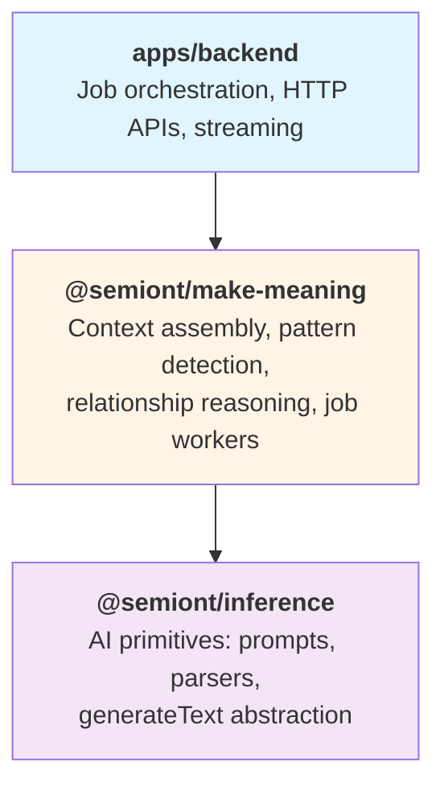

# @semiont/make-meaning

[](https://github.com/The-AI-Alliance/semiont/actions/workflows/package-tests.yml?query=branch%3Amain+is%3Asuccess+job%3A%22Test+make-meaning%22)
[](https://codecov.io/gh/The-AI-Alliance/semiont?flag=make-meaning)
[](https://www.npmjs.com/package/@semiont/make-meaning)
[](https://www.npmjs.com/package/@semiont/make-meaning)
[](https://github.com/The-AI-Alliance/semiont/blob/main/LICENSE)

**Making meaning from resources through context assembly, pattern detection, and relationship reasoning.**

This package transforms raw resources into meaningful, interconnected knowledge through:

- **Context Assembly**: Gathering resource metadata, content, and annotations from distributed storage
- **Pattern Detection**: AI-powered discovery of semantic patterns (comments, highlights, assessments, tags)
- **Relationship Reasoning**: Navigating connections between resources through graph traversal
- **Job Workers**: Asynchronous processing of detection tasks with progress tracking

## Quick Start

```bash
npm install @semiont/make-meaning
```

### Assemble Resource Context

```typescript
import { ResourceContext } from '@semiont/make-meaning';

const resource = await ResourceContext.getResourceMetadata(resourceId, config);
const resources = await ResourceContext.listResources({ createdAfter: '2024-01-01' }, config);
const withContent = await ResourceContext.addContentPreviews(resources, config);
```

### Work with Annotations

```typescript
import { AnnotationContext } from '@semiont/make-meaning';

// Get all annotations for a resource
const annotations = await AnnotationContext.getResourceAnnotations(resourceId, config);

// Build LLM context for an annotation (includes surrounding text)
const context = await AnnotationContext.buildLLMContext(
  annotationUri,
  resourceId,
  config,
  { contextLines: 5 }
);
```

### Detect Semantic Patterns

```typescript
import { AnnotationDetection } from '@semiont/make-meaning';

// AI-powered detection of passages that merit commentary
const comments = await AnnotationDetection.detectComments(
  resourceId,
  config,
  'Focus on technical explanations',
  'educational',
  0.7
);

// Detect passages that should be highlighted
const highlights = await AnnotationDetection.detectHighlights(
  resourceId,
  config,
  'Find key definitions and important concepts',
  0.5
);

// Detect and extract structured tags from text using ontology schemas
const tags = await AnnotationDetection.detectTags(
  resourceId,
  config,
  'irac',  // Schema ID from @semiont/ontology
  'issue'  // Category within the schema
);
```

### Navigate Resource Relationships

```typescript
import { GraphContext } from '@semiont/make-meaning';

// Find resources that link to this resource (backlinks)
const backlinks = await GraphContext.getBacklinks(resourceId, config);

// Find shortest path between two resources
const paths = await GraphContext.findPath(fromResourceId, toResourceId, config, 3);

// Full-text search across all resources
const results = await GraphContext.searchResources('neural networks', config, 10);
```

### Use Job Workers

```typescript
import {
  ReferenceDetectionWorker,
  HighlightDetectionWorker,
  GenerationWorker,
} from '@semiont/make-meaning';
import { JobQueue } from '@semiont/jobs';
import { createEventStore } from '@semiont/event-sourcing';

// Create shared dependencies
const jobQueue = new JobQueue({ dataDir: './data' });
await jobQueue.initialize();
const eventStore = await createEventStore(config);

// Create workers with explicit dependencies
const referenceWorker = new ReferenceDetectionWorker(jobQueue, config, eventStore);
const highlightWorker = new HighlightDetectionWorker(jobQueue, config, eventStore);
const generationWorker = new GenerationWorker(jobQueue, config, eventStore);

// Start workers
await Promise.all([
  referenceWorker.start(),
  highlightWorker.start(),
  generationWorker.start(),
]);
```

## Documentation

- **[API Reference](./docs/api-reference.md)** - Complete API documentation for all classes and methods
- **[Job Workers](./docs/job-workers.md)** - Asynchronous task processing with progress tracking
- **[Architecture](./docs/architecture.md)** - System design and data flow
- **[Examples](./docs/examples.md)** - Common use cases and patterns

## Philosophy

Resources don't exist in isolation. A document becomes meaningful when we understand its annotations, its relationships to other resources, and the patterns within its content. `@semiont/make-meaning` provides the infrastructure to:

1. **Assemble context** from event-sourced storage
2. **Detect patterns** using AI inference
3. **Reason about relationships** through graph traversal

This is the "applied meaning-making" layer - it sits between low-level AI primitives ([@semiont/inference](../inference/)) and high-level application orchestration ([apps/backend](../../apps/backend/)).

## Architecture

Three-layer design separating concerns:



**Key principles:**

- **Event-sourced context**: Resources and annotations assembled from event streams
- **Content-addressed storage**: Content retrieved using checksums (deduplication, caching)
- **Graph-backed relationships**: @semiont/graph provides traversal for backlinks, paths, connections
- **Explicit dependencies**: Workers receive JobQueue and EventStore via constructor (no singletons)

See [Architecture](./docs/architecture.md) for complete details.

## Exports

### Context Assembly

- `ResourceContext` - Resource metadata and content
- `AnnotationContext` - Annotation queries and context building
- `GraphContext` - Graph traversal and search

### Pattern Detection

- `AnnotationDetection` - AI-powered semantic pattern detection

### Job Workers

- `ReferenceDetectionWorker` - Entity reference detection
- `GenerationWorker` - AI content generation
- `HighlightDetectionWorker` - Highlight detection
- `CommentDetectionWorker` - Comment detection
- `AssessmentDetectionWorker` - Assessment detection
- `TagDetectionWorker` - Structured tag detection

See [Job Workers](./docs/job-workers.md) for implementation details.

### Type Re-exports

```typescript
export type {
  CommentMatch,
  HighlightMatch,
  AssessmentMatch,
  TagMatch,
} from '@semiont/inference';
```

## Configuration

All methods require an `EnvironmentConfig` object:

```typescript
import type { EnvironmentConfig } from '@semiont/core';

const config: EnvironmentConfig = {
  services: {
    backend: {
      publicURL: 'http://localhost:3000',
    },
    openai: {
      apiKey: process.env.OPENAI_API_KEY!,
      model: 'gpt-4o-mini',
      temperature: 0.7,
    },
  },
  storage: {
    base: '/path/to/storage',
  },
};
```

## Dependencies

`@semiont/make-meaning` builds on several core packages:

- **[@semiont/core](../core/)**: Core types and utilities
- **[@semiont/api-client](../api-client/)**: OpenAPI-generated types
- **[@semiont/event-sourcing](../event-sourcing/)**: Event store and view storage
- **[@semiont/content](../content/)**: Content-addressed storage
- **[@semiont/graph](../graph/)**: Neo4j graph database client
- **[@semiont/ontology](../ontology/)**: Schema definitions for tags
- **[@semiont/inference](../inference/)**: AI primitives (prompts, parsers, generateText)
- **[@semiont/jobs](../jobs/)**: Job queue and worker base class

## Testing

```bash
npm test                # Run tests
npm run test:watch      # Watch mode
npm run test:coverage   # Coverage report
```

## License

Apache-2.0
